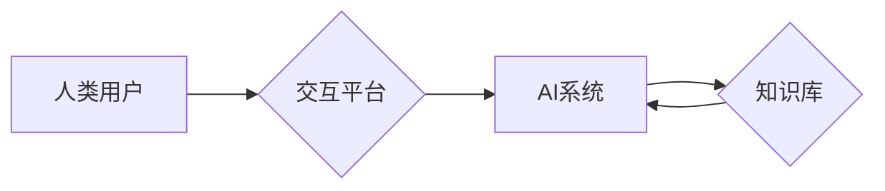

                 

## 人类-AI协作：增强人类潜能与AI能力的融合发展趋势预测分析机遇挑战机遇

> 关键词： 人工智能、协作、人类潜能、AI能力、融合发展、趋势预测、机遇、挑战

### 1. 背景介绍

人工智能（AI）技术近年来发展迅猛，从语音识别、图像识别到自然语言处理等领域取得了突破性进展。AI技术的快速发展为人类社会带来了前所未有的机遇，但也引发了关于AI与人类关系的深刻思考。如何将AI技术与人类智慧相结合，实现互补互利，共同创造更加美好的未来，成为全球科技界和学术界共同关注的焦点。

人类-AI协作，即人类与人工智能系统共同完成任务，是AI技术发展的重要方向之一。这种协作模式强调人类和AI的优势互补，发挥各自的独特能力，共同完成复杂的任务。人类拥有创造力、批判性思维和情感智能等优势，而AI拥有强大的计算能力、数据处理能力和学习能力。通过协作，人类可以利用AI技术提高效率、降低成本，同时AI也可以从人类的经验和知识中学习，不断提升自身能力。

### 2. 核心概念与联系

#### 2.1 人类-AI协作模式

人类-AI协作模式可以分为以下几种类型：

* **监督式协作:** 人类提供明确的指令和反馈，指导AI完成任务。
* **自主式协作:** AI系统能够自主学习和决策，人类提供必要的支持和监督。
* **混合式协作:** 结合监督式和自主式协作，根据任务的不同灵活切换协作模式。

#### 2.2 协作架构

人类-AI协作的架构通常包括以下几个关键组件：

* **人类用户:** 提供任务目标、知识和反馈。
* **AI系统:** 负责执行任务、处理数据和提供建议。
* **交互平台:** 作为人类和AI系统之间沟通的桥梁，提供用户友好界面和数据共享机制。
* **知识库:** 存储人类知识和经验，供AI系统参考和学习。

**Mermaid 流程图**



### 3. 核心算法原理 & 具体操作步骤

#### 3.1 算法原理概述

人类-AI协作的核心算法原理主要包括：

* **强化学习:** AI系统通过与环境交互，学习最优的策略，以获得最大奖励。
* **迁移学习:** AI系统将已学习到的知识应用于新的任务，提高学习效率。
* **知识图谱:** 将知识表示为图结构，方便AI系统理解和推理。
* **自然语言处理:** 允许AI系统理解和生成人类语言，实现人机自然交互。

#### 3.2 算法步骤详解

以强化学习为例，其具体操作步骤如下：

1. **环境建模:** 建立模拟真实世界的环境模型，定义状态、动作和奖励函数。
2. **策略初始化:** 初始化AI系统的策略，例如随机策略或基于经验的策略。
3. **环境交互:** AI系统与环境交互，根据当前状态选择动作，并获得相应的奖励。
4. **策略更新:** 根据获得的奖励，更新AI系统的策略，使其在未来能够获得更高的奖励。
5. **重复步骤3-4:** 持续与环境交互，更新策略，直到达到预设的目标或迭代次数。

#### 3.3 算法优缺点

**优点:**

* 能够学习复杂的任务，并不断优化策略。
* 适应性强，能够应对不断变化的环境。

**缺点:**

* 训练时间长，需要大量的样本数据。
* 容易陷入局部最优解。

#### 3.4 算法应用领域

强化学习广泛应用于以下领域：

* **游戏:** AI系统可以学习玩游戏，并达到人类水平甚至超越人类水平。
* **机器人:** AI系统可以学习控制机器人完成复杂的任务，例如导航、抓取和组装。
* **自动驾驶:** AI系统可以学习驾驶汽车，并实现自动驾驶功能。

### 4. 数学模型和公式 & 详细讲解 & 举例说明

#### 4.1 数学模型构建

强化学习的数学模型通常基于马尔可夫决策过程（MDP）。MDP定义了一个状态空间、动作空间、转移概率和奖励函数。

* **状态空间:** 所有可能的系统状态的集合。
* **动作空间:** 在每个状态下可以执行的动作的集合。
* **转移概率:** 从一个状态执行一个动作后转移到另一个状态的概率。
* **奖励函数:** 在每个状态执行一个动作后获得的奖励值。

#### 4.2 公式推导过程

强化学习的目标是找到一个最优策略，使得在长期的交互过程中获得最大的总奖励。最优策略可以通过动态规划或蒙特卡罗方法等算法求解。

* **Bellman方程:** 描述了状态价值函数与动作价值函数之间的关系。
* **价值迭代算法:** 通过迭代更新状态价值函数，最终得到最优策略。

#### 4.3 案例分析与讲解

例如，训练一个AI系统玩游戏“贪吃蛇”。

* **状态空间:** 蛇的当前位置和食物的位置。
* **动作空间:** 向上、向下、向左、向右四个方向移动。
* **转移概率:** 根据蛇的移动方向和游戏规则确定。
* **奖励函数:** 吃到食物获得奖励，撞到墙壁或自身则获得惩罚。

通过强化学习算法，AI系统可以学习到最优的移动策略，从而获得更高的分数。

### 5. 项目实践：代码实例和详细解释说明

#### 5.1 开发环境搭建

* Python 3.x
* TensorFlow 或 PyTorch 等深度学习框架
* Jupyter Notebook 或 VS Code 等代码编辑器

#### 5.2 源代码详细实现

```python
import tensorflow as tf

# 定义神经网络模型
model = tf.keras.models.Sequential([
    tf.keras.layers.Dense(128, activation='relu', input_shape=(input_dim,)),
    tf.keras.layers.Dense(64, activation='relu'),
    tf.keras.layers.Dense(4, activation='softmax')
])

# 定义损失函数和优化器
loss_fn = tf.keras.losses.CategoricalCrossentropy()
optimizer = tf.keras.optimizers.Adam()

# 训练模型
for epoch in range(num_epochs):
    for batch in data_loader:
        with tf.GradientTape() as tape:
            predictions = model(batch['input'])
            loss = loss_fn(batch['label'], predictions)
        gradients = tape.gradient(loss, model.trainable_variables)
        optimizer.apply_gradients(zip(gradients, model.trainable_variables))

# 保存模型
model.save('trained_model.h5')
```

#### 5.3 代码解读与分析

* 代码定义了一个简单的深度学习模型，用于分类任务。
* 模型包含三个全连接层，激活函数分别为ReLU和softmax。
* 损失函数为CategoricalCrossentropy，优化器为Adam。
* 模型训练过程包括迭代训练多个epoch，每个epoch包含多个batch。
* 训练结束后，模型参数会被保存到文件。

#### 5.4 运行结果展示

训练结果可以通过评估指标，例如准确率、召回率和F1-score等来衡量。

### 6. 实际应用场景

#### 6.1 医疗保健

* **疾病诊断:** AI系统可以辅助医生诊断疾病，提高诊断准确率。
* **药物研发:** AI系统可以加速药物研发过程，发现新的药物候选物。
* **个性化医疗:** AI系统可以根据患者的基因信息和生活习惯，提供个性化的医疗方案。

#### 6.2 金融服务

* **欺诈检测:** AI系统可以识别金融交易中的欺诈行为，降低风险。
* **风险管理:** AI系统可以评估投资风险，帮助投资者做出更明智的决策。
* **客户服务:** AI系统可以提供24小时在线客户服务，提高客户满意度。

#### 6.3 制造业

* **质量控制:** AI系统可以检测产品缺陷，提高产品质量。
* **预测性维护:** AI系统可以预测设备故障，避免停机损失。
* **生产优化:** AI系统可以优化生产流程，提高生产效率。

#### 6.4 未来应用展望

随着AI技术的不断发展，人类-AI协作将在更多领域得到应用，例如教育、交通、能源等。AI系统将成为人类的智能助手，帮助人类解决更复杂的问题，创造更加美好的未来。

### 7. 工具和资源推荐

#### 7.1 学习资源推荐

* **在线课程:** Coursera、edX、Udacity 等平台提供丰富的AI课程。
* **书籍:** 《深度学习》、《人工智能：一种现代方法》等书籍。
* **开源项目:** TensorFlow、PyTorch、OpenAI 等开源项目。

#### 7.2 开发工具推荐

* **Python:** 广泛用于AI开发的编程语言。
* **Jupyter Notebook:** 用于代码编写、数据分析和可视化。
* **VS Code:** 功能强大的代码编辑器。

#### 7.3 相关论文推荐

* **AlphaGo论文:** 《Mastering the Game of Go with Deep Neural Networks and Tree Search》
* **GPT-3论文:** 《Language Models are Few-Shot Learners》
* **BERT论文:** 《BERT: Pre-training of Deep Bidirectional Transformers for Language Understanding》

### 8. 总结：未来发展趋势与挑战

#### 8.1 研究成果总结

人类-AI协作领域取得了显著的成果，例如在游戏、机器人、自动驾驶等领域取得了突破性进展。

#### 8.2 未来发展趋势

* **更强的AI能力:** AI系统的计算能力、学习能力和推理能力将不断提升。
* **更智能的交互:** 人机交互方式将更加自然、智能和人性化。
* **更广泛的应用:** 人类-AI协作将应用于更多领域，解决更复杂的问题。

#### 8.3 面临的挑战

* **伦理问题:** AI系统的决策是否公平、透明和可解释？
* **安全问题:** AI系统是否安全可靠，不会被恶意利用？
* **社会影响:** AI技术的普及会对人类社会产生哪些影响？

#### 8.4 研究展望

未来，人类-AI协作领域需要继续深入研究以下问题：

* 如何设计更安全、更可靠的AI系统？
* 如何确保AI技术的公平、透明和可解释性？
* 如何应对AI技术带来的社会挑战？

### 9. 附录：常见问题与解答

* **什么是人类-AI协作？**

人类-AI协作是指人类与人工智能系统共同完成任务，发挥各自优势，实现互补互利。

* **人类-AI协作有哪些优势？**

人类-AI协作可以提高效率、降低成本，并帮助人类解决更复杂的问题。

* **人类-AI协作有哪些挑战？**

人类-AI协作面临伦理、安全和社会影响等挑战。

* **未来人类-AI协作的发展趋势是什么？**

未来，AI能力将更强，交互更智能，应用更广泛。

作者：禅与计算机程序设计艺术 / Zen and the Art of Computer Programming


<end_of_turn>

