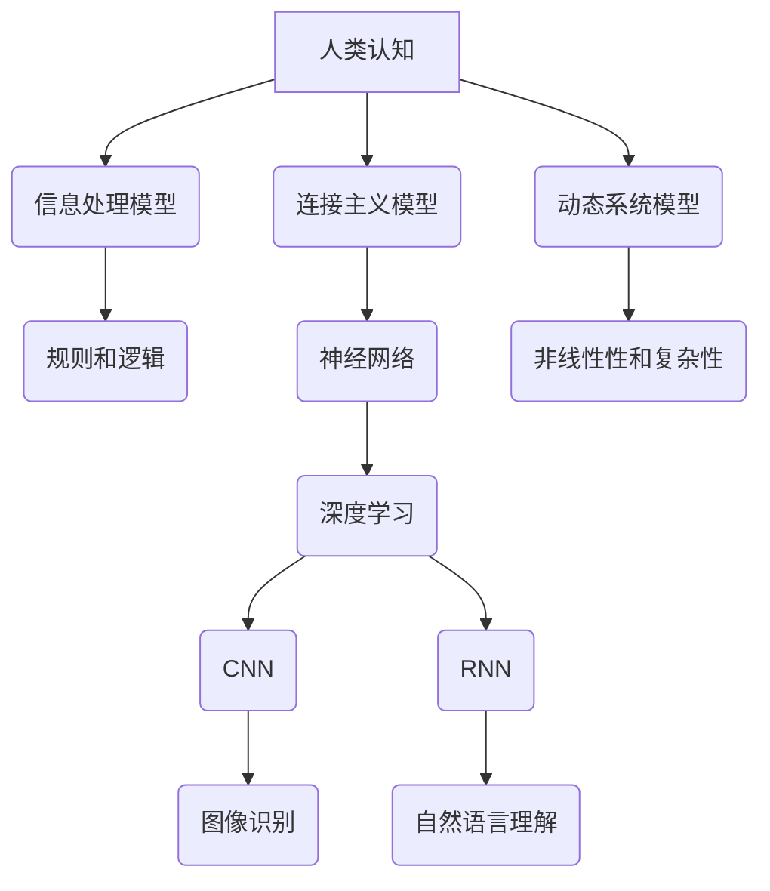

                 

## 人类认知：AI 时代的进步

> 关键词：人工智能、认知科学、深度学习、神经网络、自然语言处理、计算机视觉、机器学习

### 1. 背景介绍

人工智能（AI）正以惊人的速度发展，从简单的规则系统演变为能够学习、推理和解决复杂问题的智能系统。这其中，模拟人类认知过程的 AI 成为研究热点，旨在构建能够理解、学习和交互的智能体。

人类认知是一个复杂而多维的系统，涉及感知、记忆、语言、推理和决策等多个方面。传统 AI 系统主要依靠规则和符号逻辑，难以模拟人类的灵活性和创造性。近年来，深度学习的兴起为模拟人类认知提供了新的思路。深度学习算法能够从海量数据中学习复杂的模式和特征，从而实现更接近人类的认知能力。

### 2. 核心概念与联系

**2.1 人类认知模型**

人类认知模型试图解释人类如何感知、理解和交互世界。常见的模型包括信息处理模型、连接主义模型和动态系统模型等。

* **信息处理模型:** 将认知过程比喻为信息处理系统，强调认知过程中的步骤和规则。
* **连接主义模型:** 强调神经元之间的连接和权重，模拟大脑神经网络的结构和功能。
* **动态系统模型:** 将认知过程视为一个不断变化的动态系统，强调认知过程中的非线性性和复杂性。

**2.2 深度学习与人类认知**

深度学习算法，特别是卷积神经网络（CNN）和循环神经网络（RNN），在模拟人类视觉和语言认知方面取得了显著进展。

* **CNN:** 擅长处理图像数据，能够学习图像的特征和结构，实现图像识别、分类和物体检测等任务。
* **RNN:** 擅长处理序列数据，能够学习文本的语法和语义，实现自然语言理解、机器翻译和文本生成等任务。

**2.3 核心概念关系图**



### 3. 核心算法原理 & 具体操作步骤

**3.1 算法原理概述**

深度学习算法的核心是多层神经网络，通过学习数据中的特征表示来实现认知任务。

* **神经元:** 神经网络的基本单元，模拟大脑神经元的功能。
* **层:** 神经元按层次组织，每层神经元接收上一层的输出作为输入。
* **权重:** 连接神经元的参数，决定信号传递强度。
* **激活函数:** 将神经元的输入转换为输出，引入非线性特性。

**3.2 算法步骤详解**

1. **数据预处理:** 将原始数据转换为深度学习算法可以处理的格式。
2. **网络结构设计:** 根据任务需求设计神经网络的层数、神经元数量和激活函数等参数。
3. **参数初始化:** 为神经网络中的权重赋初值。
4. **前向传播:** 将输入数据通过神经网络传递，计算输出结果。
5. **反向传播:** 计算输出结果与目标值的误差，根据误差调整神经网络的权重。
6. **迭代训练:** 重复前向传播和反向传播过程，直到模型性能达到预期水平。

**3.3 算法优缺点**

* **优点:** 能够学习复杂特征，性能优于传统算法。
* **缺点:** 需要大量数据训练，训练时间长，解释性差。

**3.4 算法应用领域**

* **计算机视觉:** 图像识别、分类、物体检测、图像生成等。
* **自然语言处理:** 机器翻译、文本摘要、情感分析、对话系统等。
* **语音识别:** 语音转文本、语音合成等。
* **推荐系统:** 商品推荐、内容推荐等。

### 4. 数学模型和公式 & 详细讲解 & 举例说明

**4.1 数学模型构建**

深度学习算法的核心是神经网络，其数学模型可以表示为多层函数的复合。

* **激活函数:** 常见的激活函数包括 sigmoid 函数、ReLU 函数、tanh 函数等。

**4.2 公式推导过程**

* **损失函数:** 用于衡量模型预测结果与真实值的差异。常见的损失函数包括均方误差（MSE）、交叉熵损失等。
* **梯度下降:** 用于更新神经网络权重的优化算法。

**4.3 案例分析与讲解**

以图像识别为例，CNN 可以学习图像的特征表示。

* **卷积层:** 使用卷积核提取图像的局部特征。
* **池化层:** 降低特征图的维度，提高模型的鲁棒性。
* **全连接层:** 将提取的特征进行分类。

### 5. 项目实践：代码实例和详细解释说明

**5.1 开发环境搭建**

使用 Python 语言和深度学习框架 TensorFlow 或 PyTorch 搭建开发环境。

**5.2 源代码详细实现**

使用 TensorFlow 或 PyTorch 实现一个简单的图像分类模型，例如 MNIST 手写数字识别。

```python
import tensorflow as tf

# 定义模型结构
model = tf.keras.models.Sequential([
    tf.keras.layers.Conv2D(32, (3, 3), activation='relu', input_shape=(28, 28, 1)),
    tf.keras.layers.MaxPooling2D((2, 2)),
    tf.keras.layers.Conv2D(64, (3, 3), activation='relu'),
    tf.keras.layers.MaxPooling2D((2, 2)),
    tf.keras.layers.Flatten(),
    tf.keras.layers.Dense(10, activation='softmax')
])

# 编译模型
model.compile(optimizer='adam',
              loss='sparse_categorical_crossentropy',
              metrics=['accuracy'])

# 训练模型
model.fit(x_train, y_train, epochs=5)

# 评估模型
loss, accuracy = model.evaluate(x_test, y_test)
print('Test loss:', loss)
print('Test accuracy:', accuracy)
```

**5.3 代码解读与分析**

* **模型结构:** 模型包含两层卷积层、两层池化层、一层全连接层和一层输出层。
* **激活函数:** 使用 ReLU 函数作为激活函数，提高模型的非线性表达能力。
* **损失函数:** 使用交叉熵损失函数，适合多分类问题。
* **优化器:** 使用 Adam 优化器，可以快速收敛。

**5.4 运行结果展示**

训练完成后，模型可以对新的图像进行分类。

### 6. 实际应用场景

**6.1 医疗诊断:** 利用深度学习算法分析医学图像，辅助医生诊断疾病。

**6.2 自动驾驶:** 利用深度学习算法识别道路场景、车辆和行人，实现自动驾驶功能。

**6.3 金融风险控制:** 利用深度学习算法分析金融数据，识别欺诈行为和风险。

**6.4 未来应用展望**

* **更智能的虚拟助手:** 能够理解更复杂的人类语言，提供更个性化的服务。
* **个性化教育:** 根据学生的学习情况提供个性化的学习方案。
* **科学发现:** 帮助科学家分析大数据，加速科学发现。

### 7. 工具和资源推荐

**7.1 学习资源推荐**

* **书籍:**
    * 深度学习 (Deep Learning) - Ian Goodfellow, Yoshua Bengio, Aaron Courville
    * 人工智能：一种现代方法 (Artificial Intelligence: A Modern Approach) - Stuart Russell, Peter Norvig
* **在线课程:**
    * Coursera: 深度学习 Specialization
    * Udacity: 
    * fast.ai: Practical Deep Learning for Coders

**7.2 开发工具推荐**

* **TensorFlow:** 开源深度学习框架，支持多种硬件平台。
* **PyTorch:** 开源深度学习框架，以其灵活性和易用性而闻名。
* **Keras:** 高级深度学习 API，可以运行在 TensorFlow、Theano 或 CNTK 后端。

**7.3 相关论文推荐**

* **ImageNet Classification with Deep Convolutional Neural Networks** - Alex Krizhevsky, Ilya Sutskever, Geoffrey E. Hinton
* **Attention Is All You Need** - Ashish Vaswani, Noam Shazeer, Niki Parmar, Jakob Uszkoreit, Llion Jones, Aidan N. Gomez, Łukasz Kaiser, Illia Polosukhin

### 8. 总结：未来发展趋势与挑战

**8.1 研究成果总结**

深度学习在模拟人类认知方面取得了显著进展，在图像识别、自然语言处理等领域取得了突破性成果。

**8.2 未来发展趋势**

* **更强大的模型:** 研究更深、更复杂的网络结构，提高模型的表达能力和泛化能力。
* **更有效的训练方法:** 研究更有效的训练算法，降低训练时间和数据需求。
* **更解释性强的模型:** 研究更能解释模型决策过程的算法，提高模型的可信度和透明度。

**8.3 面临的挑战**

* **数据获取和标注:** 深度学习算法需要大量数据训练，数据获取和标注成本高昂。
* **模型解释性:** 深度学习模型的决策过程难以解释，这限制了其在一些安全关键领域应用。
* **伦理问题:** 人工智能的快速发展引发了伦理问题，例如算法偏见、隐私保护等。

**8.4 研究展望**

未来，人工智能研究将继续朝着更智能、更安全、更可解释的方向发展。


### 9. 附录：常见问题与解答

**9.1 什么是深度学习？**

深度学习是一种机器学习的子领域，它使用多层神经网络来学习数据中的复杂特征表示。

**9.2 深度学习与传统机器学习有什么区别？**

传统机器学习算法需要人工特征工程，而深度学习算法可以自动学习特征。深度学习算法通常需要更多数据训练，但可以学习更复杂的模式。

**9.3 深度学习有哪些应用场景？**

深度学习应用广泛，包括图像识别、自然语言处理、语音识别、推荐系统等。

**9.4 如何学习深度学习？**

可以通过阅读书籍、在线课程、参加培训等方式学习深度学习。

作者：禅与计算机程序设计艺术 / Zen and the Art of Computer Programming 


<end_of_turn>

