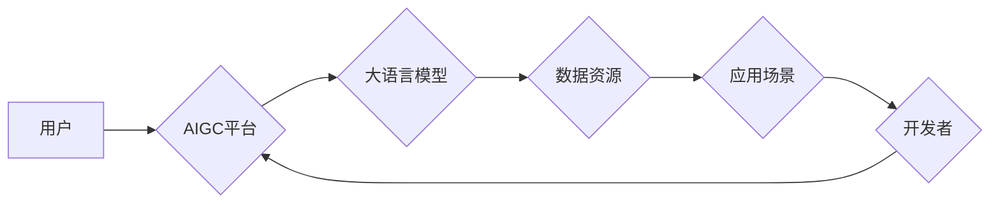

                 

## 从零开始构建AIGC应用生态

> 关键词：AIGC, 生成式AI, 大语言模型, 应用生态, 算法原理, 数学模型, 项目实践, 未来趋势

## 1. 背景介绍

近年来，人工智能（AI）技术取得了飞速发展，特别是生成式人工智能（AIGC）领域，掀起了前所未有的技术浪潮。AIGC是指利用人工智能技术，从文本、图像、音频等数据中生成新的内容，例如文本创作、图像生成、音乐作曲等。

AIGC技术的突破，源于大语言模型（LLM）的快速发展。LLM 拥有海量文本数据训练，能够理解和生成人类语言，并具备强大的文本处理能力。例如，GPT-3、LaMDA、BERT等模型，都展现了令人惊叹的文本生成能力，在写作、翻译、对话等领域展现出巨大的应用潜力。

随着AIGC技术的成熟，其应用场景不断拓展，从内容创作、营销推广到教育培训、科学研究等领域，都开始涌现出基于AIGC的创新应用。然而，AIGC技术还处于发展初期，其应用生态尚未完全形成。

## 2. 核心概念与联系

AIGC应用生态的构建，需要整合多方资源和技术，形成一个相互协作、互利共赢的生态系统。

**核心概念:**

* **生成式AI:** 利用人工智能技术，从现有数据中生成新的数据，例如文本、图像、音频等。
* **大语言模型 (LLM):** 训练于海量文本数据的深度学习模型，能够理解和生成人类语言，并具备强大的文本处理能力。
* **应用场景:** AIGC技术可以应用于各种领域，例如内容创作、营销推广、教育培训、科学研究等。
* **开发工具:** 用于开发和部署AIGC应用的软件工具和平台。
* **数据资源:** AIGC模型训练和应用都需要大量的文本、图像、音频等数据资源。

**架构图:**



**核心联系:**

用户通过AIGC平台，调用大语言模型进行内容生成等操作，平台依赖于丰富的训练数据资源，并提供给开发者开发各种应用场景，开发者可以利用平台和工具，构建新的AIGC应用，最终反馈给平台和用户，形成一个闭环生态系统。

## 3. 核心算法原理 & 具体操作步骤

### 3.1  算法原理概述

AIGC的核心算法主要基于深度学习，特别是Transformer模型架构。Transformer模型通过自注意力机制，能够捕捉文本序列中的长距离依赖关系，从而实现更精准的文本生成。

**核心算法:**

* **Transformer模型:**  一种基于深度学习的序列到序列模型，能够处理文本、音频等序列数据。
* **自注意力机制:**  一种机制，能够捕捉文本序列中不同词语之间的关系，并赋予每个词语不同的权重。
* **解码器:**  负责根据输入序列生成新的序列，例如文本生成、图像生成等。

### 3.2  算法步骤详解

1. **数据预处理:** 将原始数据进行清洗、格式化、编码等操作，使其适合模型训练。
2. **模型训练:** 使用训练数据训练Transformer模型，通过反向传播算法，不断调整模型参数，使其能够生成高质量的输出。
3. **模型评估:** 使用测试数据评估模型的性能，例如准确率、流畅度、多样性等指标。
4. **模型部署:** 将训练好的模型部署到服务器或云平台，供用户调用。
5. **用户交互:** 用户通过平台接口，输入文本或其他数据，模型根据输入生成新的内容。

### 3.3  算法优缺点

**优点:**

* **生成高质量内容:** Transformer模型能够生成流畅、自然、符合语义的文本内容。
* **适应多种应用场景:**  AIGC算法可以应用于文本生成、图像生成、音频生成等多种领域。
* **不断迭代优化:**  随着训练数据的增加和算法的改进，AIGC模型的性能会不断提升。

**缺点:**

* **训练成本高:**  训练大型Transformer模型需要大量的计算资源和时间。
* **数据依赖性强:**  AIGC模型的性能取决于训练数据的质量和数量。
* **伦理风险:**  AIGC技术可能被用于生成虚假信息、恶意内容等，需要谨慎使用和监管。

### 3.4  算法应用领域

* **内容创作:**  自动生成新闻报道、小说、诗歌、剧本等内容。
* **营销推广:**  生成广告文案、社交媒体内容、产品描述等。
* **教育培训:**  自动生成学习材料、练习题、个性化辅导等。
* **科学研究:**  辅助科研人员进行数据分析、文献综述、实验设计等。
* **艺术创作:**  生成音乐、绘画、雕塑等艺术作品。

## 4. 数学模型和公式 & 详细讲解 & 举例说明

### 4.1  数学模型构建

AIGC算法的核心是Transformer模型，其数学模型基于深度学习的框架，主要包括以下几个部分:

* **词嵌入层:** 将每个词语映射到一个低维向量空间，表示词语的语义信息。
* **多头自注意力层:**  捕捉文本序列中不同词语之间的关系，并赋予每个词语不同的权重。
* **前馈神经网络层:**  对每个词语的嵌入向量进行非线性变换，提取更深层次的语义特征。
* **解码器:**  根据输入序列生成新的序列，例如文本生成、图像生成等。

### 4.2  公式推导过程

Transformer模型的数学公式推导过程较为复杂，涉及到线性变换、激活函数、softmax函数等多种数学操作。

**自注意力机制公式:**

$$
Attention(Q, K, V) = \frac{exp(Q \cdot K^T / \sqrt{d_k})}{exp(Q \cdot K^T / \sqrt{d_k})} \cdot V
$$

其中:

* $Q$: 查询矩阵
* $K$: 键矩阵
* $V$: 值矩阵
* $d_k$: 键向量的维度

### 4.3  案例分析与讲解

**文本生成案例:**

假设我们想要使用AIGC模型生成一篇关于“人工智能”的短文。

1. 用户输入关键词“人工智能”。
2. AIGC平台将关键词转换为词嵌入向量。
3. Transformer模型通过多头自注意力机制，捕捉关键词与训练数据中相关词语之间的关系。
4. 解码器根据上下文信息，生成一篇关于“人工智能”的短文。

## 5. 项目实践：代码实例和详细解释说明

### 5.1  开发环境搭建

* **操作系统:**  Linux/macOS/Windows
* **编程语言:**  Python
* **深度学习框架:**  TensorFlow/PyTorch
* **其他工具:**  Git、Jupyter Notebook等

### 5.2  源代码详细实现

```python
# 使用HuggingFace Transformers库加载预训练模型
from transformers import pipeline

# 加载文本生成模型
generator = pipeline("text-generation", model="gpt2")

# 输入文本提示
prompt = "人工智能的发展趋势是"

# 生成文本
output = generator(prompt, max_length=100, num_return_sequences=3)

# 打印生成结果
for text in output:
    print(text["generated_text"])
```

### 5.3  代码解读与分析

*  `pipeline("text-generation", model="gpt2")`: 使用HuggingFace Transformers库加载预训练的GPT-2文本生成模型。
*  `generator(prompt, max_length=100, num_return_sequences=3)`:  使用模型生成文本，`prompt`为输入提示，`max_length`为生成文本的最大长度，`num_return_sequences`为生成文本的数量。
*  `print(text["generated_text"])`: 打印生成的文本内容。

### 5.4  运行结果展示

```
人工智能的发展趋势是朝着更加智能化、自动化、个性化的方向发展。
人工智能的发展趋势是未来将更加广泛地应用于各个领域，例如医疗、教育、金融等。
人工智能的发展趋势是不断突破技术瓶颈，实现更强大的计算能力和更精准的预测能力。
```

## 6. 实际应用场景

### 6.1  内容创作

* **新闻报道:**  自动生成新闻报道，例如财经新闻、体育新闻等。
* **小说创作:**  根据用户输入的主题、人物、情节等信息，自动生成小说。
* **诗歌创作:**  根据用户输入的主题、风格、韵律等信息，自动生成诗歌。

### 6.2  营销推广

* **广告文案:**  自动生成吸引人的广告文案，例如标题、描述、call to action等。
* **社交媒体内容:**  自动生成适合不同社交媒体平台的文案，例如微博、微信、抖音等。
* **产品描述:**  自动生成产品描述，突出产品特点和优势。

### 6.3  教育培训

* **学习材料:**  自动生成学习材料，例如课件、习题、练习等。
* **个性化辅导:**  根据学生的学习情况，自动生成个性化的辅导内容。
* **在线考试:**  自动生成在线考试题，并进行自动批改。

### 6.4  未来应用展望

* **虚拟助手:**  更加智能、人性化的虚拟助手，能够理解用户的自然语言指令，并提供更精准的帮助。
* **个性化推荐:**  根据用户的兴趣爱好、行为习惯等信息，提供更加个性化的商品、服务、内容推荐。
* **跨语言沟通:**  实现更加流畅、自然的跨语言沟通，打破语言障碍。

## 7. 工具和资源推荐

### 7.1  学习资源推荐

* **书籍:**  《深度学习》、《自然语言处理》
* **在线课程:**  Coursera、edX、Udacity等平台上的深度学习、自然语言处理课程。
* **博客和论坛:**  Towards Data Science、Machine Learning Mastery等博客网站，以及相关的论坛和社区。

### 7.2  开发工具推荐

* **HuggingFace Transformers:**  一个开源的深度学习库，提供预训练的语言模型和工具。
* **TensorFlow/PyTorch:**  主流的深度学习框架，用于训练和部署AIGC模型。
* **Jupyter Notebook:**  一个交互式编程环境，方便进行代码开发和实验。

### 7.3  相关论文推荐

* **Attention Is All You Need:**  Transformer模型的奠基性论文。
* **BERT: Pre-training of Deep Bidirectional Transformers for Language Understanding:**  BERT模型的论文。
* **GPT-3: Language Models are Few-Shot Learners:**  GPT-3模型的论文。

## 8. 总结：未来发展趋势与挑战

### 8.1  研究成果总结

AIGC技术取得了显著进展，能够生成高质量的文本、图像、音频等内容，并应用于多个领域。

### 8.2  未来发展趋势

* **模型规模和能力提升:**  未来AIGC模型将更加强大，能够处理更复杂的任务，生成更精细的内容。
* **多模态生成:**  AIGC模型将能够融合文本、图像、音频等多种模态数据，生成更加丰富、多样的内容。
* **个性化定制:**  AIGC模型将更加注重用户个性化需求，能够根据用户的喜好、风格等信息，生成更加符合用户需求的内容。

### 8.3  面临的挑战

* **数据安全和隐私:**  AIGC模型训练和应用需要大量数据，如何保证数据安全和隐私是一个重要挑战。
* **算法偏见和伦理风险:**  AIGC模型可能存在算法偏见，导致生成内容不公平、不准确，需要加强算法的公平性、伦理性研究。
* **可解释性和可控性:**  AIGC模型的决策过程较为复杂，难以解释其生成内容的原理，需要提高模型的可解释性和可控性。

### 8.4  研究展望

未来AIGC研究将更加注重以下几个方面:

* **开发更加安全、可靠、可解释的AIGC算法。**
* **探索AIGC技术在更多领域的新应用场景。**
* **构建更加完善的AIGC应用生态系统。**

## 9. 附录：常见问题与解答

**Q1:  AIGC技术与传统人工智能技术有什么区别？**

**A1:**  传统人工智能技术主要依赖于规则和特征工程，而AIGC技术则主要基于深度学习，能够从海量数据中学习，自动生成新的内容。

**Q2:  AIGC技术有哪些应用场景？**

**A2:**  AIGC技术可以应用于内容创作、营销推广、教育培训、科学研究等多个领域。

**Q3:  如何学习AIGC技术？**

**A3:**  可以学习深度学习、自然语言处理相关的书籍、课程，并使用开源工具进行实践。

**Q4:  AIGC技术有哪些伦理风险？**

**A4:**  AIGC技术可能被用于生成虚假信息、恶意内容等，需要加强算法的公平性、伦理性研究。


作者：禅与计算机程序设计艺术 / Zen and the Art of Computer Programming<end_of_turn>

