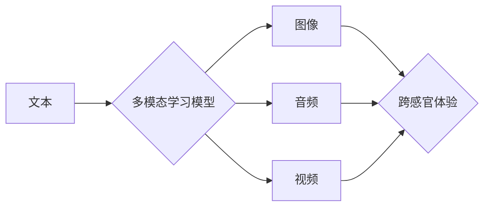

                 

## 体验的跨感官协奏：AI创造的感官交响曲

> 关键词：人工智能、跨感官体验、感官合成、多模态学习、AI艺术

## 1. 背景介绍

人类的感知世界的方式是多样的，我们通过视觉、听觉、触觉、嗅觉和味觉等感官接收信息，并将其整合为完整的体验。然而，传统的数字媒体通常局限于单一感官的呈现，例如视频只提供视觉信息，音频只提供听觉信息。随着人工智能技术的飞速发展，我们开始探索利用AI技术创造跨感官体验，即通过多种感官的融合，构建更加沉浸式、逼真的虚拟世界。

跨感官体验的应用领域非常广泛，例如：

* **游戏和娱乐:** 通过跨感官交互，游戏可以更加逼真、沉浸式，玩家可以更深入地体验游戏世界。
* **教育和培训:** 跨感官学习可以帮助人们更好地理解和记忆知识，例如通过视觉、听觉和触觉的结合，学习解剖学或机械原理。
* **艺术和设计:** AI可以帮助艺术家创作跨感官艺术作品，例如将音乐转化为视觉图像，或将绘画作品转化为声音体验。
* **医疗保健:** 跨感官技术可以帮助医生诊断疾病，例如通过触觉和视觉的结合，识别皮肤病变。

## 2. 核心概念与联系

跨感官体验的核心概念是多模态学习，即让AI模型能够理解和处理多种类型的输入数据，例如文本、图像、音频、视频等。通过学习这些不同模态的数据之间的关系，AI模型可以生成跨感官的输出，例如将文本描述转化为图像、音频或视频。

**Mermaid 流程图**

## 3. 核心算法原理 & 具体操作步骤

### 3.1  算法原理概述

跨感官体验的实现依赖于多种算法，例如：

* **深度学习:** 深度学习算法可以学习数据之间的复杂关系，例如图像识别、语音识别、自然语言处理等。
* **生成对抗网络 (GAN):** GAN是一种生成式模型，可以生成逼真的图像、音频、视频等数据。
* **变分自编码器 (VAE):** VAE是一种压缩和生成数据模型，可以将数据压缩成低维表示，并根据该表示生成新的数据。

### 3.2  算法步骤详解

跨感官体验的具体实现步骤如下：

1. **数据收集和预处理:** 收集不同模态的数据，例如文本、图像、音频等，并进行预处理，例如图像裁剪、音频降噪等。
2. **特征提取:** 使用深度学习算法提取不同模态数据的特征，例如图像的边缘特征、音频的音调特征等。
3. **多模态融合:** 将不同模态的特征融合在一起，例如使用注意力机制学习不同模态之间的关系。
4. **跨感官生成:** 使用生成模型，例如GAN或VAE，根据融合后的特征生成跨感官的输出，例如将文本描述转化为图像、音频或视频。
5. **评估和优化:** 使用评价指标评估跨感官体验的质量，并根据评价结果优化算法参数。

### 3.3  算法优缺点

**优点:**

* 可以创造更加沉浸式、逼真的虚拟体验。
* 可以扩展人类感知能力，例如将文本描述转化为图像或音频。
* 可以应用于多个领域，例如游戏、教育、艺术、医疗保健等。

**缺点:**

* 需要大量的训练数据和计算资源。
* 跨感官体验的评估指标仍然缺乏统一标准。
* 跨感官体验可能引发伦理问题，例如虚假信息传播、隐私泄露等。

### 3.4  算法应用领域

跨感官体验的应用领域非常广泛，例如：

* **游戏和娱乐:** 通过跨感官交互，游戏可以更加逼真、沉浸式，玩家可以更深入地体验游戏世界。
* **教育和培训:** 跨感官学习可以帮助人们更好地理解和记忆知识，例如通过视觉、听觉和触觉的结合，学习解剖学或机械原理。
* **艺术和设计:** AI可以帮助艺术家创作跨感官艺术作品，例如将音乐转化为视觉图像，或将绘画作品转化为声音体验。
* **医疗保健:** 跨感官技术可以帮助医生诊断疾病，例如通过触觉和视觉的结合，识别皮肤病变。

## 4. 数学模型和公式 & 详细讲解 & 举例说明

### 4.1  数学模型构建

跨感官体验的数学模型通常基于深度学习框架，例如TensorFlow或PyTorch。这些框架提供了一系列预训练的模型和工具，可以帮助开发者构建跨感官体验系统。

### 4.2  公式推导过程

跨感官体验的具体公式推导过程取决于具体的算法和应用场景。例如，使用GAN生成跨感官体验的公式推导过程涉及到生成器和判别器的损失函数，以及梯度下降算法的迭代过程。

### 4.3  案例分析与讲解

例如，将文本描述转化为图像的跨感官体验，可以使用文本到图像生成模型，例如DALL-E 2或Stable Diffusion。这些模型使用深度学习算法，学习文本描述和图像之间的关系，并根据文本描述生成相应的图像。

## 5. 项目实践：代码实例和详细解释说明

### 5.1  开发环境搭建

跨感官体验项目的开发环境通常需要包含以下软件：

* Python编程语言
* 深度学习框架，例如TensorFlow或PyTorch
* 数据处理工具，例如Pandas或NumPy
* 可视化工具，例如Matplotlib或Seaborn

### 5.2  源代码详细实现

具体的源代码实现取决于具体的跨感官体验项目。例如，将文本描述转化为图像的项目，需要使用文本到图像生成模型的API接口，并根据文本描述生成相应的图像。

### 5.3  代码解读与分析

代码解读需要根据具体的代码实现进行分析，例如分析文本到图像生成模型的输入输出结构，以及模型训练和预测过程。

### 5.4  运行结果展示

运行结果展示需要根据具体的项目目标进行展示，例如将文本描述转化为图像的项目，需要展示生成的图像，并分析图像与文本描述的匹配程度。

## 6. 实际应用场景

### 6.1  跨感官游戏

跨感官游戏可以利用多种感官信息，例如视觉、听觉、触觉、嗅觉等，创造更加沉浸式的游戏体验。例如，一款虚拟现实游戏可以利用触觉反馈装置，让玩家感受到游戏中的虚拟物体，并通过声音效果，增强游戏的氛围感。

### 6.2  跨感官教育

跨感官教育可以利用多种感官信息，帮助学生更好地理解和记忆知识。例如，学习生物学的学生可以通过虚拟现实体验，观察细胞的结构和功能，并通过触觉反馈装置，感受细胞的形状和大小。

### 6.3  跨感官艺术

跨感官艺术可以利用多种感官信息，创造更加丰富的艺术体验。例如，艺术家可以使用AI技术，将音乐转化为视觉图像，或将绘画作品转化为声音体验。

### 6.4  未来应用展望

跨感官体验的应用前景非常广阔，未来可能会应用于更多领域，例如：

* **医疗保健:** 跨感官技术可以帮助医生诊断疾病，例如通过触觉和视觉的结合，识别皮肤病变。
* **零售:** 跨感官体验可以帮助消费者更好地了解产品，例如通过虚拟现实体验，试穿衣服或体验家具。
* **旅游:** 跨感官体验可以帮助游客更好地体验旅游目的地，例如通过虚拟现实体验，参观博物馆或探索自然景观。

## 7. 工具和资源推荐

### 7.1  学习资源推荐

* **书籍:**
    * 《深度学习》 by Ian Goodfellow, Yoshua Bengio, and Aaron Courville
    * 《Generative Deep Learning》 by David Foster
* **在线课程:**
    * Coursera: Deep Learning Specialization
    * Udacity: Deep Learning Nanodegree
* **博客和论坛:**
    * TensorFlow Blog
    * PyTorch Blog
    * Reddit: r/MachineLearning

### 7.2  开发工具推荐

* **深度学习框架:** TensorFlow, PyTorch
* **数据处理工具:** Pandas, NumPy
* **可视化工具:** Matplotlib, Seaborn
* **云计算平台:** AWS, Google Cloud, Azure

### 7.3  相关论文推荐

* **Generative Adversarial Networks** by Ian Goodfellow et al. (2014)
* **Attention Is All You Need** by Ashish Vaswani et al. (2017)
* **DALL-E 2: Hierarchical Text-Conditional Image Generation with CLIP Latents** by OpenAI (2022)

## 8. 总结：未来发展趋势与挑战

### 8.1  研究成果总结

跨感官体验的研究取得了显著进展，例如：

* 深度学习算法的不断发展，使得跨感官体验的生成更加逼真。
* 多模态学习技术的进步，使得跨感官体验更加丰富和多样。
* 跨感官体验的应用场景不断扩展，覆盖了游戏、教育、艺术、医疗保健等多个领域。

### 8.2  未来发展趋势

未来跨感官体验的发展趋势包括：

* **更加逼真的跨感官体验:** 利用更先进的算法和硬件，创造更加逼真、沉浸式的跨感官体验。
* **更加个性化的跨感官体验:** 根据用户的喜好和需求，定制更加个性化的跨感官体验。
* **跨感官体验的融合:** 将跨感官体验与其他新兴技术，例如增强现实 (AR) 和虚拟现实 (VR)，进行融合，创造更加丰富的体验。

### 8.3  面临的挑战

跨感官体验的发展也面临着一些挑战，例如：

* **数据获取和标注:** 跨感官体验需要大量的训练数据，获取和标注这些数据非常困难。
* **算法的复杂性:** 跨感官体验的算法非常复杂，需要大量的计算资源和专业知识。
* **伦理问题:** 跨感官体验可能引发伦理问题，例如虚假信息传播、隐私泄露等。

### 8.4  研究展望

未来，跨感官体验的研究将继续深入，探索更加逼真、丰富、个性化的跨感官体验，并解决相关的技术和伦理挑战。

## 9. 附录：常见问题与解答

**Q1: 跨感官体验和虚拟现实 (VR) 是同一个概念吗？**

**A1:** 跨感官体验和虚拟现实 (VR) 并不是同一个概念，但它们之间存在一定的关联。VR通常指的是利用头戴式显示器和传感器，创造沉浸式的虚拟环境。而跨感官体验则更强调利用多种感官信息，创造更加逼真的体验，VR只是其中一种实现方式。

**Q2: 跨感官体验的应用场景有哪些？**

**A2:** 跨感官体验的应用场景非常广泛，例如：游戏、教育、艺术、医疗保健、零售、旅游等。

**Q3: 如何评估跨感官体验的质量？**

**A3:** 跨感官体验的评估指标仍然缺乏统一标准，通常会根据具体的应用场景和目标进行评估，例如使用用户满意度调查、客观评价指标等。

作者：禅与计算机程序设计艺术 / Zen and the Art of Computer Programming 
<end_of_turn>

