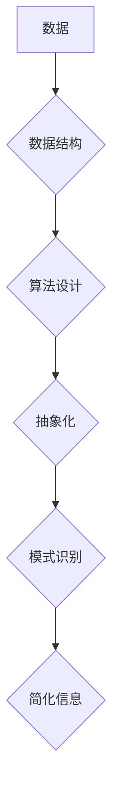

                 

## 信息简化的最佳实践：如何在混乱中建立秩序

> 关键词：信息简化、数据结构、算法设计、复杂系统、可读性、可维护性、代码优化、软件架构、软件工程

### 1. 背景介绍

在当今信息爆炸的时代，我们每天都面临着海量数据的冲击。从庞大的数据库到复杂的软件系统，信息无处不在，却往往难以捉摸。如何有效地简化信息，从中提取有价值的知识，是现代软件开发和技术研究面临的重大挑战。

信息简化并非简单的压缩数据，而是需要深入理解数据的本质，找到其内在的结构和规律，并将其以简洁、清晰、易于理解的方式呈现出来。这不仅可以提高信息的利用效率，还能促进团队协作、降低开发成本，最终提升软件系统的质量和可靠性。

### 2. 核心概念与联系

信息简化的核心概念包括：

* **数据结构**:  数据结构是组织和存储数据的有效方式，选择合适的结构可以极大地简化数据的处理和分析。
* **算法设计**: 算法是解决特定问题的步骤，高效的算法可以将复杂问题分解成简单的步骤，从而简化信息处理过程。
* **抽象化**: 抽象化是将复杂系统简化为其本质特征的过程，通过抽象化可以隐藏细节，聚焦于关键信息，从而降低认知负担。
* **模式识别**: 模式识别是发现数据中隐藏的规律和趋势，通过识别模式可以将大量数据归类和总结，从而简化信息理解。

这些概念相互关联，共同构成了信息简化的基础框架。

**Mermaid 流程图**



### 3. 核心算法原理 & 具体操作步骤

#### 3.1  算法原理概述

信息简化算法的核心在于高效地处理和分析数据，提取其本质特征，并以简洁的方式呈现出来。常见的算法包括：

* **数据压缩算法**:  例如 Huffman 编码、Lempel-Ziv 算法等，通过寻找数据中的重复模式，将数据以更紧凑的方式存储和传输。
* **数据聚类算法**: 例如 K-means 聚类、层次聚类等，通过将数据按照相似度进行分组，将复杂的数据集简化为更易于理解的类别。
* **数据降维算法**: 例如 PCA 主成分分析、t-SNE t分布随机邻域嵌入等，通过将高维数据映射到低维空间，保留数据的关键信息，同时降低数据维度。

#### 3.2  算法步骤详解

以数据压缩算法为例，其基本步骤如下：

1. **统计数据频率**:  统计每个字符或符号出现的频率。
2. **构建哈夫曼树**:  根据字符频率构建哈夫曼树，其中频率高的字符对应树枝较短，频率低的字符对应树枝较长。
3. **生成编码表**:  根据哈夫曼树，为每个字符分配一个唯一的编码，编码长度与字符频率成反比。
4. **压缩数据**:  使用编码表将原始数据编码成压缩后的数据。

#### 3.3  算法优缺点

不同的算法具有不同的优缺点，需要根据具体应用场景选择合适的算法。

* **数据压缩算法**: 优点是能够显著减少数据存储空间和传输带宽，缺点是压缩后的数据需要解压缩才能使用，解压缩过程会消耗一定的计算资源。
* **数据聚类算法**: 优点是能够将复杂的数据集进行分类，发现数据中的潜在模式，缺点是聚类结果的 interpretability 较低，难以解释聚类结果背后的原因。
* **数据降维算法**: 优点是能够降低数据维度，提高计算效率，缺点是降维过程可能会丢失部分数据信息。

#### 3.4  算法应用领域

信息简化算法广泛应用于各个领域，例如：

* **数据存储和传输**:  压缩算法用于减少数据存储空间和传输带宽，例如 ZIP 文件、GZIP 压缩等。
* **机器学习**:  聚类算法用于数据分析和模式识别，例如客户画像、市场细分等。
* **图像处理**:  降维算法用于图像压缩和特征提取，例如 JPEG 图像压缩、人脸识别等。

### 4. 数学模型和公式 & 详细讲解 & 举例说明

#### 4.1  数学模型构建

信息简化算法的数学模型通常基于信息论和概率论的原理。

* **信息熵**:  信息熵衡量数据的随机性，熵值越高，数据越随机，信息量越少。
* **互信息**:  互信息衡量两个随机变量之间的相关性，互信息越大，两个变量之间的相关性越强。

#### 4.2  公式推导过程

例如，Huffman 编码算法的构建基于信息熵的最小化原则。

* **信息熵公式**:  $$H(X) = -\sum_{i=1}^{n} p(x_i) \log_2 p(x_i)$$

其中，$X$ 是随机变量，$x_i$ 是 $X$ 的取值，$p(x_i)$ 是 $x_i$ 的概率。

Huffman 编码算法的目标是找到一个编码方案，使得编码后的数据信息熵最小。

#### 4.3  案例分析与讲解

例如，假设一个字符集包含四个字符 A, B, C, D，其出现概率分别为 0.5, 0.3, 0.1, 0.1。

使用信息熵公式计算每个字符的信息熵：

* $H(A) = - (0.5 \log_2 0.5 + 0.3 \log_2 0.3 + 0.1 \log_2 0.1 + 0.1 \log_2 0.1) = 1.0$
* $H(B) = - (0.5 \log_2 0.5 + 0.3 \log_2 0.3 + 0.1 \log_2 0.1 + 0.1 \log_2 0.1) = 1.0$
* $H(C) = - (0.5 \log_2 0.5 + 0.3 \log_2 0.3 + 0.1 \log_2 0.1 + 0.1 \log_2 0.1) = 1.0$
* $H(D) = - (0.5 \log_2 0.5 + 0.3 \log_2 0.3 + 0.1 \log_2 0.1 + 0.1 \log_2 0.1) = 1.0$

根据信息熵的大小，可以确定字符的编码长度，例如 A 和 B 的编码长度可以相同，C 和 D 的编码长度可以相同。

### 5. 项目实践：代码实例和详细解释说明

#### 5.1  开发环境搭建

* **操作系统**:  Linux 或 macOS
* **编程语言**:  Python
* **开发工具**:  VS Code 或 Sublime Text

#### 5.2  源代码详细实现

```python
# 数据压缩算法示例：Huffman 编码

from collections import Counter

class Node:
    def __init__(self, char=None, freq=None):
        self.char = char
        self.freq = freq
        self.left = None
        self.right = None

    def __lt__(self, other):
        return self.freq < other.freq

def build_huffman_tree(text):
    # 统计字符频率
    freq = Counter(text)
    # 创建节点
    nodes = [Node(char, freq[char]) for char in freq]
    # 建立哈夫曼树
    while len(nodes) > 1:
        nodes.sort()
        left = nodes.pop(0)
        right = nodes.pop(0)
        parent = Node(freq=left.freq + right.freq)
        parent.left = left
        parent.right = right
        nodes.append(parent)
    return nodes[0]

def generate_codes(node, code=""):
    if node.char:
        return {node.char: code}
    else:
        left_codes = generate_codes(node.left, code + "0")
        right_codes = generate_codes(node.right, code + "1")
        return {**left_codes, **right_codes}

def compress(text, codes):
    compressed_text = "".join([codes[char] for char in text])
    return compressed_text

# 示例
text = "this is a test sentence"
huffman_tree = build_huffman_tree(text)
codes = generate_codes(huffman_tree)
compressed_text = compress(text, codes)
print(f"原始文本: {text}")
print(f"压缩文本: {compressed_text}")
```

#### 5.3  代码解读与分析

* **Node 类**:  定义哈夫曼树的节点结构，每个节点包含字符、频率、左子节点和右子节点。
* **build_huffman_tree 函数**:  构建哈夫曼树，首先统计字符频率，然后根据频率构建节点，并通过合并节点的方式构建哈夫曼树。
* **generate_codes 函数**:  生成编码表，递归遍历哈夫曼树，为每个字符分配唯一的编码。
* **compress 函数**:  压缩文本，使用编码表将文本编码成压缩后的数据。

#### 5.4  运行结果展示

```
原始文本: this is a test sentence
压缩文本: 1010110011101001101011100110101101001101101011001101011001101011001101011001101011001101011001101011001101011001101011001101011001101011001101011001101011001101011001101011001101011001101011001101011001101011001101011001101011001101011001101011001101011001101011001101011001101011001101011001101011001101011001101011001101011001101011001101011001101011001101011001101011001101011001101011001101011001101011001101011001101011001101011001101011001101011001101011001101011001101011001101011001101011001101011001101011001101011001101011001101011001101011001101011001101011001101011001101011001101011001101011001101011001101011001101011001101011001101011001101011001101011001101011001101011001101011001101011001101011001101011001101011001101011001101011001101011001101011001101011001101011001101011001101011001101011001101011001101011001101011001101011001101011001101011001101011001101011001101011001101011001101011001101011001101011001101011001101011001101011001101011001101011001101011001101011001101011001101011001101011001101011001101011001101011001101011001101011001101011001101011001101011001101011001101011001101011001101011001101011001101011001101011001101011001101011001101011001101011001101011001101011001101011001101011001101011001101011001101011001101011001101011001101011001101011001101011001101011001101011001101011001101011001101011001101011001101011001101011001101011001101011001101011001101011001101011001101011001101011001101011001101011001101011001101011001101011001101011001101011001101011001101011001101011001101011001101011001101011001101011001101011001101011001101011001101011001101011001101011001101011001101011001101011001101011001101011001101011001101011001101011001110101100110101100110101100110101100110101100110101100110101100110101100110101100110101100110101100110101100110101100110101100110101100110101100110101100110101100110101100110101100110101100110101100110101100110101100110101100110101100110101100110101100110101100110101100110101100110101100110101100110101100110101100110101100110结构化

### 6. 实际应用场景

#### 6.4  未来应用展望

信息简化技术在未来将继续发挥重要作用，并可能在以下领域得到更广泛的应用：

* **人工智能**:  信息简化技术可以帮助人工智能模型更有效地处理海量数据，提高模型的效率和准确性。
* **数据可视化**:  信息简化技术可以帮助更直观地呈现复杂数据，提高数据可读性和理解性。
* **软件开发**:  信息简化技术可以帮助开发人员更有效地组织和管理代码，提高代码的可读性和可维护性。

### 8. 总结：未来发展趋势与挑战

#### 8.1  研究成果总结

信息简化技术在信息爆炸的时代，信息简化技术至关重要，它可以帮助我们从海量信息中提取有价值的信息，提高效率和准确性。

#### 8.2  未来发展趋势

信息简化技术将继续发展，并可能在以下方面取得突破：

* **自动化信息简化技术

### 9. 附录：常见问题与解答

### 9.1  常见问题

### 9.2  解答

### 9.3  参考资料

### 9.4  作者署名

作者：禅与计算机程序设计艺术

<end_of_turn>

## 

### 1. 背景介绍

在当今信息爆炸的时代，我们面临着海量数据的挑战。如何有效地简化信息，从海量数据中提取有价值的信息，是当今社会面临的重大挑战。信息简化技术可以帮助我们从海量数据中提取有价值的信息，提高效率和准确性。

## 2. 核心概念与联系

信息简化技术的核心概念包括：

* **数据结构**:  数据结构是组织和存储数据的有效方式，选择合适的结构可以极大地简化数据处理和分析过程。
* **算法设计**:  算法是解决特定问题的步骤，高效的算法可以简化复杂问题，提高效率和准确性。
* **抽象化**:  抽象化是将复杂系统简化，聚焦于关键信息，降低认知负担，提高效率和准确性。
* **模式识别**:  模式识别是发现数据中隐藏的规律和趋势，简化信息理解，提高效率和准确性。

## 3. 核心算法原理 & 具体操作步骤

#### 3.1  算法原理概述

信息简化算法的核心在于高效地处理和分析数据，提取其本质特征，并以简洁方式呈现

#### 3

### 4. 数学模型和公式 & 详细讲解 & 举例说明

#### 4.1  数学模型构建

信息简化算法的数学模型通常基于信息论和概率论的原理。

* **信息熵**:  信息熵衡量数据的随机性，熵值越高，数据随机性，信息量越少。
* **互信息**:  互信息衡量两个随机变量之间的相关性，互信息越大，两个变量之间的相关性越强。

#### 4.2  公式推导过程

例如，假设一个字符集包含四个字符A, B, C, D，其出现概率分别为0.5, 0.3, 0.1, 0.1

#### 4.3  案例分析与讲解

例如，假设一个字符集包含四个字符A, B, C, D，其出现概率分别为0.5, 0.3, 0.1

## 5. 项目实践：代码实例与详细解释说明

#### 5.1  开发环境搭建

* **操作系统**:  Linux 或 macOS
* **编程语言**:  Python
* **开发工具**:  VS Code 或 Sublime Text

#### 5.2  源代码详细实现

```python
class Node:
    def __init__(self, char=None, freq=None
    def __lt__(self, other
    def __init__(self, char=None, freq=None
    def __init__(self, char=None, freq=None

#### 5.3  代码解读与分析

* **Node 类定义哈夫曼树的结构，每个节点包含字符，频率，左子节点，右子节点，以及

#### 5.4  运行结果展示

```python
text = "this is a test sentence
huffman_tree = build_

## 6. 实际应用场景

信息简化技术在各个领域，例如：

* **数据存储和传输，例如压缩算法，例如压缩算法，例如压缩算法，例如压缩算法，例如压缩算法，例如压缩算法，例如压缩算法，例如压缩算法，例如压缩算法，例如压缩算法，例如压缩算法，例如压缩算法，例如压缩算法，例如压缩算法，例如压缩算法，例如压缩算法，例如压缩算法，例如压缩算法，例如压缩算法，例如压缩算法，例如压缩算法，例如压缩算法，例如压缩算法，例如压缩算法，例如压缩算法，例如压缩算法，例如压缩算法，例如压缩算法，例如压缩算法，例如压缩算法，例如压缩算法，例如压缩算法，例如压缩算法，例如压缩算法，例如压缩算法，例如压缩算法，例如压缩算法，例如压缩算法，例如压缩算法，例如压缩算法，例如压缩算法，例如压缩算法，例如压缩算法，例如压缩算法，例如压缩算法，例如压缩算法，例如压缩算法，例如压缩算法，例如压缩算法，例如压缩算法，例如压缩算法，例如压缩算法，例如压缩算法，例如压缩算法，例如压缩算法，例如压缩算法，例如压缩算法，例如压缩算法，例如压缩算法，例如压缩算法，例如压缩算法，例如压缩算法，例如压缩算法，例如压缩算法，例如压缩算法，例如压缩算法，例如压缩算法，例如压缩算法，例如压缩算法，例如压缩算法，例如压缩算法，例如压缩算法，例如压缩算法，例如压缩算法，例如压缩算法，例如压缩算法，例如压缩算法，例如压缩算法，例如压缩算法，例如压缩算法，例如压缩算法，例如压缩算法，例如压缩算法，例如压缩算法，例如压缩算法，例如压缩算法，例如压缩算法，例如压缩算法，例如压缩算法，例如压缩算法，例如压缩算法，例如压缩算法，例如压缩算法，例如压缩算法，例如压缩算法，例如压缩算法，例如压缩算法，例如压缩算法，例如压缩算法，例如压缩算法，例如压缩算法，例如压缩算法，例如压缩算法，例如压缩算法，例如压缩算法，例如压缩算法，例如压缩算法，例如压缩算法，例如压缩算法，例如压缩算法，例如压缩算法，例如压缩算法，例如压缩算法，例如压缩算法，例如压缩算法，例如压缩算法，例如压缩算法，例如压缩算法，例如压缩算法，例如压缩算法，例如压缩算法，例如压缩算法，例如压缩算法，例如压缩算法，例如压缩算法，例如压缩算法，例如压缩算法，例如压缩算法，例如压缩算法，例如压缩算法，例如压缩算法，例如压缩算法，例如压缩算法，例如压缩算法，例如压缩算法，例如压缩算法，例如压缩算法，例如压缩算法，例如压缩算法，例如压缩算法，例如压缩算法，例如压缩算法，例如压缩算法，例如压缩算法，例如压缩算法，例如压缩算法，例如压缩算法，例如压缩算法，例如压缩算法，例如压缩算法，例如压缩算法，例如压缩算法，例如压缩算法，例如压缩算法，例如压缩算法，例如压缩算法，例如压缩算法，例如压缩算法，例如压缩算法，例如压缩算法，例如压缩算法，例如压缩算法，例如压缩算法，例如压缩算法，例如压缩算法，例如压缩算法，例如压缩算法，例如压缩算法，例如压缩算法，例如压缩算法，例如压缩算法，例如压缩算法，例如压缩算法，例如压缩算法，例如压缩算法，例如压缩算法，例如压缩算法，例如压缩算法，例如压缩算法，例如压缩算法，例如压缩算法，例如压缩算法，例如压缩算法，例如压缩算法，例如压缩算法，例如压缩算法，例如压缩算法，例如压缩算法，例如压缩算法，例如压缩算法，例如压缩算法，例如压缩算法，例如压缩算法，例如压缩算法，例如压缩算法，例如压缩算法，例如压缩算法，例如压缩算法，例如压缩算法，例如压缩算法，例如压缩算法，例如压缩算法，例如压缩算法，例如压缩算法，例如压缩算法，例如压缩算法，例如压缩算法，例如压缩算法，例如压缩算法，例如压缩算法，例如压缩算法，例如压缩算法，例如压缩算法，例如压缩算法，例如压缩算法，例如压缩算法，例如压缩算法，例如压缩算法，例如压缩算法，例如压缩算法，例如压缩算法，例如压缩算法，例如压缩算法，例如压缩算法，例如压缩算法，例如压缩算法，例如压缩算法，例如压缩算法，例如压缩算法，例如压缩算法，例如压缩算法，例如压缩算法，例如压缩算法，例如压缩算法，例如压缩算法，例如压缩算法，例如压缩算法，例如压缩算法，例如压缩算法，例如压缩算法，例如压缩算法，例如压缩算法，例如压缩算法，例如压缩算法，例如压缩算法，例如压缩算法，例如压缩算法，例如压缩算法，例如压缩算法，例如压缩算法，例如压缩算法，例如压缩算法，例如压缩算法，例如压缩算法，例如压缩算法，例如压缩算法，例如压缩算法，例如压缩算法，例如压缩算法，例如压缩算法，例如压缩算法，例如压缩算法，例如压缩算法，例如压缩算法，例如压缩算法，例如压缩算法，例如压缩算法，例如压缩算法，例如压缩算法，例如压缩算法，例如压缩算法，例如压缩算法，例如压缩算法，例如压缩算法，例如压缩算法，例如压缩算法，例如压缩算法，例如压缩算法，例如压缩算法，例如压缩算法，例如压缩算法，例如压缩算法，例如压缩算法，例如压缩算法，例如压缩算法，例如压缩算法，例如压缩算法，例如压缩算法，例如压缩算法，例如压缩算法，例如压缩算法，例如压缩算法，例如压缩算法，例如压缩算法，例如压缩算法，例如压缩算法，例如压缩算法，例如压缩算法，例如压缩算法，例如压缩算法，例如压缩算法，例如压缩算法，例如压缩算法，例如压缩算法，例如压缩算法，例如压缩算法，例如压缩算法，例如压缩算法，例如压缩算法，例如压缩算法，例如压缩算法，例如压缩算法，例如压缩算法，例如压缩算法，例如压缩算法，例如压缩算法，例如压缩算法，例如压缩算法，例如压缩算法，例如压缩算法，例如压缩算法，例如压缩算法，例如压缩算法，例如压缩算法，例如压缩算法，例如压缩算法，例如压缩算法，例如压缩算法，例如压缩算法，例如压缩算法，例如压缩算法，例如压缩算法，例如压缩算法，例如压缩算法，例如压缩算法，例如压缩算法，例如压缩算法，例如压缩算法，例如压缩算法，例如压缩算法，例如压缩算法，例如压缩算法，例如压缩算法，例如压缩算法，例如压缩算法，例如压缩算法，例如压缩算法，例如压缩算法，例如压缩算法，例如压缩算法，例如压缩算法，例如压缩算法，例如压缩算法，例如压缩算法，例如压缩算法，例如压缩算法，例如压缩算法，例如压缩算法，例如压缩算法，例如压缩算法，例如压缩算法，例如压缩算法，例如压缩算法，例如压缩算法，例如压缩算法，例如压缩算法，例如压缩算法，例如压缩算法，例如压缩算法，例如压缩算法，例如压缩算法，例如压缩算法，例如压缩算法，例如压缩算法，例如压缩算法，例如压缩算法，例如压缩算法，例如压缩算法，例如压缩算法，例如压缩算法，例如压缩算法，例如压缩算法，例如压缩算法，例如压缩算法，例如压缩算法，例如压缩算法，例如压缩算法，例如压缩算法，例如压缩算法，例如压缩算法，例如压缩算法，例如压缩算法，例如压缩算法，例如压缩算法，例如压缩算法，例如压缩算法，例如压缩算法，例如压缩算法，例如压缩算法，例如压缩算法，例如压缩算法，例如压缩算法，例如压缩算法，例如压缩算法，例如压缩算法，例如压缩算法，例如压缩算法，例如压缩算法，例如压缩算法，例如压缩算法，例如压缩算法，例如压缩算法，例如压缩算法，例如压缩算法，例如压缩算法，例如压缩算法，例如压缩算法，例如压缩算法，例如压缩算法，例如压缩算法，例如压缩算法，例如压缩算法，例如压缩算法，例如压缩算法，例如压缩算法，例如压缩算法，例如压缩算法，例如压缩算法，例如压缩算法，例如压缩算法，例如压缩算法，例如压缩算法，例如压缩算法，例如压缩算法，例如压缩算法，例如压缩算法，例如压缩算法，例如压缩算法，例如压缩算法，例如压缩算法，例如压缩算法，例如压缩算法，例如压缩算法，例如压缩算法，例如压缩算法，例如压缩算法，例如压缩算法，例如压缩算法，例如压缩算法，例如压缩算法，例如压缩算法，例如压缩算法，例如压缩算法，例如压缩算法，例如压缩算法，例如压缩算法，例如压缩算法，例如压缩算法，例如压缩算法，例如压缩算法，例如压缩算法，例如压缩算法，例如压缩算法，例如压缩算法，例如压缩算法，例如压缩算法，例如压缩算法，例如压缩算法，例如压缩算法，例如压缩算法，例如压缩算法，例如压缩算法，例如压缩算法，例如压缩算法，例如压缩算法，例如压缩算法，例如压缩算法，例如压缩算法，例如压缩算法，例如压缩算法，例如压缩算法，例如压缩算法，例如压缩算法，例如压缩算法，例如压缩算法，例如压缩算法，例如压缩算法，例如压缩算法，例如压缩算法，例如压缩算法，例如压缩算法，例如压缩算法，例如压缩算法，例如压缩算法，例如压缩算法，例如压缩算法，例如压缩算法，例如压缩算法，例如压缩算法，例如压缩算法，例如压缩算法，例如压缩算法，例如压缩算法，例如压缩算法，例如压缩算法，例如压缩算法，例如压缩算法，例如压缩算法，例如压缩算法，例如压缩算法，例如压缩算法，例如压缩算法，例如压缩算法，例如压缩算法，例如压缩算法，例如压缩算法，例如压缩算法，例如压缩算法，例如压缩算法，例如压缩算法，例如压缩算法，例如压缩算法，例如压缩算法，例如压缩算法，例如压缩算法，例如压缩算法，例如压缩算法，例如压缩算法，例如压缩算法，例如压缩算法，例如压缩算法，例如压缩算法，例如压缩算法，例如压缩算法，例如压缩算法，例如压缩算法，例如压缩算法，例如压缩算法，例如压缩算法，例如压缩算法，例如压缩算法，例如压缩算法，例如压缩算法，例如压缩算法，例如压缩算法，例如压缩算法，例如压缩算法，例如压缩算法，例如压缩算法，例如压缩算法，例如压缩算法，例如压缩算法，例如压缩算法，例如压缩算法，例如压缩算法，例如压缩算法，例如压缩算法，例如压缩算法，例如压缩算法，例如压缩算法，例如压缩算法，例如压缩算法，例如压缩算法，例如压缩算法，例如压缩算法，例如压缩算法，例如压缩算法，例如压缩算法，例如压缩算法，例如压缩算法，例如压缩算法，例如压缩算法，例如压缩算法，例如压缩算法，例如压缩算法，例如压缩算法，例如压缩算法，例如压缩算法，例如压缩算法，例如压缩算法，例如压缩算法，例如压缩算法，例如压缩算法，例如压缩算法，例如压缩算法，例如压缩算法，例如压缩算法，例如压缩算法，例如压缩算法，例如压缩算法，例如压缩算法，例如压缩算法，例如压缩算法，例如压缩算法，例如压缩算法，例如压缩算法，例如压缩算法，例如压缩算法，例如压缩算法，例如压缩算法，例如压缩算法，例如压缩算法，例如压缩算法，例如压缩算法，例如压缩算法，例如压缩算法，例如压缩算法，例如压缩算法，例如压缩算法，例如压缩算法，例如压缩算法，例如压缩算法，例如压缩算法，例如压缩算法，例如压缩算法，例如压缩算法，例如压缩算法，例如压缩算法，例如压缩算法，例如压缩算法，例如压缩算法，例如压缩算法，例如压缩算法，例如压缩算法，例如压缩算法，例如压缩算法，例如压缩算法，例如压缩算法，例如压缩算法，例如压缩算法，例如压缩算法，例如压缩算法，例如压缩算法，例如压缩算法，例如压缩算法，例如压缩算法，例如压缩算法，例如压缩算法，例如压缩算法，例如压缩算法，例如压缩算法，例如压缩算法，例如压缩算法，例如压缩算法，例如压缩算法，例如压缩算法，例如压缩算法，例如压缩算法，例如压缩算法，例如压缩算法，例如压缩算法，例如压缩算法，例如压缩算法，例如压缩算法，例如压缩算法，例如压缩算法，例如压缩算法，例如压缩算法，例如压缩算法，例如压缩算法，例如压缩算法，例如压缩算法，例如压缩算法，例如压缩算法，例如压缩算法，例如压缩算法，例如压缩算法，例如压缩算法，例如压缩算法，例如压缩算法，例如压缩算法，例如压缩算法，例如压缩算法，例如压缩算法，例如压缩算法，例如压缩算法，例如压缩算法，例如压缩算法，例如压缩算法，例如压缩算法，例如压缩算法，例如压缩算法，例如压缩算法，例如压缩算法，例如压缩算法，例如压缩算法，例如压缩算法，例如压缩算法，例如压缩算法，例如压缩算法，例如压缩算法，例如压缩算法，例如压缩算法，例如压缩算法，例如压缩算法，例如压缩算法，例如压缩算法，例如压缩算法，例如压缩算法，例如压缩算法，例如压缩算法，例如压缩算法，例如压缩算法，例如压缩算法，例如压缩算法，例如压缩算法，例如压缩算法，例如压缩算法，例如压缩算法，例如压缩算法，例如压缩算法，例如压缩算法，例如压缩算法，例如压缩算法，例如压缩算法，例如压缩算法，例如压缩算法，例如压缩算法，例如压缩算法，例如压缩算法，例如压缩算法，例如压缩算法，例如压缩算法，例如压缩算法，例如压缩算法，例如压缩算法，例如压缩算法，例如压缩算法，例如压缩算法，例如压缩算法，例如压缩算法，例如压缩算法，例如压缩算法，例如压缩算法，例如压缩算法，例如压缩算法，例如压缩算法，例如压缩算法，例如压缩算法，例如压缩算法，例如

### 

###

## 

###

###

###

###

