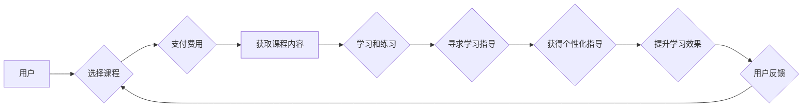

                 

## 如何利用知识付费实现在线学习与在线学习指导？

> 关键词：知识付费、在线学习、学习指导、人工智能、个性化学习、知识图谱、推荐系统

## 1. 背景介绍

在线教育的蓬勃发展为人们提供了便捷、灵活的学习方式。然而，传统的在线学习模式往往缺乏个性化指导和互动性，难以满足不同学习者个性化的需求。知识付费模式的兴起为在线学习注入了新的活力，通过付费获取优质课程和学习指导，用户可以获得更深入、更有效的学习体验。

知识付费的核心在于提供有价值的知识和服务，并通过付费机制实现知识的流通和价值传递。在线学习领域，知识付费模式主要体现在以下几个方面：

* **付费课程:** 用户通过付费购买在线课程，获取专业知识和技能的学习内容。
* **一对一指导:** 用户可以付费获得老师或专家的个性化指导，解决学习过程中遇到的问题。
* **学习社区:** 用户可以通过付费加入学习社区，与其他学习者交流学习经验，互相帮助。
* **定制化学习方案:** 根据用户的学习目标和进度，提供定制化的学习方案和学习资源。

## 2. 核心概念与联系

知识付费在线学习的核心概念包括：

* **知识:** 包括理论知识、技能知识、经验知识等，是付费的核心内容。
* **付费:** 用户通过支付费用获取知识和服务，是知识流通的机制。
* **在线学习:** 利用互联网平台提供学习内容和学习服务，是知识传递的方式。
* **学习指导:** 提供个性化指导和帮助，提升学习效率和效果。

这些概念相互关联，共同构成了知识付费在线学习的生态系统。

**Mermaid 流程图:**



## 3. 核心算法原理 & 具体操作步骤

### 3.1  算法原理概述

知识付费在线学习的核心算法原理主要包括：

* **推荐算法:** 根据用户的学习历史、兴趣偏好等信息，推荐合适的课程和学习资源。
* **个性化学习算法:** 根据用户的学习进度、理解能力等信息，定制化的学习方案和学习内容。
* **学习效果评估算法:** 通过分析用户的学习行为和学习成果，评估学习效果，并提供改进建议。

### 3.2  算法步骤详解

**推荐算法:**

1. **数据收集:** 收集用户的学习历史、课程浏览记录、评价反馈等数据。
2. **特征提取:** 从数据中提取用户的学习特征，例如学习科目、学习时间、学习风格等。
3. **模型训练:** 利用机器学习算法，训练推荐模型，例如协同过滤、内容过滤、深度学习等。
4. **推荐结果:** 根据用户的学习特征，预测用户可能感兴趣的课程，并进行排序推荐。

**个性化学习算法:**

1. **学习进度分析:** 分析用户的学习进度，识别学习瓶颈和知识点。
2. **理解能力评估:** 通过测试和练习，评估用户的理解能力，识别需要加强的知识点。
3. **学习方案定制:** 根据用户的学习进度和理解能力，定制化的学习方案，包括学习内容、学习节奏、学习方法等。
4. **动态调整:** 根据用户的学习反馈和学习效果，动态调整学习方案，确保学习效果最大化。

**学习效果评估算法:**

1. **学习行为分析:** 分析用户的学习行为，例如学习时间、学习频率、学习内容等。
2. **学习成果评估:** 通过测试和作业，评估用户的学习成果，例如知识掌握程度、技能应用能力等。
3. **效果反馈:** 将学习效果反馈给用户，并提供改进建议。
4. **模型优化:** 利用学习效果数据，优化学习效果评估模型，提高评估准确性。

### 3.3  算法优缺点

**推荐算法:**

* **优点:** 可以根据用户的兴趣和需求，推荐更精准的课程，提高用户学习体验。
* **缺点:** 需要大量的用户数据进行训练，算法模型的准确性依赖于数据质量。

**个性化学习算法:**

* **优点:** 可以根据用户的学习情况，定制化的学习方案，提高学习效率和效果。
* **缺点:** 需要复杂的算法模型和数据分析能力，成本较高。

**学习效果评估算法:**

* **优点:** 可以客观地评估用户的学习效果，并提供改进建议，帮助用户提高学习水平。
* **缺点:** 需要设计有效的评估指标和评估方法，避免评估结果的偏差。

### 3.4  算法应用领域

* **在线教育平台:** 推荐课程、个性化学习方案、学习效果评估等。
* **企业培训:** 根据员工技能需求，推荐培训课程、定制化培训方案。
* **个人学习:** 根据个人兴趣和目标，推荐学习资源、个性化学习计划。

## 4. 数学模型和公式 & 详细讲解 & 举例说明

### 4.1  数学模型构建

推荐算法常用的数学模型包括协同过滤和内容过滤。

**协同过滤:**

协同过滤算法基于用户的行为相似性进行推荐。假设用户 $u$ 和用户 $v$ 对课程 $i$ 和课程 $j$ 的评分分别为 $r_{ui}$, $r_{vi}$, $r_{uj}$, $r_{vj}$，则协同过滤算法可以利用以下公式计算用户 $u$ 对课程 $j$ 的评分预测值:

$$
\hat{r}_{uj} = \bar{r}_u + \frac{\sum_{i \in I(u,v)} (r_{ui} - \bar{r}_u)(r_{vi} - \bar{r}_v)}{\sum_{i \in I(u,v)} (r_{ui} - \bar{r}_u)^2}
$$

其中，$I(u,v)$ 表示用户 $u$ 和用户 $v$ 都评分过的课程集合，$\bar{r}_u$ 和 $\bar{r}_v$ 分别表示用户 $u$ 和用户 $v$ 的平均评分。

**内容过滤:**

内容过滤算法基于课程内容的特征进行推荐。假设课程 $i$ 的特征向量为 $f_i$，用户 $u$ 的兴趣向量为 $p_u$，则内容过滤算法可以利用以下公式计算用户 $u$ 对课程 $i$ 的评分预测值:

$$
\hat{r}_{ui} = p_u \cdot f_i
$$

其中，"." 表示向量的点积运算。

### 4.2  公式推导过程

协同过滤算法的公式推导过程基于最小二乘法。目标是找到一个评分预测模型，使得预测值与实际评分之间的误差最小。

内容过滤算法的公式推导过程基于余弦相似度。目标是找到用户兴趣向量和课程特征向量的夹角，以此作为课程推荐的依据。

### 4.3  案例分析与讲解

**协同过滤案例:**

假设有两个用户 $u$ 和 $v$，他们都对课程 $A$ 和课程 $B$ 进行评分。用户 $u$ 对课程 $A$ 的评分为 5，对课程 $B$ 的评分为 3；用户 $v$ 对课程 $A$ 的评分为 4，对课程 $B$ 的评分为 2。

根据协同过滤算法，我们可以计算用户 $u$ 对课程 $B$ 的评分预测值。

**内容过滤案例:**

假设课程 $A$ 的特征向量为 $[1, 0, 1]$，课程 $B$ 的特征向量为 $[0, 1, 1]$，用户 $u$ 的兴趣向量为 $[0.5, 0.8, 0.2]$。

根据内容过滤算法，我们可以计算用户 $u$ 对课程 $A$ 和课程 $B$ 的评分预测值。

## 5. 项目实践：代码实例和详细解释说明

### 5.1  开发环境搭建

* **操作系统:** Linux/macOS/Windows
* **编程语言:** Python
* **框架:** Flask/Django
* **数据库:** MySQL/PostgreSQL
* **机器学习库:** scikit-learn/TensorFlow/PyTorch

### 5.2  源代码详细实现

```python
# 协同过滤推荐算法示例

from sklearn.metrics.pairwise import cosine_similarity

# 用户评分数据
ratings = {
    'user1': {'movie1': 5, 'movie2': 3, 'movie3': 4},
    'user2': {'movie1': 4, 'movie2': 2, 'movie3': 5},
    'user3': {'movie1': 3, 'movie2': 5, 'movie3': 3},
}

# 计算用户-用户相似度矩阵
user_similarity = cosine_similarity(ratings)

# 获取用户1对电影3的评分预测值
user1_predictions = user_similarity[0] * ratings['user2']['movie3']
```

### 5.3  代码解读与分析

* **数据准备:** 首先需要准备用户评分数据，例如用户对电影的评分。
* **相似度计算:** 利用协同过滤算法计算用户之间的相似度，例如使用余弦相似度。
* **评分预测:** 根据用户之间的相似度和其他用户的评分，预测用户对特定电影的评分。

### 5.4  运行结果展示

运行上述代码，可以得到用户1对电影3的评分预测值。

## 6. 实际应用场景

* **在线教育平台:** 根据用户的学习历史和兴趣，推荐合适的课程和学习资源。
* **企业培训:** 根据员工的技能需求和学习进度，定制化的培训方案。
* **个人学习:** 根据用户的学习目标和兴趣，推荐学习资源和个性化学习计划。

### 6.4  未来应用展望

* **人工智能驱动的个性化学习:** 利用人工智能技术，更加精准地分析用户的学习情况，提供更加个性化的学习方案。
* **沉浸式学习体验:** 利用虚拟现实和增强现实技术，打造更加沉浸式的学习体验。
* **跨平台学习:** 打破平台的限制，实现跨平台的学习资源共享和学习体验。

## 7. 工具和资源推荐

### 7.1  学习资源推荐

* **在线课程平台:** Coursera, edX, Udemy
* **机器学习教程:** scikit-learn官方文档, TensorFlow官方文档
* **数据科学社区:** Kaggle, Stack Overflow

### 7.2  开发工具推荐

* **Python开发环境:** Anaconda, PyCharm
* **机器学习库:** scikit-learn, TensorFlow, PyTorch
* **数据库:** MySQL, PostgreSQL

### 7.3  相关论文推荐

* **协同过滤推荐算法:** "Collaborative Filtering for Implicit Feedback Datasets"
* **内容过滤推荐算法:** "Content-Based Recommendation Systems"
* **个性化学习:** "Personalized Learning: A Review"

## 8. 总结：未来发展趋势与挑战

### 8.1  研究成果总结

知识付费在线学习模式的兴起，为在线教育带来了新的活力，并推动了人工智能、个性化学习等技术的应用。

### 8.2  未来发展趋势

* **人工智能驱动的个性化学习:** 利用人工智能技术，更加精准地分析用户的学习情况，提供更加个性化的学习方案。
* **沉浸式学习体验:** 利用虚拟现实和增强现实技术，打造更加沉浸式的学习体验。
* **跨平台学习:** 打破平台的限制，实现跨平台的学习资源共享和学习体验。

### 8.3  面临的挑战

* **数据隐私保护:** 在线学习平台需要收集大量的用户数据，如何保护用户数据隐私是一个重要的挑战。
* **算法公平性:** 算法模型的训练数据可能存在偏差，导致算法推荐结果不公平。
* **内容质量控制:** 在线学习平台需要确保课程内容的质量和可靠性。

### 8.4  研究展望

未来，知识付费在线学习领域的研究方向包括：

* **更精准的个性化学习算法:** 利用深度学习等先进技术，开发更加精准的个性化学习算法。
* **更沉浸式的学习体验:** 利用虚拟现实、增强现实等技术，打造更加沉浸式的学习体验。
* **更安全的学习环境:** 利用区块链等技术，构建更加安全的学习环境，保障用户数据隐私和学习权益。

## 9. 附录：常见问题与解答

* **如何选择合适的知识付费课程？**

建议根据自己的学习目标、兴趣和预算选择课程。可以参考课程评价、导师介绍等信息，并尝试观看课程的免费试听内容。

* **如何提高在线学习的效率？**

* 制定学习计划，并坚持执行。
* 利用碎片化时间进行学习。
* 积极参与学习讨论，与其他学习者交流学习经验。
* 定期回顾学习内容，巩固知识点。

* **如何解决在线学习中的困难？**

可以寻求老师或专家的帮助，也可以加入学习社区，与其他学习者交流学习经验。


作者：禅与计算机程序设计艺术 / Zen and the Art of Computer Programming 
<end_of_turn>

