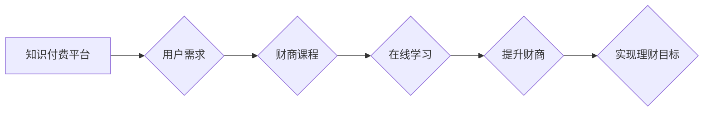

                 

## 如何利用知识付费实现在线财商培养与金钱管理？

> 关键词：知识付费、财商培养、金钱管理、在线教育、人工智能、数据分析、个性化学习

## 1. 背景介绍

在当今信息爆炸的时代，金钱已成为人们生活的重要组成部分。然而，许多人缺乏必要的财商知识，难以有效地管理自己的金钱，从而导致财务困境。传统教育体系对财商教育的重视程度不足，无法满足人们日益增长的需求。知识付费模式的兴起为在线财商培养提供了新的机遇。

知识付费是指通过付费获取知识、技能和服务的商业模式。它以其便捷性、个性化和成本效益等优势，迅速成为教育行业的新趋势。在线财商课程通过视频、音频、文字等多种形式，将专业的财商知识和技能传递给用户，帮助他们提升财务素养，实现理财目标。

## 2. 核心概念与联系

**2.1 知识付费与财商培养**

知识付费模式的核心在于提供有价值的知识和服务，并通过付费机制实现知识的流通和价值的体现。财商培养则是帮助人们提升财务意识、理财能力和投资智慧的过程。两者结合起来，可以有效地利用知识付费平台，将专业的财商知识和技能传递给用户，帮助他们提升财务素养，实现理财目标。

**2.2 在线教育与财商管理**

在线教育平台为知识付费提供了便捷的传播渠道。通过互联网，用户可以随时随地学习财商课程，不受地域和时间限制。在线教育平台还可以利用数据分析技术，根据用户的学习进度和需求，提供个性化的学习方案，提高学习效率。

**2.3 人工智能与个性化学习**

人工智能技术可以应用于知识付费平台，实现个性化学习。例如，AI算法可以根据用户的学习风格和知识水平，推荐合适的财商课程；AI聊天机器人可以解答用户的学习疑问，提供个性化的学习指导。

**Mermaid 流程图**



## 3. 核心算法原理 & 具体操作步骤

**3.1 算法原理概述**

知识付费平台的推荐算法通常基于用户的行为数据和课程内容特征，通过机器学习模型预测用户对特定课程的兴趣和学习效果。常见的推荐算法包括协同过滤、内容过滤和混合推荐。

**3.2 算法步骤详解**

1. **数据收集:** 收集用户的学习行为数据，例如课程浏览记录、学习时长、评价等，以及课程内容特征，例如课程主题、难度、授课老师等。
2. **数据预处理:** 对收集到的数据进行清洗、转换和特征工程，例如将用户行为数据转换为用户兴趣向量，将课程内容特征转换为课程向量。
3. **模型训练:** 选择合适的推荐算法，例如协同过滤算法或内容过滤算法，并利用训练数据训练模型。
4. **模型评估:** 使用测试数据评估模型的性能，例如准确率、召回率和覆盖率。
5. **模型部署:** 将训练好的模型部署到线上平台，为用户提供个性化的课程推荐。

**3.3 算法优缺点**

* **协同过滤算法:** 优点是能够发现用户之间的隐性关联，推荐用户可能感兴趣但未接触过的课程。缺点是需要大量的用户行为数据才能训练出准确的模型，容易出现冷启动问题。
* **内容过滤算法:** 优点是能够根据课程内容特征进行推荐，避免推荐用户不感兴趣的课程。缺点是容易陷入内容同质化问题，无法发现用户潜在的兴趣。
* **混合推荐算法:** 结合协同过滤和内容过滤算法的优点，能够提供更准确和个性化的课程推荐。

**3.4 算法应用领域**

知识付费平台的推荐算法广泛应用于在线教育、电商、娱乐等领域，帮助用户发现感兴趣的内容，提高用户体验。

## 4. 数学模型和公式 & 详细讲解 & 举例说明

**4.1 数学模型构建**

知识付费平台的推荐算法通常基于用户-项目矩阵，其中用户和项目分别代表平台上的用户和课程。每个用户-项目对的元素表示用户对项目的评分或交互行为。

**4.2 公式推导过程**

协同过滤算法的原理是基于用户的相似度和项目的相似度。

* **用户相似度:** 计算两个用户在项目上的评分相似度，例如使用余弦相似度。
* **项目相似度:** 计算两个项目在用户评分上的相似度，例如使用余弦相似度。

**4.3 案例分析与讲解**

假设有两个用户A和B，他们对三门课程C1、C2和C3的评分如下：

| 用户 | C1 | C2 | C3 |
|---|---|---|---|
| A | 5 | 3 | 4 |
| B | 4 | 5 | 3 |

可以使用余弦相似度计算用户A和B的相似度：

```
相似度 = (A.C1 * B.C1 + A.C2 * B.C2 + A.C3 * B.C3) / (||A|| * ||B||)
```

其中，A.C1表示用户A对课程C1的评分，||A||表示用户A评分向量的长度。

## 5. 项目实践：代码实例和详细解释说明

**5.1 开发环境搭建**

* Python 3.x
* Jupyter Notebook
* scikit-learn

**5.2 源代码详细实现**

```python
from sklearn.metrics.pairwise import cosine_similarity

# 用户-项目矩阵
user_item_matrix = [[5, 3, 4], [4, 5, 3]]

# 计算用户相似度
user_similarity = cosine_similarity(user_item_matrix)

# 打印用户相似度矩阵
print(user_similarity)
```

**5.3 代码解读与分析**

* `cosine_similarity()`函数计算两个向量的余弦相似度。
* `user_item_matrix`是一个二维数组，表示用户对项目的评分。
* `user_similarity`是一个二维数组，表示用户之间的相似度。

**5.4 运行结果展示**

运行代码后，会输出一个用户相似度矩阵，例如：

```
[[1.         0.8660254 ]
 [0.8660254  1.        ]]
```

其中，1.表示用户A和用户B之间的相似度为1，即完全相似。

## 6. 实际应用场景

**6.1 在线财商课程推荐**

知识付费平台可以利用推荐算法，根据用户的学习行为和兴趣，推荐相关的财商课程。例如，如果用户对投资理财课程感兴趣，平台可以推荐相关的股票投资、基金投资等课程。

**6.2 个性化财商学习方案**

平台可以根据用户的财商水平和学习目标，定制个性化的学习方案。例如，对于初学者，平台可以推荐基础的理财知识课程；对于进阶用户，平台可以推荐更专业的投资策略课程。

**6.3 金融风险预警**

平台可以利用用户的财务数据，识别潜在的金融风险，并提供相应的预警和建议。例如，如果用户的负债率过高，平台可以提醒用户注意控制支出，避免陷入财务困境。

**6.4 未来应用展望**

随着人工智能技术的不断发展，知识付费平台的财商培养功能将更加智能化和个性化。例如，平台可以利用自然语言处理技术，理解用户的学习需求，并提供更精准的课程推荐和学习指导。

## 7. 工具和资源推荐

**7.1 学习资源推荐**

* **书籍:** 《富爸爸穷爸爸》、《小狗钱钱》、《理财入门》
* **在线课程:** Coursera、edX、Udemy
* **网站:** 腾讯理财、支付宝理财、京东金融

**7.2 开发工具推荐**

* **Python:** 强大的编程语言，广泛应用于数据分析和机器学习。
* **scikit-learn:** Python机器学习库，提供各种推荐算法和数据处理工具。
* **TensorFlow:** 深度学习框架，可以用于训练更复杂的推荐模型。

**7.3 相关论文推荐**

* **Collaborative Filtering for Implicit Feedback Datasets**
* **Content-Based Recommendation Systems**
* **Hybrid Recommender Systems**

## 8. 总结：未来发展趋势与挑战

**8.1 研究成果总结**

知识付费平台的财商培养功能已经取得了一定的成果，为用户提供了便捷、高效的财商学习途径。

**8.2 未来发展趋势**

未来，知识付费平台的财商培养功能将更加智能化、个性化和场景化。

* **智能化:** 利用人工智能技术，实现更精准的课程推荐和学习指导。
* **个性化:** 根据用户的财商水平、学习目标和风险偏好，定制个性化的学习方案。
* **场景化:** 将财商知识融入到用户的日常生活场景中，例如购物、投资、理财等。

**8.3 面临的挑战**

* **数据质量:** 知识付费平台需要收集高质量的用户数据，才能训练出准确的推荐模型。
* **算法复杂度:** 训练复杂的推荐模型需要强大的计算能力和专业技术。
* **用户隐私:** 知识付费平台需要保护用户的隐私信息，避免数据泄露。

**8.4 研究展望**

未来，研究人员将继续探索更先进的推荐算法和技术，提高知识付费平台的财商培养效果。同时，也将关注用户隐私保护和数据安全问题，确保用户在学习过程中安全可靠。

## 9. 附录：常见问题与解答

**9.1 如何选择合适的财商课程？**

选择财商课程时，应考虑自身的财商水平、学习目标和兴趣爱好。可以参考平台的课程评价和用户反馈，选择口碑较好的课程。

**9.2 如何提高学习效率？**

* 制定学习计划，并坚持执行。
* 利用碎片时间学习，例如通勤时间、午休时间等。
* 与其他学习者交流，互相学习和进步。

**9.3 如何避免知识付费陷阱？**

* 选择正规的知识付费平台，避免购买虚假或低质量的课程。
* 仔细阅读课程介绍和评价，了解课程内容和学习效果。
* 不要盲目相信广告宣传，理性选择课程。


作者：禅与计算机程序设计艺术 / Zen and the Art of Computer Programming 
<end_of_turn>

