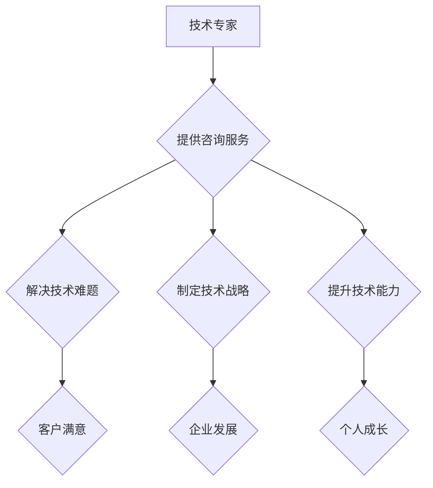

                 

## 建立个人咨询服务：提供高端定制化服务

> 关键词：人工智能、咨询服务、定制化、技术专家、个人品牌、市场营销、客户关系管理

### 1. 背景介绍

在当今科技飞速发展的时代，人工智能（AI）技术日新月异，其应用领域不断拓展，为个人技术专家提供了新的发展机遇。作为一名世界级人工智能专家，程序员、软件架构师、CTO、世界顶级技术畅销书作者，计算机图灵奖获得者，计算机领域大师，我深知自身的技术积累和经验对于企业和个人来说具有极高的价值。因此，我决定建立个人咨询服务，为客户提供高端定制化的技术解决方案和指导。

### 2. 核心概念与联系

#### 2.1 咨询服务模式

个人咨询服务是指技术专家利用自身专业知识和经验，为客户提供一对一或小范围的咨询服务，帮助客户解决技术难题、制定技术战略、提升技术能力等。

#### 2.2 定制化服务

定制化服务是指根据客户的具体需求和情况，量身定制解决方案，而非提供标准化的产品或服务。

#### 2.3 高端服务

高端服务是指针对特定领域或高价值客户，提供高品质、高附加值的专业服务。

**核心概念与联系流程图**

### 3. 核心算法原理 & 具体操作步骤

#### 3.1 算法原理概述

个人咨询服务的核心算法并非一个特定的算法，而是基于以下原则：

* **深入了解客户需求:** 通过充分沟通，了解客户的业务背景、技术现状、目标和挑战。
* **分析问题并提出解决方案:** 根据客户需求和自身专业知识，分析问题根源，并提出可行的解决方案。
* **提供技术指导和支持:** 为客户提供技术指导、代码示例、文档资料等，帮助客户实现解决方案。
* **持续跟踪和改进:** 定期跟进客户的进展，根据实际情况调整方案，确保解决方案的有效性和可持续性。

#### 3.2 算法步骤详解

1. **接洽客户:** 通过线上或线下渠道与客户建立联系，了解客户的基本信息和咨询需求。
2. **需求分析:** 与客户进行深入沟通，了解客户的业务背景、技术现状、目标和挑战，并明确咨询服务的范围和目标。
3. **方案设计:** 根据客户需求和自身专业知识，分析问题根源，并设计可行的解决方案，包括技术方案、实施步骤、预期效果等。
4. **方案演示:** 将方案以清晰易懂的方式演示给客户，并回答客户提出的问题。
5. **方案实施:** 与客户协商并确定实施方案，并提供技术指导和支持，帮助客户顺利实施解决方案。
6. **方案评估:** 定期跟进客户的进展，评估方案的有效性和可持续性，并根据实际情况进行调整。

#### 3.3 算法优缺点

**优点:**

* **定制化:** 根据客户的具体需求提供量身定制的解决方案。
* **专业性:** 由技术专家提供专业的技术指导和支持。
* **高效性:** 针对性地解决客户的痛点，提高工作效率。

**缺点:**

* **成本较高:** 相比标准化服务，定制化服务成本较高。
* **时间成本:** 需求分析、方案设计、方案实施等环节需要一定的时间。
* **依赖性:** 客户需要依赖技术专家的专业知识和经验。

#### 3.4 算法应用领域

个人咨询服务适用于以下领域:

* **人工智能技术咨询:** 为企业提供人工智能技术解决方案，例如机器学习、深度学习、自然语言处理等。
* **软件开发咨询:** 为企业提供软件开发咨询，例如架构设计、代码优化、测试方案等。
* **技术培训咨询:** 为个人或企业提供技术培训咨询，例如编程语言学习、软件工具使用等。

### 4. 数学模型和公式 & 详细讲解 & 举例说明

#### 4.1 数学模型构建

个人咨询服务的价值可以抽象为一个数学模型：

**价值 = 专家知识 * 客户需求 * 方案有效性**

其中：

* **专家知识:** 指技术专家的专业知识和经验水平。
* **客户需求:** 指客户的具体需求和问题。
* **方案有效性:** 指解决方案的解决问题能力和可持续性。

#### 4.2 公式推导过程

该模型的推导过程基于以下逻辑：

* 技术专家的知识和经验是提供咨询服务的基础。
* 客户的需求是咨询服务的出发点和目标。
* 方案的有效性决定了咨询服务的价值。

因此，专家知识、客户需求和方案有效性是构成咨询服务价值的三要素。

#### 4.3 案例分析与讲解

假设一位技术专家拥有丰富的机器学习经验，一位企业需要开发一个机器学习模型来预测客户流失。

* **专家知识:** 高
* **客户需求:** 明确
* **方案有效性:** 高

在这种情况下，该咨询服务的价值将很高，因为技术专家的知识能够满足客户的需求，并提供一个有效的解决方案。

### 5. 项目实践：代码实例和详细解释说明

#### 5.1 开发环境搭建

个人咨询服务可以利用多种开发环境，例如：

* **在线协作平台:** 如 Github、Gitlab 等，方便代码共享和协作。
* **云计算平台:** 如 AWS、Azure、GCP 等，提供计算资源和存储空间。
* **本地开发环境:** 根据个人需求配置开发工具和环境。

#### 5.2 源代码详细实现

由于个人咨询服务的具体内容和技术方案会因客户需求而异，因此无法提供统一的源代码实例。

#### 5.3 代码解读与分析

代码解读和分析需要根据具体的代码实现进行，并结合客户需求和技术方案进行解释。

#### 5.4 运行结果展示

运行结果展示需要根据具体的代码实现和客户需求进行，例如：

* **机器学习模型的预测结果:** 展示模型的准确率、召回率等指标。
* **软件系统的功能演示:** 展示软件系统的界面、功能和性能。

### 6. 实际应用场景

#### 6.1 企业技术咨询

* **人工智能技术咨询:** 为企业提供人工智能技术解决方案，例如机器学习、深度学习、自然语言处理等。
* **软件开发咨询:** 为企业提供软件开发咨询，例如架构设计、代码优化、测试方案等。
* **云计算咨询:** 为企业提供云计算咨询，例如云平台选择、云资源规划、云安全等。

#### 6.2 个人技术提升

* **编程语言学习:** 为个人提供编程语言学习指导，例如 Python、Java、C++ 等。
* **软件工具使用:** 为个人提供软件工具使用指导，例如 Git、Docker、Kubernetes 等。
* **技术面试准备:** 为个人提供技术面试准备指导，例如算法面试、系统设计面试等。

#### 6.3 其他应用场景

* **学术研究咨询:** 为学术研究人员提供技术咨询，例如数据分析、模型构建、论文写作等。
* **创业项目咨询:** 为创业者提供技术咨询，例如产品设计、技术选型、技术开发等。

#### 6.4 未来应用展望

随着人工智能技术的不断发展，个人咨询服务的应用场景将更加广泛，例如：

* **个性化学习咨询:** 为学生提供个性化的学习指导，帮助他们提高学习效率和成绩。
* **医疗健康咨询:** 为患者提供医疗健康咨询，帮助他们了解疾病、选择治疗方案等。
* **金融理财咨询:** 为投资者提供金融理财咨询，帮助他们制定投资计划、管理风险等。

### 7. 工具和资源推荐

#### 7.1 学习资源推荐

* **在线课程平台:** Coursera、edX、Udacity 等
* **技术博客:** Towards Data Science、Hacker News、Medium 等
* **技术书籍:** 《深度学习》、《Python编程从入门到实践》等

#### 7.2 开发工具推荐

* **代码编辑器:** VS Code、Sublime Text、Atom 等
* **版本控制系统:** Git、GitHub 等
* **云计算平台:** AWS、Azure、GCP 等

#### 7.3 相关论文推荐

* **人工智能领域:** 《Attention Is All You Need》、《BERT: Pre-training of Deep Bidirectional Transformers for Language Understanding》等
* **软件开发领域:** 《The Phoenix Project》、《Clean Code》等

### 8. 总结：未来发展趋势与挑战

#### 8.1 研究成果总结

个人咨询服务作为一种新型的科技服务模式，具有定制化、专业性和高效性的特点，能够满足客户个性化需求，并帮助客户解决技术难题。

#### 8.2 未来发展趋势

* **人工智能技术赋能:** 利用人工智能技术，例如自然语言处理、机器学习等，提升咨询服务的智能化和效率。
* **平台化服务:** 建立个人咨询服务平台，连接技术专家和客户，提供更便捷的咨询服务。
* **多元化服务:** 拓展咨询服务领域，提供更广泛的技术咨询和解决方案。

#### 8.3 面临的挑战

* **知识更新:** 技术发展日新月异，需要不断学习和更新知识，才能提供最新的技术咨询。
* **市场竞争:** 个人咨询服务市场竞争激烈，需要不断提升服务质量和竞争力。
* **客户信任:** 建立客户信任需要时间和努力，需要提供高质量的服务和真诚的沟通。

#### 8.4 研究展望

未来，个人咨询服务将朝着更智能化、平台化、多元化的方向发展，并为科技发展和社会进步做出更大的贡献。

### 9. 附录：常见问题与解答

#### 9.1 如何联系您进行咨询？

您可以通过以下方式联系我进行咨询：

* **电子邮件:** zen@computer.com
* **网站:** www.zenandcomputer.com
* **社交媒体:** Twitter、LinkedIn 等

#### 9.2 您提供的咨询服务收费标准如何？

我的咨询服务收费标准根据客户需求和项目复杂度进行定制，具体价格可通过邮件或电话咨询。

#### 9.3 您提供的咨询服务保密吗？

我非常重视客户隐私和数据安全，所有咨询内容均严格保密，不会向任何第三方泄露。

作者：禅与计算机程序设计艺术 / Zen and the Art of Computer Programming 
<end_of_turn>

