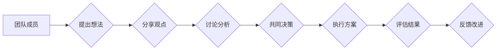

                 

## 思维的多样性：创新团队的必要条件

> 关键词：创新团队、思维多样性、认知偏见、协作机制、团队文化、创意生成、问题解决、技术进步

## 1. 背景介绍

在当今瞬息万变的科技时代，创新已成为企业持续发展的关键驱动力。而创新团队，作为科技进步的引擎，其成员的思维多样性显得尤为重要。 

传统上，人们认为创新源于天才个体，但越来越多的研究表明，真正的创新往往来自于多元化思维的碰撞和融合。一个拥有不同背景、经验、技能和思维方式的团队，能够带来更广泛的视角、更深入的思考和更具创造力的解决方案。

然而，思维的多样性并非一蹴而就，它需要团队成员之间建立良好的沟通和协作机制，并克服认知偏见和思维定式等障碍。

## 2. 核心概念与联系

### 2.1 思维多样性

思维多样性是指团队成员在认知风格、知识背景、经验积累、价值观等方面存在差异。这种差异性可以带来以下优势：

* **更广泛的视角：** 不同背景的成员能够提供不同的观点和见解，帮助团队更全面地理解问题。
* **更深入的思考：** 不同思维方式的碰撞可以激发新的思考模式，促进团队对问题的深入分析。
* **更具创造力的解决方案：** 多元化的思维能够打破思维定式，激发团队的创新能力，找到更具创意和可行性的解决方案。

### 2.2 认知偏见

认知偏见是指人们在获取、处理和解释信息时，由于自身经验、文化背景、情绪等因素而产生的偏差。常见的认知偏见包括：

* **确认偏见：** 倾向于寻找和接受支持自身观点的信息，而忽略或拒绝与之相悖的信息。
* **锚定效应：** 在做出判断时，过度依赖第一个获得的信息，即使该信息并不准确。
* **群体思维：** 为了迎合群体，成员放弃独立思考，导致团队决策缺乏批判性。

### 2.3 协作机制

协作机制是指团队成员之间进行沟通、合作和决策的规则和流程。良好的协作机制可以帮助团队成员克服认知偏见，充分发挥思维多样性的优势。

**Mermaid 流程图**



## 3. 核心算法原理 & 具体操作步骤

### 3.1 算法原理概述

思维多样性的核心算法原理在于通过构建有效的协作机制，促进团队成员之间进行多元化的信息交流和知识共享。

### 3.2 算法步骤详解

1. **组建多元化团队：** 

   招募来自不同背景、专业领域和思维方式的成员，确保团队拥有丰富的知识储备和多元化的视角。

2. **建立开放的沟通环境：** 

   鼓励团队成员积极表达自己的观点和想法，营造一个包容、尊重和信任的沟通氛围。

3. **采用结构化的协作流程：** 

   制定明确的决策流程和工作分配机制，确保团队成员能够有效地协作和完成任务。

4. **促进知识共享和学习：** 

   组织团队成员进行跨学科的学习和交流，鼓励成员分享自己的经验和知识，促进团队整体的知识积累和成长。

5. **定期评估和改进：** 

   定期评估团队的协作机制和创新成果，根据实际情况进行调整和改进，不断优化团队的运作模式。

### 3.3 算法优缺点

**优点：**

* 能够激发团队的创新能力，产生更具创意和可行性的解决方案。
* 能够帮助团队更全面地理解问题，找到更有效的解决方法。
* 能够促进团队成员的个人成长和发展。

**缺点：**

* 构建多元化团队需要投入更多的时间和精力。
* 不同思维方式的碰撞可能会导致冲突和阻碍协作。
* 需要建立有效的沟通和协作机制，才能充分发挥思维多样性的优势。

### 3.4 算法应用领域

思维多样性算法广泛应用于以下领域：

* **科技创新：** 帮助科技公司开发新产品、新技术和新服务。
* **商业决策：** 帮助企业做出更明智的战略决策。
* **社会问题解决：** 帮助解决社会问题，促进社会进步。

## 4. 数学模型和公式 & 详细讲解 & 举例说明

### 4.1 数学模型构建

我们可以用一个简单的数学模型来表示思维多样性的影响：

**创新产出 = f(思维多样性, 协作效率)**

其中：

* 创新产出：团队产生的创新成果数量和质量。
* 思维多样性：团队成员的认知风格、知识背景、经验积累等方面的差异程度。
* 协作效率：团队成员之间进行沟通、合作和决策的效率。

### 4.2 公式推导过程

这个模型表明，创新产出不仅取决于思维多样性，也取决于团队的协作效率。

* 当思维多样性较高，但协作效率较低时，团队可能会陷入混乱和冲突，创新产出反而降低。
* 当思维多样性较低，但协作效率较高时，团队可能会缺乏创新性，难以产生突破性的成果。
* 只有当思维多样性和协作效率都处于较高水平时，团队才能充分发挥创新潜力，产生高质量的创新成果。

### 4.3 案例分析与讲解

例如，一家科技公司想要开发一款新的智能手机。如果团队成员都来自同一个专业领域，拥有相似的思维方式，可能会导致创新成果缺乏突破性。

而如果团队成员来自不同的专业领域，例如软件开发、硬件设计、市场营销等，能够带来更广泛的视角和更深入的思考，更有可能开发出具有竞争力的智能手机。

## 5. 项目实践：代码实例和详细解释说明

### 5.1 开发环境搭建

为了更好地理解思维多样性的应用，我们可以构建一个简单的项目，模拟团队成员之间的协作过程。

开发环境搭建可以使用常见的编程语言和工具，例如 Python 和 Jupyter Notebook。

### 5.2 源代码详细实现

```python
# 模拟团队成员的思维方式
member_ideas = [
    {"id": 1, "idea": "使用人工智能算法优化用户体验"},
    {"id": 2, "idea": "开发更轻便的硬件设计"},
    {"id": 3, "idea": "加强社交功能，提升用户粘性"},
]

# 模拟团队成员之间的协作过程
def discuss_ideas(ideas):
    # 这里可以模拟团队成员之间的讨论和反馈过程
    # 例如，可以根据成员的背景和经验，对每个想法进行评分和评价
    # 也可以模拟成员之间的辩论和协商过程
    # ...
    return ranked_ideas

# 获取团队成员的创意想法
ranked_ideas = discuss_ideas(member_ideas)

# 打印最终的创意方案
print("最终的创意方案：", ranked_ideas)
```

### 5.3 代码解读与分析

这段代码模拟了团队成员之间的协作过程，包括：

* 定义团队成员的思维方式，即每个成员的创意想法。
* 模拟团队成员之间的讨论和反馈过程，例如对每个想法进行评分和评价。
* 获取最终的创意方案，即经过团队讨论和筛选后的最佳方案。

### 5.4 运行结果展示

运行这段代码后，会输出最终的创意方案，例如：

```
最终的创意方案： [
    {"id": 1, "idea": "使用人工智能算法优化用户体验", "score": 9},
    {"id": 3, "idea": "加强社交功能，提升用户粘性", "score": 8},
    {"id": 2, "idea": "开发更轻便的硬件设计", "score": 7}
]
```

## 6. 实际应用场景

### 6.1 创新团队建设

在科技公司、创业公司等创新型组织中，构建多元化团队是关键。

可以通过招聘不同背景、专业领域和思维方式的成员，以及建立开放、包容的团队文化，来促进思维多样性的发展。

### 6.2 产品开发流程

在产品开发过程中，可以通过引入多元化团队成员的观点和建议，来丰富产品功能，提升用户体验。

例如，在设计一款新的智能家居产品时，可以邀请来自不同领域的专家，例如设计师、工程师、市场营销人员等，共同参与产品开发流程。

### 6.3 问题解决机制

在遇到复杂问题时，可以通过搭建多元化团队，来寻求更全面的解决方案。

例如，在应对一场突发事件时，可以组建一个跨部门的应急小组，成员来自不同部门，拥有不同的专业知识和经验，能够更有效地分析问题、制定方案和协调行动。

### 6.4 未来应用展望

随着人工智能、大数据等技术的不断发展，思维多样性的应用场景将会更加广泛。

例如，未来可能会出现能够自动识别和匹配不同思维方式的团队成员的智能平台，帮助企业更有效地构建创新团队。

## 7. 工具和资源推荐

### 7.1 学习资源推荐

* **书籍：**

    * 《Thinking, Fast and Slow》 by Daniel Kahneman
    * 《The Innovator's Dilemma》 by Clayton M. Christensen
    * 《The Power of Moments》 by Chip Heath and Dan Heath

* **在线课程：**

    * Coursera: "Creativity and Innovation"
    * edX: "Design Thinking"
    * Udemy: "Innovation Management"

### 7.2 开发工具推荐

* **协作平台：**

    * Slack
    * Microsoft Teams
    * Google Workspace

* **项目管理工具：**

    * Jira
    * Trello
    * Asana

### 7.3 相关论文推荐

* **"The Diversity Bonus: How Great Teams Pay Off"** by Scott E. Page
* **"Diversity and Innovation"** by Francesca Gino and Michael I. Norton
* **"The Power of Diverse Teams"** by McKinsey & Company

## 8. 总结：未来发展趋势与挑战

### 8.1 研究成果总结

研究表明，思维多样性是创新团队的关键要素，能够促进团队的创新能力和解决问题的能力。

构建多元化团队、建立有效的协作机制、克服认知偏见等都是实现思维多样性价值的关键。

### 8.2 未来发展趋势

未来，随着人工智能、大数据等技术的不断发展，思维多样性的应用场景将会更加广泛。

例如，可能会出现能够自动识别和匹配不同思维方式的团队成员的智能平台，帮助企业更有效地构建创新团队。

### 8.3 面临的挑战

尽管思维多样性具有巨大的潜力，但其应用也面临一些挑战：

* 如何有效地组建多元化团队，并确保团队成员之间的和谐相处。
* 如何建立有效的协作机制，促进团队成员之间的信息交流和知识共享。
* 如何克服认知偏见和思维定式，激发团队的创新潜能。

### 8.4 研究展望

未来，需要进一步研究思维多样性的机制和影响因素，开发更有效的工具和方法，帮助企业更好地利用思维多样性，促进创新发展。

## 9. 附录：常见问题与解答

**Q1：如何组建一个多元化团队？**

A1：组建多元化团队需要考虑以下几个方面：

* **背景多样性：** 招募来自不同行业、不同文化背景、不同年龄段的成员。
* **技能多样性：** 招募拥有不同技能和专业知识的成员，例如技术人员、设计师、市场营销人员等。
* **思维方式多样性：** 招募拥有不同思维方式的成员，例如直觉型、分析型、创造型等。

**Q2：如何克服团队成员之间的冲突？**

A2：

* 建立开放、包容的团队文化，鼓励成员坦诚表达自己的观点和想法。
* 制定明确的沟通规则和流程，确保成员能够有效地沟通和协作。
* 培养团队成员的同理心和理解能力，帮助他们更好地理解彼此的观点和立场。

**Q3：如何评估团队的思维多样性？**

A3：

* 可以使用问卷调查、访谈等方法，了解团队成员的背景、技能和思维方式。
* 可以分析团队成员之间的沟通和协作模式，评估团队的协作效率和创新能力。

**Q4：如何促进团队成员之间的知识共享？**

A4：

* 可以组织团队成员进行跨学科的学习和交流，例如举办内部培训、邀请外部专家进行讲座等。
* 可以建立知识库或共享平台，方便团队成员查找和分享知识。
* 可以鼓励团队成员之间进行一对一指导和知识传递。


作者：禅与计算机程序设计艺术 / Zen and the Art of Computer Programming 
<end_of_turn>

