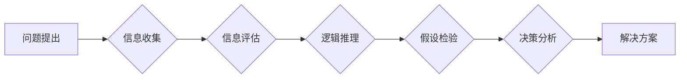

                 

## 批判性思维：提升洞察力的必备工具

> 关键词：批判性思维、逻辑推理、问题解决、洞察力、决策分析、算法设计、编程思维

## 1. 背景介绍

在当今瞬息万变的科技时代，信息爆炸和复杂系统日益增长，对我们提出更高的要求，需要我们能够快速、准确地分析信息，做出明智的决策。批判性思维，作为一种高阶认知能力，在这样的背景下显得尤为重要。它不仅是个人成长的关键，也是推动科技进步和社会发展的重要驱动力。

批判性思维是指运用逻辑、推理和评估来分析信息、识别谬误、形成独立判断的能力。它不仅仅是接受信息，而是对信息进行深入思考，质疑其来源、可靠性和有效性，并最终形成自己的观点和见解。

对于程序员和软件开发人员来说，批判性思维更是至关重要。他们需要能够分析复杂的系统需求，设计合理的算法和架构，并解决各种技术难题。

## 2. 核心概念与联系

批判性思维的核心概念包括：

* **逻辑推理:**  运用逻辑规则和推理方法，从已知信息推导出新的结论。
* **问题分析:**  分解复杂问题，识别关键要素和潜在问题。
* **信息评估:**  判断信息的准确性、可靠性和有效性。
* **假设检验:**  提出假设，并通过证据进行验证或反驳。
* **决策分析:**  评估不同方案的优缺点，做出明智的决策。

这些概念相互关联，共同构成批判性思维的框架。

**Mermaid 流程图:**



## 3. 核心算法原理 & 具体操作步骤

批判性思维并非一种算法，但它可以被看作是一种思维模式，其核心是逻辑推理。许多算法的设计和应用都依赖于批判性思维，例如：

### 3.1  算法原理概述

**A* 算法** 是一种常用的路径规划算法，它通过评估节点的成本和估算值来选择最优路径。

**核心原理:**

* **启发式搜索:** A* 算法利用启发函数来估算节点到目标节点的距离，从而优先搜索更有希望的路径。
* **代价函数:**  算法计算每个节点到目标节点的实际代价，并将其与估算值相加，得到节点的总代价。
* **开放列表和关闭列表:**  A* 算法使用开放列表存储待探索的节点，并使用关闭列表存储已探索的节点，避免重复计算。

### 3.2  算法步骤详解

1. **初始化:**  设置起点节点和目标节点，并将起点节点添加到开放列表中。
2. **选择节点:** 从开放列表中选择总代价最小的节点。
3. **扩展节点:**  对选中的节点进行扩展，生成其相邻节点。
4. **评估节点:**  计算每个相邻节点的总代价，并将其添加到开放列表中。如果相邻节点已经在关闭列表中，则跳过。
5. **重复步骤 2-4:**  重复上述步骤，直到目标节点被添加到开放列表中。
6. **回溯路径:**  从目标节点开始，回溯到起点节点，形成最优路径。

### 3.3  算法优缺点

**优点:**

* **效率高:**  A* 算法利用启发函数，可以有效地缩小搜索空间，提高效率。
* **可扩展性强:**  A* 算法可以应用于各种路径规划问题，例如地图导航、机器人路径规划等。

**缺点:**

* **启发函数设计:**  A* 算法的性能依赖于启发函数的设计，如果启发函数设计不合理，可能会导致算法效率降低。
* **内存消耗:**  A* 算法需要存储开放列表和关闭列表，在处理大型地图时，可能会导致内存消耗过大。

### 3.4  算法应用领域

A* 算法广泛应用于以下领域:

* **地图导航:**  Google Maps、Apple Maps 等导航软件使用 A* 算法规划路线。
* **机器人路径规划:**  机器人使用 A* 算法避开障碍物，到达目标位置。
* **游戏开发:**  游戏角色使用 A* 算法寻找路径，躲避敌人或到达目标地点。
* **物流配送:**  物流公司使用 A* 算法优化配送路线，提高效率。

## 4. 数学模型和公式 & 详细讲解 & 举例说明

A* 算法的核心是代价函数和启发函数。

### 4.1  数学模型构建

* **代价函数 (g(n)):**  表示节点 n 到起点节点的实际代价。
* **估算值 (h(n)):**  表示节点 n 到目标节点的估算代价。
* **总代价 (f(n)):**  表示节点 n 到目标节点的总代价，计算公式为：f(n) = g(n) + h(n)

### 4.2  公式推导过程

A* 算法选择总代价最小的节点进行扩展，因此需要计算每个节点的总代价。

* **节点选择:**  选择 f(n) 最小的节点。

### 4.3  案例分析与讲解

假设我们有一个地图，起点节点为 A，目标节点为 B。

* **代价函数:**  每个节点之间的移动代价为 1，因此 g(A) = 0，g(B) = 4。
* **估算值:**  我们可以使用曼哈顿距离作为启发函数，估算节点到目标节点的距离。例如，h(C) = 2。
* **总代价:**  f(A) = 0 + 0 = 0，f(B) = 4 + 0 = 4，f(C) = 1 + 2 = 3。

根据总代价，A* 算法会首先选择节点 C 进行扩展。

## 5. 项目实践：代码实例和详细解释说明

以下是一个使用 Python 实现 A* 算法的代码示例：

### 5.1  开发环境搭建

* Python 3.x
* 安装必要的库，例如 `numpy` 和 `matplotlib`

### 5.2  源代码详细实现

```python
import numpy as np

class Node:
    def __init__(self, position, parent=None):
        self.position = position
        self.parent = parent
        self.g = 0
        self.h = 0
        self.f = 0

    def __lt__(self, other):
        return self.f < other.f

def manhattan_distance(pos1, pos2):
    return abs(pos1[0] - pos2[0]) + abs(pos1[1] - pos2[1])

def astar(grid, start, goal):
    open_list = []
    closed_list = set()

    start_node = Node(start)
    start_node.g = 0
    start_node.h = manhattan_distance(start, goal)
    start_node.f = start_node.g + start_node.h
    open_list.append(start_node)

    while open_list:
        current_node = min(open_list)
        open_list.remove(current_node)
        closed_list.add(current_node.position)

        if current_node.position == goal:
            path = []
            while current_node:
                path.append(current_node.position)
                current_node = current_node.parent
            return path[::-1]

        for neighbor in get_neighbors(grid, current_node.position):
            if neighbor in closed_list:
                continue

            neighbor_node = Node(neighbor, current_node)
            neighbor_node.g = current_node.g + 1
            neighbor_node.h = manhattan_distance(neighbor, goal)
            neighbor_node.f = neighbor_node.g + neighbor_node.h

            if neighbor_node not in open_list:
                open_list.append(neighbor_node)

    return None

def get_neighbors(grid, position):
    x, y = position
    neighbors = []
    for dx, dy in [(0, 1), (1, 0), (0, -1), (-1, 0)]:
        nx, ny = x + dx, y + dy
        if 0 <= nx < len(grid[0]) and 0 <= ny < len(grid):
            neighbors.append((nx, ny))
    return neighbors

# 示例使用
grid = np.array([
    [0, 0, 0, 0, 0],
    [0, 1, 1, 0, 0],
    [0, 0, 0, 1, 0],
    [0, 1, 1, 1, 0],
    [0, 0, 0, 0, 0]
])
start = (0, 0)
goal = (4, 4)
path = astar(grid, start, goal)
print(path)
```

### 5.3  代码解读与分析

* **Node 类:**  表示地图上的节点，包含节点位置、父节点、代价函数值、估算值和总代价。
* **manhattan_distance 函数:**  计算两个节点之间的曼哈顿距离。
* **astar 函数:**  实现 A* 算法的核心逻辑，包括初始化节点、选择节点、扩展节点、评估节点和路径回溯。
* **get_neighbors 函数:**  获取当前节点的相邻节点。

### 5.4  运行结果展示

运行上述代码，将会输出从起点到目标节点的最优路径。

## 6. 实际应用场景

A* 算法在现实世界中有着广泛的应用场景，例如：

* **导航系统:**  Google Maps、Apple Maps 等导航软件使用 A* 算法规划路线，帮助用户找到最优路径。
* **机器人路径规划:**  机器人使用 A* 算法避开障碍物，到达目标位置。
* **游戏开发:**  游戏角色使用 A* 算法寻找路径，躲避敌人或到达目标地点。
* **物流配送:**  物流公司使用 A* 算法优化配送路线，提高效率。

### 6.4  未来应用展望

随着人工智能和机器学习技术的不断发展，A* 算法的应用场景将会更加广泛。例如，它可以应用于无人驾驶汽车、智能家居、医疗诊断等领域。

## 7. 工具和资源推荐

### 7.1  学习资源推荐

* **书籍:**  《人工智能：现代方法》
* **在线课程:**  Coursera、edX 等平台上的人工智能课程
* **网站:**  Towards Data Science、Machine Learning Mastery 等网站

### 7.2  开发工具推荐

* **Python:**  A* 算法的常用编程语言
* **NumPy:**  用于数值计算的 Python 库
* **Matplotlib:**  用于数据可视化的 Python 库

### 7.3  相关论文推荐

* **A* Search Algorithm:**  Hart, P. E., Nilsson, N. J., & Raphael, B. (1968).
* **Informed Search and Graph Search:**  Russell, S. J., & Norvig, P. (2010).

## 8. 总结：未来发展趋势与挑战

### 8.1  研究成果总结

A* 算法是一种经典的路径规划算法，它在效率和可扩展性方面表现出色。

### 8.2  未来发展趋势

* **结合机器学习:**  将机器学习技术与 A* 算法相结合，提高算法的性能和适应性。
* **多目标优化:**  扩展 A* 算法，使其能够解决多目标路径规划问题。
* **动态环境:**  研究 A* 算法在动态环境下的应用，例如机器人导航。

### 8.3  面临的挑战

* **复杂环境:**  在复杂环境中，A* 算法可能会遇到性能下降的问题。
* **大规模地图:**  处理大规模地图时，A* 算法可能会导致内存消耗过大。
* **实时性要求:**  在需要实时响应的应用场景中，A* 算法的效率可能不足。

### 8.4  研究展望

未来，A* 算法的研究方向将集中在提高算法效率、扩展算法功能和应用于更复杂的环境。


## 9. 附录：常见问题与解答

**Q1:  A* 算法的启发函数如何设计?**

**A1:**  启发函数的设计至关重要，它应该能够准确地估算节点到目标节点的距离，同时避免过高或过低的估计。常用的启发函数包括曼哈顿距离、欧几里得距离等。

**Q2:  A* 算法的复杂度如何?**

**A2:**  A* 算法的复杂度取决于启发函数的设计和地图的大小。在最坏情况下，A* 算法的复杂度为 O(b^d)，其中 b 是每个节点的平均分支数，d 是路径长度。

**Q3:  A* 算法有哪些缺点?**

**A3:**  A* 算法的缺点包括：

* 启发函数设计不合理可能会导致算法效率降低。
* 处理大型地图时，A* 算法可能会导致内存消耗过大。
* 在需要实时响应的应用场景中，A* 算法的效率可能不足。


作者：禅与计算机程序设计艺术 / Zen and the Art of Computer Programming 
<end_of_turn>

