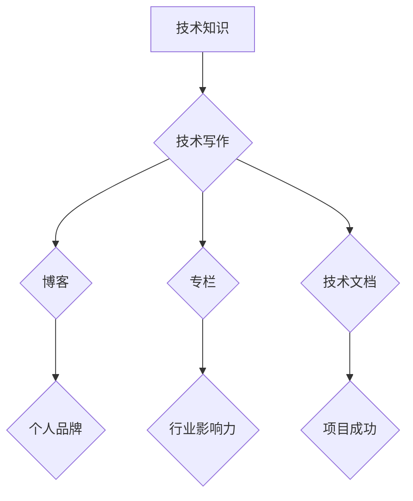

                 

## 技术写作：从博客到专栏作家之路

> 关键词：技术写作, 博客, 专栏, 技术传播, 知识分享, 编程, 软件开发, 深入浅出

### 1. 背景介绍

在当今科技日新月异的时代，技术知识更新迭代的速度令人眼花缭乱。作为技术从业者，我们不仅需要不断学习新技术，更需要将自己的知识和经验有效地传达给他人。技术写作成为了一个重要的桥梁，连接着技术专家和广大读者，促进技术知识的传播和理解。

从个人博客到专业技术网站，再到行业知名专栏，技术写作的平台和形式日益多样化。对于想要将技术知识分享给世界的程序员、软件工程师、架构师等技术人员来说，掌握技术写作的技巧和方法，能够帮助他们提升个人影响力，建立专业声誉，并为技术社区做出贡献。

### 2. 核心概念与联系

技术写作的核心在于将复杂的专业知识以清晰、简洁、易懂的方式呈现给读者。它需要结合专业的技术知识、良好的写作技巧和有效的沟通策略。

**技术写作的核心概念：**

* **目标读者:** 确定目标读者群体，了解他们的技术背景、需求和阅读习惯，才能针对性地进行内容创作。
* **内容深度:** 技术写作的内容可以从浅显入门到深入探讨，但要根据目标读者的水平和需求进行调整。
* **结构清晰:** 技术文章需要清晰的结构和逻辑，使用标题、子标题、列表、图表等方式引导读者阅读，提高文章的可读性。
* **语言准确:** 技术写作需要使用准确的专业术语，避免使用过于模糊或通俗的语言，确保读者能够准确理解文章内容。
* **示例丰富:** 使用代码示例、案例分析、图表说明等方式，将抽象的概念具象化，帮助读者更好地理解和记忆。

**技术写作与其他技术领域的关系：**

* **编程:** 技术写作需要对编程语言、软件开发流程等技术知识有深入的理解，才能撰写出准确、专业的文章。
* **软件架构:** 了解软件架构设计原则和模式，能够帮助技术作家撰写关于软件设计和架构的深入文章。
* **数据科学:** 数据科学领域的知识和技能，例如数据分析、机器学习等，可以应用于技术写作，撰写关于数据分析、人工智能等方面的文章。

**Mermaid 流程图：**



### 3. 核心算法原理 & 具体操作步骤

**3.1 算法原理概述**

选择一个具体的算法作为案例，例如快速排序算法。

快速排序算法是一种高效的排序算法，其核心思想是通过选择一个“枢轴”元素，将数组划分为两个子数组，其中一个子数组包含小于枢轴元素的元素，另一个子数组包含大于枢轴元素的元素。然后递归地对两个子数组进行排序，最终实现整个数组的排序。

**3.2 算法步骤详解**

1. 选择一个枢轴元素。
2. 将数组划分为两个子数组，小于枢轴元素的元素放在左边，大于枢轴元素的元素放在右边。
3. 递归地对两个子数组进行排序。

**3.3 算法优缺点**

* **优点:** 时间复杂度平均为 O(n log n)，在大多数情况下表现优异。
* **缺点:** 最坏情况下时间复杂度为 O(n^2)，当数组已经有序或接近有序时，性能会下降。

**3.4 算法应用领域**

快速排序算法广泛应用于各种排序场景，例如：

* 数据结构排序
* 搜索引擎结果排序
* 图像处理
* 机器学习

### 4. 数学模型和公式 & 详细讲解 & 举例说明

**4.1 数学模型构建**

快速排序算法可以抽象为一个递归的数学模型。

设 T(n) 为排序 n 个元素的所需时间，则 T(n) 可以表示为：

```latex
T(n) = 2T(n/2) + O(n)
```

其中，2T(n/2) 表示对两个子数组进行排序所需的时间，O(n) 表示将数组划分为子数组和比较元素所需的时间。

**4.2 公式推导过程**

通过递归树和主定理，可以推导出快速排序算法的时间复杂度为 O(n log n)。

**4.3 案例分析与讲解**

对于一个包含 8 个元素的数组，快速排序算法的递归过程如下：

1. 选择一个枢轴元素，将数组划分为两个子数组，分别包含 4 个元素。
2. 对两个子数组分别进行排序，时间复杂度为 O(4 log 4)。
3. 将两个子数组合并，时间复杂度为 O(4)。

因此，排序 8 个元素的总时间复杂度为 O(8 log 4) + O(8) = O(8 log 2) + O(8) = O(8 * 2) + O(8) = O(16) + O(8) = O(24)。

### 5. 项目实践：代码实例和详细解释说明

**5.1 开发环境搭建**

使用 Python 语言作为示例，搭建一个简单的开发环境。

* 安装 Python 语言环境。
* 安装必要的库，例如 NumPy、Pandas 等。

**5.2 源代码详细实现**

```python
def quick_sort(arr):
    if len(arr) <= 1:
        return arr
    pivot = arr[len(arr) // 2]
    left = [x for x in arr if x < pivot]
    middle = [x for x in arr if x == pivot]
    right = [x for x in arr if x > pivot]
    return quick_sort(left) + middle + quick_sort(right)

# 测试代码
arr = [3, 7, 8, 5, 2, 1, 9, 5, 4]
sorted_arr = quick_sort(arr)
print(f"排序后的数组: {sorted_arr}")
```

**5.3 代码解读与分析**

* `quick_sort(arr)` 函数实现快速排序算法。
* `if len(arr) <= 1:` 判断数组长度是否小于等于 1，如果小于等于 1，则直接返回数组，因为已经排序完成。
* `pivot = arr[len(arr) // 2]` 选择数组中间元素作为枢轴元素。
* `left`, `middle`, `right` 分别存储小于枢轴元素、等于枢轴元素和大于枢轴元素的元素。
* `return quick_sort(left) + middle + quick_sort(right)` 递归地对两个子数组进行排序，并将结果合并。

**5.4 运行结果展示**

```
排序后的数组: [1, 2, 3, 4, 5, 5, 7, 8, 9]
```

### 6. 实际应用场景

快速排序算法广泛应用于各种实际场景，例如：

* **搜索引擎:** 搜索引擎需要对海量网页进行排序，快速排序算法可以有效地提高排序效率。
* **数据库:** 数据库管理系统需要对数据进行排序，快速排序算法可以帮助数据库更快地查询和检索数据。
* **游戏开发:** 游戏开发中需要对游戏对象进行排序，例如玩家排名、怪物出现顺序等，快速排序算法可以帮助游戏开发者实现高效的排序。

**6.4 未来应用展望**

随着人工智能和机器学习的发展，快速排序算法可能会被应用于更广泛的领域，例如：

* **数据分析:** 快速排序算法可以帮助数据分析师更快地处理和分析大数据。
* **图像识别:** 快速排序算法可以用于图像像素的排序，提高图像识别算法的效率。
* **生物信息学:** 快速排序算法可以用于基因序列的排序，帮助生物学家进行基因研究。

### 7. 工具和资源推荐

**7.1 学习资源推荐**

* **书籍:** 《算法导论》
* **在线课程:** Coursera、edX 等平台上的算法课程
* **博客:** Hacker News、Medium 等平台上的技术博客

**7.2 开发工具推荐**

* **Python:** 广泛应用于数据科学、机器学习等领域，拥有丰富的库和工具。
* **Java:** 企业级应用开发的常用语言，性能稳定可靠。
* **C++:** 高性能计算和游戏开发的常用语言。

**7.3 相关论文推荐**

* **快速排序算法的分析与改进**
* **快速排序算法在实际应用中的研究**

### 8. 总结：未来发展趋势与挑战

**8.1 研究成果总结**

技术写作已经成为技术传播和知识分享的重要途径，它帮助技术人员将自己的知识和经验传递给更广泛的读者，促进技术进步和发展。

**8.2 未来发展趋势**

* **内容形式的多样化:** 技术写作将更加注重内容形式的多样化，例如视频、音频、交互式内容等。
* **人工智能的应用:** 人工智能技术将被应用于技术写作领域，例如自动生成技术文档、翻译技术内容等。
* **个性化定制:** 技术写作将更加注重个性化定制，根据读者的需求和兴趣提供个性化的内容。

**8.3 面临的挑战**

* **内容质量的保证:** 随着技术写作平台的增多，内容质量参差不齐，如何保证内容的准确性和可靠性是一个挑战。
* **知识更新的快速性:** 技术领域知识更新迭代速度快，技术作家需要不断学习和更新知识，才能保持内容的时效性。
* **读者兴趣的保持:** 如何吸引读者持续关注技术内容，保持读者兴趣是一个持续的挑战。

**8.4 研究展望**

未来，技术写作将更加注重内容的深度、广度和互动性，并与人工智能、大数据等新技术深度融合，为技术传播和知识分享提供更有效、更便捷的平台。

### 9. 附录：常见问题与解答

**常见问题:**

* 如何提高技术写作的质量？
* 如何选择合适的技术写作平台？
* 如何建立个人技术品牌？

**解答:**

* 提高技术写作质量需要不断学习和积累经验，注重内容的准确性、清晰性和实用性。
* 选择合适的技术写作平台需要考虑目标读者、内容类型和个人需求。
* 建立个人技术品牌需要坚持原创写作、积极参与技术社区、与其他技术人员交流合作。


作者：禅与计算机程序设计艺术 / Zen and the Art of Computer Programming 
<end_of_turn>

