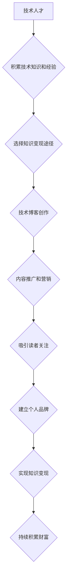

                 

## 技术博客：知识变现的途径

> 关键词：知识变现、人工智能、软件开发、技术博客、内容创作、技术社区、知识产权

## 1. 背景介绍

在当今数字时代，知识已成为最宝贵的资源。随着互联网的普及和信息爆炸，获取知识变得更加容易，但如何将知识转化为实际价值，实现知识变现，却成为许多人面临的挑战。对于技术领域的人才来说，拥有丰富的技术知识和经验，是他们宝贵的财富。如何将这些知识转化为收入，并持续地积累财富，是他们需要思考的重要问题。

技术博客作为一种知识分享和传播的平台，为技术人才提供了展示自我、积累粉丝、建立个人品牌的机会。通过撰写高质量的技术文章，分享自己的技术经验和见解，技术人才可以吸引读者关注，建立个人影响力，并最终实现知识变现。

## 2. 核心概念与联系

**2.1 知识变现的本质**

知识变现是指将知识转化为经济价值的过程。对于技术人才来说，知识变现主要体现在以下几个方面：

* **内容创作：** 通过撰写技术博客文章、编写技术书籍、制作技术视频等方式，将自己的技术知识和经验转化为有价值的内容，并通过广告、赞助、付费订阅等方式获得收益。
* **技术咨询：** 利用自己的技术专长，为企业或个人提供技术咨询服务，解决他们的技术难题，并获得相应的报酬。
* **技术培训：** 开设技术培训课程，教授他人技术知识和技能，并收取培训费用。
* **开源项目开发：** 开发开源软件项目，积累技术经验和贡献，并通过企业赞助、捐赠等方式获得收益。

**2.2 技术博客在知识变现中的作用**

技术博客作为一种在线平台，为技术人才提供了展示自我、分享知识、建立个人品牌和实现知识变现的多种途径。

* **展示技术能力：** 通过撰写高质量的技术文章，技术人才可以展示自己的技术能力和专业知识，吸引潜在客户或雇主关注。
* **建立个人品牌：** 持之以恒地创作优质内容，并积极参与技术社区，技术人才可以建立自己的个人品牌，提升个人影响力。
* **积累粉丝群体：** 通过博客文章、社交媒体等渠道，技术人才可以积累自己的粉丝群体，并与粉丝互动交流，建立良好的关系。
* **拓展商业机会：** 技术博客可以成为技术人才拓展商业机会的平台，例如接广告、赞助、付费订阅等。

**2.3 知识变现的流程图**



## 3. 核心算法原理 & 具体操作步骤

**3.1 算法原理概述**

知识变现的核心算法原理在于内容创作、用户运营和商业模式的结合。

* **内容创作：** 创作高质量、有价值的技术内容是知识变现的基础。内容需要符合目标受众的需求，并提供独特的价值观和见解。
* **用户运营：** 吸引和留住用户是知识变现的关键。需要通过内容推广、社区互动、用户关系管理等方式，建立良好的用户关系。
* **商业模式：** 选择合适的商业模式是知识变现的保障。常见的商业模式包括广告、赞助、付费订阅、电商等。

**3.2 算法步骤详解**

1. **确定目标受众：** 首先要明确自己的目标受众是谁，他们的技术水平、兴趣爱好、需求是什么。
2. **选择知识变现途径：** 根据自己的技术专长、兴趣爱好和目标受众，选择合适的知识变现途径。
3. **创作高质量内容：** 撰写高质量、有价值的技术文章，并进行适当的优化，使其更容易被搜索引擎和用户发现。
4. **推广和营销内容：** 通过社交媒体、技术社区、邮件营销等方式，推广和营销自己的技术内容。
5. **建立用户关系：** 与读者互动交流，回复评论、解答问题，建立良好的用户关系。
6. **选择商业模式：** 根据自己的目标和资源，选择合适的商业模式，例如广告、赞助、付费订阅等。
7. **持续积累财富：** 通过持续创作优质内容、运营用户关系和拓展商业模式，实现知识变现，并持续积累财富。

**3.3 算法优缺点**

* **优点：**
    * 灵活多变：知识变现的途径多种多样，可以根据自己的情况选择合适的模式。
    * 低门槛：相对于传统创业模式，知识变现的门槛相对较低，可以更容易地开始。
    * 持续收益：只要持续创作优质内容，并运营好用户关系，知识变现可以持续产生收益。
* **缺点：**
    * 竞争激烈：技术领域的信息传播速度快，竞争也十分激烈。
    * 收益不稳定：知识变现的收益通常不稳定，需要不断地努力才能获得稳定的收入。
    * 需要时间积累：知识变现需要时间积累，短期内难以获得丰厚的回报。

**3.4 算法应用领域**

知识变现的算法应用领域非常广泛，包括：

* **技术博客：** 技术博客是知识变现最常见的平台之一，可以用于分享技术经验、建立个人品牌和获得收益。
* **在线教育：** 在线教育平台可以利用知识变现算法，为用户提供高质量的在线课程和培训服务。
* **知识付费：** 知识付费平台可以利用知识变现算法，为用户提供付费订阅的知识内容和服务。
* **技术咨询：** 技术咨询公司可以利用知识变现算法，为企业或个人提供专业的技术咨询服务。

## 4. 数学模型和公式 & 详细讲解 & 举例说明

**4.1 数学模型构建**

知识变现可以看作是一个动态系统，其核心要素包括内容质量、用户数量、用户活跃度和商业模式。我们可以用以下数学模型来描述知识变现过程：

```
知识变现收益 = f(内容质量, 用户数量, 用户活跃度, 商业模式)
```

其中：

* 内容质量：指文章的质量、原创性、实用性等因素。
* 用户数量：指博客的访问量、粉丝数量等指标。
* 用户活跃度：指用户对博客内容的参与度、评论量、分享量等指标。
* 商业模式：指博客的盈利模式，例如广告、赞助、付费订阅等。

**4.2 公式推导过程**

由于知识变现是一个复杂的系统，其收益与各个要素之间的关系并非线性关系。我们可以通过以下公式来进一步描述各个要素之间的影响关系：

* 内容质量对收益的影响：

```
收益 = a * 内容质量^b
```

其中 a 和 b 是常数，代表内容质量对收益的影响程度。

* 用户数量对收益的影响：

```
收益 = c * 用户数量^d
```

其中 c 和 d 是常数，代表用户数量对收益的影响程度。

* 用户活跃度对收益的影响：

```
收益 = e * 用户活跃度^f
```

其中 e 和 f 是常数，代表用户活跃度对收益的影响程度。

**4.3 案例分析与讲解**

假设一个技术博客，其内容质量较高，用户数量较多，用户活跃度也较高，那么其知识变现收益将会较高。反之，如果内容质量较低，用户数量较少，用户活跃度也较低，那么其知识变现收益将会较低。

## 5. 项目实践：代码实例和详细解释说明

**5.1 开发环境搭建**

为了实现知识变现，需要搭建一个合适的开发环境。常用的开发环境包括：

* **博客平台：** 选择一个合适的博客平台，例如 WordPress、Medium、Ghost 等。
* **域名和服务器：** 购买一个域名和服务器，搭建自己的博客网站。
* **开发工具：** 熟悉常用的开发工具，例如文本编辑器、代码版本控制工具等。

**5.2 源代码详细实现**

由于知识变现涉及多个方面，例如内容创作、用户运营、商业模式等，其源代码实现较为复杂。这里只提供一个简单的博客文章发布的代码示例，使用 Python 和 Flask 框架：

```python
from flask import Flask, render_template

app = Flask(__name__)

@app.route('/')
def index():
    return render_template('index.html')

if __name__ == '__main__':
    app.run(debug=True)
```

**5.3 代码解读与分析**

这段代码是一个简单的 Flask 应用程序，用于展示一个博客文章列表。

* `from flask import Flask, render_template`: 导入 Flask 框架的必要模块。
* `app = Flask(__name__)`: 创建一个 Flask 应用程序实例。
* `@app.route('/')`: 定义一个路由规则，当访问根路径 '/' 时，执行 `index()` 函数。
* `def index()`: 定义一个函数，用于渲染博客文章列表页面。
* `return render_template('index.html')`: 使用 `render_template()` 函数渲染 `index.html` 模板文件。

**5.4 运行结果展示**

运行这段代码后，可以访问 http://127.0.0.1:5000/，看到一个简单的博客文章列表页面。

## 6. 实际应用场景

**6.1 技术博客平台**

技术博客平台是知识变现最常见的应用场景之一。例如，GitHub 上的博客功能，可以用于分享技术经验、建立个人品牌和获得收益。

**6.2 在线教育平台**

在线教育平台可以利用知识变现算法，为用户提供高质量的在线课程和培训服务。例如，Coursera、Udemy 等平台，可以利用知识变现算法，为用户提供付费课程和培训服务。

**6.3 知识付费平台**

知识付费平台可以利用知识变现算法，为用户提供付费订阅的知识内容和服务。例如，知乎、微信公众号等平台，可以利用知识变现算法，为用户提供付费订阅的知识内容和服务。

**6.4 未来应用展望**

随着人工智能技术的不断发展，知识变现的应用场景将会更加广泛。例如，人工智能可以帮助自动生成高质量的知识内容，并根据用户的需求进行个性化推荐。

## 7. 工具和资源推荐

**7.1 学习资源推荐**

* **书籍：**
    * 《零基础学Python》
    * 《Flask Web Development》
    * 《The Lean Startup》
* **在线课程：**
    * Coursera: Python for Everybody Specialization
    * Udemy: The Complete Python Bootcamp: Go from zero to hero in Python 3
    * Codecademy: Learn Python 3

**7.2 开发工具推荐**

* **文本编辑器：** Sublime Text, Atom, VS Code
* **代码版本控制工具：** Git, GitHub
* **博客平台：** WordPress, Medium, Ghost

**7.3 相关论文推荐**

* **The Economics of Attention**
* **The Long Tail**
* **Network Effects**

## 8. 总结：未来发展趋势与挑战

**8.1 研究成果总结**

知识变现是一个不断发展和演变的领域。通过对知识变现算法的深入研究，我们可以更好地理解知识变现的过程，并找到更有效的知识变现方法。

**8.2 未来发展趋势**

* **人工智能技术的应用：** 人工智能技术将进一步推动知识变现的发展，例如自动生成高质量的知识内容、个性化推荐等。
* **虚拟现实和增强现实技术的应用：** 虚拟现实和增强现实技术将为知识变现提供新的场景和体验。
* **区块链技术的应用：** 区块链技术可以帮助解决知识产权保护问题，促进知识变现的公平性和可持续性。

**8.3 面临的挑战**

* **知识产权保护：** 如何保护知识产权，防止知识被盗用和抄袭，是知识变现面临的重大挑战。
* **内容质量的保证：** 如何保证知识内容的质量和原创性，是知识变现的关键。
* **用户信任的建立：** 如何建立用户的信任，让他们愿意付费购买知识内容，是知识变现的难题。

**8.4 研究展望**

未来，我们需要继续深入研究知识变现算法，探索新的知识变现模式，并解决知识变现面临的挑战，推动知识变现的健康发展。

## 9. 附录：常见问题与解答

**9.1 如何选择合适的知识变现途径？**

选择合适的知识变现途径需要根据自己的技术专长、兴趣爱好、目标受众和资源情况进行综合考虑。

**9.2 如何提高知识内容的质量？**

提高知识内容的质量需要不断学习和积累经验，并注重原创性和实用性。

**9.3 如何建立用户的信任？**

建立用户的信任需要提供高质量的知识内容，并真诚地与用户互动交流。


作者：禅与计算机程序设计艺术 / Zen and the Art of Computer Programming<end_of_turn>

