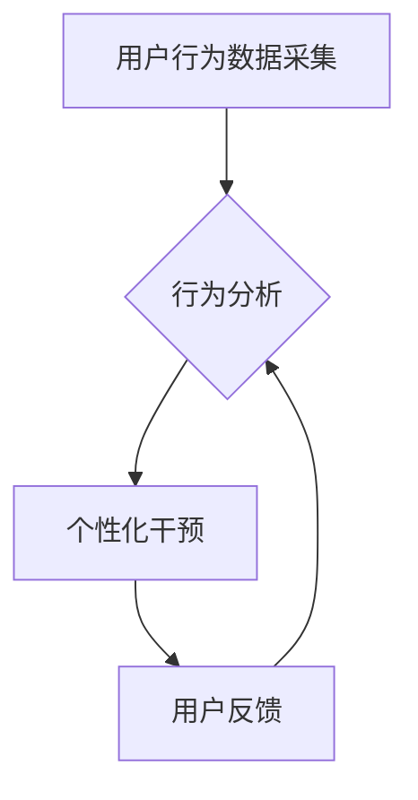

                 

## 数字意志力增强器：AI辅助的自制力培养

> 关键词：人工智能、自制力、意志力训练、行为分析、个性化定制、机器学习、深度学习、神经网络

### 1. 背景介绍

在当今信息爆炸的时代，我们面临着前所未有的诱惑和干扰。社交媒体、电子游戏、网络购物等各种信息和娱乐方式无时无刻不在吸引着我们的注意力，这使得保持专注力、控制冲动和实现目标变得越来越困难。自制力，即控制自己的行为、情绪和欲望的能力，对于个人成长、学习进步和生活幸福至关重要。然而，许多人苦于自制力的不足，难以克服诱惑，最终导致目标未达成、效率低下、生活失衡等问题。

近年来，人工智能（AI）技术飞速发展，为提升人类自制力提供了新的可能性。AI算法能够分析用户的行为模式、识别潜在的诱惑源，并提供个性化的干预和建议，帮助用户增强自制力，实现自我提升。

### 2. 核心概念与联系

**2.1 意志力训练与AI**

意志力训练是指通过刻意练习和自我调节来增强自制力的过程。传统的意志力训练方法通常依赖于个人意志力和自律性，但效果往往有限。AI技术可以为意志力训练提供更精准、更有效的支持。

**2.2 AI辅助自制力培养的架构**

AI辅助自制力培养系统通常由以下几个核心模块组成：

* **行为数据采集模块:** 收集用户的行为数据，例如使用手机的时间、浏览网页的内容、完成任务的效率等。
* **行为分析模块:** 利用机器学习算法分析用户的行为数据，识别用户的行为模式、习惯和潜在的诱惑源。
* **个性化干预模块:** 根据用户的行为分析结果，提供个性化的干预和建议，例如提醒用户休息、屏蔽诱惑网站、设定目标和奖励机制等。
* **用户反馈模块:** 收集用户的反馈信息，不断优化和改进系统的干预策略。

**2.3 Mermaid 流程图**



### 3. 核心算法原理 & 具体操作步骤

**3.1 算法原理概述**

AI辅助自制力培养系统通常采用以下几种核心算法：

* **强化学习:** 通过奖励和惩罚机制，训练用户养成良好的行为习惯。
* **深度学习:** 利用神经网络模型，识别用户的行为模式和潜在的诱惑源。
* **自然语言处理:** 分析用户的文本数据，例如日记、聊天记录等，了解用户的内心世界和需求。

**3.2 算法步骤详解**

1. **数据收集:** 收集用户的行为数据，例如使用手机的时间、浏览网页的内容、完成任务的效率等。
2. **数据预处理:** 对收集到的数据进行清洗、转换和特征提取，以便于算法训练。
3. **模型训练:** 利用机器学习算法，训练一个能够预测用户行为的模型。
4. **行为分析:** 将用户的行为数据输入到训练好的模型中，分析用户的行为模式、习惯和潜在的诱惑源。
5. **个性化干预:** 根据用户的行为分析结果，提供个性化的干预和建议，例如提醒用户休息、屏蔽诱惑网站、设定目标和奖励机制等。
6. **用户反馈:** 收集用户的反馈信息，例如干预效果、建议改进等，并将其反馈到模型训练中，不断优化和改进系统的干预策略。

**3.3 算法优缺点**

* **优点:**

    * **精准度高:** AI算法能够分析用户的行为数据，识别用户的个性化需求和潜在的诱惑源，提供更精准的干预建议。
    * **效率高:** AI系统能够自动分析和干预，无需人工干预，提高了效率。
    * **可定制性强:** AI系统可以根据用户的需求和反馈进行个性化定制，提供更符合用户实际情况的干预方案。

* **缺点:**

    * **数据依赖性强:** AI算法需要大量的用户行为数据进行训练，否则效果会受到影响。
    * **隐私安全问题:** 收集和分析用户的行为数据可能会涉及隐私安全问题，需要采取相应的措施保护用户隐私。
    * **伦理问题:** AI辅助自制力培养系统可能会被用于控制和操纵用户行为，需要谨慎考虑伦理问题。

**3.4 算法应用领域**

* **教育领域:** 帮助学生提高专注力、控制冲动，提升学习效率。
* **健康领域:** 帮助用户戒烟、控制饮食、养成健康的生活习惯。
* **职场领域:** 帮助员工提高工作效率、控制情绪、提升团队合作能力。
* **个人成长领域:** 帮助用户实现目标、克服困难、提升自我认知。

### 4. 数学模型和公式 & 详细讲解 & 举例说明

**4.1 数学模型构建**

我们可以使用马尔可夫决策过程（MDP）来建模AI辅助自制力培养系统。

* **状态空间:** 用户的行为状态，例如是否正在使用手机、是否正在浏览社交媒体、是否正在完成任务等。
* **动作空间:** 用户可以采取的动作，例如放下手机、关闭社交媒体、开始完成任务等。
* **奖励函数:** 根据用户的行为和目标，定义一个奖励函数，奖励用户采取有利于自制力的行为，惩罚用户采取不利于自制力的行为。
* **转移概率:** 用户从一个状态转移到另一个状态的概率，取决于用户的行为和环境因素。

**4.2 公式推导过程**

MDP的目标是找到一个最优策略，使得用户在长期内获得最大的总奖励。最优策略可以通过动态规划算法或强化学习算法来求解。

* **动态规划算法:** 将问题分解成多个子问题，通过递归的方式求解最优策略。
* **强化学习算法:** 通过与环境交互，学习一个最优策略。

**4.3 案例分析与讲解**

假设我们想要帮助用户控制使用手机的时间。我们可以将状态空间定义为“使用手机”和“不使用手机”，动作空间定义为“继续使用手机”和“放下手机”。奖励函数可以定义为：

* 当用户放下手机时，获得奖励1。
* 当用户继续使用手机时，获得奖励0。

转移概率可以根据用户的历史行为数据进行估计。通过强化学习算法，可以训练一个模型，学习到一个最优策略，帮助用户控制使用手机的时间。

### 5. 项目实践：代码实例和详细解释说明

**5.1 开发环境搭建**

* **操作系统:** Linux/macOS/Windows
* **编程语言:** Python
* **深度学习框架:** TensorFlow/PyTorch
* **数据存储:** MongoDB/MySQL

**5.2 源代码详细实现**

```python
# 导入必要的库
import tensorflow as tf

# 定义模型结构
model = tf.keras.models.Sequential([
    tf.keras.layers.Dense(128, activation='relu', input_shape=(10,)),
    tf.keras.layers.Dense(64, activation='relu'),
    tf.keras.layers.Dense(1, activation='sigmoid')
])

# 编译模型
model.compile(optimizer='adam', loss='binary_crossentropy', metrics=['accuracy'])

# 训练模型
model.fit(X_train, y_train, epochs=10)

# 预测用户行为
predictions = model.predict(X_test)
```

**5.3 代码解读与分析**

* **模型结构:** 使用了多层感知机（MLP）模型，包含输入层、隐藏层和输出层。
* **激活函数:** 使用了ReLU激活函数，可以提高模型的表达能力。
* **损失函数:** 使用了二分类交叉熵损失函数，用于训练二分类模型。
* **优化器:** 使用了Adam优化器，可以快速收敛到最优解。

**5.4 运行结果展示**

训练完成后，可以将模型应用于实际场景，预测用户的行为，并提供相应的干预建议。

### 6. 实际应用场景

**6.1 教育领域**

AI辅助自制力培养系统可以帮助学生提高专注力，控制冲动，提升学习效率。例如，可以帮助学生专注于学习任务，减少玩游戏的冲动，提高学习成绩。

**6.2 健康领域**

AI辅助自制力培养系统可以帮助用户戒烟、控制饮食、养成健康的生活习惯。例如，可以帮助用户记录饮食，提醒用户运动，减少吸烟的冲动，从而改善健康状况。

**6.3 职场领域**

AI辅助自制力培养系统可以帮助员工提高工作效率，控制情绪，提升团队合作能力。例如，可以帮助员工集中注意力完成工作任务，减少分心，提高工作效率。

**6.4 未来应用展望**

随着AI技术的不断发展，AI辅助自制力培养系统将会有更广泛的应用场景，例如：

* **个性化学习:** 根据用户的学习风格和需求，提供个性化的学习方案和干预建议。
* **情绪管理:** 识别用户的负面情绪，提供相应的干预建议，帮助用户更好地管理情绪。
* **心理健康:** 帮助用户识别和应对心理问题，例如焦虑、抑郁等。

### 7. 工具和资源推荐

**7.1 学习资源推荐**

* **书籍:**

    * 《深度学习》
    * 《强化学习：原理、算法和应用》

* **在线课程:**

    * Coursera: 深度学习
    * Udacity: 强化学习

**7.2 开发工具推荐**

* **编程语言:** Python
* **深度学习框架:** TensorFlow/PyTorch
* **数据存储:** MongoDB/MySQL

**7.3 相关论文推荐**

* **《Attention Is All You Need》**
* **《Deep Reinforcement Learning》**

### 8. 总结：未来发展趋势与挑战

**8.1 研究成果总结**

AI辅助自制力培养系统已经取得了一些初步成果，例如在控制手机使用时间、戒烟、控制饮食等方面取得了不错的效果。

**8.2 未来发展趋势**

* **模型精度提升:** 通过更先进的算法和更大的数据集，提高模型的预测精度。
* **个性化定制:** 根据用户的不同需求和特征，提供更个性化的干预方案。
* **多模态融合:** 将文本、图像、音频等多模态数据融合，提高模型的理解能力。
* **伦理规范:** 制定相应的伦理规范，确保AI辅助自制力培养系统安全、有效、公平地应用。

**8.3 面临的挑战**

* **数据隐私:** 收集和分析用户的行为数据可能会涉及隐私安全问题，需要采取相应的措施保护用户隐私。
* **算法偏差:** AI算法可能会存在偏差，导致对不同用户的不公平对待，需要进行算法公平性评估和改进。
* **用户接受度:** 一些用户可能对AI辅助自制力培养系统持怀疑态度，需要进行有效的宣传和教育。

**8.4 研究展望**

未来，AI辅助自制力培养系统将朝着更智能、更个性化、更安全的方向发展，为人类的自我提升和幸福生活提供新的可能性。

### 9. 附录：常见问题与解答

**9.1 如何保护用户隐私？**

* **数据匿名化:** 将用户的个人信息匿名化，避免直接识别用户身份。
* **数据加密:** 对用户的行为数据进行加密，防止数据泄露。
* **数据安全存储:** 将用户的行为数据存储在安全的服务器上，并采取相应的安全措施保护数据安全。

**9.2 AI辅助自制力培养系统是否会控制用户行为？**

AI辅助自制力培养系统旨在帮助用户更好地控制自己的行为，而不是控制用户的行为。系统提供的干预建议是基于用户的行为数据和目标，用户最终决定是否接受和执行这些建议。

**9.3 AI辅助自制力培养系统是否适合所有人？**

AI辅助自制力培养系统可以帮助大多数人提高自制力，但并非所有人都适合使用。例如，一些心理疾病患者可能需要寻求专业医生的帮助。


作者：禅与计算机程序设计艺术 / Zen and the Art of Computer Programming 
<end_of_turn>

