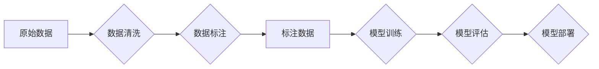

                 

## 数据标注：人工智能背后的无名英雄

> 关键词：数据标注、人工智能、机器学习、深度学习、数据质量、标注工具、标注人员

### 1. 背景介绍

人工智能（AI）近年来发展迅速，取得了令人瞩目的成就。从语音识别到图像识别，从自然语言处理到自动驾驶，AI技术正在深刻地改变着我们的生活。然而，支撑AI发展的基石并非复杂的算法或强大的算力，而是海量高质量的数据标注。

数据标注是指为机器学习模型提供训练数据，并为这些数据赋予明确的标签或标记的过程。例如，在图像识别领域，需要为图像标注出相应的物体类别，如“猫”、“狗”、“车”等；在自然语言处理领域，需要为文本标注出情感倾向、实体关系等信息。

数据标注是AI发展的关键环节，它直接影响着模型的训练效果和最终的应用性能。高质量的数据标注可以帮助模型更好地理解数据，提高识别精度和准确率，从而实现更智能的应用。

### 2. 核心概念与联系

数据标注是机器学习和深度学习训练的基础。它将原始数据转化为机器可理解的形式，为模型提供学习和训练的素材。

**数据标注流程图：**



**核心概念：**

* **数据清洗:** 移除数据中的噪声、错误和重复数据，确保数据质量。
* **数据标注:** 为数据赋予标签或标记，使其具备机器可理解的语义。
* **模型训练:** 利用标注数据训练机器学习模型，使其能够学习数据中的规律和模式。
* **模型评估:** 评估模型的性能，并根据评估结果进行模型调优。
* **模型部署:** 将训练好的模型部署到实际应用场景中。

### 3. 核心算法原理 & 具体操作步骤

数据标注算法本身并不复杂，主要依赖于人工标注和自动化工具的结合。

**3.1 算法原理概述**

数据标注算法的核心在于将人类的知识和理解转化为机器可理解的格式。这可以通过以下几种方式实现：

* **规则-基于的标注:** 根据预先定义的规则，自动标注数据。例如，根据文本中的关键词自动识别情感倾向。
* **监督学习-基于的标注:** 利用已标注的数据训练机器学习模型，使模型能够自动标注新的数据。例如，利用已标注的图像训练图像识别模型。
* **半监督学习-基于的标注:** 利用少量标注数据和大量未标注数据训练模型，提高标注效率。

**3.2 算法步骤详解**

1. **数据收集:** 收集需要标注的数据，例如图像、文本、音频等。
2. **数据清洗:** 移除数据中的噪声、错误和重复数据，确保数据质量。
3. **标注策略选择:** 根据数据类型和应用场景选择合适的标注策略，例如规则-基于的标注、监督学习-基于的标注或半监督学习-基于的标注。
4. **标注工具选择:** 选择合适的标注工具，例如LabelImg、BRAT、Amazon Mechanical Turk等。
5. **标注人员培训:** 对标注人员进行培训，确保他们能够准确理解标注任务和标准。
6. **数据标注:** 由标注人员对数据进行标注，并根据标注标准进行质量控制。
7. **数据评估:** 对标注数据进行评估，确保其质量和准确性。
8. **数据迭代:** 根据评估结果，对标注数据进行迭代修正，不断提高数据质量。

**3.3 算法优缺点**

**优点:**

* 能够为机器学习模型提供高质量的训练数据。
* 可以根据不同的应用场景选择不同的标注策略和工具。
* 随着自动化工具的不断发展，标注效率不断提高。

**缺点:**

* 数据标注工作量大，成本高。
* 需要专业的标注人员进行标注，确保数据质量。
* 标注结果受标注人员主观判断的影响。

**3.4 算法应用领域**

数据标注在人工智能领域广泛应用，例如：

* **图像识别:** 用于识别物体、场景、人脸等。
* **自然语言处理:** 用于情感分析、文本分类、机器翻译等。
* **语音识别:** 用于语音转文本、语音助手等。
* **自动驾驶:** 用于识别道路、交通标志、行人等。
* **医疗诊断:** 用于辅助医生诊断疾病。

### 4. 数学模型和公式 & 详细讲解 & 举例说明

数据标注算法本身并不依赖复杂的数学模型，但它与机器学习算法密切相关。机器学习算法通常使用数学模型来表示数据之间的关系，并通过训练来学习这些关系。

**4.1 数学模型构建**

机器学习算法的数学模型通常是基于概率论和统计学原理构建的。例如，线性回归模型使用线性方程来表示数据之间的关系，而决策树模型使用树状结构来表示数据分类规则。

**4.2 公式推导过程**

机器学习算法的训练过程通常涉及以下公式：

* **损失函数:** 用于衡量模型预测结果与真实值的差异。
* **梯度下降算法:** 用于更新模型参数，使其能够最小化损失函数。

**4.3 案例分析与讲解**

例如，在图像识别领域，可以使用卷积神经网络（CNN）模型进行图像分类。CNN模型的数学模型包含卷积层、池化层和全连接层。卷积层用于提取图像特征，池化层用于降低特征维度，全连接层用于分类。

训练CNN模型时，需要使用大量的标注图像数据。模型会根据标注数据学习图像特征和分类规则，并通过梯度下降算法不断优化模型参数，使其能够准确地识别图像类别。

### 5. 项目实践：代码实例和详细解释说明

以下是一个简单的图像标注项目示例，使用Python和LabelImg工具进行实现。

**5.1 开发环境搭建**

1. 安装Python环境。
2. 安装LabelImg工具：`pip install labelImg`

**5.2 源代码详细实现**

```python
# 使用LabelImg工具进行图像标注
# 运行命令：labelImg --image-folder data/images --label-file data/labels.txt
```

**5.3 代码解读与分析**

该代码使用LabelImg工具进行图像标注。

* `--image-folder data/images`: 指定图像存放路径。
* `--label-file data/labels.txt`: 指定标注结果保存路径。

**5.4 运行结果展示**

运行该代码后，会启动LabelImg工具，用户可以对图像进行标注，并保存标注结果到指定文件。

### 6. 实际应用场景

数据标注在人工智能领域广泛应用，例如：

* **自动驾驶:** 用于标注道路、交通标志、行人等信息，训练自动驾驶模型。
* **医疗诊断:** 用于标注病理图像、医学影像等信息，辅助医生诊断疾病。
* **金融风险控制:** 用于标注金融交易数据、客户信息等信息，识别潜在风险。
* **电商推荐:** 用于标注用户行为数据、商品信息等信息，个性化推荐商品。

**6.4 未来应用展望**

随着人工智能技术的不断发展，数据标注的需求将更加广泛和深入。未来，数据标注将朝着以下方向发展：

* **自动化程度更高:** 利用人工智能技术自动完成部分或全部数据标注任务。
* **标注质量更高:** 开发更先进的标注工具和方法，提高标注数据的准确性和一致性。
* **标注成本更低:** 利用云计算、分布式计算等技术，降低数据标注成本。

### 7. 工具和资源推荐

**7.1 学习资源推荐**

* **斯坦福大学CS224N课程:** https://web.stanford.edu/class/cs224n/
* **Udacity机器学习工程师 Nanodegree:** https://www.udacity.com/course/machine-learning-engineer-nanodegree--nd009

**7.2 开发工具推荐**

* **LabelImg:** https://github.com/tzutalin/labelImg
* **BRAT:** https://brat.nlplab.org/
* **Amazon Mechanical Turk:** https://www.mturk.com/

**7.3 相关论文推荐**

* **ImageNet Classification with Deep Convolutional Neural Networks:** https://papers.nips.cc/paper/4824-imagenet-classification-with-deep-convolutional-neural-networks.pdf
* **Attention Is All You Need:** https://arxiv.org/abs/1706.03762

### 8. 总结：未来发展趋势与挑战

数据标注是人工智能发展的基石，它为机器学习模型提供训练数据，并直接影响着模型的性能。随着人工智能技术的不断发展，数据标注的需求将更加广泛和深入。

**8.1 研究成果总结**

近年来，数据标注领域取得了显著进展，例如：

* 自动化标注技术的不断发展，提高了标注效率。
* 标注质量评估方法的不断完善，确保了标注数据的准确性和一致性。
* 数据标注平台的不断涌现，提供了更便捷的标注服务。

**8.2 未来发展趋势**

未来，数据标注将朝着以下方向发展：

* **更智能的自动化标注:** 利用人工智能技术自动完成更多数据标注任务。
* **更精准的标注质量控制:** 开发更先进的标注质量评估方法，确保标注数据的准确性和一致性。
* **更协同的标注平台:** 打造更完善的标注平台，支持多人协同标注和数据共享。

**8.3 面临的挑战**

数据标注领域也面临着一些挑战：

* **标注数据成本高:** 数据标注工作量大，成本高昂。
* **标注人员缺乏:** 缺乏专业的数据标注人员。
* **标注数据质量难以保证:** 标注结果受标注人员主观判断的影响。

**8.4 研究展望**

未来，需要进一步研究以下问题：

* 如何降低数据标注成本？
* 如何提高数据标注的自动化程度？
* 如何保证数据标注的质量和一致性？


### 9. 附录：常见问题与解答

**常见问题:**

* **数据标注的成本如何控制？**

**解答:**

数据标注的成本可以通过以下方式控制：

* 利用自动化工具完成部分标注任务。
* 选择合适的标注人员，并进行培训。
* 优化标注流程，提高标注效率。

* **如何保证数据标注的质量？**

**解答:**

数据标注的质量可以通过以下方式保证：

* 制定严格的标注标准，并进行培训。
* 使用标注质量评估工具，对标注结果进行评估。
* 对标注结果进行迭代修正，不断提高标注质量。


作者：禅与计算机程序设计艺术 / Zen and the Art of Computer Programming 
<end_of_turn>

