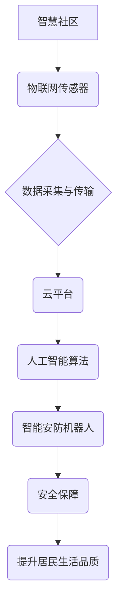

                 

## 未来的智慧物业：2050年的智能安防机器人与智慧社区

> 关键词：智能安防机器人、智慧社区、物联网、人工智能、机器学习、计算机视觉、自然语言处理、安全保障

## 1. 背景介绍

随着城市化进程的加速和人口密集度的提高，智慧城市建设已成为全球发展趋势。智慧物业作为智慧城市的重要组成部分，旨在通过信息技术和智能化手段，提升物业管理效率、保障居民安全和提升生活品质。未来，智能安防机器人将成为智慧物业的核心驱动力，为社区居民提供更加安全、便捷、智能的生活体验。

传统的安防系统主要依靠人工巡逻和监控，存在人力成本高、效率低、反应速度慢等问题。而智能安防机器人则通过传感器、人工智能和机器学习等技术，实现自主巡逻、异常检测、预警响应等功能，能够有效提升安防效率和安全性。

## 2. 核心概念与联系

**2.1 智慧社区**

智慧社区是指利用物联网、云计算、大数据等信息技术，构建一个智能化、互联互通、高效便捷的社区生活环境。智慧社区的核心目标是提升居民生活品质、提高社区管理效率、增强社区安全保障。

**2.2 智能安防机器人**

智能安防机器人是指具备自主导航、感知、决策和执行能力的机器人，能够在社区环境中自主巡逻、监控、识别异常情况并进行预警响应。

**2.3 核心概念架构**



**2.4 核心概念联系**

智慧社区通过物联网传感器收集社区环境数据，并将数据传输到云平台。云平台利用人工智能算法对数据进行分析和处理，并控制智能安防机器人进行巡逻和监控。智能安防机器人通过感知和识别异常情况，及时进行预警响应，保障社区安全，提升居民生活品质。

## 3. 核心算法原理 & 具体操作步骤

**3.1 算法原理概述**

智能安防机器人主要依赖以下核心算法：

* **计算机视觉算法**: 用于识别和分类物体，例如人、车辆、宠物等，并进行行为分析，例如行走、停留、奔跑等。
* **机器学习算法**: 用于训练模型，识别异常行为和事件，例如入侵、火灾、盗窃等。
* **自然语言处理算法**: 用于理解和响应居民的语音指令，例如巡逻路线调整、报警请求等。
* **路径规划算法**: 用于规划机器人自主巡逻路线，避免障碍物，提高巡逻效率。

**3.2 算法步骤详解**

1. **数据采集**: 智能安防机器人通过摄像头、传感器等设备采集社区环境数据，包括图像、视频、音频、环境参数等。
2. **数据预处理**: 对采集到的数据进行预处理，例如图像增强、噪音过滤、数据格式转换等，以便后续算法处理。
3. **特征提取**: 利用计算机视觉算法提取图像和视频中的特征，例如物体形状、颜色、纹理等，并将其转换为数字特征向量。
4. **异常检测**: 利用机器学习算法对特征向量进行分析，识别异常行为和事件，例如陌生人进入社区、物品被移动、声音异常等。
5. **预警响应**: 当检测到异常情况时，机器人会根据预设规则进行预警响应，例如发出警报声、发送短信通知、自动报警等。
6. **语音交互**: 利用自然语言处理算法，机器人可以理解和响应居民的语音指令，例如巡逻路线调整、报警请求等。

**3.3 算法优缺点**

**优点**:

* **提高效率**: 智能安防机器人能够24小时不间断巡逻，提高安防效率，减少人力成本。
* **增强安全性**: 机器人能够识别和预警潜在安全威胁，提高社区安全性。
* **提升体验**: 机器人能够提供语音交互、智能服务等功能，提升居民生活体验。

**缺点**:

* **技术复杂**: 智能安防机器人需要集成多种先进技术，开发难度较高。
* **成本高昂**: 机器人硬件和软件成本较高，初期投入较大。
* **伦理问题**: 机器人决策和行为可能存在伦理问题，需要谨慎考虑。

**3.4 算法应用领域**

智能安防机器人广泛应用于以下领域:

* **社区安防**: 巡逻、监控、预警、报警等。
* **商业场所安防**: 商场、酒店、写字楼等场所的安防巡逻和监控。
* **工业园区安防**: 工厂、仓库、物流园区等场所的安防巡逻和监控。
* **公共场所安防**: 公园、广场、车站等公共场所的安防巡逻和监控。

## 4. 数学模型和公式 & 详细讲解 & 举例说明

**4.1 数学模型构建**

智能安防机器人的行为决策可以建模为一个马尔可夫决策过程 (MDP)。

* 状态空间 S：机器人当前的位置、感知到的环境信息等。
* 动作空间 A：机器人可以执行的动作，例如移动、观察、报警等。
* 转移概率 P(s' | s, a)：从状态 s 执行动作 a 到状态 s' 的概率。
* 奖励函数 R(s, a)：机器人执行动作 a 在状态 s 得到的奖励。
* 策略 π(a | s)：在状态 s 下执行动作 a 的概率。

**4.2 公式推导过程**

目标是找到最优策略 π*，使得机器人获得最大的累积奖励。可以使用动态规划算法或强化学习算法来求解最优策略。

* 动态规划算法：通过递归的方式，从终态开始，逐步推导最优策略。
* 强化学习算法：通过与环境交互，不断更新策略，使其逐渐趋近于最优策略。

**4.3 案例分析与讲解**

假设机器人需要在社区中巡逻，并识别异常行为。

* 状态空间 S：机器人当前的位置、感知到的环境信息 (例如摄像头图像、传感器数据)。
* 动作空间 A：移动到下一个位置、观察当前位置、报警。
* 转移概率 P(s' | s, a)：取决于机器人的移动速度、环境复杂度等因素。
* 奖励函数 R(s, a)：例如，识别到异常行为获得高奖励，巡逻完成获得奖励，误报则获得负奖励。

通过强化学习算法，机器人可以学习到最优巡逻策略，例如在高风险区域停留更长时间，在低风险区域快速移动。

## 5. 项目实践：代码实例和详细解释说明

**5.1 开发环境搭建**

* 操作系统：Ubuntu 20.04
* 编程语言：Python 3.8
* 机器学习框架：TensorFlow 2.0
* 深度学习库：OpenCV

**5.2 源代码详细实现**

```python
# 导入必要的库
import tensorflow as tf
from tensorflow.keras.models import Sequential
from tensorflow.keras.layers import Conv2D, MaxPooling2D, Flatten, Dense
import cv2

# 定义模型结构
model = Sequential()
model.add(Conv2D(32, (3, 3), activation='relu', input_shape=(64, 64, 3)))
model.add(MaxPooling2D((2, 2)))
model.add(Conv2D(64, (3, 3), activation='relu'))
model.add(MaxPooling2D((2, 2)))
model.add(Flatten())
model.add(Dense(10, activation='softmax'))

# 编译模型
model.compile(optimizer='adam',
              loss='categorical_crossentropy',
              metrics=['accuracy'])

# 加载训练数据
(x_train, y_train), (x_test, y_test) = tf.keras.datasets.cifar10.load_data()

# 数据预处理
x_train = x_train.astype('float32') / 255
x_test = x_test.astype('float32') / 255

# 训练模型
model.fit(x_train, y_train, epochs=10, batch_size=32)

# 评估模型
loss, accuracy = model.evaluate(x_test, y_test)
print('Test loss:', loss)
print('Test accuracy:', accuracy)

# 使用模型进行预测
predictions = model.predict(x_test)

# 将预测结果转换为类别
predicted_classes = tf.math.argmax(predictions, axis=1)

# 显示预测结果
for i in range(10):
    image = x_test[i]
    predicted_class = predicted_classes[i]
    print('Predicted class:', predicted_class)
    cv2.imshow('Image', image)
    cv2.waitKey(0)
```

**5.3 代码解读与分析**

这段代码实现了基于深度学习的图像分类模型。

* 首先，导入必要的库，包括 TensorFlow、OpenCV 等。
* 然后，定义模型结构，使用卷积神经网络 (CNN) 进行图像特征提取和分类。
* 接着，编译模型，指定优化器、损失函数和评价指标。
* 接下来，加载训练数据，并进行数据预处理，例如归一化。
* 然后，训练模型，使用训练数据进行模型训练。
* 最后，评估模型，使用测试数据评估模型性能，并使用模型进行预测。

**5.4 运行结果展示**

运行代码后，模型将训练完成，并能够对图像进行分类。

## 6. 实际应用场景

**6.1 智能安防巡逻机器人**

在社区中部署智能安防巡逻机器人，可以实现24小时不间断巡逻，实时监控社区环境，识别异常行为，并进行预警响应。例如，机器人可以巡逻小区道路，识别陌生人进入，并自动报警；可以巡逻停车场，识别车辆违停，并进行提醒。

**6.2 智能安防监控中心**

利用智能安防机器人收集到的数据，构建智能安防监控中心，可以实现多角度、多层次的监控和分析。例如，监控中心可以实时监控社区摄像头画面，识别异常事件，并进行快速响应；可以分析机器人巡逻数据，发现社区安全隐患，并进行预防措施。

**6.3 智能安防服务机器人**

开发智能安防服务机器人，可以为居民提供更加便捷的安防服务。例如，机器人可以帮助居民进行门禁管理，识别居民身份，并控制门禁系统；可以帮助居民报警，及时联系保安人员；可以提供社区安全信息，例如安全提示、紧急联系方式等。

**6.4 未来应用展望**

未来，智能安防机器人将更加智能化、人性化、协同化。例如，机器人将能够更加精准地识别异常行为，并进行更加智能的预警响应；机器人将能够更加自然地与居民进行交互，提供更加便捷的服务；机器人将能够与其他智能设备协同工作，构建更加完善的智慧安防体系。

## 7. 工具和资源推荐

**7.1 学习资源推荐**

* **书籍**:
    * 《深度学习》 - Ian Goodfellow, Yoshua Bengio, Aaron Courville
    * 《机器学习》 - Tom Mitchell
* **在线课程**:
    * Coursera: 深度学习 Specialization
    * Udacity: 机器学习 Engineer Nanodegree
* **开源项目**:
    * TensorFlow: https://www.tensorflow.org/
    * PyTorch: https://pytorch.org/

**7.2 开发工具推荐**

* **编程语言**: Python
* **机器学习框架**: TensorFlow, PyTorch
* **深度学习库**: OpenCV, scikit-learn
* **机器人平台**: ROS, Gazebo

**7.3 相关论文推荐**

* **计算机视觉**:
    * 《ImageNet Classification with Deep Convolutional Neural Networks》 - Alex Krizhevsky, Ilya Sutskever, Geoffrey E. Hinton
* **机器学习**:
    * 《Deep Reinforcement Learning》 - Volodymyr Mnih, Koray Kavukcuoglu, David Silver, et al.
* **机器人**:
    * 《Probabilistic Robotics》 - Sebastian Thrun, Wolfram Burgard, Dieter Fox

## 8. 总结：未来发展趋势与挑战

**8.1 研究成果总结**

近年来，智能安防机器人技术取得了显著进展，在社区安防、商业场所安防、工业园区安防等领域得到了广泛应用。

**8.2 未来发展趋势**

* **更加智能化**: 机器人将更加智能，能够更加精准地识别异常行为，并进行更加智能的预警响应。
* **更加人性化**: 机器人将更加人性化，能够更加自然地与居民进行交互，提供更加便捷的服务。
* **更加协同化**: 机器人将与其他智能设备协同工作，构建更加完善的智慧安防体系。

**8.3 面临的挑战**

* **技术挑战**: 
    * 提高机器人的感知能力和决策能力。
    * 降低机器人的成本和复杂度。
    * 确保机器人的安全性和可靠性。
* **伦理挑战**: 
    * 确保机器人的行为符合伦理规范。
    * 避免机器人的滥用。
* **社会挑战**: 
    * 提高公众对智能安防机器人的接受度。
    * 完善相关法律法规。

**8.4 研究展望**

未来，智能安防机器人将继续朝着更加智能化、人性化、协同化的方向发展，为社区居民提供更加安全、便捷、智能的生活体验。


## 9. 附录：常见问题与解答

**9.1 机器人如何识别异常行为？**

智能安防机器人通过计算机视觉算法和机器学习算法识别异常行为。

* 计算机视觉算法可以识别物体和行为，例如人、车辆、奔跑、停留等。
* 机器学习算法可以学习正常行为模式，并将异常行为与正常行为模式进行对比，识别异常情况。

**9.2 机器人如何与居民进行交互？**

智能安防机器人可以通过语音交互、触摸屏交互等方式与居民进行交互。

* 语音交互：机器人可以使用语音识别和合成技术，理解和响应居民的语音指令。
* 触摸屏交互：机器人可以配备触摸屏，居民可以通过触摸屏操作机器人，例如查看监控画面、设置巡逻路线等。

**9.3 机器人的安全性如何保障？**

智能安防机器人的安全性通过以下措施保障：

* **冗余系统**: 机器人配备冗余系统，例如多套传感器、多套控制系统，以确保系统可靠性。
* **安全围栏**: 在机器人工作区域设置安全围栏，限制机器人的活动范围。
* **紧急停止机制**: 机器人配备紧急停止机制，在紧急情况下可以立即停止工作。
* **安全算法**: 机器人使用安全算法，防止恶意攻击和数据泄露。


作者：禅与计算机程序设计艺术 / Zen and the Art of Computer Programming 
<end_of_turn>

