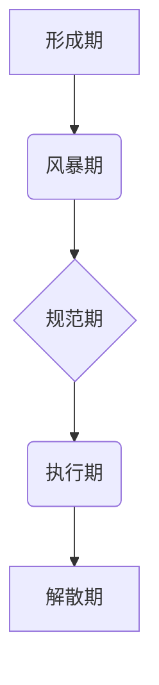

                 

## 用福格模型打造高效团队

> 关键词：福格模型，团队建设，高效团队，沟通协作，组织架构，软件开发，项目管理

### 1. 背景介绍

在当今快速发展的科技时代，团队合作已成为企业成功的重要驱动力。高效的团队能够快速响应市场变化，创新产品和服务，最终实现商业目标。然而，构建高效团队并非易事，需要精心设计团队结构、明确职责分工、建立良好的沟通机制以及营造积极的团队氛围。

福格模型（Tuckman's Stages of Group Development）是一个经典的团队发展模型，它描述了团队从形成到成熟的五个阶段：

* **形成期 (Forming):** 团队成员刚开始接触，彼此陌生，处于试探阶段，需要建立信任和了解彼此。
* **风暴期 (Storming):** 团队成员开始表达自己的观点和想法，可能会出现冲突和争论，但也是团队凝聚力和团队精神逐渐形成的阶段。
* **规范期 (Norming):** 团队成员逐渐达成共识，建立了共同的价值观和行为规范，团队合作开始更加顺畅。
* **执行期 (Performing):** 团队进入高效运作阶段，成员之间默契配合，能够有效完成任务目标。
* **解散期 (Adjourning):** 团队完成任务目标后，可能会解散或进入新的发展阶段。

福格模型为我们理解团队发展提供了清晰的框架，也为团队建设提供了重要的指导。

### 2. 核心概念与联系

福格模型的核心概念是团队发展是一个循序渐进的过程，每个阶段都有其独特的特点和挑战。团队需要经历五个阶段才能最终达到高效运作的状态。

**福格模型流程图**

### 3. 核心算法原理 & 具体操作步骤

福格模型本身并非一个算法，而是描述团队发展阶段的模型。然而，我们可以将其应用于团队建设的实践中，并将其与其他管理工具和方法结合起来，以提高团队效率。

**3.1 算法原理概述**

福格模型的应用原理在于：

* **了解团队发展阶段:** 通过观察团队的行为和动态，识别团队处于哪个阶段，并针对不同的阶段采取相应的策略。
* **引导团队发展:** 领导者需要积极引导团队成员，帮助他们克服每个阶段的挑战，并顺利进入下一个阶段。
* **营造积极的团队氛围:** 鼓励团队成员之间的沟通和协作，建立信任和尊重，营造积极向上的团队氛围。

**3.2 算法步骤详解**

1. **识别团队阶段:** 通过观察团队成员之间的互动、沟通方式、决策过程等，判断团队处于哪个阶段。
2. **制定阶段性策略:** 根据团队阶段的特点，制定相应的策略。例如，在形成期，需要注重团队成员之间的了解和信任建立；在风暴期，需要引导团队成员理性表达意见，化解冲突；在规范期，需要明确团队目标和职责分工；在执行期，需要关注团队绩效和持续改进。
3. **实施策略:** 领导者需要积极行动，实施相应的策略，并及时调整策略，以适应团队的发展变化。
4. **评估效果:** 定期评估团队发展情况，并根据评估结果调整策略，不断优化团队建设工作。

**3.3 算法优缺点**

* **优点:** 
    * 易于理解和应用。
    * 提供了团队发展阶段的清晰框架。
    * 可以帮助领导者更好地理解团队成员的行为和动态。
* **缺点:** 
    * 模型过于简单，无法完全涵盖团队发展的复杂性。
    * 每个团队的發展速度和阶段特征可能不同。
    * 模型缺乏具体的指导性，需要结合实际情况进行调整。

**3.4 算法应用领域**

福格模型广泛应用于团队建设、项目管理、组织发展等领域。

* **软件开发:** 帮助软件开发团队更好地协作，提高开发效率。
* **项目管理:** 帮助项目经理更好地管理项目团队，提高项目成功率。
* **组织发展:** 帮助组织领导者更好地理解团队发展规律，促进组织发展。

### 4. 数学模型和公式 & 详细讲解 & 举例说明

福格模型本身并非一个数学模型，它是一个描述团队发展阶段的阶段性模型。

### 5. 项目实践：代码实例和详细解释说明

由于福格模型本身不是一个算法，因此没有具体的代码实例。但是，我们可以将其应用于软件开发项目中，例如：

* **团队成员分配:** 根据团队阶段的特点，合理分配团队成员的职责和任务。
* **沟通机制:** 建立有效的沟通机制，及时解决团队成员之间的问题和冲突。
* **进度管理:** 制定合理的进度计划，并根据团队发展阶段进行调整。

### 6. 实际应用场景

福格模型在实际应用场景中可以帮助团队更好地理解自身发展阶段，并采取相应的策略来提高团队效率。

* **创业团队:** 初期创业团队成员之间可能相互陌生，需要通过福格模型的引导，建立信任和了解彼此，并逐步形成团队凝聚力。
* **软件开发团队:** 软件开发项目通常需要经历多个阶段，例如需求分析、设计、开发、测试、部署等。福格模型可以帮助团队成员更好地理解每个阶段的特点，并进行有效的协作。
* **跨部门团队:** 跨部门团队成员来自不同的部门，可能存在不同的工作习惯和思维方式。福格模型可以帮助团队成员更好地理解彼此，并建立有效的沟通机制。

### 7. 工具和资源推荐

* **学习资源推荐:**
    * Tuckman's Stages of Group Development: https://en.wikipedia.org/wiki/Tuckman%27s_stages_of_group_development
    * The Five Stages of Team Development: https://www.mindtools.com/pages/article/newLDR_82.htm
* **开发工具推荐:**
    * 团队协作工具：如 Jira, Asana, Trello 等
    * 沟通协作工具：如 Slack, Microsoft Teams 等
* **相关论文推荐:**
    * Tuckman, B. W. (1965). Developmental sequence in small groups. Psychological Bulletin, 63(6), 384-399.

### 8. 总结：未来发展趋势与挑战

福格模型是一个经典的团队发展模型，它为我们理解团队发展提供了重要的框架和指导。随着科技发展和社会变革，团队的组成和工作方式也在不断变化，福格模型也需要不断完善和发展。

**8.1 研究成果总结**

福格模型的研究成果表明，团队发展是一个循序渐进的过程，每个阶段都有其独特的特点和挑战。团队需要经历五个阶段才能最终达到高效运作的状态。

**8.2 未来发展趋势**

未来，福格模型的研究将更加注重以下几个方面：

* **个性化团队发展:** 考虑团队成员的个性差异，制定更加个性化的团队发展策略。
* **虚拟团队发展:** 研究虚拟团队的独特特点，并提出相应的团队发展模型。
* **跨文化团队发展:** 研究跨文化团队的沟通和协作模式，并提出相应的团队发展策略。

**8.3 面临的挑战**

福格模型的应用也面临一些挑战：

* **模型的局限性:** 福格模型过于简单，无法完全涵盖团队发展的复杂性。
* **团队成员的参与度:** 模型的应用需要团队成员的积极参与和配合。
* **文化差异:** 不同文化背景的团队成员可能对福格模型的理解和应用存在差异。

**8.4 研究展望**

未来，我们将继续研究福格模型，并将其与其他管理工具和方法结合起来，以更好地帮助团队提高效率和达成目标。

### 9. 附录：常见问题与解答

* **问题:** 如何判断团队处于哪个阶段？
* **解答:** 可以通过观察团队成员之间的互动、沟通方式、决策过程等，判断团队处于哪个阶段。

* **问题:** 如何引导团队进入下一个阶段？
* **解答:** 领导者需要积极行动，实施相应的策略，并及时调整策略，以适应团队的发展变化。

* **问题:** 福格模型适用于所有类型的团队吗？
* **解答:** 福格模型是一个通用的团队发展模型，但需要根据实际情况进行调整。

作者：禅与计算机程序设计艺术 / Zen and the Art of Computer Programming 
<end_of_turn>

