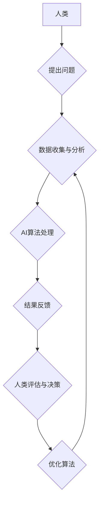

                 

## 科技向善的力量：利用人类计算造福人类

> 关键词： 人类计算、人工智能、分布式计算、协同智能、科技伦理、社会影响、可持续发展

### 1. 背景介绍

科技发展日新月异，人工智能（AI）作为科技发展的重要方向，正在深刻地改变着我们的生活。从自动驾驶到医疗诊断，从个性化教育到智能客服，AI技术的应用场景日益广泛。然而，随着AI技术的快速发展，也引发了人们对AI伦理、社会影响等问题的担忧。如何确保AI技术向善，造福人类，成为一个亟待解决的课题。

人类计算，作为一种新型的计算模式，以其独特的优势，为AI技术向善提供了新的思路和方向。人类计算是指利用人类的智慧、经验和创造力，与计算机协同工作，共同完成复杂的任务。这种模式打破了传统计算机的局限性，将人类的智能融入到计算过程中，从而提升了计算的效率、准确性和创造力。

### 2. 核心概念与联系

#### 2.1 人类计算的本质

人类计算的核心在于将人类的智慧和计算机的计算能力相结合，形成一种协同智能的模式。它强调人类的参与和决策，将人类的经验和直觉融入到计算过程中，从而弥补计算机在理解复杂问题、进行创造性思考等方面的不足。

#### 2.2 人类计算与AI的协同

人类计算与AI技术可以相互补充，共同推动科技进步。AI技术可以提供强大的数据处理和分析能力，帮助人类快速获取信息和洞察问题；而人类的智慧和经验可以指导AI算法的设计和优化，赋予AI更强的理解力和决策能力。

**Mermaid 流程图**



### 3. 核心算法原理 & 具体操作步骤

#### 3.1 算法原理概述

人类计算的核心算法原理是基于人类认知和决策模式的模拟。这些算法通常采用启发式搜索、群体智能、机器学习等方法，模拟人类的思维过程，并通过反馈机制不断优化算法，提高计算效率和准确性。

#### 3.2 算法步骤详解

1. **问题定义:** 明确人类计算的目标和任务，并将其转化为计算机可理解的格式。
2. **数据收集:** 收集与任务相关的各种数据，包括文本、图像、音频等。
3. **数据预处理:** 对收集到的数据进行清洗、转换和格式化，使其能够被算法处理。
4. **算法选择:** 根据任务的特点选择合适的算法，例如启发式搜索、群体智能、机器学习等。
5. **模型训练:** 利用训练数据训练算法模型，使其能够学习任务相关的知识和规律。
6. **结果评估:** 对算法模型的输出结果进行评估，并根据评估结果进行算法优化。
7. **迭代优化:** 重复上述步骤，不断优化算法模型，提高计算效率和准确性。

#### 3.3 算法优缺点

**优点:**

* 能够解决传统计算机难以处理的复杂问题，例如需要人类判断和决策的任务。
* 能够利用人类的智慧和经验，提高计算的准确性和创造力。
* 能够促进人类与计算机之间的协同，提升整体的计算能力。

**缺点:**

* 计算效率相对较低，需要大量的人力投入。
* 算法的可靠性和可重复性需要进一步提高。
* 存在伦理和社会影响等问题，需要谨慎对待。

#### 3.4 算法应用领域

* **科学研究:** 协助科学家进行复杂数据分析、模型构建和实验设计。
* **医疗诊断:** 辅助医生进行疾病诊断、治疗方案制定和药物研发。
* **金融分析:** 帮助金融机构进行风险评估、投资决策和欺诈检测。
* **教育教学:** 提供个性化学习方案、智能辅导和知识评估。
* **艺术创作:** 辅助艺术家进行创意灵感激发、作品创作和艺术风格探索。

### 4. 数学模型和公式 & 详细讲解 & 举例说明

#### 4.1 数学模型构建

人类计算的数学模型通常基于概率论、统计学和信息论等学科。这些模型试图量化人类的认知过程、决策机制和知识表达方式，并将其转化为计算机可处理的数学公式。

#### 4.2 公式推导过程

例如，在群体智能算法中，可以使用贝叶斯理论推导个体决策的概率分布，并通过群体决策机制来获得最终的解决方案。

$$P(x|y) = \frac{P(y|x)P(x)}{P(y)}$$

其中：

* $P(x|y)$ 是给定条件 $y$ 下事件 $x$ 发生的概率。
* $P(y|x)$ 是给定事件 $x$ 下事件 $y$ 发生的概率。
* $P(x)$ 是事件 $x$ 发生的概率。
* $P(y)$ 是事件 $y$ 发生的概率。

#### 4.3 案例分析与讲解

在医疗诊断领域，可以使用贝叶斯网络模型来模拟医生对患者症状的判断和诊断决策。通过收集患者的病史、体征和实验室检查结果，并根据这些信息的概率关系，贝叶斯网络可以计算出患者患特定疾病的概率，并辅助医生做出诊断决策。

### 5. 项目实践：代码实例和详细解释说明

#### 5.1 开发环境搭建

* 操作系统：Linux/macOS/Windows
* 编程语言：Python
* 库依赖：NumPy、Pandas、Scikit-learn等

#### 5.2 源代码详细实现

```python
# 导入必要的库
import numpy as np
from sklearn.linear_model import LogisticRegression

# 加载训练数据
data = np.loadtxt("data.csv", delimiter=",")
X = data[:, :-1]
y = data[:, -1]

# 创建LogisticRegression模型
model = LogisticRegression()

# 训练模型
model.fit(X, y)

# 使用模型预测新数据
new_data = np.array([[1, 2, 3]])
prediction = model.predict(new_data)

# 打印预测结果
print(prediction)
```

#### 5.3 代码解读与分析

这段代码实现了简单的机器学习模型训练和预测。首先，导入必要的库，然后加载训练数据。接着，创建LogisticRegression模型，并使用训练数据训练模型。最后，使用训练好的模型预测新数据，并打印预测结果。

#### 5.4 运行结果展示

运行结果将显示预测新数据的类别标签。例如，如果预测结果为1，则表示新数据属于类别1。

### 6. 实际应用场景

#### 6.1 人工智能辅助医疗诊断

人类计算可以帮助医生更快、更准确地诊断疾病。例如，可以利用人类专家对疾病的知识和经验，训练机器学习模型，识别病人的影像学特征，辅助医生进行诊断。

#### 6.2 智能客服系统

人类计算可以提高智能客服系统的响应速度和准确性。例如，可以利用人类专家对常见问题的解答，训练聊天机器人，帮助用户解决问题。

#### 6.3 个性化教育

人类计算可以提供个性化的学习方案，帮助学生更好地掌握知识。例如，可以利用学生的学习进度和知识掌握情况，推荐个性化的学习资源和练习题。

#### 6.4 未来应用展望

随着人工智能技术的不断发展，人类计算将在更多领域得到应用，例如：

* **科学发现:** 协助科学家进行复杂数据分析，加速科学发现。
* **创意设计:** 辅助设计师进行创意灵感激发，提升设计效率。
* **社会治理:** 帮助政府部门进行决策分析，提高社会治理效率。

### 7. 工具和资源推荐

#### 7.1 学习资源推荐

* **书籍:**《人类计算：人工智能与人类智慧的协同》
* **在线课程:** Coursera、edX等平台上的人工智能和机器学习课程。
* **研究机构:** 人工智能研究机构的网站和期刊，例如OpenAI、DeepMind、MIT人工智能实验室等。

#### 7.2 开发工具推荐

* **编程语言:** Python、Java、C++等。
* **机器学习库:** TensorFlow、PyTorch、Scikit-learn等。
* **云计算平台:** AWS、Azure、Google Cloud等。

#### 7.3 相关论文推荐

* **人类计算的定义和分类**
* **人类计算算法原理和应用**
* **人类计算的伦理和社会影响**

### 8. 总结：未来发展趋势与挑战

#### 8.1 研究成果总结

人类计算作为一种新型的计算模式，在解决复杂问题、提升计算效率和创造力方面展现出巨大的潜力。

#### 8.2 未来发展趋势

未来，人类计算将朝着以下方向发展：

* **更智能的算法:** 开发更智能、更灵活、更适应人类认知模式的算法。
* **更广泛的应用场景:** 将人类计算应用于更多领域，例如科学研究、医疗诊断、教育教学等。
* **更强的协同能力:** 增强人类与计算机之间的协同能力，形成更强大的计算能力。

#### 8.3 面临的挑战

人类计算也面临着一些挑战：

* **算法的可靠性和可重复性:** 需要进一步提高算法的可靠性和可重复性，确保计算结果的准确性和稳定性。
* **伦理和社会影响:** 需要认真考虑人类计算的伦理和社会影响，确保其安全、公平和可持续发展。
* **技术普及和应用推广:** 需要推动人类计算技术的普及和应用推广，使其真正造福人类。

#### 8.4 研究展望

未来，我们将继续致力于人类计算的研究和发展，探索其更深层次的潜力，并将其应用于更多领域，为人类社会创造更大的价值。

### 9. 附录：常见问题与解答

**Q1: 人类计算与传统计算有什么区别？**

**A1:** 传统计算依赖于计算机的算法和数据处理能力，而人类计算则将人类的智慧和经验融入到计算过程中，形成一种协同智能的模式。

**Q2: 人类计算的应用场景有哪些？**

**A2:** 人类计算的应用场景非常广泛，例如医疗诊断、智能客服、个性化教育、科学研究等。

**Q3: 人类计算面临哪些挑战？**

**A3:** 人类计算面临着算法的可靠性和可重复性、伦理和社会影响、技术普及和应用推广等挑战。


作者：禅与计算机程序设计艺术 / Zen and the Art of Computer Programming 
<end_of_turn>

