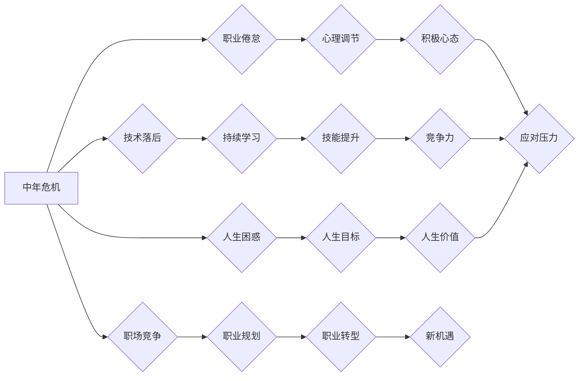

                 

## 程序员如何应对中年职场危机

> 关键词：中年危机、程序员、职场转型、技能提升、学习方法、心理调节、职业规划、技术趋势、未来发展

## 1. 背景介绍

在当今科技飞速发展的时代，程序员这个职业群体的需求量持续增长，但同时也面临着前所未有的挑战。随着年龄的增长，程序员们往往会经历一段被称为“中年危机”的阶段。这种危机可能源于多种因素，例如：

* **技术落后:**  软件开发技术日新月异，如果程序员没有持续学习，很容易被淘汰。
* **职业倦怠:** 长期从事重复性的工作，可能会导致程序员感到疲惫和缺乏动力。
* **职场竞争:**  年轻程序员的涌入，加剧了职场竞争，让中年程序员感到压力。
* **人生困惑:**  中年时期是人生的重要阶段，程序员们可能会对自己的职业发展和人生目标产生疑问。

这些因素共同作用，使得中年程序员面临着职业发展瓶颈、心理压力和人生迷茫等问题。

## 2. 核心概念与联系

中年危机是一个普遍存在的现象，它不仅限于程序员这个职业群体，也出现在其他行业。 

**核心概念：**

* **职业生涯阶段:**  人们的职业生涯可以分为多个阶段，每个阶段都有其特点和挑战。中年时期通常是职业生涯的转折点，需要进行调整和规划。
* **学习能力:**  在快速变化的科技时代，持续学习和提升技能是保持竞争力的关键。
* **心理韧性:**  面对压力和挑战，保持积极的心态和良好的心理调节能力至关重要。
* **职业规划:**  明确自己的职业目标和发展方向，制定合理的职业规划，可以帮助程序员更好地应对中年危机。

**Mermaid 流程图：**



## 3. 核心算法原理 & 具体操作步骤

**3.1  算法原理概述**

应对中年危机，需要程序员们像学习新的算法一样，采用系统化的方法进行自我提升和职业转型。 

**3.2  算法步骤详解**

1. **自我评估:**  程序员需要认真评估自己的技术水平、职业经验、兴趣爱好和个人价值观。
2. **技术栈更新:**  关注最新的技术趋势，学习新语言、框架和工具，不断更新自己的技术栈。
3. **技能拓展:**  除了编程技能，还需要拓展其他方面的技能，例如沟通能力、团队合作能力、项目管理能力等。
4. **职业规划:**  根据自己的兴趣和能力，制定合理的职业规划，明确未来的发展方向。
5. **实践应用:**  将学习到的知识和技能应用到实际项目中，不断积累经验和提升能力。
6. **网络交流:**  积极参加技术社区和线上线下活动，与其他程序员交流学习，拓展人脉资源。
7. **心理调节:**  保持积极的心态，相信自己能够克服困难，实现职业目标。

**3.3  算法优缺点**

* **优点:**  系统化、可操作、效果显著。
* **缺点:**  需要付出时间和精力，需要克服学习和心理上的挑战。

**3.4  算法应用领域**

该算法适用于所有想要应对中年危机、提升职业竞争力的程序员。

## 4. 数学模型和公式 & 详细讲解 & 举例说明

**4.1  数学模型构建**

我们可以用一个简单的数学模型来描述程序员的职业发展：

```latex
Career_Growth = f(Technical_Skill, Soft_Skill, Experience, Learning_Rate)
```

其中：

* **Career_Growth:**  职业发展水平
* **Technical_Skill:**  技术技能水平
* **Soft_Skill:**  软技能水平
* **Experience:**  工作经验
* **Learning_Rate:**  学习速度

**4.2  公式推导过程**

这个模型表明，程序员的职业发展水平取决于技术技能、软技能、工作经验和学习速度的综合作用。

* **技术技能:**  是程序员的核心竞争力，高水平的技术技能可以带来更高的薪资和更广阔的职业发展空间。
* **软技能:**  例如沟通能力、团队合作能力、领导能力等，也是程序员职业发展的重要因素。
* **工作经验:**  积累经验可以帮助程序员更好地理解工作流程、解决问题和提升工作效率。
* **学习速度:**  在快速变化的科技时代，持续学习和提升技能是保持竞争力的关键。

**4.3  案例分析与讲解**

假设有两个程序员，A和B，他们的技术技能水平相近，但A的学习速度更快，B的工作经验更丰富。根据上述模型，我们可以推断：

* A的Career_Growth可能更快，因为其学习速度可以帮助其更快地掌握新的技术和技能。
* B的Career_Growth可能更稳定，因为其丰富的经验可以帮助其更好地应对工作挑战。

## 5. 项目实践：代码实例和详细解释说明

**5.1  开发环境搭建**

为了更好地理解和实践上述算法，我们可以选择一个具体的项目进行开发，例如构建一个简单的在线学习平台。

**5.2  源代码详细实现**

由于篇幅限制，这里只提供部分代码示例，具体实现细节可以参考开源项目或相关教程。

```python
# 用户注册功能

def register_user(username, password):
    # 校验用户名和密码
    # ...
    # 将用户信息存储到数据库
    # ...
    return True  # 注册成功

# 登录功能

def login_user(username, password):
    # 从数据库查询用户信息
    # ...
    # 校验密码
    # ...
    return True  # 登录成功

```

**5.3  代码解读与分析**

这段代码实现了用户注册和登录的功能。

* `register_user()` 函数负责处理用户注册请求，包括用户名和密码的校验以及用户信息的存储。
* `login_user()` 函数负责处理用户登录请求，包括用户信息的查询和密码的校验。

**5.4  运行结果展示**

运行上述代码后，可以创建一个简单的在线学习平台，用户可以注册账号、登录系统并访问学习资源。

## 6. 实际应用场景

**6.1  职场转型**

中年程序员可以通过学习新技术、拓展技能和制定职业规划，实现职场转型，进入新的领域或岗位。

**6.2  创业机会**

中年程序员积累了丰富的经验和人脉资源，可以利用这些优势创业，开发自己的软件产品或服务。

**6.3  个人成长**

应对中年危机，不仅可以帮助程序员提升职业竞争力，还可以促进个人成长，获得新的成就感和人生价值。

**6.4  未来应用展望**

随着人工智能、大数据等技术的快速发展，程序员的需求将更加多元化，中年程序员需要不断学习和适应新的技术趋势，才能保持竞争力。

## 7. 工具和资源推荐

**7.1  学习资源推荐**

* **在线学习平台:**  Coursera、edX、Udemy等
* **技术博客:**  Hacker News、Medium、Stack Overflow等
* **开源项目:**  GitHub、GitLab等

**7.2  开发工具推荐**

* **代码编辑器:**  VS Code、Sublime Text、Atom等
* **版本控制系统:**  Git、SVN等
* **云平台:**  AWS、Azure、GCP等

**7.3  相关论文推荐**

* **程序员职业生涯发展研究**
* **中年危机应对策略**
* **技术学习方法研究**

## 8. 总结：未来发展趋势与挑战

**8.1  研究成果总结**

通过对程序员中年危机进行分析，我们发现，持续学习、技能拓展、职业规划和心理调节是应对中年危机的关键。

**8.2  未来发展趋势**

未来，程序员职业发展将更加注重综合能力和跨领域合作，需要具备更强的学习能力、适应能力和创新能力。

**8.3  面临的挑战**

程序员面临着技术更新迭代快、竞争加剧、职业倦怠等挑战，需要不断提升自身素质和能力，才能在未来发展中保持竞争力。

**8.4  研究展望**

未来研究可以进一步探讨程序员中年危机的心理机制、应对策略和职业发展路径，为程序员提供更有效的指导和支持。

## 9. 附录：常见问题与解答

**9.1  Q: 如何才能保持学习的动力？**

**A:**  可以尝试以下方法：

* **设定明确的目标:**  明确学习的目标，可以提高学习的动力和效率。
* **找到学习的乐趣:**  选择自己感兴趣的领域学习，可以保持学习的兴趣和热情。
* **与他人交流学习:**  加入学习小组或社区，与他人交流学习经验，可以互相鼓励和支持。

**9.2  Q: 如何应对职场竞争？**

**A:**  可以尝试以下方法：

* **提升自身技能:**  不断学习新技术，提升自身竞争力。
* **拓展人脉资源:**  积极参加行业活动，拓展人脉资源。
* **保持积极的心态:**  相信自己能够克服困难，实现职业目标。


作者：禅与计算机程序设计艺术 / Zen and the Art of Computer Programming 
<end_of_turn>

