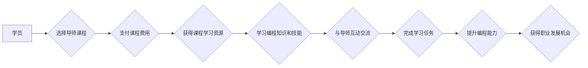

                 

## 程序员知识付费：打造导师课程

> 关键词：程序员知识付费、导师课程、在线教育、技术分享、课程设计、教学方法、社区建设、知识体系

### 1. 背景介绍

在当今科技飞速发展的时代，程序员的需求量持续增长，而优质的编程教育资源也日益稀缺。传统的教育模式难以满足程序员快速学习和提升技能的需求。知识付费模式的兴起为程序员提供了新的学习途径，导师课程作为一种新型的知识付费模式，凭借其个性化指导、实战经验分享和紧跟行业趋势的特点，逐渐成为程序员学习的首选。

### 2. 核心概念与联系

**2.1 导师课程的概念**

导师课程是一种以导师为核心，通过线上平台提供一对一或小班制的编程教学模式。导师课程通常由经验丰富的程序员或技术专家担任导师，他们不仅会传授编程知识和技能，还会根据学员的实际情况提供个性化的指导和建议，帮助学员解决学习中的难题，并提升编程能力。

**2.2 知识付费模式**

知识付费模式是指通过付费的方式获取知识和技能的商业模式。在互联网时代，知识付费模式得到了快速发展，涵盖了各种领域，包括编程教育、商业管理、艺术创作等。程序员知识付费主要通过以下几种方式进行：

* **在线课程:** 提供录制的视频课程、课件资料和练习题，学员可以根据自己的时间安排进行学习。
* **直播课程:** 实时在线进行教学，学员可以与导师互动，提出问题并获得即时的解答。
* **一对一辅导:** 提供一对一的个性化指导，导师会根据学员的学习进度和需求制定专属学习计划。
* **会员体系:** 提供付费会员服务，会员可以获得更丰富的学习资源、专属导师答疑和社区交流等权益。

**2.3 导师课程与知识付费模式的联系**

导师课程是知识付费模式在编程教育领域的应用。通过导师课程，学员可以付费获取编程知识和技能，并获得导师的个性化指导和支持。

**2.4 导师课程的优势**

* **个性化指导:** 导师可以根据学员的学习进度和需求提供个性化的指导，帮助学员克服学习困难，更快地掌握编程知识。
* **实战经验分享:** 导师通常拥有丰富的实战经验，可以分享他们在实际项目中遇到的问题和解决方案，帮助学员更好地理解和应用编程知识。
* **紧跟行业趋势:** 导师课程通常会紧跟行业发展趋势，教授最新的编程技术和工具，帮助学员保持竞争力。
* **社区交流:** 导师课程通常会建立学员社区，方便学员之间交流学习经验，互相帮助，共同进步。

**2.5 导师课程的挑战**

* **导师质量:** 导师课程的质量取决于导师的水平和经验。如何筛选和培养优秀的导师是导师课程发展面临的挑战。
* **课程内容:** 课程内容需要不断更新和迭代，以满足学员不断变化的需求。
* **学员管理:** 如何有效管理学员，确保他们能够按时完成学习任务，并获得良好的学习效果也是一个挑战。
* **商业模式:** 如何建立可持续的商业模式，保证导师课程的盈利能力也是一个重要的挑战。

**2.6 导师课程的未来发展趋势**

* **人工智能辅助教学:** 利用人工智能技术，为学员提供个性化的学习建议和反馈，提高学习效率。
* **虚拟现实/增强现实技术应用:** 利用虚拟现实和增强现实技术，打造更加沉浸式的学习体验。
* **跨平台学习:** 导师课程将更加注重跨平台学习，方便学员在不同设备上进行学习。
* **社区化学习:** 导师课程将更加注重社区化学习，鼓励学员之间互相交流和合作。

**Mermaid 流程图**

### 3. 核心算法原理 & 具体操作步骤

**3.1 算法原理概述**

在导师课程中，算法原理是构建课程内容的基础。不同的课程类型，例如数据结构与算法、机器学习、软件工程等，需要掌握不同的算法原理。

**3.2 算法步骤详解**

算法步骤详解需要根据具体的算法类型进行描述。例如，对于排序算法，可以详细介绍冒泡排序、插入排序、快速排序等算法的步骤，并分析其时间复杂度和空间复杂度。

**3.3 算法优缺点**

算法优缺点需要根据具体的算法类型进行分析。例如，冒泡排序的优点是简单易懂，缺点是效率较低；快速排序的优点是效率较高，缺点是时间复杂度不稳定。

**3.4 算法应用领域**

算法应用领域需要根据具体的算法类型进行描述。例如，排序算法广泛应用于数据处理、搜索引擎、数据库等领域；搜索算法应用于搜索引擎、信息检索等领域。

### 4. 数学模型和公式 & 详细讲解 & 举例说明

**4.1 数学模型构建**

数学模型是描述算法逻辑和性能的工具。例如，时间复杂度可以用大O符号来表示，空间复杂度可以用函数来表示。

**4.2 公式推导过程**

公式推导过程需要根据具体的算法类型进行描述。例如，快速排序的时间复杂度公式推导过程需要用到概率论和组合数学的知识。

**4.3 案例分析与讲解**

案例分析与讲解需要结合具体的算法类型和应用场景，分析算法的性能和效率。例如，可以分析快速排序在不同数据规模下的性能表现，并与其他排序算法进行比较。

**4.4 数学公式示例**

* **时间复杂度:**  O(n log n)
* **空间复杂度:** O(n)

**举例说明:**

快速排序的时间复杂度为 O(n log n)，空间复杂度为 O(log n)。

### 5. 项目实践：代码实例和详细解释说明

**5.1 开发环境搭建**

开发环境搭建需要根据具体的编程语言和项目需求进行配置。例如，Python 项目需要安装 Python 解释器和相关库；Java 项目需要安装 JDK 和 IDE。

**5.2 源代码详细实现**

源代码详细实现需要根据具体的算法类型和项目需求进行编写。例如，实现快速排序算法需要编写代码进行数据划分、递归排序和合并操作。

**5.3 代码解读与分析**

代码解读与分析需要解释代码的逻辑结构、算法实现细节和性能特点。例如，可以分析快速排序算法的代码实现，解释其如何进行数据划分、递归排序和合并操作，以及其时间复杂度和空间复杂度。

**5.4 运行结果展示**

运行结果展示需要展示算法的运行效果，例如排序后的数据序列、算法执行时间等。

### 6. 实际应用场景

**6.1 实际应用场景介绍**

导师课程的实际应用场景广泛，例如：

* **企业培训:** 企业可以利用导师课程培训员工，提升员工的编程技能和工作效率。
* **个人学习:** 个人可以利用导师课程学习新的编程技术，提升自身的职业竞争力。
* **教育机构:** 教育机构可以利用导师课程提供编程教育服务，培养更多优秀的程序员人才。

**6.2 案例分析**

可以介绍一些导师课程的成功案例，例如：

* 一家互联网公司利用导师课程培训员工，提升了员工的编程技能，并成功开发了一款新的产品。
* 一位个人利用导师课程学习了新的编程技术，成功找到了新的工作机会。

**6.3 未来应用展望**

导师课程的未来应用前景广阔，例如：

* **人工智能辅助教学:** 利用人工智能技术，为学员提供个性化的学习建议和反馈，提高学习效率。
* **虚拟现实/增强现实技术应用:** 利用虚拟现实和增强现实技术，打造更加沉浸式的学习体验。
* **跨平台学习:** 导师课程将更加注重跨平台学习，方便学员在不同设备上进行学习。
* **社区化学习:** 导师课程将更加注重社区化学习，鼓励学员之间互相交流和合作。

### 7. 工具和资源推荐

**7.1 学习资源推荐**

* **在线学习平台:** Coursera, Udemy, edX, Udacity
* **编程书籍:** 《编程之美》、《算法导论》、《深入理解计算机系统》
* **开源项目:** GitHub, GitLab

**7.2 开发工具推荐**

* **代码编辑器:** VS Code, Sublime Text, Atom
* **调试工具:** GDB, LLDB
* **版本控制系统:** Git

**7.3 相关论文推荐**

* **算法导论:** Cormen, Leiserson, Rivest, Stein
* **计算机网络:** Kurose, Ross
* **数据库系统:** Ramakrishnan, Gehrke

### 8. 总结：未来发展趋势与挑战

**8.1 研究成果总结**

导师课程作为一种新型的知识付费模式，在编程教育领域取得了显著的成果。它为程序员提供了个性化指导、实战经验分享和紧跟行业趋势的学习机会，有效提升了程序员的学习效率和编程能力。

**8.2 未来发展趋势**

导师课程的未来发展趋势将更加注重人工智能辅助教学、虚拟现实/增强现实技术应用、跨平台学习和社区化学习。

**8.3 面临的挑战**

导师课程的发展还面临着一些挑战，例如：

* **导师质量:** 如何筛选和培养优秀的导师是导师课程发展面临的挑战。
* **课程内容:** 课程内容需要不断更新和迭代，以满足学员不断变化的需求。
* **学员管理:** 如何有效管理学员，确保他们能够按时完成学习任务，并获得良好的学习效果也是一个挑战。
* **商业模式:** 如何建立可持续的商业模式，保证导师课程的盈利能力也是一个重要的挑战。

**8.4 研究展望**

未来研究将重点关注以下几个方面：

* **人工智能辅助教学:** 如何利用人工智能技术，为学员提供更加个性化和智能化的学习体验。
* **虚拟现实/增强现实技术应用:** 如何利用虚拟现实和增强现实技术，打造更加沉浸式的学习体验，提高学员的学习兴趣和效果。
* **跨平台学习:** 如何构建更加灵活和便捷的跨平台学习环境，方便学员在不同设备上进行学习。
* **社区化学习:** 如何构建更加活跃和有效的学习社区，鼓励学员之间互相交流和合作，共同进步。

### 9. 附录：常见问题与解答

**9.1 常见问题**

* 如何选择合适的导师课程？
* 导师课程的学习效果如何？
* 导师课程的费用是多少？
* 如何与导师进行互动交流？

**9.2 常见问题解答**

* 选择导师课程时，需要考虑导师的经验、教学风格、课程内容和学员评价等因素。
* 导师课程的学习效果取决于学员的学习态度、学习方法和学习时间。
* 导师课程的费用因课程类型、导师水平和学习时长而异。
* 导师课程通常提供线上交流平台，学员可以与导师通过文字、语音或视频进行互动交流。

作者：禅与计算机程序设计艺术 / Zen and the Art of Computer Programming 
<end_of_turn>

