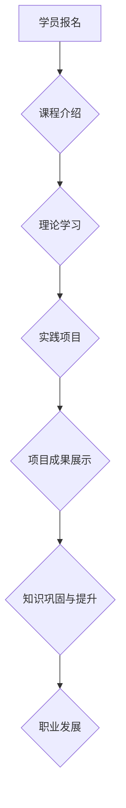

                 

## 程序员知识付费：打造项目制课程

> 关键词：知识付费、程序员、项目制课程、在线教育、技术技能、实践项目、课程设计

### 1. 背景介绍

在当今数字化时代，技术人才需求量持续增长，程序员作为科技发展的重要力量，其技能和知识价值日益凸显。知识付费作为一种新型的教育模式，在技术领域迅速发展，为程序员提供了一种高效便捷的学习途径。然而，传统的在线课程模式往往存在着理论性过强、缺乏实践操作、难以提升实际应用能力等问题。

为了更好地满足程序员的学习需求，项目制课程应运而生。项目制课程以实际项目为核心，将理论知识与实践操作紧密结合，让学员在完成项目的过程中学习和提升技术技能。这种模式能够有效解决传统课程的不足，更贴近实际工作场景，帮助学员快速掌握核心技能，提升实战能力。

### 2. 核心概念与联系

**2.1 项目制课程的核心概念**

项目制课程是一种以项目为导向的学习模式，学员通过参与真实项目开发，学习和实践相关技术知识。其核心特点包括：

* **实践导向:**  课程内容以实际项目为基础，学员通过动手操作，解决实际问题，提升实践能力。
* **团队合作:** 项目开发通常需要团队协作，学员能够在项目中学习团队合作、沟通协作等软技能。
* **循序渐进:** 项目通常分阶段开发，学员能够逐步深入学习，掌握更复杂的技术知识。
* **成果导向:** 项目开发最终会产生可交付成果，学员能够展示自己的能力，积累项目经验。

**2.2 项目制课程与传统课程的联系**

项目制课程与传统课程之间存在着密切的联系，两者共同构成了程序员知识付费体系的重要组成部分。

* **理论基础:** 项目制课程需要建立在扎实的理论基础之上，学员需要掌握相关技术知识才能有效参与项目开发。
* **实践应用:** 项目制课程将理论知识应用于实际项目，帮助学员理解和掌握知识的应用场景。
* **综合提升:** 项目制课程能够帮助学员综合提升技术技能、实践能力、团队合作能力等，为职业发展提供更全面的支持。

**2.3 项目制课程的流程图**



### 3. 核心算法原理 & 具体操作步骤

**3.1 算法原理概述**

项目制课程的核心算法原理在于将复杂的项目分解成多个模块，并通过迭代开发的方式逐步完成。每个模块都包含具体的技术任务和目标，学员需要在完成每个模块后进行测试和验证，确保项目整体的质量和稳定性。

**3.2 算法步骤详解**

1. **项目需求分析:** 首先需要对项目的整体需求进行分析，明确项目的目标、功能、技术栈等关键信息。
2. **模块化设计:** 将项目分解成多个独立的模块，每个模块负责特定的功能，并定义模块之间的接口和依赖关系。
3. **代码开发:** 每个模块的开发人员根据模块设计文档进行代码编写，并进行单元测试，确保代码的正确性和可靠性。
4. **模块集成:** 将各个模块集成在一起，并进行系统测试，确保模块之间能够正常交互，系统能够满足整体需求。
5. **项目发布:** 完成测试后，将项目发布到线上环境，并进行持续维护和更新。

**3.3 算法优缺点**

* **优点:**

    * 能够有效分解复杂项目，提高开发效率。
    * 每个模块的开发可以独立进行，提高开发人员的灵活性和协作性。
    * 能够保证项目质量，降低开发风险。

* **缺点:**

    * 需要对项目进行详细的模块化设计，需要一定的经验和技巧。
    * 模块之间的接口设计需要谨慎，避免出现依赖关系问题。
    * 需要进行多次测试和验证，增加开发时间和成本。

**3.4 算法应用领域**

项目制课程的算法原理广泛应用于软件开发、网站建设、移动应用开发等领域。

### 4. 数学模型和公式 & 详细讲解 & 举例说明

**4.1 数学模型构建**

项目制课程的进度管理可以采用甘特图模型，将项目分解成多个任务，并用时间轴表示任务的开始和结束时间。

**4.2 公式推导过程**

甘特图模型中常用的公式包括：

* **任务持续时间:**  持续时间 = 任务结束时间 - 任务开始时间
* **项目总持续时间:**  项目总持续时间 = 最大任务持续时间

**4.3 案例分析与讲解**

假设一个项目需要开发一个简单的网站，包含首页、产品页面、联系页面三个模块。

* 首页模块持续时间为 10 天
* 产品页面模块持续时间为 15 天
* 联系页面模块持续时间为 5 天

根据公式推导，项目总持续时间为 15 天。

**4.4 举例说明**

甘特图模型可以帮助项目经理清晰地了解项目进度，并及时发现潜在的风险和问题。

### 5. 项目实践：代码实例和详细解释说明

**5.1 开发环境搭建**

项目实践需要搭建相应的开发环境，包括操作系统、编程语言、开发工具等。

**5.2 源代码详细实现**

具体代码实现需要根据项目需求和技术栈进行编写，这里以一个简单的网站为例，展示部分代码片段。

```html
<!DOCTYPE html>
<html>
<head>
  <title>我的网站</title>
</head>
<body>
  <h1>欢迎来到我的网站</h1>
  <p>这是一个简单的网站示例。</p>
</body>
</html>
```

**5.3 代码解读与分析**

这段代码是一个简单的 HTML 文件，包含了网页的基本结构，包括标题、段落等元素。

**5.4 运行结果展示**

将 HTML 文件保存到本地，并使用浏览器打开，即可看到网页的运行结果。

### 6. 实际应用场景

项目制课程在实际应用场景中具有广泛的应用价值，例如：

* **企业内部培训:** 企业可以利用项目制课程培训员工，提升员工的技术技能和实践能力。
* **技术社区学习:** 技术社区可以利用项目制课程组织学习活动，帮助成员提升技术水平，并促进社区交流合作。
* **个人技能提升:** 个人可以利用项目制课程学习新的技术，并积累项目经验，为职业发展打下坚实基础。

**6.4 未来应用展望**

随着人工智能、大数据等技术的快速发展，项目制课程将更加智能化、个性化，能够更好地满足不同用户的学习需求。

### 7. 工具和资源推荐

**7.1 学习资源推荐**

* **在线学习平台:** Udemy、Coursera、edX 等平台提供丰富的项目制课程资源。
* **开源项目:** GitHub、GitLab 等平台提供大量的开源项目，可以作为学习实践的素材。
* **技术博客:** 许多技术博客会分享项目开发经验和技术技巧，可以作为学习参考。

**7.2 开发工具推荐**

* **代码编辑器:** VS Code、Sublime Text、Atom 等代码编辑器可以提高代码编写效率。
* **版本控制系统:** Git、GitHub 等版本控制系统可以帮助管理代码版本，并进行协同开发。
* **项目管理工具:** Trello、Jira 等项目管理工具可以帮助规划项目进度，并跟踪任务完成情况。

**7.3 相关论文推荐**

* **项目制学习的有效性研究**
* **项目制课程的设计与实施**
* **项目制学习与团队合作**

### 8. 总结：未来发展趋势与挑战

**8.1 研究成果总结**

项目制课程作为一种新型的教育模式，在程序员知识付费领域取得了显著的成果，能够有效提升学员的实践能力和职业竞争力。

**8.2 未来发展趋势**

未来项目制课程将朝着更加智能化、个性化、沉浸式的方向发展，并与人工智能、虚拟现实等新技术深度融合。

**8.3 面临的挑战**

项目制课程的开发和实施也面临着一些挑战，例如：

* **课程内容的更新迭代:** 技术发展日新月异，课程内容需要不断更新迭代，以满足学员不断变化的需求。
* **教学资源的整合:** 项目制课程需要整合丰富的教学资源，包括代码库、测试工具、项目案例等。
* **学员的参与度:** 项目制课程需要学员积极参与，才能达到最佳的学习效果。

**8.4 研究展望**

未来研究将重点关注项目制课程的教学方法、评估体系、平台建设等方面，以进一步提升课程的质量和效果。

### 9. 附录：常见问题与解答

**9.1 如何选择合适的项目制课程？**

选择项目制课程时，需要考虑以下因素：

* **课程内容:** 课程内容是否与自己的学习目标相符？
* **教学质量:** 课程的教学团队是否经验丰富？课程评价如何？
* **项目实践:** 课程提供的项目实践机会是否充足？项目案例是否真实可行？
* **学习成本:** 课程的费用是否合理？

**9.2 如何提高项目制课程的学习效果？**

* **积极参与:** 积极参与课程讨论，并主动提出问题。
* **认真实践:** 认真完成课程中的项目任务，并进行代码调试和测试。
* **寻求帮助:** 当遇到困难时，及时寻求老师或同学的帮助。
* **总结反思:** 完成项目后，进行总结反思，并记录学习心得。


作者：禅与计算机程序设计艺术 / Zen and the Art of Computer Programming 
<end_of_turn>

