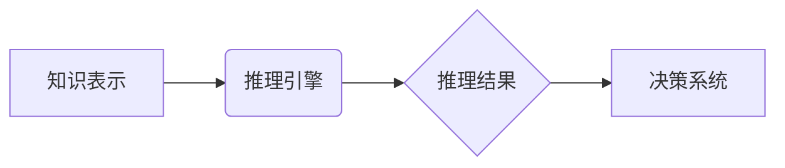

                 

## 自动推理库：AI决策系统的核心

> 关键词：自动推理、决策系统、知识表示、逻辑推理、机器学习、深度学习、AI应用

## 1. 背景介绍

在当今数据爆炸的时代，人工智能（AI）正以惊人的速度发展，并逐渐渗透到各个领域。AI决策系统作为人工智能的核心应用之一，旨在通过分析数据、学习规则并进行推理，为复杂问题提供智能决策方案。然而，构建高效、可靠的AI决策系统面临着诸多挑战，其中之一便是如何有效地进行自动推理。

自动推理是指机器能够根据已有的知识和规则，自动推导出新的结论或知识的过程。它在AI决策系统中扮演着至关重要的角色，例如：

* **知识库推理:**  AI系统可以利用知识库中的事实和规则，回答用户问题、进行诊断、预测未来趋势等。
* **决策支持:** AI系统可以根据用户输入和环境信息，进行多方案分析和比较，为用户提供最佳决策建议。
* **智能控制:** AI系统可以根据实时数据和预设目标，自动控制机器或系统行为，实现自动化决策。

传统的AI决策系统主要依赖于规则引擎或专家系统，但这些方法往往难以处理复杂、不确定性强的场景。随着机器学习和深度学习技术的进步，自动推理库开始涌现，为AI决策系统提供了更强大的推理能力。

## 2. 核心概念与联系

自动推理库的核心概念包括：

* **知识表示:**  将知识以机器可理解的形式表示，例如符号逻辑、语义网络、知识图谱等。
* **推理引擎:**  负责执行推理过程，根据知识表示和推理规则，推导出新的结论。
* **推理算法:**  用于实现推理过程的具体算法，例如前向推理、后向推理、基于图的推理等。

**自动推理库架构**



## 3. 核心算法原理 & 具体操作步骤

### 3.1  算法原理概述

自动推理算法的核心是根据已有的知识和规则，通过逻辑推导或概率计算，推导出新的结论。常见的自动推理算法包括：

* **前向推理:** 从已知事实出发，根据规则逐步推导新的结论，直到达到目标结论或无法继续推导。
* **后向推理:** 从目标结论出发，根据规则反向推导所需的前提条件，直到找到所有满足条件的事实。
* **基于图的推理:** 将知识表示为图结构，利用图论算法进行推理，例如路径查找、节点聚类等。

### 3.2  算法步骤详解

以前向推理为例，其具体操作步骤如下：

1. **知识表示:** 将知识库中的事实和规则以符号逻辑的形式表示。
2. **初始状态:** 设置初始状态，即已知的事实。
3. **规则匹配:** 扫描规则库，寻找与当前状态相匹配的规则。
4. **结论生成:** 根据匹配的规则，生成新的结论。
5. **状态更新:** 将新的结论添加到当前状态中。
6. **重复步骤3-5:** 直到达到目标结论或无法继续推导。

### 3.3  算法优缺点

**前向推理:**

* **优点:** 容易理解和实现，适用于简单规则的推理。
* **缺点:** 效率较低，难以处理复杂、庞大的知识库。

**后向推理:**

* **优点:** 能够从目标结论出发，找到满足条件的事实，适用于逆向推理问题。
* **缺点:** 算法复杂度较高，需要大量的计算资源。

**基于图的推理:**

* **优点:** 能够处理复杂、非线性关系的知识，效率较高。
* **缺点:** 需要构建复杂的图结构，算法实现较为复杂。

### 3.4  算法应用领域

自动推理算法广泛应用于以下领域：

* **自然语言处理:**  机器翻译、文本摘要、问答系统等。
* **知识管理:**  知识库构建、知识发现、知识推理等。
* **人工智能决策:**  决策支持系统、智能控制系统等。

## 4. 数学模型和公式 & 详细讲解 & 举例说明

### 4.1  数学模型构建

自动推理库通常使用逻辑推理的数学模型，例如命题逻辑、谓词逻辑等。

**命题逻辑:**

* **原子命题:**  基本命题，只能为真或假。
* **逻辑连接词:**  连接原子命题，例如“与”（∧）、“或”（∨）、“非”（¬）等。
* **公式:**  由原子命题和逻辑连接词组成的表达式。

**谓词逻辑:**

* **谓词:**  描述关系或属性的函数。
* **参数:**  谓词的输入值。
* **量词:**  用于量化变量，例如“所有”（∀）、“存在”（∃）等。
* **公式:**  由谓词、参数、量词和逻辑连接词组成的表达式。

### 4.2  公式推导过程

自动推理库利用逻辑推理规则，从已知公式推导出新的公式。常见的推理规则包括：

* ** Modus Ponens:**  若已知“如果P，则Q”，以及“P为真”，则可以推导出“Q为真”。
* ** Modus Tollens:**  若已知“如果P，则Q”，以及“Q为假”，则可以推导出“P为假”。
* **析取引入:**  若已知“P为真”或“Q为真”，则可以推导出“P为真”或“Q为真”。

### 4.3  案例分析与讲解

**例题:**

已知：

* 所有猫都是哺乳动物。
* 小明有一只猫。

推论：

* 小明的猫是哺乳动物。

**推导过程:**

1.  **前提1:** 所有猫都是哺乳动物。
2.  **前提2:** 小明有一只猫。
3.  **推理规则:** Modus Ponens
4.  **结论:** 小明的猫是哺乳动物。

## 5. 项目实践：代码实例和详细解释说明

### 5.1  开发环境搭建

自动推理库的开发环境通常包括：

* **编程语言:**  Python、Java、C++等。
* **推理引擎:**  Prolog、Jess、OpenCyc等。
* **知识表示库:**  OWL、RDF、SPARQL等。

### 5.2  源代码详细实现

以下是一个使用Python和Prolog实现简单自动推理系统的代码示例：

```python
# Python代码
import prolog

# 连接到Prolog引擎
engine = prolog.Prolog()

# 加载Prolog知识库
engine.consult("knowledge.pl")

# 查询推理结果
result = engine.query("cat(X), owns(john, X)")

# 打印结果
for solution in result:
    print(f"John owns a cat named {solution['X']}")

# Prolog知识库
# knowledge.pl
cat(fluffy).
owns(john, fluffy).
```

### 5.3  代码解读与分析

* Python代码：
    * 使用`prolog`库连接到Prolog引擎。
    * 使用`consult()`函数加载Prolog知识库文件`knowledge.pl`。
    * 使用`query()`函数查询推理结果，并打印结果。
* Prolog知识库：
    * 定义了两个事实：
        * `cat(fluffy)`: Fluffy是一只猫。
        * `owns(john, fluffy)`: John拥有Fluffy。

### 5.4  运行结果展示

运行上述代码，将输出以下结果：

```
John owns a cat named fluffy
```

## 6. 实际应用场景

自动推理库在各个领域都有广泛的应用场景：

* **医疗诊断:**  根据患者症状和病史，自动推理可能的疾病诊断。
* **金融风险评估:**  根据客户信用记录和交易行为，自动推理客户的风险等级。
* **法律推理:**  根据法律法规和案例，自动推理案件的法律结果。
* **智能客服:**  根据用户问题和知识库，自动推理用户需求并提供解决方案。

### 6.4  未来应用展望

随着人工智能技术的不断发展，自动推理库的应用场景将更加广泛，例如：

* **个性化教育:**  根据学生的学习情况，自动推理个性化学习方案。
* **自动驾驶:**  根据传感器数据和道路规则，自动推理最佳驾驶路线。
* **科学发现:**  根据实验数据和理论模型，自动推理新的科学发现。

## 7. 工具和资源推荐

### 7.1  学习资源推荐

* **书籍:**
    * 《人工智能：现代方法》
    * 《知识表示与推理》
    * 《自动推理》
* **在线课程:**
    * Coursera: Artificial Intelligence
    * edX: Introduction to Artificial Intelligence
    * Udacity: Artificial Intelligence Nanodegree

### 7.2  开发工具推荐

* **Prolog:**  经典的逻辑推理引擎。
* **Jess:**  基于规则的推理引擎。
* **OpenCyc:**  开放式知识库和推理引擎。
* **OWL:**  Web Ontology Language，用于知识表示。

### 7.3  相关论文推荐

* **Automated Theorem Proving: A Survey**
* **Knowledge Representation and Reasoning**
* **Deep Learning for Automated Reasoning**

## 8. 总结：未来发展趋势与挑战

### 8.1  研究成果总结

自动推理库的发展取得了显著成果，例如：

* **推理能力的提升:**  新的推理算法和技术，使得自动推理库能够处理更复杂、更灵活的知识。
* **知识表示的丰富:**  新的知识表示形式，例如知识图谱，使得自动推理库能够处理更丰富的知识。
* **应用场景的扩展:**  自动推理库的应用场景不断扩展，覆盖了各个领域。

### 8.2  未来发展趋势

未来自动推理库的发展趋势包括：

* **更强大的推理能力:**  研究更先进的推理算法，例如基于深度学习的推理。
* **更灵活的知识表示:**  开发新的知识表示形式，例如动态知识图谱。
* **更广泛的应用场景:**  将自动推理库应用到更多领域，例如医疗、金融、法律等。

### 8.3  面临的挑战

自动推理库也面临着一些挑战：

* **知识获取和维护:**  构建和维护高质量的知识库仍然是一个难题。
* **推理效率:**  处理大型知识库的推理效率仍然是一个瓶颈。
* **可解释性:**  自动推理过程的透明度和可解释性仍然需要提高。

### 8.4  研究展望

未来研究方向包括：

* **开发更有效的知识获取方法:**  例如，利用机器学习技术自动从文本数据中提取知识。
* **研究更高效的推理算法:**  例如，利用并行计算和分布式计算技术提高推理效率。
* **提高自动推理系统的可解释性:**  例如，开发可视化工具，帮助用户理解自动推理过程。

## 9. 附录：常见问题与解答

**常见问题:**

* **自动推理库和规则引擎有什么区别？**

**解答:**  规则引擎主要用于执行预先定义的规则，而自动推理库则能够根据知识库和推理规则，自动推导出新的结论。

* **自动推理库的应用场景有哪些？**

**解答:**  自动推理库广泛应用于医疗诊断、金融风险评估、法律推理、智能客服等领域。

* **如何选择合适的自动推理库？**

**解答:**  选择合适的自动推理库需要考虑应用场景、知识表示形式、推理能力、性能等因素。

作者：禅与计算机程序设计艺术 / Zen and the Art of Computer Programming


<end_of_turn>

