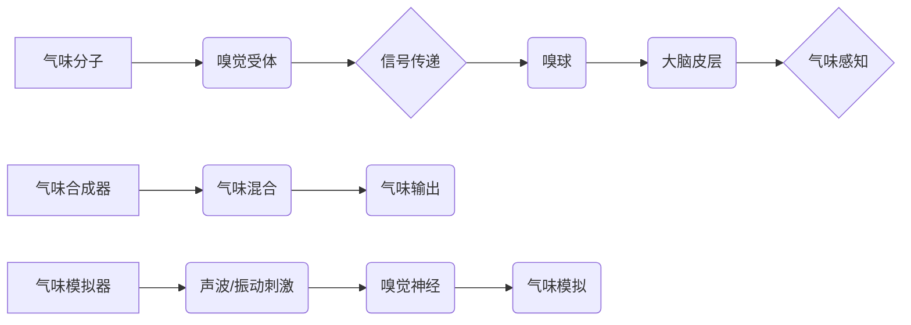

                 

## 虚拟嗅觉景观：AI构建的气味世界

> 关键词：人工智能、嗅觉、虚拟现实、气味识别、机器学习、神经网络、传感器技术

### 1. 背景介绍

人类感知世界的方式多种多样，其中嗅觉扮演着重要的角色。气味能够唤起记忆、情绪和联想，深刻地影响我们的体验和行为。然而，与视觉、听觉等感官相比，嗅觉在计算机领域的研究相对滞后。传统的计算机无法直接感知气味，这限制了虚拟现实、增强现实等技术的沉浸式体验，也阻碍了气味信息在医疗、食品安全、环境监测等领域的应用。

近年来，随着人工智能技术的飞速发展，特别是深度学习的兴起，气味识别和模拟技术取得了显著进展。研究人员利用机器学习算法训练神经网络，使计算机能够识别和分类不同的气味分子，并通过声波、振动等方式模拟气味，构建虚拟嗅觉景观。

### 2. 核心概念与联系

**2.1 嗅觉感知原理**

嗅觉感知的过程可以概括为以下几个步骤：

1. **气味分子进入鼻腔：** 当我们闻到气味时，气味分子会进入鼻腔，与嗅觉受体结合。
2. **嗅觉受体激活：** 每个嗅觉受体只对特定的气味分子敏感，当气味分子与受体结合时，会激活相应的信号通路。
3. **信号传递到大脑：** 激活的信号通路会传递到嗅球，然后通过嗅觉通路传递到大脑皮层，被大脑识别和解读。

**2.2 虚拟嗅觉技术原理**

虚拟嗅觉技术主要通过以下两种方式模拟气味：

1. **气味合成器：** 通过混合不同气味分子，合成出特定的气味。
2. **气味模拟器：** 利用声波、振动等方式，刺激嗅觉神经，模拟气味的感觉。

**2.3 核心概念架构**



### 3. 核心算法原理 & 具体操作步骤

**3.1 算法原理概述**

气味识别和模拟的核心算法主要基于深度学习技术，特别是卷积神经网络（CNN）和循环神经网络（RNN）。

* **CNN** 擅长提取图像中的特征，在气味识别中，可以将气味传感器采集到的数据作为输入，学习气味分子的特征表示。
* **RNN** 擅长处理序列数据，可以用于模拟气味的时间变化特征，例如气味强度、气味持续时间等。

**3.2 算法步骤详解**

1. **数据采集和预处理:** 收集不同气味分子的数据，并进行预处理，例如归一化、降维等。
2. **模型构建:** 根据具体应用场景，选择合适的深度学习模型，例如 CNN、RNN 或其组合。
3. **模型训练:** 使用训练数据训练模型，调整模型参数，使模型能够准确识别不同的气味分子。
4. **模型评估:** 使用测试数据评估模型的性能，例如识别准确率、召回率等。
5. **气味模拟:** 根据训练好的模型，将虚拟环境中的物体或事件与对应的气味分子关联，并通过气味合成器或气味模拟器模拟气味。

**3.3 算法优缺点**

* **优点:**

    * 识别精度高: 深度学习算法能够学习复杂的特征表示，识别精度显著提高。
    * 可扩展性强: 可以扩展到识别更多种类的气味分子。
    * 适应性强: 可以适应不同的气味传感器和气味模拟器。

* **缺点:**

    * 数据需求大: 需要大量的训练数据才能训练出准确的模型。
    * 计算资源消耗大: 训练深度学习模型需要大量的计算资源。
    * 缺乏可解释性: 深度学习模型的决策过程难以解释。

**3.4 算法应用领域**

* **虚拟现实和增强现实:** 构建更沉浸式的虚拟环境，增强现实体验。
* **医疗诊断:** 识别疾病相关的气味，辅助诊断。
* **食品安全:** 检测食品中的有害物质，保障食品安全。
* **环境监测:** 监测空气质量，识别污染源。
* **情感识别:** 通过气味识别用户的情绪状态。

### 4. 数学模型和公式 & 详细讲解 & 举例说明

**4.1 数学模型构建**

气味识别模型通常采用多层感知机（MLP）或卷积神经网络（CNN）作为基础架构。

* **MLP:** 将气味传感器采集到的数据作为输入，通过多层神经元进行处理，最终输出气味分类结果。
* **CNN:** 利用卷积层和池化层提取气味特征，并通过全连接层进行分类。

**4.2 公式推导过程**

* **激活函数:** 神经网络中常用的激活函数包括 sigmoid 函数、ReLU 函数等。激活函数的作用是将神经元的输入映射到输出，引入非线性，使神经网络能够学习复杂的特征表示。

* **损失函数:** 用于衡量模型预测结果与真实结果之间的差异。常用的损失函数包括交叉熵损失函数、均方误差损失函数等。

* **优化算法:** 用于更新模型参数，使模型的损失函数最小化。常用的优化算法包括梯度下降法、Adam 算法等。

**4.3 案例分析与讲解**

假设我们训练一个气味识别模型，用于识别三种气味：花香、水果香和咖啡香。

* **输入数据:** 气味传感器采集到的气味分子浓度数据。
* **模型结构:** 使用一个简单的 MLP 模型，包含三个隐藏层，每个隐藏层包含 128 个神经元。
* **激活函数:** 使用 ReLU 函数作为激活函数。
* **损失函数:** 使用交叉熵损失函数。
* **优化算法:** 使用 Adam 算法。

通过训练数据，模型学习到不同气味分子的特征表示，并能够准确地识别三种气味。

### 5. 项目实践：代码实例和详细解释说明

**5.1 开发环境搭建**

* 操作系统: Ubuntu 20.04
* Python 版本: 3.8
* 深度学习框架: TensorFlow 2.0

**5.2 源代码详细实现**

```python
import tensorflow as tf

# 定义模型结构
model = tf.keras.models.Sequential([
    tf.keras.layers.Dense(128, activation='relu', input_shape=(10,)),
    tf.keras.layers.Dense(128, activation='relu'),
    tf.keras.layers.Dense(3, activation='softmax')
])

# 编译模型
model.compile(optimizer='adam',
              loss='sparse_categorical_crossentropy',
              metrics=['accuracy'])

# 训练模型
model.fit(x_train, y_train, epochs=10)

# 评估模型
loss, accuracy = model.evaluate(x_test, y_test)
print('Loss:', loss)
print('Accuracy:', accuracy)
```

**5.3 代码解读与分析**

* **模型结构:** 代码定义了一个简单的 MLP 模型，包含三个隐藏层和一个输出层。
* **激活函数:** 使用 ReLU 函数作为隐藏层的激活函数，softmax 函数作为输出层的激活函数。
* **损失函数:** 使用交叉熵损失函数，用于衡量模型预测结果与真实结果之间的差异。
* **优化算法:** 使用 Adam 算法，用于更新模型参数。
* **训练和评估:** 代码使用训练数据训练模型，并使用测试数据评估模型的性能。

**5.4 运行结果展示**

训练完成后，可以将模型应用于新的气味数据，进行气味识别。

### 6. 实际应用场景

**6.1 虚拟现实游戏**

虚拟嗅觉技术可以为虚拟现实游戏增添沉浸感，例如在冒险游戏中闻到森林的清香，在烹饪游戏中闻到食物的香味。

**6.2 医疗诊断**

气味识别技术可以用于识别疾病相关的气味，例如癌症、糖尿病等，辅助医生进行诊断。

**6.3 食品安全**

气味识别技术可以用于检测食品中的有害物质，例如腐败、变质等，保障食品安全。

**6.4 未来应用展望**

随着人工智能技术的不断发展，虚拟嗅觉技术将有更广泛的应用场景，例如：

* **个性化体验:** 根据用户的喜好，定制气味体验。
* **远程医疗:** 通过气味识别，远程诊断疾病。
* **智能家居:** 使用气味传感器，监测家居环境，并进行相应的调节。

### 7. 工具和资源推荐

**7.1 学习资源推荐**

* **书籍:**

    * 《深度学习》 by Ian Goodfellow, Yoshua Bengio, Aaron Courville
    * 《神经网络与深度学习》 by Michael Nielsen

* **在线课程:**

    * Coursera: Deep Learning Specialization
    * Udacity: Deep Learning Nanodegree

**7.2 开发工具推荐**

* **TensorFlow:** 开源深度学习框架，支持多种硬件平台。
* **PyTorch:** 开源深度学习框架，以其灵活性和易用性而闻名。
* **Keras:** 高级深度学习API，可以运行在 TensorFlow、Theano 或 CNTK 后端。

**7.3 相关论文推荐**

* **Electronic Nose for Gas Sensing Using Convolutional Neural Networks**
* **A Deep Learning Approach to Odor Recognition**
* **Virtual Olfaction: A Review**

### 8. 总结：未来发展趋势与挑战

**8.1 研究成果总结**

虚拟嗅觉技术取得了显著进展，特别是深度学习算法的应用，使得气味识别和模拟精度大幅提高。

**8.2 未来发展趋势**

* **更精准的气味识别:** 研究更复杂的深度学习模型，提高气味识别精度。
* **更逼真的气味模拟:** 开发更先进的气味合成器和气味模拟器，模拟更丰富的气味体验。
* **更广泛的应用场景:** 将虚拟嗅觉技术应用于更多领域，例如医疗、教育、娱乐等。

**8.3 面临的挑战**

* **气味数据的获取和标注:** 气味数据难以获取和标注，这限制了模型的训练和性能。
* **气味感知的复杂性:** 气味感知是一个复杂的过程，受多种因素影响，例如个人喜好、环境温度等。
* **伦理问题:** 虚拟嗅觉技术可能引发伦理问题，例如隐私泄露、信息操纵等。

**8.4 研究展望**

未来，虚拟嗅觉技术将继续发展，为人类带来更丰富的感知体验，并应用于更多领域，改变我们的生活方式。


### 9. 附录：常见问题与解答

**9.1 如何获取气味数据？**

气味数据可以通过气味传感器采集，也可以通过人工标注获取。

**9.2 如何训练气味识别模型？**

可以使用深度学习框架，例如 TensorFlow 或 PyTorch，训练气味识别模型。

**9.3 如何模拟气味？**

可以使用气味合成器或气味模拟器模拟气味。

**9.4 虚拟嗅觉技术有哪些伦理问题？**

虚拟嗅觉技术可能引发隐私泄露、信息操纵等伦理问题。

**9.5 虚拟嗅觉技术未来的发展趋势是什么？**

虚拟嗅觉技术将更加精准、逼真，并应用于更多领域。


作者：禅与计算机程序设计艺术 / Zen and the Art of Computer Programming 
<end_of_turn>

