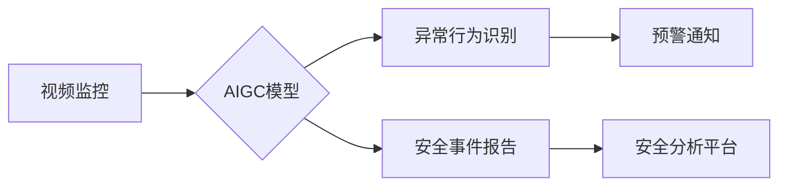

                 

## AIGC助力智能安防建设

> 关键词：AIGC、智能安防、计算机视觉、自然语言处理、深度学习、安全监控、预警分析、数据分析

## 1. 背景介绍

随着社会发展和科技进步，安防安全问题日益突出。传统安防系统主要依靠人工监控，存在效率低、成本高、易疲劳等问题。而人工智能（AI）技术的快速发展为智能安防建设提供了新的机遇。

AIGC（人工智能生成内容）作为AI技术的最新成果，能够利用大数据和深度学习算法，自动生成高质量的文本、图像、音频等内容。其强大的生成能力和智能分析能力，为智能安防建设带来了新的可能性。

## 2. 核心概念与联系

### 2.1  智能安防概述

智能安防是指利用人工智能技术，对安全事件进行智能识别、分析和预警，实现安全防范的自动化、智能化和高效化。

### 2.2  AIGC在智能安防中的应用

AIGC技术在智能安防中的应用主要体现在以下几个方面：

* **视频监控智能化:** 利用AIGC技术，可以对视频监控画面进行智能识别，例如识别人员、车辆、异常行为等，提高监控效率和准确性。
* **安全事件预警:** AIGC可以分析历史安全事件数据，识别潜在的安全风险，并提前预警，帮助安全人员及时采取措施。
* **安全报告自动生成:** AIGC可以自动生成安全事件报告，包括事件描述、相关视频片段、分析结果等，节省人力成本，提高工作效率。
* **虚拟安防人员:** AIGC可以生成虚拟安防人员，用于巡逻、引导、提供信息等，降低人力成本，提高安防覆盖范围。

### 2.3  AIGC与智能安防的架构



## 3. 核心算法原理 & 具体操作步骤

### 3.1  算法原理概述

AIGC在智能安防中的应用主要基于以下核心算法：

* **计算机视觉:** 用于识别和分析视频监控画面，例如人脸识别、物体检测、行为识别等。
* **自然语言处理:** 用于处理文本数据，例如安全事件描述、报警信息、安全报告等。
* **深度学习:** 用于训练AIGC模型，提高其识别和分析能力。

### 3.2  算法步骤详解

1. **数据采集:** 收集视频监控数据、安全事件数据、人员信息等。
2. **数据预处理:** 对数据进行清洗、格式化、标注等处理，以便于模型训练。
3. **模型训练:** 利用深度学习算法，训练AIGC模型，使其能够识别和分析安全事件。
4. **模型部署:** 将训练好的模型部署到智能安防系统中。
5. **实时监控:** 系统实时采集视频监控数据，并利用AIGC模型进行分析，识别异常行为和安全事件。
6. **预警和报警:** 当系统识别到安全事件时，会发出预警和报警，并提供相关信息。
7. **事件处理:** 安全人员根据预警信息，及时处理安全事件。

### 3.3  算法优缺点

**优点:**

* **提高效率:** 自动化安全事件识别和分析，提高监控效率。
* **降低成本:** 减少人工监控成本，提高资源利用率。
* **提高准确性:** 利用深度学习算法，提高安全事件识别和分析的准确性。
* **增强预警能力:** 通过分析历史数据，识别潜在安全风险，提前预警。

**缺点:**

* **数据依赖:** AIGC模型的性能依赖于训练数据的质量和数量。
* **算法复杂:** AIGC算法复杂，需要专业的技术人员进行开发和维护。
* **伦理问题:** AIGC技术可能引发一些伦理问题，例如隐私泄露、算法偏见等。

### 3.4  算法应用领域

AIGC技术在智能安防领域的应用范围广泛，包括：

* **城市安全:** 城市监控、交通安全、公共场所安全等。
* **工业安全:** 工厂安全、矿山安全、能源安全等。
* **金融安全:** 银行安全、证券交易安全、支付安全等。
* **家庭安全:** 智能家居安全、老人照护、儿童安全等。

## 4. 数学模型和公式 & 详细讲解 & 举例说明

### 4.1  数学模型构建

AIGC模型通常基于深度学习架构，例如卷积神经网络（CNN）和循环神经网络（RNN）。

* **CNN:** 用于处理图像数据，例如视频监控画面。CNN通过卷积操作提取图像特征，并利用全连接层进行分类和识别。
* **RNN:** 用于处理序列数据，例如文本数据。RNN通过循环连接，能够捕捉序列中的时间依赖关系，用于文本生成、翻译、情感分析等任务。

### 4.2  公式推导过程

深度学习模型的训练过程基于梯度下降算法，目标是找到最优的模型参数，使得模型的预测结果与真实值之间的误差最小。

* **损失函数:** 用于衡量模型预测结果与真实值的误差。常见的损失函数包括均方误差（MSE）、交叉熵损失（Cross-Entropy Loss）等。
* **梯度下降:** 用于更新模型参数，使其朝着损失函数最小化的方向进行调整。

### 4.3  案例分析与讲解

例如，在人脸识别任务中，AIGC模型需要学习将人脸图像与对应的身份信息进行匹配。

* **训练数据:** 包括大量的人脸图像和对应的身份信息。
* **损失函数:** 使用交叉熵损失函数，衡量模型预测结果与真实身份信息的差异。
* **梯度下降:** 利用梯度下降算法，更新模型参数，使其能够准确识别人脸图像并匹配对应的身份信息。

## 5. 项目实践：代码实例和详细解释说明

### 5.1  开发环境搭建

* **操作系统:** Ubuntu 20.04 LTS
* **编程语言:** Python 3.8
* **深度学习框架:** TensorFlow 2.0
* **其他工具:** Git、Jupyter Notebook

### 5.2  源代码详细实现

```python
# 人脸识别模型训练代码示例

import tensorflow as tf

# 定义模型结构
model = tf.keras.models.Sequential([
    tf.keras.layers.Conv2D(32, (3, 3), activation='relu', input_shape=(64, 64, 3)),
    tf.keras.layers.MaxPooling2D((2, 2)),
    tf.keras.layers.Conv2D(64, (3, 3), activation='relu'),
    tf.keras.layers.MaxPooling2D((2, 2)),
    tf.keras.layers.Flatten(),
    tf.keras.layers.Dense(10, activation='softmax')
])

# 定义损失函数和优化器
model.compile(loss='sparse_categorical_crossentropy',
              optimizer='adam',
              metrics=['accuracy'])

# 训练模型
model.fit(x_train, y_train, epochs=10)

# 保存模型
model.save('face_recognition_model.h5')
```

### 5.3  代码解读与分析

* **模型结构:** 代码定义了一个简单的卷积神经网络模型，用于人脸识别。模型包含两个卷积层、两个最大池化层、一个扁平化层和一个全连接层。
* **损失函数和优化器:** 使用交叉熵损失函数和Adam优化器进行模型训练。
* **训练过程:** 使用训练数据训练模型，并设置训练轮数为10。
* **模型保存:** 将训练好的模型保存为`face_recognition_model.h5`文件。

### 5.4  运行结果展示

训练完成后，可以将模型用于人脸识别任务。例如，可以将人脸图像输入到模型中，模型会输出对应的身份信息。

## 6. 实际应用场景

### 6.1  智慧城市安全

* **城市监控:** 利用AIGC技术，对城市监控视频进行智能分析，识别违法行为、犯罪嫌疑人等，提高城市安全水平。
* **交通安全:** 利用AIGC技术，识别交通违规行为，例如超速、闯红灯等，提高交通安全效率。
* **公共场所安全:** 利用AIGC技术，对公共场所进行智能监控，识别异常行为，预防安全事故。

### 6.2  工业安全

* **工厂安全:** 利用AIGC技术，识别危险行为、设备故障等，提高工厂安全生产效率。
* **矿山安全:** 利用AIGC技术，识别矿山安全隐患，预防矿难事故。
* **能源安全:** 利用AIGC技术，监控能源设施运行状态，识别安全风险，保障能源安全。

### 6.3  金融安全

* **银行安全:** 利用AIGC技术，识别身份盗窃、信用卡诈骗等金融犯罪行为，提高银行安全防范能力。
* **证券交易安全:** 利用AIGC技术，监控证券交易市场，识别异常交易行为，预防市场风险。
* **支付安全:** 利用AIGC技术，识别支付欺诈行为，保障支付安全。

### 6.4  未来应用展望

随着AIGC技术的不断发展，其在智能安防领域的应用将更加广泛和深入。例如：

* **更精准的风险预测:** 利用大数据分析和机器学习算法，对安全事件进行更精准的预测，提前预警潜在风险。
* **更智能的安防机器人:** 利用AIGC技术，开发更智能的安防机器人，能够自主巡逻、识别异常行为、提供安全服务。
* **更安全的隐私保护:** 利用AIGC技术，开发更安全的隐私保护机制，保障个人信息安全。

## 7. 工具和资源推荐

### 7.1  学习资源推荐

* **书籍:**
    * 《深度学习》 by Ian Goodfellow, Yoshua Bengio, Aaron Courville
    * 《动手学深度学习》 by Aurélien Géron
* **在线课程:**
    * Coursera: 深度学习 Specialization
    * Udacity: Deep Learning Nanodegree
* **开源项目:**
    * TensorFlow: https://www.tensorflow.org/
    * PyTorch: https://pytorch.org/

### 7.2  开发工具推荐

* **IDE:** PyCharm, VS Code
* **深度学习框架:** TensorFlow, PyTorch
* **数据可视化工具:** Matplotlib, Seaborn

### 7.3  相关论文推荐

* **《Generative Adversarial Networks》 by Ian Goodfellow et al. (2014)**
* **《Attention Is All You Need》 by Ashish Vaswani et al. (2017)**
* **《BERT: Pre-training of Deep Bidirectional Transformers for Language Understanding》 by Jacob Devlin et al. (2018)**

## 8. 总结：未来发展趋势与挑战

### 8.1  研究成果总结

AIGC技术在智能安防领域的应用取得了显著成果，例如：

* **提高了安全事件识别和分析的准确性。**
* **增强了安全预警和防范能力。**
* **降低了安防成本，提高了效率。**

### 8.2  未来发展趋势

* **更强大的模型:** 研究更强大的AIGC模型，例如Transformer、GPT等，提高其识别和分析能力。
* **更丰富的应用场景:** 将AIGC技术应用到更多安防场景，例如无人机监控、智能门禁、智能报警等。
* **更智能的交互:** 开发更智能的AIGC交互方式，例如语音识别、自然语言交互等。

### 8.3  面临的挑战

* **数据安全:** AIGC模型的训练需要大量数据，如何保障数据安全和隐私保护是一个重要挑战。
* **算法偏见:** AIGC模型可能存在算法偏见，导致识别结果不准确，需要进行算法调优和公平性评估。
* **伦理问题:** AIGC技术可能引发一些伦理问题，例如监控过度、隐私侵犯等，需要进行伦理规范和法律法规的完善。

### 8.4  研究展望

未来，AIGC技术将在智能安防领域发挥越来越重要的作用，为构建更加安全、智能的社会贡献力量。


## 9. 附录：常见问题与解答

**Q1: AIGC技术与传统安防技术相比有哪些优势？**

**A1:** AIGC技术相比传统安防技术具有以下优势：

* **提高效率:** 自动化安全事件识别和分析，减少人工监控成本。
* **提高准确性:** 利用深度学习算法，提高安全事件识别和分析的准确性。
* **增强预警能力:** 通过分析历史数据，识别潜在安全风险，提前预警。

**Q2: AIGC技术有哪些应用场景？**

**A2:** AIGC技术在智能安防领域的应用场景广泛，包括：

* **城市安全:** 城市监控、交通安全、公共场所安全等。
* **工业安全:** 工厂安全、矿山安全、能源安全等。
* **金融安全:** 银行安全、证券交易安全、支付安全等。
* **家庭安全:** 智能家居安全、老人照护、儿童安全等。

**Q3: AIGC技术有哪些挑战？**

**A3:** AIGC技术在应用过程中面临以下挑战：

* **数据安全:** AIGC模型的训练需要大量数据，如何保障数据安全和隐私保护是一个重要挑战。
* **算法偏见:** AIGC模型可能存在算法偏见，导致识别结果不准确，需要进行算法调优和公平性评估。
* **伦理问题:** AIGC技术可能引发一些伦理问题，例如监控过度、隐私侵犯等，需要进行伦理规范和法律法规的完善。


作者：禅与计算机程序设计艺术 / Zen and the Art of Computer Programming<end_of_turn>

