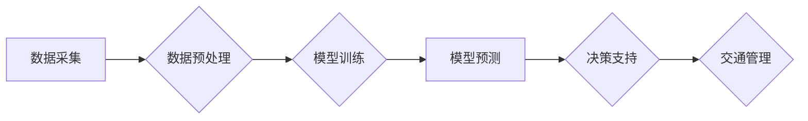

                 

## AI与人类计算：打造可持续发展的城市交通与规划

> 关键词：人工智能、城市交通、规划、可持续发展、人类计算、机器学习、深度学习、优化算法、交通预测、智能交通系统

## 1. 背景介绍

随着全球人口的快速增长和城市化的进程加速，城市交通问题日益突出。拥堵、污染、事故等问题给城市居民带来了巨大的困扰，也阻碍了城市经济和社会的发展。传统交通规划方法难以有效应对这些挑战，亟需引入新的技术手段和理念。

人工智能（AI）作为一门新兴技术，凭借其强大的数据处理能力和学习能力，为解决城市交通问题提供了新的思路。AI技术可以帮助我们更好地理解交通流量、预测交通状况、优化交通调度，从而打造更加高效、便捷、可持续的城市交通系统。

## 2. 核心概念与联系

### 2.1 人类计算与人工智能

人类计算是指人类利用自身的智慧和经验进行计算和决策的过程。传统交通规划主要依赖于人类计算，但随着数据量的爆炸式增长，人类难以有效处理海量交通数据，并从中发现规律和趋势。

人工智能，特别是机器学习和深度学习，可以自动学习和分析数据，发现隐藏的模式和关系，从而辅助人类进行交通规划和决策。

### 2.2 城市交通与规划

城市交通是指城市范围内各种交通工具和人员的流动和运输活动。城市规划则是对城市空间布局、功能分区、交通网络建设等进行合理规划和设计，以实现城市的可持续发展。

AI技术可以应用于各个环节的城市交通规划，例如：

* **交通流量预测:** 利用历史交通数据和实时路况信息，预测未来交通流量，为交通管理提供决策依据。
* **交通拥堵缓解:** 通过智能交通信号灯控制、动态车道分配等手段，优化交通流量，缓解交通拥堵。
* **公共交通优化:** 根据乘客需求和交通状况，优化公交线路、班次和调度方案，提高公共交通效率。
* **智能停车系统:** 利用传感器和AI算法，实现智能停车位引导、自动收费等功能，提高停车场利用率。
* **城市道路规划:** 根据人口分布、交通需求和环境因素，规划城市道路网络，构建更加合理的交通体系。

### 2.3 AI技术架构

AI技术在城市交通规划中的应用，通常采用以下架构：



**数据采集:** 从各种传感器、摄像头、GPS设备等收集交通数据，包括车辆位置、速度、流量、路况等信息。

**数据预处理:** 对采集到的数据进行清洗、转换、格式化等处理，使其适合模型训练。

**模型训练:** 利用机器学习或深度学习算法，训练交通预测模型，例如交通流量预测模型、拥堵预测模型等。

**模型预测:** 将训练好的模型应用于实时交通数据，进行交通状况预测。

**决策支持:** 将预测结果提供给交通管理人员，辅助他们进行决策，例如调整交通信号灯控制、引导车辆行驶等。

**交通管理:** 根据决策结果，对交通系统进行调整和控制，以优化交通流量和缓解拥堵。

## 3. 核心算法原理 & 具体操作步骤

### 3.1 算法原理概述

在城市交通规划中，常用的AI算法包括：

* **回归算法:** 用于预测连续变量，例如交通流量、拥堵程度等。常见的回归算法包括线性回归、逻辑回归、支持向量回归等。
* **分类算法:** 用于分类数据，例如预测交通事故发生概率、识别交通违规行为等。常见的分类算法包括决策树、随机森林、支持向量机等。
* **聚类算法:** 用于将数据分组，例如根据车辆类型、行驶路线等特征，将车辆进行分类。常见的聚类算法包括K-means聚类、层次聚类等。
* **神经网络算法:** 用于处理复杂数据，例如预测交通流量、识别交通场景等。常见的深度学习算法包括卷积神经网络、循环神经网络等。

### 3.2 算法步骤详解

以交通流量预测为例，详细说明算法步骤：

1. **数据收集:** 从各种传感器、摄像头等收集历史交通数据，包括时间、地点、车辆数量、速度等信息。
2. **数据预处理:** 对收集到的数据进行清洗、转换、格式化等处理，例如处理缺失值、归一化数据等。
3. **特征工程:** 从原始数据中提取特征，例如时间特征、地点特征、天气特征等，这些特征可以帮助模型更好地理解交通流量的规律。
4. **模型选择:** 根据数据特点和预测目标，选择合适的回归算法，例如线性回归、支持向量回归等。
5. **模型训练:** 利用历史交通数据训练模型，调整模型参数，使模型能够准确预测交通流量。
6. **模型评估:** 利用测试数据评估模型的预测精度，例如使用均方误差、R-squared等指标。
7. **模型部署:** 将训练好的模型部署到生产环境中，用于实时预测交通流量。

### 3.3 算法优缺点

**优点:**

* **高精度:** AI算法可以学习和分析海量数据，提高交通流量预测的精度。
* **实时性:** AI算法可以实时处理交通数据，及时预测交通状况。
* **可扩展性:** AI算法可以根据需要扩展模型规模，处理更大的数据量。

**缺点:**

* **数据依赖:** AI算法需要大量高质量的数据进行训练，否则预测精度会下降。
* **黑盒效应:** 一些AI算法的决策过程难以解释，难以理解模型是如何做出预测的。
* **计算资源:** 训练复杂的AI模型需要大量的计算资源。

### 3.4 算法应用领域

AI算法在城市交通规划中的应用领域非常广泛，例如：

* **交通流量预测:** 预测道路、路口、交通枢纽等处的交通流量，为交通管理提供决策依据。
* **拥堵缓解:** 利用AI算法优化交通信号灯控制、动态车道分配等手段，缓解交通拥堵。
* **公共交通优化:** 根据乘客需求和交通状况，优化公交线路、班次和调度方案，提高公共交通效率。
* **智能停车系统:** 利用传感器和AI算法，实现智能停车位引导、自动收费等功能，提高停车场利用率。
* **城市道路规划:** 根据人口分布、交通需求和环境因素，规划城市道路网络，构建更加合理的交通体系。

## 4. 数学模型和公式 & 详细讲解 & 举例说明

### 4.1 数学模型构建

交通流量预测模型通常采用时间序列模型，例如ARIMA模型、SARIMA模型等。这些模型假设交通流量具有时间相关性，即未来交通流量与历史交通流量相关。

**ARIMA模型:** ARIMA模型是一种经典的时间序列模型，其全称是Autoregressive Integrated Moving Average模型。ARIMA模型包含三个参数：

* **p:** Autoregressive (AR) order，表示模型中自回归项的阶数。
* **d:** Integrated (I) order，表示数据需要进行的差分次数。
* **q:** Moving Average (MA) order，表示模型中移动平均项的阶数。

**SARIMA模型:** SARIMA模型是ARIMA模型的扩展，它引入了季节性因素。SARIMA模型包含四个参数：

* **P:** Seasonal AR order，表示季节性自回归项的阶数。
* **D:** Seasonal Integrated order，表示季节性数据需要进行的差分次数。
* **Q:** Seasonal MA order，表示季节性移动平均项的阶数。
* **s:** Seasonal period，表示季节性的周期长度。

### 4.2 公式推导过程

ARIMA模型和SARIMA模型的具体公式推导过程比较复杂，这里不再赘述。

### 4.3 案例分析与讲解

假设我们想要预测某条道路的交通流量，我们可以使用ARIMA模型进行预测。首先，我们需要收集该道路的历史交通流量数据，并进行数据预处理。然后，我们可以使用ARIMA模型的参数估计方法，例如最大似然估计，来估计模型的参数。最后，我们可以使用训练好的模型预测未来交通流量。

## 5. 项目实践：代码实例和详细解释说明

### 5.1 开发环境搭建

为了实现交通流量预测项目，我们需要搭建以下开发环境：

* **操作系统:** Linux或Windows
* **编程语言:** Python
* **机器学习库:** scikit-learn、TensorFlow、PyTorch等
* **数据处理库:** pandas、NumPy等
* **可视化库:** matplotlib、seaborn等

### 5.2 源代码详细实现

```python
import pandas as pd
from sklearn.model_selection import train_test_split
from sklearn.linear_model import LinearRegression
from sklearn.metrics import mean_squared_error

# 加载交通流量数据
data = pd.read_csv('traffic_data.csv')

# 选择特征和目标变量
features = ['hour', 'weekday', 'temperature']
target = 'traffic_volume'

# 将数据划分为训练集和测试集
X_train, X_test, y_train, y_test = train_test_split(data[features], data[target], test_size=0.2)

# 创建线性回归模型
model = LinearRegression()

# 训练模型
model.fit(X_train, y_train)

# 预测测试集数据
y_pred = model.predict(X_test)

# 计算模型精度
mse = mean_squared_error(y_test, y_pred)
print('Mean Squared Error:', mse)
```

### 5.3 代码解读与分析

这段代码实现了交通流量预测的简单示例。

1. 首先，我们加载交通流量数据，并选择特征和目标变量。
2. 然后，我们将数据划分为训练集和测试集，用于训练和评估模型。
3. 接下来，我们创建线性回归模型，并使用训练集数据训练模型。
4. 最后，我们使用训练好的模型预测测试集数据，并计算模型精度。

### 5.4 运行结果展示

运行这段代码后，会输出模型的均方误差值，该值越小，模型的预测精度越高。

## 6. 实际应用场景

### 6.1 交通流量预测

交通流量预测是城市交通规划中最重要的应用场景之一。通过预测未来交通流量，可以帮助交通管理部门优化交通信号灯控制、引导车辆行驶、调整公交线路等，从而缓解交通拥堵。

### 6.2 拥堵缓解

AI技术可以帮助缓解交通拥堵，例如：

* **智能交通信号灯控制:** 根据实时交通流量情况，动态调整交通信号灯的绿灯时间，优化交通流量。
* **动态车道分配:** 根据交通流量情况，动态分配车道，例如将部分车道用于公交车专用车道，提高公交车通行效率。
* **诱导式交通管理:** 利用电子显示屏、导航系统等引导车辆行驶，避免拥堵路段。

### 6.3 公共交通优化

AI技术可以帮助优化公共交通系统，例如：

* **公交线路优化:** 根据乘客需求和交通状况，优化公交线路、班次和调度方案，提高公共交通效率。
* **智能公交站台:** 利用传感器和AI算法，实现公交站台信息发布、乘客引导等功能，提高乘客体验。
* **共享单车管理:** 利用AI算法优化共享单车的调度和维护，提高共享单车的利用率。

### 6.4 未来应用展望

未来，AI技术在城市交通规划中的应用将更加广泛和深入，例如：

* **自动驾驶:** 自动驾驶技术将彻底改变城市交通模式，提高交通效率和安全性。
* **智能交通网络:** 利用AI技术构建智能交通网络，实现交通流量的实时监测、预测和控制。
* **可持续交通:** AI技术可以帮助构建更加可持续的交通系统，例如优化能源消耗、减少碳排放等。

## 7. 工具和资源推荐

### 7.1 学习资源推荐

* **书籍:**
    * 《深度学习》
    * 《机器学习实战》
    * 《Python机器学习》
* **在线课程:**
    * Coursera
    * edX
    * Udacity
* **博客和论坛:**
    * Towards Data Science
    * Machine Learning Mastery
    * Stack Overflow

### 7.2 开发工具推荐

* **编程语言:** Python
* **机器学习库:** scikit-learn、TensorFlow、PyTorch
* **数据处理库:** pandas、NumPy
* **可视化库:** matplotlib、seaborn
* **云平台:** AWS、Azure、GCP

### 7.3 相关论文推荐

* **交通流量预测:**
    * "Traffic Flow Prediction Using Deep Learning"
    * "A Hybrid ARIMA-LSTM Model for Short-Term Traffic Flow Forecasting"
* **拥堵缓解:**
    * "Intelligent Traffic Signal Control Using Machine Learning"
    * "Dynamic Lane Allocation for Traffic Flow Optimization"
* **公共交通优化:**
    * "Bus Route Optimization Using Machine Learning"
    * "Smart Bus Stop Design and Management"

## 8. 总结：未来发展趋势与挑战

### 8.1 研究成果总结

近年来，AI技术在城市交通规划领域取得了显著成果，例如交通流量预测、拥堵缓解、公共交通优化等方面取得了突破。

### 8.2 未来发展趋势

未来，AI技术在城市交通规划领域的应用将更加广泛和深入，例如：

* **自动驾驶:** 自动驾驶技术将彻底改变城市交通模式，提高交通效率和安全性。
* **智能交通网络:** 利用AI技术构建智能交通网络，实现交通流量的实时监测、预测和控制。
* **可持续交通:** AI技术可以帮助构建更加可持续的交通系统，例如优化能源消耗、减少碳排放等。

### 8.3 面临的挑战

尽管AI技术在城市交通规划领域取得了显著成果，但仍面临一些挑战：

* **数据质量:** AI算法依赖于高质量的数据，而现实世界中的交通数据往往存在噪声、缺失值等问题。
* **模型解释性:** 一些AI算法的决策过程难以解释，难以理解模型是如何做出预测的。
* **伦理问题:** AI技术在城市交通规划中的应用可能引发一些伦理问题，例如数据隐私、算法偏见等。

### 8.4 研究展望

未来，我们需要继续加强对AI技术在城市交通规划领域的应用研究，解决上述挑战，并探索新的应用场景。


## 9. 附录：常见问题与解答

### 9.1 如何选择合适的AI算法？

选择合适的AI算法取决于具体的应用场景和数据特点。例如，对于预测连续变量，可以使用回归算法；对于分类数据，可以使用分类算法；对于复杂数据，可以使用深度学习算法。

### 9.2 如何处理交通数据中的噪声和缺失值？

可以采用以下方法处理交通数据中的噪声和缺失值：

* **数据清洗:** 删除明显错误的数据，例如负值交通流量等。
* **数据填充:** 使用平均值、中位数等方法填充缺失值。
* **数据降维:** 使用主成分分析等方法降维，减少数据噪声的影响。

### 9.3 如何评估AI模型的精度？

常用的评估指标包括均方误差、R-squared等。

### 9.4 如何解决AI算法的解释性问题？

可以使用可解释AI技术，例如LIME、SHAP等，解释AI模型的决策过程。


作者：禅与计算机程序设计艺术 / Zen and the Art of Computer Programming 
<end_of_turn>

