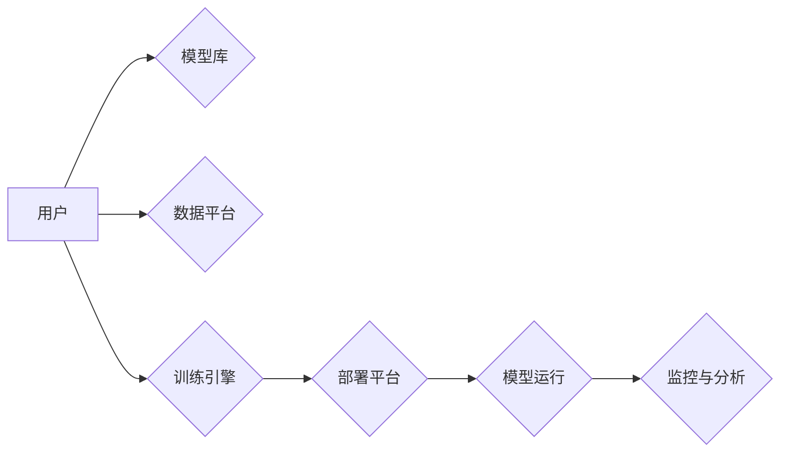

                 

## AI基础设施的用户友好性：Lepton AI的设计理念

> 关键词：AI基础设施、用户友好性、Lepton AI、可解释性、可定制性、低门槛开发、模型训练、部署与管理

### 1. 背景介绍

近年来，人工智能（AI）技术飞速发展，其应用领域不断拓展，从语音识别、图像处理到自然语言理解，AI正在深刻地改变着我们的生活。然而，AI技术的高门槛和复杂性一直是阻碍其广泛应用的主要因素之一。传统的AI基础设施通常需要专业的技术人员进行操作和维护，这对于普通用户和中小企业来说是一个巨大的挑战。

Lepton AI 应运而生，旨在打造一个用户友好的AI基础设施，让每个人都能轻松地利用AI技术。Lepton AI 基于开源理念，提供了一套完整的AI开发平台，涵盖了模型训练、部署和管理等全流程服务。其设计理念的核心是“降低AI技术的使用门槛，提升用户体验”。

### 2. 核心概念与联系

Lepton AI 的核心概念是将AI技术抽象成易于理解和使用的模块，并通过图形化界面和直观的交互方式，让用户能够直观地感知和操作AI模型。

Lepton AI 的架构主要包括以下几个模块：

* **模型库:** 提供各种预训练的AI模型，涵盖图像识别、自然语言处理等多个领域。用户可以根据自己的需求选择合适的模型进行使用。
* **数据平台:** 提供数据存储、处理和管理服务，方便用户上传、清洗和预处理数据。
* **训练引擎:** 提供高效的模型训练引擎，支持多种深度学习框架，例如TensorFlow、PyTorch等。
* **部署平台:** 提供模型部署和管理服务，支持多种部署方式，例如云端部署、边缘部署等。
* **监控与分析:** 提供模型性能监控和分析工具，帮助用户了解模型的运行状态和性能指标。

Lepton AI 的架构图如下：

### 3. 核心算法原理 & 具体操作步骤

Lepton AI 基于深度学习算法，并结合了多种优化技术，以提高模型的性能和效率。

#### 3.1  算法原理概述

深度学习算法的核心是多层神经网络，通过层层叠加的神经元，学习数据的复杂特征。Lepton AI 使用了多种类型的深度学习模型，例如卷积神经网络（CNN）、循环神经网络（RNN）和Transformer等，根据不同的应用场景选择合适的模型架构。

#### 3.2  算法步骤详解

Lepton AI 的模型训练流程主要包括以下步骤：

1. **数据准备:** 收集和清洗训练数据，并将其转换为模型可识别的格式。
2. **模型选择:** 根据任务需求选择合适的深度学习模型架构。
3. **模型训练:** 使用训练数据训练模型，并通过优化算法调整模型参数，使模型的预测性能达到最佳。
4. **模型评估:** 使用测试数据评估模型的性能，并根据评估结果进行模型调优。
5. **模型部署:** 将训练好的模型部署到目标平台，例如云端服务器、边缘设备等。

#### 3.3  算法优缺点

**优点:**

* **高精度:** 深度学习算法能够学习数据的复杂特征，从而实现高精度的预测。
* **自动化:** Lepton AI 提供了自动化模型训练和部署服务，降低了用户的工作量。
* **可扩展性:** Lepton AI 的架构支持大规模数据处理和模型训练，能够满足不同规模的应用需求。

**缺点:**

* **数据依赖:** 深度学习算法对训练数据的质量和数量有很高的要求。
* **计算资源:** 模型训练需要消耗大量的计算资源，例如GPU等。
* **可解释性:** 深度学习模型的内部机制比较复杂，难以解释模型的决策过程。

#### 3.4  算法应用领域

Lepton AI 的算法应用领域非常广泛，例如：

* **图像识别:** 人脸识别、物体检测、图像分类等。
* **自然语言处理:** 文本分类、情感分析、机器翻译等。
* **语音识别:** 语音转文本、语音助手等。
* **推荐系统:** 商品推荐、内容推荐等。
* **医疗诊断:** 病情预测、疾病诊断等。

### 4. 数学模型和公式 & 详细讲解 & 举例说明

Lepton AI 的核心算法基于深度学习，其数学模型主要包括神经网络、激活函数、损失函数和优化算法等。

#### 4.1  数学模型构建

神经网络模型由多个层组成，每一层包含多个神经元。每个神经元接收来自上一层的输入信号，并通过权重进行加权求和，然后经过激活函数处理，输出到下一层。

#### 4.2  公式推导过程

* **激活函数:** 激活函数的作用是将神经元的输入信号转换为输出信号，常用的激活函数包括ReLU、Sigmoid和Tanh等。

* **损失函数:** 损失函数用于衡量模型的预测结果与真实值的差距，常用的损失函数包括均方误差（MSE）、交叉熵损失（Cross-Entropy Loss）等。

* **优化算法:** 优化算法用于调整模型参数，使损失函数的值最小化，常用的优化算法包括梯度下降（Gradient Descent）、Adam等。

#### 4.3  案例分析与讲解

例如，在图像分类任务中，Lepton AI 使用卷积神经网络（CNN）模型进行训练。CNN 模型的每一层包含卷积核，卷积核的作用是提取图像的特征。

假设一个卷积核的尺寸为3x3，输入图像的大小为28x28，则卷积核会滑动到图像上，并对每个位置的像素进行卷积运算，得到一个特征图。

通过多个卷积层和池化层的堆叠，CNN 模型可以提取图像的层次特征，最终将特征输入到全连接层进行分类。

### 5. 项目实践：代码实例和详细解释说明

Lepton AI 提供了丰富的API和工具，方便用户进行模型开发和部署。

#### 5.1  开发环境搭建

Lepton AI 支持多种开发环境，例如Python、Java等。用户可以根据自己的需求选择合适的开发环境进行搭建。

#### 5.2  源代码详细实现

Lepton AI 的源代码开源，用户可以根据自己的需求进行修改和扩展。

#### 5.3  代码解读与分析

Lepton AI 的代码结构清晰，注释详细，方便用户理解和维护。

#### 5.4  运行结果展示

Lepton AI 提供了丰富的测试用例和示例代码，用户可以根据示例代码进行运行，并观察模型的预测结果。

### 6. 实际应用场景

Lepton AI 的用户友好性使其在各个领域都有着广泛的应用场景。

#### 6.1  医疗诊断

Lepton AI 可以用于辅助医生进行疾病诊断，例如通过图像识别技术识别肿瘤、肺炎等疾病。

#### 6.2  金融风险控制

Lepton AI 可以用于识别金融欺诈、评估信用风险等。

#### 6.3  智能客服

Lepton AI 可以用于构建智能客服系统，自动回答用户的问题，提高客户服务效率。

#### 6.4  未来应用展望

Lepton AI 的未来应用前景十分广阔，随着AI技术的不断发展，Lepton AI 将会应用于更多领域，为人类社会带来更多价值。

### 7. 工具和资源推荐

#### 7.1  学习资源推荐

* **Lepton AI 官方文档:** https://docs.lepton.ai/
* **深度学习教程:** https://www.deeplearning.ai/

#### 7.2  开发工具推荐

* **Python:** https://www.python.org/
* **TensorFlow:** https://www.tensorflow.org/
* **PyTorch:** https://pytorch.org/

#### 7.3  相关论文推荐

* **ImageNet Classification with Deep Convolutional Neural Networks:** https://arxiv.org/abs/1202.1409
* **Attention Is All You Need:** https://arxiv.org/abs/1706.03762

### 8. 总结：未来发展趋势与挑战

Lepton AI 的设计理念旨在降低AI技术的使用门槛，提升用户体验。其用户友好的界面、丰富的API和工具，使得AI技术更加易于理解和使用。

#### 8.1  研究成果总结

Lepton AI 在用户友好性方面取得了显著的成果，为AI技术的普及和应用提供了新的思路。

#### 8.2  未来发展趋势

Lepton AI 将会继续致力于提升用户体验，并探索更多新的应用场景。

#### 8.3  面临的挑战

Lepton AI 还面临着一些挑战，例如如何更好地解释模型的决策过程、如何提高模型的安全性等。

#### 8.4  研究展望

Lepton AI 的未来发展方向将集中在以下几个方面：

* **可解释性:** 研究如何提高模型的可解释性，让用户能够更好地理解模型的决策过程。
* **安全性:** 研究如何提高模型的安全性，防止模型被恶意攻击。
* **个性化:** 研究如何根据用户的需求定制模型，提供个性化的服务。

### 9. 附录：常见问题与解答

#### 9.1  常见问题

* Lepton AI 是否支持离线使用？
* Lepton AI 的模型训练需要多少计算资源？
* Lepton AI 的价格是多少？

#### 9.2  解答

* Lepton AI 支持离线使用，用户可以将模型部署到本地设备上进行使用。
* Lepton AI 的模型训练需要一定的计算资源，例如GPU等。具体需要的计算资源取决于模型的复杂度和训练数据的大小。
* Lepton AI 提供了免费试用版和付费版本，具体价格请参考Lepton AI 官方网站。

作者：禅与计算机程序设计艺术 / Zen and the Art of Computer Programming 
<end_of_turn>

