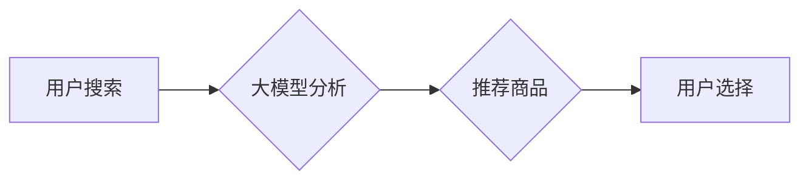

                 

## AI大模型视角下电商搜索推荐的技术创新文化建设

> 关键词：电商搜索推荐、大模型、深度学习、推荐算法、个性化推荐、技术创新文化、数据驱动

## 1. 背景介绍

电商行业竞争日益激烈，用户需求日益多元化，如何精准推荐用户感兴趣的产品，提升用户体验，成为电商平台的核心竞争力。传统基于规则的搜索推荐系统难以满足用户个性化需求，随着深度学习技术的快速发展，大模型在电商搜索推荐领域展现出巨大的潜力。

大模型，是指参数规模庞大、训练数据海量的人工智能模型，其强大的学习能力和泛化能力，能够从海量数据中挖掘出用户需求和商品特征之间的复杂关系，实现更精准、更个性化的推荐。

## 2. 核心概念与联系

### 2.1  电商搜索推荐

电商搜索推荐是指在电商平台上，根据用户的搜索行为、浏览历史、购买记录等数据，推荐与用户需求相匹配的商品。其目标是提高用户转化率，提升用户购物体验。

### 2.2  大模型

大模型是指参数规模庞大、训练数据海量的人工智能模型，其强大的学习能力和泛化能力，能够从海量数据中挖掘出用户需求和商品特征之间的复杂关系，实现更精准、更个性化的推荐。

### 2.3  关系

大模型在电商搜索推荐领域的核心作用在于：

* **数据挖掘和特征提取:** 大模型能够从海量用户行为数据和商品信息中，自动学习和提取用户需求和商品特征之间的隐含关系，构建更精准的推荐模型。
* **个性化推荐:** 大模型能够根据用户的历史行为和偏好，构建个性化的推荐模型，为每个用户提供更精准、更符合其需求的商品推荐。
* **跨模态学习:** 大模型能够学习不同模态的数据，例如文本、图像、视频等，构建更全面的用户画像和商品描述，实现更精准的跨模态推荐。

**Mermaid 流程图**



## 3. 核心算法原理 & 具体操作步骤

### 3.1  算法原理概述

大模型在电商搜索推荐领域常用的算法包括：

* **协同过滤:** 基于用户的历史行为和商品的购买记录，预测用户对商品的兴趣。
* **内容过滤:** 基于商品的属性和描述，推荐与用户兴趣相匹配的商品。
* **深度学习:** 利用深度神经网络，从海量数据中学习用户需求和商品特征之间的复杂关系，实现更精准的推荐。

### 3.2  算法步骤详解

以深度学习算法为例，其具体操作步骤如下：

1. **数据预处理:** 收集用户行为数据和商品信息，进行清洗、转换和特征工程，构建训练数据。
2. **模型构建:** 选择合适的深度学习模型，例如多层感知机、卷积神经网络、循环神经网络等，并根据训练数据进行模型训练。
3. **模型评估:** 使用测试数据评估模型的性能，例如准确率、召回率、点击率等。
4. **模型优化:** 根据评估结果，调整模型参数和结构，提高模型性能。
5. **模型部署:** 将训练好的模型部署到线上环境，实现实时推荐。

### 3.3  算法优缺点

**深度学习算法**

* **优点:** 能够学习复杂的关系，实现更精准的推荐。
* **缺点:** 需要海量数据进行训练，训练时间长，模型参数复杂。

### 3.4  算法应用领域

深度学习算法广泛应用于电商搜索推荐、个性化推荐、广告推荐等领域。

## 4. 数学模型和公式 & 详细讲解 & 举例说明

### 4.1  数学模型构建

深度学习模型的数学模型通常基于神经网络，其核心是权重矩阵和激活函数。

* **权重矩阵:** 用于学习用户需求和商品特征之间的关系。
* **激活函数:** 用于引入非线性，提高模型的表达能力。

### 4.2  公式推导过程

深度学习模型的训练过程基于梯度下降算法，其目标是最小化模型的损失函数。

损失函数通常定义为预测值与真实值的差值，例如均方误差。

梯度下降算法通过迭代更新权重矩阵，逐步降低损失函数的值。

### 4.3  案例分析与讲解

例如，在协同过滤算法中，可以使用矩阵分解模型来预测用户对商品的评分。

矩阵分解模型将用户-商品评分矩阵分解成两个低维矩阵，分别表示用户特征和商品特征。

通过最小化两个低维矩阵的乘积与原始评分矩阵的差值，可以学习到用户和商品的潜在特征，并预测用户对未评分商品的评分。

## 5. 项目实践：代码实例和详细解释说明

### 5.1  开发环境搭建

* **操作系统:** Linux
* **编程语言:** Python
* **深度学习框架:** TensorFlow 或 PyTorch
* **数据存储:** MySQL 或 MongoDB

### 5.2  源代码详细实现

```python
# 使用 TensorFlow 实现协同过滤推荐

import tensorflow as tf

# 定义用户-商品评分矩阵
ratings = tf.constant([[5, 4, 3],
                      [4, 5, 2],
                      [3, 2, 5]])

# 定义用户特征矩阵和商品特征矩阵
user_factors = tf.Variable(tf.random.normal([3, 10]))
item_factors = tf.Variable(tf.random.normal([3, 10]))

# 计算预测评分
predictions = tf.matmul(user_factors, item_factors, transpose_b=True)

# 定义损失函数
loss = tf.reduce_mean(tf.square(predictions - ratings))

# 定义优化器
optimizer = tf.keras.optimizers.Adam()

# 训练模型
for epoch in range(100):
    with tf.GradientTape() as tape:
        loss_value = loss
    gradients = tape.gradient(loss_value, [user_factors, item_factors])
    optimizer.apply_gradients(zip(gradients, [user_factors, item_factors]))

# 打印预测评分
print(predictions)
```

### 5.3  代码解读与分析

* 代码首先定义了用户-商品评分矩阵、用户特征矩阵和商品特征矩阵。
* 然后使用矩阵乘法计算预测评分。
* 定义损失函数为预测评分与真实评分的均方差。
* 使用Adam优化器进行模型训练。
* 训练完成后，打印预测评分。

### 5.4  运行结果展示

运行代码后，将输出预测评分矩阵，该矩阵包含了模型学习到的用户和商品的潜在特征，可以用于预测用户对未评分商品的评分。

## 6. 实际应用场景

大模型在电商搜索推荐领域有着广泛的应用场景：

* **商品推荐:** 根据用户的搜索历史、浏览记录、购买记录等数据，推荐与用户兴趣相匹配的商品。
* **个性化推荐:** 根据用户的兴趣偏好、购买习惯等数据，为每个用户提供个性化的商品推荐。
* **搜索结果排序:** 根据用户的搜索关键词和历史行为数据，对搜索结果进行排序，提升用户搜索体验。
* **广告推荐:** 根据用户的兴趣偏好和行为数据，推荐与用户需求相匹配的广告。

### 6.4  未来应用展望

随着大模型技术的不断发展，其在电商搜索推荐领域的应用场景将更加广泛，例如：

* **多模态推荐:** 利用文本、图像、视频等多模态数据，构建更全面的用户画像和商品描述，实现更精准的跨模态推荐。
* **实时推荐:** 利用大模型的实时推理能力，实现对用户行为的实时分析和推荐。
* **个性化营销:** 利用大模型学习用户的兴趣偏好和购买习惯，进行个性化的营销推广。

## 7. 工具和资源推荐

### 7.1  学习资源推荐

* **书籍:**
    * 深度学习
    * 自然语言处理
    * 机器学习实战
* **在线课程:**
    * Coursera
    * edX
    * Udacity

### 7.2  开发工具推荐

* **深度学习框架:** TensorFlow, PyTorch
* **数据处理工具:** Pandas, NumPy
* **云计算平台:** AWS, Azure, Google Cloud

### 7.3  相关论文推荐

* Attention Is All You Need
* BERT: Pre-training of Deep Bidirectional Transformers for Language Understanding
* Transformer-XL: Attentive Language Modeling Beyond Millions of Tokens

## 8. 总结：未来发展趋势与挑战

### 8.1  研究成果总结

大模型在电商搜索推荐领域取得了显著的成果，能够实现更精准、更个性化的推荐，提升用户体验和商业价值。

### 8.2  未来发展趋势

* **模型规模和能力的提升:** 随着计算能力的提升，大模型的规模和能力将不断提升，能够学习更复杂的关系，实现更精准的推荐。
* **多模态学习的深入研究:** 大模型将更加注重多模态数据的融合，实现更全面的用户画像和商品描述，构建更精准的跨模态推荐。
* **联邦学习和隐私保护:** 大模型的训练需要海量数据，如何保障用户隐私和数据安全将成为未来研究的重要方向。

### 8.3  面临的挑战

* **数据质量和标注问题:** 大模型的训练需要海量高质量数据，数据质量和标注问题将影响模型的性能。
* **模型解释性和可解释性:** 大模型的决策过程复杂，如何提高模型的解释性和可解释性，帮助用户理解推荐结果，将是未来研究的重要方向。
* **模型部署和效率问题:** 大模型的部署和推理效率较低，如何降低模型的部署成本和推理时间，将是未来研究的重要挑战。

### 8.4  研究展望

未来，大模型在电商搜索推荐领域将继续发挥重要作用，推动电商行业的发展。

## 9. 附录：常见问题与解答

**Q1: 大模型的训练需要多少数据？**

A1: 大模型的训练需要海量数据，通常需要百万甚至数十亿条数据。

**Q2: 如何评估大模型的性能？**

A2: 大模型的性能通常使用准确率、召回率、点击率等指标进行评估。

**Q3: 如何部署大模型？**

A3: 大模型的部署可以使用云计算平台、边缘计算等方式。


作者：禅与计算机程序设计艺术 / Zen and the Art of Computer Programming 
<end_of_turn>

