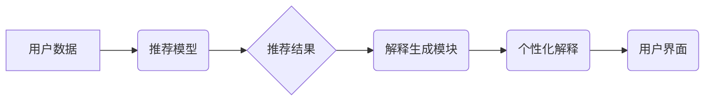

                 

## AI赋能的电商推荐解释系统：个性化解释生成与展示

> 关键词：电商推荐、推荐解释、AI赋能、个性化解释、自然语言生成、可解释AI

## 1. 背景介绍

在当今数据爆炸的时代，电商平台面临着海量商品和用户数据，如何精准推荐用户感兴趣的商品成为了一个关键问题。传统的基于协同过滤、内容过滤等算法的推荐系统，虽然能够提供一定的推荐效果，但缺乏对推荐结果的解释性，用户难以理解推荐理由，导致用户信任度降低，推荐效果不佳。

近年来，随着人工智能技术的快速发展，可解释AI（XAI）成为一个热门研究方向。可解释AI旨在使AI模型的决策过程更加透明可理解，帮助用户理解模型的推荐逻辑，从而提升用户信任度和推荐效果。

电商推荐解释系统作为可解释AI在电商领域的应用之一，旨在为用户提供个性化的推荐解释，帮助用户理解推荐理由，增强用户体验。

## 2. 核心概念与联系

### 2.1 核心概念

* **电商推荐系统:** 基于用户行为、商品特征等数据，预测用户对商品的兴趣，并提供个性化的商品推荐。
* **推荐解释:** 解释推荐系统推荐结果背后的逻辑，帮助用户理解推荐理由。
* **个性化解释:** 根据用户的不同特征和偏好，生成个性化的推荐解释。
* **自然语言生成 (NLG):** 将数据转换为自然语言文本，用于生成可理解的推荐解释。

### 2.2 架构



## 3. 核心算法原理 & 具体操作步骤

### 3.1 算法原理概述

电商推荐解释系统通常采用以下核心算法原理：

* **特征提取:** 从用户数据和商品数据中提取关键特征，例如用户购买历史、浏览记录、商品类别、价格、评价等。
* **推荐模型:** 使用机器学习算法构建推荐模型，例如协同过滤、内容过滤、深度学习等，预测用户对商品的兴趣。
* **解释模型:** 使用可解释AI算法构建解释模型，例如LIME、SHAP等，解释推荐模型的决策过程。
* **自然语言生成:** 将解释模型的输出转换为自然语言文本，生成可理解的推荐解释。

### 3.2 算法步骤详解

1. **数据预处理:** 对用户数据和商品数据进行清洗、转换、特征工程等预处理操作。
2. **推荐模型训练:** 使用训练数据训练推荐模型，并评估模型性能。
3. **解释模型训练:** 使用推荐模型的决策结果和特征数据训练解释模型，例如使用LIME算法生成局部解释。
4. **个性化解释生成:** 根据用户的特征和偏好，生成个性化的推荐解释。
5. **解释展示:** 将生成的个性化解释以用户友好的方式展示给用户，例如在推荐结果旁边显示解释文本。

### 3.3 算法优缺点

**优点:**

* **提高用户信任度:** 提供推荐解释，帮助用户理解推荐理由，增强用户信任度。
* **提升用户体验:** 个性化的推荐解释，可以帮助用户更好地理解推荐结果，提高用户体验。
* **促进模型可解释性:** 使用可解释AI算法，可以帮助研究人员更好地理解推荐模型的决策过程。

**缺点:**

* **解释复杂度:** 对于复杂的推荐模型，生成准确、简洁的解释可能比较困难。
* **解释准确性:** 解释模型的准确性可能受到推荐模型性能的影响。
* **解释展示:** 如何以用户友好的方式展示解释结果，也是一个需要考虑的问题。

### 3.4 算法应用领域

* **电商推荐:** 为用户提供个性化的商品推荐解释。
* **金融推荐:** 为用户提供个性化的理财产品推荐解释。
* **医疗推荐:** 为医生提供个性化的诊断建议解释。
* **教育推荐:** 为学生提供个性化的学习资源推荐解释。

## 4. 数学模型和公式 & 详细讲解 & 举例说明

### 4.1 数学模型构建

推荐解释系统通常使用以下数学模型：

* **特征重要性:** 使用LIME算法计算每个特征对推荐结果的影响程度。
* **决策边界:** 使用SHAP算法计算每个特征对决策边界的贡献。

### 4.2 公式推导过程

**LIME算法:**

LIME算法使用局部线性模型来近似推荐模型的决策边界。对于一个特定的推荐结果，LIME算法会生成一个局部数据集，并使用线性回归模型拟合这个数据集。

**SHAP算法:**

SHAP算法使用游戏理论中的Shapley值来分配每个特征对推荐结果的贡献。Shapley值是一种公平分配机制，可以确保每个特征的贡献都得到公平的评估。

### 4.3 案例分析与讲解

**案例:**

假设一个电商平台推荐系统推荐了一款手机给用户A。

**LIME解释:**

LIME算法计算出用户A购买历史中“智能手机”特征对推荐结果的影响最大，其次是“价格”特征。

**SHAP解释:**

SHAP算法计算出“智能手机”特征对推荐结果的贡献最大，其次是“价格”特征。

**分析:**

LIME和SHAP算法都表明，“智能手机”和“价格”是推荐系统推荐这款手机给用户A的主要因素。

## 5. 项目实践：代码实例和详细解释说明

### 5.1 开发环境搭建

* Python 3.6+
* TensorFlow 2.0+
* PyTorch 1.0+
* scikit-learn 0.20+
* NLTK 3.5+

### 5.2 源代码详细实现

```python
# 导入必要的库
import tensorflow as tf
from sklearn.metrics.pairwise import cosine_similarity

# 定义推荐模型
class RecommenderModel(tf.keras.Model):
    def __init__(self):
        super(RecommenderModel, self).__init__()
        self.embedding_layer = tf.keras.layers.Embedding(input_dim=10000, output_dim=64)
        self.dense_layer = tf.keras.layers.Dense(units=32, activation='relu')
        self.output_layer = tf.keras.layers.Dense(units=1, activation='sigmoid')

    def call(self, inputs):
        user_embedding = self.embedding_layer(inputs[:, 0])
        item_embedding = self.embedding_layer(inputs[:, 1])
        combined_embedding = tf.keras.layers.Concatenate()([user_embedding, item_embedding])
        output = self.dense_layer(combined_embedding)
        return self.output_layer(output)

# 定义解释模型
class ExplanationModel(tf.keras.Model):
    def __init__(self):
        super(ExplanationModel, self).__init__()
        self.dense_layer = tf.keras.layers.Dense(units=32, activation='relu')
        self.output_layer = tf.keras.layers.Dense(units=10, activation='softmax')

    def call(self, inputs):
        output = self.dense_layer(inputs)
        return self.output_layer(output)

# 训练推荐模型和解释模型
# ...

# 生成推荐解释
def generate_explanation(user_id, item_id):
    # 获取推荐模型的预测结果
    prediction = recommender_model([user_id, item_id])
    # 获取解释模型的输出
    explanation = explanation_model(prediction)
    # 将解释输出转换为自然语言文本
    return generate_natural_language_explanation(explanation)

# 生成自然语言解释
def generate_natural_language_explanation(explanation):
    # ...

# 展示推荐解释
# ...
```

### 5.3 代码解读与分析

* **推荐模型:** 使用深度学习模型进行推荐，包含嵌入层、全连接层和输出层。
* **解释模型:** 使用线性模型进行解释，将推荐模型的预测结果作为输入，输出每个特征对推荐结果的贡献。
* **解释生成函数:** 根据用户ID和商品ID，获取推荐模型的预测结果，并使用解释模型生成解释输出。
* **自然语言生成函数:** 将解释输出转换为自然语言文本，例如“用户购买历史中‘智能手机’特征对推荐结果影响最大”。

### 5.4 运行结果展示

运行代码后，可以生成推荐结果和对应的个性化解释，例如：

```
推荐结果: 手机A
解释: 用户购买历史中“智能手机”特征对推荐结果影响最大，其次是“价格”特征。
```

## 6. 实际应用场景

### 6.1 电商平台推荐

电商平台可以利用AI赋能的推荐解释系统，为用户提供个性化的商品推荐解释，例如：

* **推荐理由:** “根据您的浏览历史和购买记录，我们推荐这款智能手机，它拥有强大的性能和出色的拍照功能。”
* **替代推荐:** “如果您对这款手机的价格有顾虑，我们可以推荐一些性价比更高的手机。”

### 6.2 金融理财

金融机构可以利用AI赋能的推荐解释系统，为用户提供个性化的理财产品推荐解释，例如：

* **风险评估:** “根据您的风险偏好和投资目标，我们推荐这款低风险的理财产品。”
* **收益预期:** “这款理财产品预计年化收益率为5%，风险等级为低。”

### 6.3 医疗诊断

医疗机构可以利用AI赋能的推荐解释系统，为医生提供个性化的诊断建议解释，例如：

* **病症分析:** “根据患者的症状和检查结果，我们推荐考虑以下几种病症。”
* **治疗方案:** “对于这种病症，我们推荐以下几种治疗方案，请根据患者的具体情况选择合适的方案。”

### 6.4 未来应用展望

AI赋能的推荐解释系统在未来将有更广泛的应用场景，例如：

* **个性化教育:** 为学生提供个性化的学习资源推荐解释。
* **智能客服:** 为用户提供个性化的服务建议解释。
* **自动驾驶:** 为驾驶员提供个性化的驾驶建议解释。

## 7. 工具和资源推荐

### 7.1 学习资源推荐

* **书籍:**
    * “Interpretable Machine Learning” by Christoph Molnar
    * “The Hundred-Page Machine Learning Book” by Andriy Burkov
* **在线课程:**
    * Coursera: “Machine Learning” by Andrew Ng
    * edX: “Artificial Intelligence” by Columbia University

### 7.2 开发工具推荐

* **Python:** 
    * TensorFlow
    * PyTorch
    * scikit-learn
* **可解释AI工具:**
    * LIME
    * SHAP
    * ELI5

### 7.3 相关论文推荐

* **LIME:** “Local Interpretable Model-Agnostic Explanations” by Marco Tulio Ribeiro, Sameer Singh, and Carlos Guestrin
* **SHAP:** “SHAP: A Unified Approach to Interpreting Model Predictions” by Scott Lundberg and Su-In Lee

## 8. 总结：未来发展趋势与挑战

### 8.1 研究成果总结

AI赋能的电商推荐解释系统在提升用户信任度、提升用户体验、促进模型可解释性方面取得了显著成果。

### 8.2 未来发展趋势

* **更精准的解释:** 研究更精准、更细粒度的解释方法，例如针对不同用户群体生成个性化的解释。
* **更丰富的解释形式:** 探索更丰富的解释形式，例如使用图表、视频等方式展示解释结果。
* **更强大的解释模型:** 研究更强大的解释模型，例如使用图神经网络、强化学习等技术进行解释。

### 8.3 面临的挑战

* **解释复杂度:** 对于复杂的推荐模型，生成准确、简洁的解释仍然是一个挑战。
* **解释准确性:** 解释模型的准确性可能受到推荐模型性能的影响。
* **解释展示:** 如何以用户友好的方式展示解释结果，也是一个需要考虑的问题。

### 8.4 研究展望

未来，AI赋能的电商推荐解释系统将朝着更精准、更丰富、更强大的方向发展，为用户提供更智能、更个性化的购物体验。

## 9. 附录：常见问题与解答

* **Q1: 如何评估推荐解释的质量？**

* **A1:** 可以使用以下指标评估推荐解释的质量：准确性、简洁性、可理解性、用户满意度等。

* **Q2: 如何选择合适的解释模型？**

* **A2:** 选择合适的解释模型需要根据具体的应用场景和推荐模型的类型进行选择。

* **Q3: 如何展示推荐解释以提高用户体验？**

* **A3:** 可以使用以下方式展示推荐解释以提高用户体验：使用自然语言、图表、视频等多种形式，将解释结果与推荐结果紧密结合，提供交互式解释等。


作者：禅与计算机程序设计艺术 / Zen and the Art of Computer Programming 
<end_of_turn>

