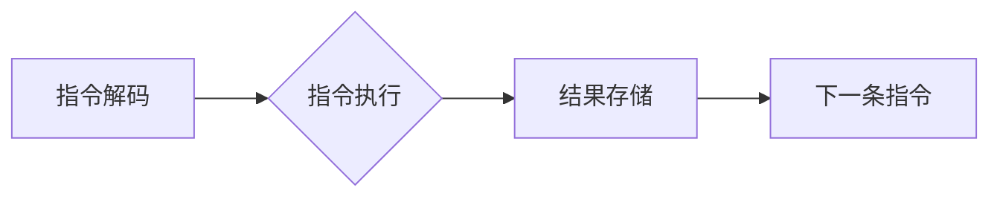

                 

## ARM架构：移动设备的核心

> 关键词：ARM架构、RISC、CPU、嵌入式系统、移动设备、性能、功耗、指令集

## 1. 背景介绍

在当今数字时代，移动设备已成为人们生活中不可或缺的一部分。从智能手机到平板电脑，再到可穿戴设备，这些设备的普及离不开高效、低功耗的处理器。而ARM架构作为移动设备的核心，在推动移动计算革命中发挥着至关重要的作用。

ARM架构并非一种具体的处理器，而是一种指令集架构（ISA），它定义了处理器与软件之间的接口。ARM架构的优势在于其精简的指令集（RISC）和灵活的设计，使得它能够被广泛应用于各种类型的嵌入式系统，尤其是在移动设备领域。

## 2. 核心概念与联系

### 2.1 ARM架构概述

ARM架构是一种精简指令集架构（RISC），其特点是指令长度固定，指令集相对简单，操作数少，执行速度快。与复杂指令集架构（CISC）相比，ARM架构更注重指令的效率和执行速度，从而降低了功耗和成本。

### 2.2 ARM架构的组成

ARM架构的处理器由多个核心组成，每个核心包含以下主要部件：

* **CPU核心：**负责执行指令，包括整数运算单元、浮点运算单元、内存管理单元等。
* **内存控制器：**管理处理器与内存之间的数据传输。
* **外设控制器：**控制处理器与各种外设（如显示器、传感器、网络接口等）之间的通信。

### 2.3 ARM架构的优势

* **高性能：**ARM架构的指令集设计使得处理器能够执行指令的速度更快，从而提高了整体性能。
* **低功耗：**ARM架构的精简指令集和流水线设计降低了功耗，使其非常适合移动设备等低功耗应用场景。
* **灵活可扩展：**ARM架构的开放性使得它能够被广泛应用于各种类型的设备，并可以根据不同的应用需求进行定制和扩展。

### 2.4 ARM架构的应用场景

ARM架构广泛应用于各种类型的嵌入式系统，尤其是在移动设备领域占据主导地位。

* **智能手机：**几乎所有主流智能手机都采用ARM架构的处理器。
* **平板电脑：**平板电脑也主要采用ARM架构的处理器。
* **可穿戴设备：**智能手表、运动手环等可穿戴设备也普遍使用ARM架构的处理器。
* **物联网设备：**ARM架构的处理器也广泛应用于物联网设备，如智能家居、智能交通等。

**Mermaid 流程图**



## 3. 核心算法原理 & 具体操作步骤

### 3.1  算法原理概述

ARM架构的核心算法原理是RISC指令集设计。RISC指令集的特点是指令长度固定，指令集相对简单，操作数少，执行速度快。

### 3.2  算法步骤详解

1. **指令获取：**处理器从内存中获取下一条指令。
2. **指令解码：**处理器解码指令，确定指令的操作数和操作类型。
3. **指令执行：**处理器执行指令，进行相应的运算或数据操作。
4. **结果存储：**处理器将运算结果存储到内存或寄存器中。
5. **跳转控制：**根据指令内容，处理器可能跳转到其他指令地址。

### 3.3  算法优缺点

**优点：**

* **高性能：**指令执行速度快，流水线设计提高了指令吞吐量。
* **低功耗：**指令集简单，操作数少，减少了处理器的工作量。
* **易于设计和实现：**指令集简单，硬件设计相对容易。

**缺点：**

* **指令集有限：**RISC指令集相对简单，可能无法满足所有类型的应用需求。
* **程序代码体积较大：**由于指令集简单，程序代码可能需要更多的指令来实现相同的功能。

### 3.4  算法应用领域

ARM架构的RISC指令集设计广泛应用于各种类型的嵌入式系统，尤其是在移动设备领域占据主导地位。

## 4. 数学模型和公式 & 详细讲解 & 举例说明

### 4.1  数学模型构建

ARM架构的性能可以根据以下数学模型进行评估：

**性能 = 指令吞吐量 * 指令时钟周期**

其中：

* 指令吞吐量是指处理器每秒钟能够执行的指令数量。
* 指令时钟周期是指处理器执行一条指令所需的时钟周期数。

### 4.2  公式推导过程

指令吞吐量可以根据以下公式计算：

**指令吞吐量 = 频率 / 指令时钟周期**

其中：

* 频率是指处理器的工作频率，单位为赫兹（Hz）。

### 4.3  案例分析与讲解

假设一个ARM处理器的工作频率为1GHz，每条指令的时钟周期为2个时钟周期，则其指令吞吐量为：

**指令吞吐量 = 10^9 Hz / 2 = 5 x 10^8 instructions/s**

## 5. 项目实践：代码实例和详细解释说明

### 5.1  开发环境搭建

为了演示ARM架构的编程，我们可以使用ARM官方提供的开发工具链，例如ARM Keil MDK。

### 5.2  源代码详细实现

以下是一个简单的ARM汇编程序，用于输出“Hello, ARM!”字符串：

```assembly
.global _start

_start:
    ldr r0, =message
    mov r1, #4
    mov r2, #0
    bl printf

    mov r7, #0
    bx lr

message:
    .asciz "Hello, ARM!\n"
```

### 5.3  代码解读与分析

* `.global _start`：声明`_start`为全局符号，作为程序的入口点。
* `ldr r0, =message`：将字符串地址存储在寄存器`r0`中。
* `mov r1, #4`：将字符串长度4存储在寄存器`r1`中。
* `mov r2, #0`：将输出缓冲区地址设置为0。
* `bl printf`：调用`printf`函数，输出字符串。
* `mov r7, #0`：设置程序退出状态码为0。
* `bx lr`：返回主程序。

### 5.4  运行结果展示

编译并运行该程序后，将输出“Hello, ARM!”字符串。

## 6. 实际应用场景

### 6.1  智能手机

ARM架构的处理器在智能手机领域占据主导地位，其高性能、低功耗和灵活的设计使其成为智能手机的理想选择。

### 6.2  平板电脑

平板电脑也主要采用ARM架构的处理器，其强大的性能和长续航能力满足了用户对平板电脑的性能和使用体验要求。

### 6.3  可穿戴设备

可穿戴设备，如智能手表和运动手环，对功耗和体积有更高的要求，ARM架构的处理器能够满足这些需求。

### 6.4  未来应用展望

随着移动计算的不断发展，ARM架构的应用场景将更加广泛。例如，在人工智能、虚拟现实和增强现实等领域，ARM架构的处理器将发挥越来越重要的作用。

## 7. 工具和资源推荐

### 7.1  学习资源推荐

* **ARM官方网站：**https://www.arm.com/
* **ARM架构入门书籍：**《ARM架构入门》
* **ARM汇编语言教程：**https://developer.arm.com/documentation/ddi0487/latest

### 7.2  开发工具推荐

* **ARM Keil MDK：**https://www.keil.com/
* **ARM GCC工具链：**https://developer.arm.com/open-source/gnu-toolchain/gnu-rm

### 7.3  相关论文推荐

* **ARM架构的性能分析和优化：**https://ieeexplore.ieee.org/document/7890244
* **ARM架构在移动设备中的应用：**https://www.sciencedirect.com/science/article/pii/S016764231930071X

## 8. 总结：未来发展趋势与挑战

### 8.1  研究成果总结

ARM架构在移动设备领域取得了巨大的成功，其高性能、低功耗和灵活的设计使其成为移动计算的基石。

### 8.2  未来发展趋势

未来，ARM架构将继续朝着更高性能、更低功耗、更安全的方向发展。例如，ARM架构将支持更先进的机器学习算法，并应用于更多的新兴领域。

### 8.3  面临的挑战

ARM架构也面临着一些挑战，例如如何提高指令集的效率，如何更好地支持人工智能等新兴应用。

### 8.4  研究展望

未来，研究人员将继续探索ARM架构的潜力，并开发出更先进的处理器和应用。


## 9. 附录：常见问题与解答

### 9.1  ARM架构和x86架构的区别是什么？

ARM架构和x86架构都是处理器架构，但它们的设计理念和特点有所不同。ARM架构是一种RISC架构，指令集简单，执行速度快，功耗低，而x86架构是一种CISC架构，指令集复杂，执行速度相对较慢，功耗较高。

### 9.2  ARM架构的处理器有哪些？

ARM架构的处理器有很多，例如ARM Cortex-A系列、ARM Cortex-M系列等。不同的系列处理器针对不同的应用场景进行了优化。

### 9.3  如何学习ARM架构？

学习ARM架构可以参考ARM官方网站提供的学习资源，例如ARM架构入门书籍、ARM汇编语言教程等。


作者：禅与计算机程序设计艺术 / Zen and the Art of Computer Programming 
<end_of_turn>

