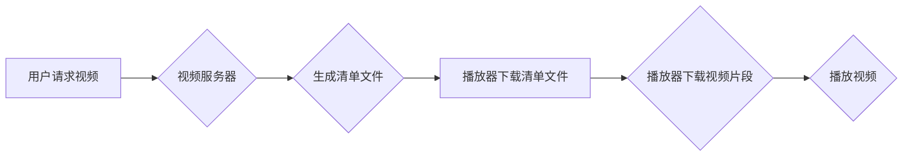

                 

## HLS 协议：在 HTTP 上分发视频

> 关键词：HLS, HTTP Live Streaming, 视频分发, 流媒体, DASH, 适应性流媒体, 编码, 分段, 播放器

## 1. 背景介绍

随着互联网技术的快速发展和移动设备的普及，在线视频服务需求量呈指数级增长。为了满足用户对高质量、流畅视频体验的需求，高效、可靠的视频分发协议成为关键。HTTP Live Streaming (HLS) 协议应运而生，它基于 HTTP 协议，将视频内容分割成小的片段，并通过 HTTP 协议进行分发，从而实现实时视频流的传输。

HLS 协议由苹果公司于 2009 年提出，并迅速成为业界主流的直播和点播视频分发协议之一。其优势在于：

* **基于 HTTP 协议：** HLS 协议充分利用了 HTTP 协议的成熟性和广泛支持，无需额外的协议栈，易于部署和维护。
* **适应性流媒体：** HLS 支持多种视频码率和分辨率，可以根据用户的网络状况和设备能力动态调整视频质量，保证流畅的播放体验。
* **低延迟：** HLS 协议采用分段传输方式，可以有效降低视频播放延迟，提升用户体验。
* **广泛兼容性：** HLS 协议被广泛支持，包括 iOS、Android、Windows、Linux 等主流平台，以及各种视频播放器和设备。

## 2. 核心概念与联系

HLS 协议的核心概念包括：

* **媒体文件：** 视频内容被分割成多个小的媒体片段，每个片段包含视频数据、音频数据和元数据。
* **清单文件 (M3U8)：** 清单文件包含了媒体片段的地址和信息，例如时长、码率、分辨率等。播放器会根据清单文件下载和播放视频片段。
* **分段传输：** 视频内容通过分段传输，每个片段独立下载，可以根据网络状况动态调整下载速度和片段大小。
* **变速播放：** HLS 支持变速播放功能，用户可以根据需要调整视频播放速度。

**Mermaid 流程图：**



## 3. 核心算法原理 & 具体操作步骤

### 3.1  算法原理概述

HLS 协议的核心算法原理是将视频内容分割成小的片段，并通过 HTTP 协议进行分发。播放器会根据清单文件下载和播放视频片段，实现实时视频流的传输。

### 3.2  算法步骤详解

1. **视频编码：** 视频内容首先需要进行编码，将视频数据压缩成更小的文件大小。常用的视频编码格式包括 H.264、H.265 等。
2. **视频分割：** 编码后的视频内容被分割成多个小的媒体片段，每个片段的时长通常在 5-10 秒之间。
3. **清单文件生成：** 每个媒体片段的地址和信息，例如时长、码率、分辨率等，都会被记录在清单文件中。清单文件通常以 M3U8 格式存储。
4. **视频分发：** 视频服务器会将清单文件和媒体片段存储在网络服务器上，并提供 HTTP 接口供播放器访问。
5. **播放器下载清单文件：** 播放器会向视频服务器请求清单文件，获取视频片段的地址和信息。
6. **播放器下载视频片段：** 播放器根据清单文件下载视频片段，并缓存到本地。
7. **播放视频：** 播放器将下载的视频片段拼接在一起，并播放视频内容。

### 3.3  算法优缺点

**优点：**

* **基于 HTTP 协议：** 充分利用了 HTTP 协议的成熟性和广泛支持。
* **适应性流媒体：** 支持多种视频码率和分辨率，可以根据用户的网络状况和设备能力动态调整视频质量。
* **低延迟：** 分段传输方式可以有效降低视频播放延迟。
* **广泛兼容性：** 被广泛支持，包括 iOS、Android、Windows、Linux 等主流平台。

**缺点：**

* **相对复杂：** HLS 协议的实现相对复杂，需要对 HTTP 协议和视频编码技术有一定的了解。
* **清单文件更新：** 清单文件需要定期更新，以反映最新的视频片段地址和信息。

### 3.4  算法应用领域

HLS 协议广泛应用于以下领域：

* **直播视频：** 直播体育赛事、新闻直播、在线会议等。
* **点播视频：** 在线电影、电视剧、纪录片等。
* **教育视频：** 在线课程、教学视频等。
* **企业视频：** 内部培训、产品演示等。

## 4. 数学模型和公式 & 详细讲解 & 举例说明

### 4.1  数学模型构建

HLS 协议的数学模型主要围绕视频片段大小、码率和播放时间进行构建。

* **视频片段大小 (S)：**  S = T * B，其中 T 为片段时长，B 为比特率。
* **码率 (B)：** B = Q * R，其中 Q 为视频质量，R 为分辨率。
* **播放时间 (T)：** T = V / S，其中 V 为视频总时长，S 为视频片段大小。

### 4.2  公式推导过程

* **视频总时长 (V)：** V = N * T，其中 N 为视频片段数量。
* **视频总大小 (V)：** V = N * S = N * (T * B) = (N * T) * B = (V / T) * B = V * B / T

### 4.3  案例分析与讲解

假设一个视频时长为 10 分钟，分辨率为 1080p，视频质量为高，比特率为 5Mbps。

* 视频片段时长为 5 秒，片段大小为 5 * 5 = 25 MB。
* 视频总大小为 10 * 60 * 5 = 3000 MB。

根据上述公式，我们可以计算出视频片段数量、码率和播放时间等信息。

## 5. 项目实践：代码实例和详细解释说明

### 5.1  开发环境搭建

HLS 视频分发可以使用多种开发工具和平台，例如 FFmpeg、Nginx、AWS Elemental MediaLive 等。

### 5.2  源代码详细实现

由于篇幅限制，这里只提供一个简单的 HLS 视频分发代码示例，使用 Python 和 FFmpeg 库。

```python
import subprocess

# 视频文件路径
video_file = "input.mp4"

# 输出 HLS 文件夹路径
hls_output_dir = "output"

# FFmpeg 命令
command = [
    "ffmpeg",
    "-i", video_file,
    "-c:v", "libx264",
    "-hls_time", "5",
    "-hls_list_size", "0",
    "-f", "hls",
    hls_output_dir
]

# 执行 FFmpeg 命令
subprocess.run(command)
```

### 5.3  代码解读与分析

* `subprocess.run(command)`: 使用 Python 的 `subprocess` 模块执行 FFmpeg 命令。
* `-i video_file`: 指定输入视频文件路径。
* `-c:v libx264`: 使用 H.264 编码器编码视频。
* `-hls_time 5`: 设置每个视频片段的时长为 5 秒。
* `-hls_list_size 0`: 设置清单文件包含所有片段的地址。
* `-f hls`: 指定输出格式为 HLS。
* `hls_output_dir`: 指定输出 HLS 文件夹路径。

### 5.4  运行结果展示

执行上述代码后，会在 `output` 文件夹中生成一个 HLS 视频文件，包含多个视频片段和清单文件。

## 6. 实际应用场景

HLS 协议广泛应用于各种视频分发场景，例如：

* **直播平台：** 直播平台使用 HLS 协议分发直播视频，例如 Twitch、YouTube Live 等。
* **视频点播平台：** 视频点播平台使用 HLS 协议分发点播视频，例如 Netflix、Amazon Prime Video 等。
* **移动视频应用：** 移动视频应用使用 HLS 协议分发视频内容，例如 YouTube、Vimeo 等。

### 6.4  未来应用展望

随着 5G 网络和移动设备的普及，HLS 协议的应用场景将更加广泛，例如：

* **VR/AR 视频：** HLS 协议可以用于分发 VR/AR 视频内容，提供沉浸式体验。
* **低延迟视频游戏：** HLS 协议可以用于分发低延迟视频游戏内容，提升游戏体验。
* **物联网视频：** HLS 协议可以用于分发物联网视频内容，例如智能家居监控、无人机视频等。

## 7. 工具和资源推荐

### 7.1  学习资源推荐

* **苹果官方文档：** https://developer.apple.com/streaming/hls/
* **HLS 协议详解：** https://en.wikipedia.org/wiki/HTTP_Live_Streaming
* **FFmpeg 文档：** https://ffmpeg.org/documentation.html

### 7.2  开发工具推荐

* **FFmpeg：** https://ffmpeg.org/
* **Nginx：** https://nginx.org/
* **AWS Elemental MediaLive：** https://aws.amazon.com/medialive/

### 7.3  相关论文推荐

* **HTTP Live Streaming：** https://www.usenix.org/system/files/conference/hotoshop10/hotoshop10-paper-schwartz.pdf
* **Adaptive Bitrate Streaming：** https://ieeexplore.ieee.org/document/6379604

## 8. 总结：未来发展趋势与挑战

### 8.1  研究成果总结

HLS 协议作为一种成熟的视频分发协议，在直播和点播视频领域取得了广泛应用。其基于 HTTP 协议的优势、适应性流媒体特性和低延迟特性使其成为视频分发领域的优选方案。

### 8.2  未来发展趋势

未来，HLS 协议将继续朝着以下方向发展：

* **更低延迟：** 通过优化视频编码和分段传输算法，进一步降低视频播放延迟。
* **更智能的适应性流媒体：** 基于用户行为和网络状况，更智能地调整视频码率和分辨率，提升用户体验。
* **更广泛的应用场景：** 扩展到 VR/AR 视频、低延迟视频游戏等新兴应用场景。

### 8.3  面临的挑战

HLS 协议也面临一些挑战：

* **网络环境复杂：** 网络环境复杂多变，需要更 robust 的算法和机制来应对网络波动和丢包问题。
* **设备差异性：** 不同设备的硬件能力和软件环境差异较大，需要提供更灵活的视频分发方案。
* **安全性和隐私性：** 视频内容的安全性与隐私性需要得到保障，需要开发更安全的视频分发机制。

### 8.4  研究展望

未来，HLS 协议的研究方向将包括：

* **更先进的视频编码算法：** 探索更有效的视频编码算法，降低视频文件大小和带宽需求。
* **更智能的适应性流媒体算法：** 基于机器学习和人工智能技术，开发更智能的适应性流媒体算法，提升用户体验。
* **更安全的视频分发机制：** 开发更安全的视频分发机制，保障视频内容的安全性与隐私性。


## 9. 附录：常见问题与解答

**Q1：HLS 和 DASH 协议有什么区别？**

**A1：** HLS 和 DASH 都是视频分发协议，但它们在一些关键方面有所不同。HLS 基于 HTTP 协议，而 DASH 基于 MPEG-DASH 标准。HLS 协议主要用于直播视频，而 DASH 协议更适合点播视频。

**Q2：如何选择合适的 HLS 视频分发方案？**

**A2：** 选择合适的 HLS 视频分发方案需要考虑以下因素：

* **视频内容类型：** 直播视频还是点播视频？
* **目标用户群体：** 用户的网络状况和设备能力如何？
* **视频质量要求：** 需要什么样的视频质量？
* **预算和资源：** 

作者：禅与计算机程序设计艺术 / Zen and the Art of Computer Programming 


<end_of_turn>

