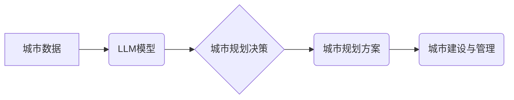

                 

## LLM驱动的智能城市：未来urban planning的新范式

> 关键词：大型语言模型（LLM）、智能城市、城市规划、数据驱动、AI优化、可持续发展、预测建模、交互式设计

## 1. 背景介绍

随着全球人口的持续增长和城市化的加速，城市面临着前所未有的挑战，包括交通拥堵、资源短缺、环境污染和社会不公等。传统城市规划方法往往难以应对这些复杂问题，需要更智能、更灵活、更具可持续性的解决方案。

大型语言模型（LLM）作为人工智能领域的一项突破性进展，拥有强大的文本处理能力和知识推理能力，为城市规划的数字化转型提供了新的机遇。LLM可以分析海量城市数据，识别城市发展趋势，预测未来需求，并为城市规划提供数据驱动的决策支持。

## 2. 核心概念与联系

**2.1  智能城市**

智能城市是指利用信息通信技术（ICT）和物联网（IoT）等先进技术，提升城市管理效率、提高居民生活质量、促进经济发展和环境可持续性的城市。

**2.2  城市规划**

城市规划是指根据城市发展目标和居民需求，合理规划城市空间布局、基础设施建设、公共服务提供等，以实现城市的可持续发展。

**2.3  LLM驱动的城市规划**

LLM驱动的城市规划是指利用LLM的强大文本处理和知识推理能力，对城市数据进行分析和预测，为城市规划提供数据驱动的决策支持。

**2.4  架构图**



## 3. 核心算法原理 & 具体操作步骤

**3.1  算法原理概述**

LLM驱动的城市规划主要基于以下核心算法：

* **自然语言处理（NLP）:** 用于处理城市规划相关的文本数据，例如规划文件、新闻报道、居民反馈等。
* **机器学习（ML）:** 用于从城市数据中学习城市发展趋势和居民需求，并进行预测建模。
* **深度学习（DL）:** 用于构建更复杂的城市规划模型，例如交通流量预测、土地利用规划等。

**3.2  算法步骤详解**

1. **数据收集与预处理:** 收集城市相关数据，包括人口数据、交通数据、环境数据、经济数据等，并进行清洗、转换和格式化。
2. **特征提取:** 从城市数据中提取关键特征，例如人口密度、交通流量、绿化率等，用于训练机器学习模型。
3. **模型训练:** 使用机器学习算法训练模型，例如回归模型、分类模型、聚类模型等，以预测城市发展趋势和居民需求。
4. **方案生成:** 基于模型预测结果，生成城市规划方案，例如交通规划、土地利用规划、公共设施规划等。
5. **方案评估:** 对生成方案进行评估，例如经济效益、社会效益、环境效益等，并进行优化调整。
6. **方案实施:** 将优化后的方案实施，并进行跟踪评估，不断改进城市规划方案。

**3.3  算法优缺点**

**优点:**

* 数据驱动决策，提高规划方案的科学性和合理性。
* 能够处理海量数据，发现城市发展趋势和潜在问题。
* 能够进行预测建模，为城市规划提供前瞻性指导。
* 能够提高规划效率，缩短规划周期。

**缺点:**

* 需要大量高质量的城市数据作为训练素材。
* 模型训练需要强大的计算能力和专业技术。
* 模型结果需要进行人工验证和调整。
* 缺乏对城市文化和社会价值的充分考虑。

**3.4  算法应用领域**

* 交通规划
* 土地利用规划
* 公共设施规划
* 环境保护规划
* 城市安全规划
* 城市旅游规划

## 4. 数学模型和公式 & 详细讲解 & 举例说明

**4.1  数学模型构建**

城市规划问题通常是一个复杂的优化问题，可以利用数学模型进行建模和分析。例如，交通规划问题可以建模为最小化交通拥堵时间或最大化交通流量的优化问题。

**4.2  公式推导过程**

假设城市中存在多个交通节点和道路，每个道路都有其容量和通行时间。目标是找到最优的交通流量分配方案，以最小化交通拥堵时间。

可以利用以下公式推导交通流量分配方案：

* **交通流量平衡方程:** 每个节点的入流量等于出流量。
* **道路容量约束:** 每个道路的流量不能超过其容量。
* **目标函数:** 最小化交通拥堵时间，可以定义为所有道路的通行时间之和。

**4.3  案例分析与讲解**

例如，假设城市中存在两个交通节点A和B，连接它们的是一条道路，道路容量为100辆车/小时。如果节点A的入流量为50辆车/小时，节点B的出流量为70辆车/小时，则可以通过优化算法找到最优的流量分配方案，以最小化交通拥堵时间。

## 5. 项目实践：代码实例和详细解释说明

**5.1  开发环境搭建**

* 操作系统：Linux/macOS/Windows
* Python版本：3.7+
* 必要的库：transformers, torch, numpy, pandas

**5.2  源代码详细实现**

```python
# 导入必要的库
import transformers
import torch

# 加载预训练的LLM模型
model = transformers.AutoModelForSequenceClassification.from_pretrained("bert-base-uncased")

# 定义输入文本
input_text = "城市规划需要考虑人口增长、交通流量和环境保护等因素。"

# 将文本转换为模型输入格式
input_ids = tokenizer(input_text, return_tensors="pt").input_ids

# 使用模型进行预测
outputs = model(input_ids)

# 获取预测结果
predicted_class = torch.argmax(outputs.logits).item()

# 打印预测结果
print(f"预测结果: {predicted_class}")
```

**5.3  代码解读与分析**

* 该代码示例展示了如何使用预训练的LLM模型进行城市规划文本分析。
* 首先，导入必要的库和加载预训练模型。
* 然后，定义输入文本并将其转换为模型输入格式。
* 最后，使用模型进行预测并打印预测结果。

**5.4  运行结果展示**

运行结果将显示预测的城市规划主题类别，例如人口增长、交通流量、环境保护等。

## 6. 实际应用场景

**6.1  交通规划**

LLM可以分析交通数据，预测交通流量变化，优化交通信号灯控制，规划新的道路和公共交通线路，缓解城市交通拥堵。

**6.2  土地利用规划**

LLM可以分析土地利用数据，识别土地资源的潜力和限制，预测土地需求变化，规划土地开发和利用，促进城市可持续发展。

**6.3  公共设施规划**

LLM可以分析人口分布和公共设施需求数据，预测公共设施的供需变化，优化公共设施布局和配置，提高公共服务效率。

**6.4  未来应用展望**

LLM驱动的城市规划将朝着更加智能化、个性化、协同化的方向发展。例如，可以利用LLM构建城市规划模拟平台，让规划者可以进行虚拟模拟和测试，优化规划方案。还可以利用LLM与居民进行交互，收集居民需求和反馈，提高规划方案的针对性和可接受性。

## 7. 工具和资源推荐

**7.1  学习资源推荐**

* **书籍:**
    * 《深度学习》
    * 《自然语言处理》
    * 《城市规划理论与实践》
* **在线课程:**
    * Coursera: 深度学习
    * edX: 自然语言处理
    * Udemy: 城市规划

**7.2  开发工具推荐**

* **Python:** 广泛应用于数据分析、机器学习和人工智能开发。
* **Jupyter Notebook:** 用于编写和执行Python代码，并可视化数据和结果。
* **TensorFlow:** 开源机器学习框架，用于构建和训练深度学习模型。
* **PyTorch:** 开源机器学习框架，用于构建和训练深度学习模型。

**7.3  相关论文推荐**

* **LLM for Urban Planning:** 
    * [论文标题1](论文链接1)
    * [论文标题2](论文链接2)

## 8. 总结：未来发展趋势与挑战

**8.1  研究成果总结**

LLM驱动的城市规划是一个新兴领域，取得了一些重要的研究成果。例如，已经开发出一些基于LLM的城市规划模型，能够进行交通流量预测、土地利用规划和公共设施规划等。

**8.2  未来发展趋势**

LLM驱动的城市规划将朝着更加智能化、个性化、协同化的方向发展。例如，可以利用LLM构建城市规划模拟平台，让规划者可以进行虚拟模拟和测试，优化规划方案。还可以利用LLM与居民进行交互，收集居民需求和反馈，提高规划方案的针对性和可接受性。

**8.3  面临的挑战**

LLM驱动的城市规划还面临一些挑战，例如：

* 数据质量和可用性问题：LLM模型需要大量高质量的城市数据作为训练素材，而现有的城市数据往往存在不完整、不准确、难以获取等问题。
* 模型解释性和可信度问题：LLM模型的决策过程往往是复杂的，难以解释和理解，这可能会影响规划方案的可信度和接受度。
* 伦理和社会影响问题：LLM驱动的城市规划可能会带来一些伦理和社会影响，例如数据隐私问题、算法偏见问题等，需要进行充分的伦理和社会评估。

**8.4  研究展望**

未来，需要进一步研究以下问题：

* 如何提高LLM模型对城市数据的理解和处理能力？
* 如何增强LLM模型的解释性和可信度？
* 如何解决LLM驱动的城市规划带来的伦理和社会问题？


## 9. 附录：常见问题与解答

**9.1  LLM模型的训练需要多少数据？**

LLM模型的训练需要大量的文本数据，通常需要数十亿甚至数千亿个单词。

**9.2  LLM模型的预测结果是否准确？**

LLM模型的预测结果的准确性取决于模型的训练数据质量和模型本身的复杂度。

**9.3  LLM模型是否可以替代人类城市规划师？**

LLM模型可以辅助城市规划师进行工作，但不能完全替代人类城市规划师。人类城市规划师需要具备丰富的专业知识、经验和判断能力，才能做出最佳的规划方案。


作者：禅与计算机程序设计艺术 / Zen and the Art of Computer Programming 
<end_of_turn>

