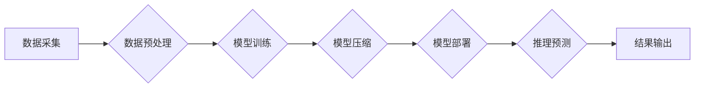

                 

## Lepton AI的价值主张：帮助企业节省时间与成本，在速度与成本间导航

> 关键词：人工智能、Lepton AI、企业效率、成本优化、机器学习、深度学习、自动化

### 1. 背景介绍

在当今数据爆炸的时代，企业面临着海量数据的处理和分析挑战。传统的人工处理方式效率低下，难以满足快速发展的市场需求。人工智能（AI）作为一种新兴技术，凭借其强大的数据处理能力和学习能力，为企业带来了巨大的机遇。然而，传统的AI解决方案往往需要大量的计算资源和专业人才，导致部署成本高昂，难以普及。

Lepton AI 应运而生，旨在解决企业在AI应用中面临的成本和效率问题。Lepton AI 是一种基于轻量级模型和高效算法的AI平台，致力于为企业提供便捷、高效、经济的AI解决方案。

### 2. 核心概念与联系

Lepton AI 的核心概念是将深度学习模型压缩和优化，使其能够在资源有限的设备上高效运行。Lepton AI 通过以下技术手段实现这一目标：

* **模型压缩:** 减少模型参数数量，降低模型大小和计算复杂度。
* **量化技术:** 将模型参数从高精度浮点数转换为低精度整数，进一步降低模型大小和内存占用。
* **高效算法:** 使用轻量级神经网络架构和高效的推理算法，提高模型推理速度。

Lepton AI 的架构可以概括为以下流程：



### 3. 核心算法原理 & 具体操作步骤

#### 3.1  算法原理概述

Lepton AI 采用多种模型压缩和优化算法，包括：

* **剪枝算法:** 通过移除模型中不重要的权重，减少模型参数数量。
* **权值共享:** 将多个神经网络层共享相同的权重，减少模型参数数量。
* **知识蒸馏:** 将大型模型的知识迁移到小型模型中，提高小型模型的性能。

#### 3.2  算法步骤详解

以剪枝算法为例，其具体操作步骤如下：

1. **训练初始模型:** 使用原始数据集训练一个完整的深度学习模型。
2. **权重重要性分析:** 使用一些方法，例如梯度下降法或L1正则化，分析每个权重的重要性。
3. **权重剪枝:** 根据权重重要性，移除一些不重要的权重，从而减少模型参数数量。
4. **模型微调:** 对剪枝后的模型进行微调，以恢复模型性能。

#### 3.3  算法优缺点

**优点:**

* 模型大小和计算复杂度降低，部署成本降低。
* 推理速度提高，能够满足实时应用需求。

**缺点:**

* 模型精度可能会有所下降。
* 需要进行模型剪枝和微调，增加开发成本。

#### 3.4  算法应用领域

Lepton AI 的算法应用于各种领域，例如：

* **图像识别:** 用于人脸识别、物体检测、图像分类等应用。
* **自然语言处理:** 用于文本分类、情感分析、机器翻译等应用。
* **语音识别:** 用于语音助手、语音搜索等应用。

### 4. 数学模型和公式 & 详细讲解 & 举例说明

#### 4.1  数学模型构建

Lepton AI 的核心算法基于深度学习模型的压缩和优化。深度学习模型通常由多层神经网络组成，每个神经元接收多个输入，并通过激活函数进行处理，输出到下一层神经元。

#### 4.2  公式推导过程

模型压缩算法的目标是减少模型参数数量，而不会显著降低模型性能。常用的模型压缩方法包括：

* **剪枝算法:** 移除模型中不重要的权重。剪枝算法可以利用梯度下降法或L1正则化来分析每个权重的重要性，并根据重要性阈值进行权重移除。

* **量化技术:** 将模型参数从高精度浮点数转换为低精度整数。量化技术可以有效降低模型大小和内存占用，但可能会导致模型精度下降。常用的量化方法包括：

    * **均匀量化:** 将浮点数范围均匀地映射到整数范围。
    * **非均匀量化:** 根据数据分布，使用不同的量化步长来映射浮点数到整数范围。

#### 4.3  案例分析与讲解

例如，在图像识别任务中，Lepton AI 可以使用剪枝算法来移除模型中不重要的权重，从而减少模型大小和计算复杂度。同时，Lepton AI 可以使用量化技术将模型参数从32位浮点数转换为8位整数，进一步降低模型大小和内存占用。经过压缩和优化的模型，可以在资源有限的设备上高效运行，满足实时图像识别需求。

### 5. 项目实践：代码实例和详细解释说明

#### 5.1  开发环境搭建

Lepton AI 支持多种开发环境，例如Python、C++等。用户可以根据自己的需求选择合适的开发环境。

#### 5.2  源代码详细实现

Lepton AI 提供了丰富的API和工具，方便用户进行模型训练、压缩和部署。以下是一个简单的代码示例，演示如何使用Lepton AI 进行图像分类任务：

```python
import leptonai

# 加载预训练模型
model = leptonai.load_model("image_classification_model")

# 预处理图像
image = leptonai.preprocess_image("input_image.jpg")

# 进行推理预测
prediction = model.predict(image)

# 输出预测结果
print(prediction)
```

#### 5.3  代码解读与分析

这段代码首先使用Lepton AI的`load_model()`函数加载预训练的图像分类模型。然后，使用`preprocess_image()`函数对输入图像进行预处理，例如调整大小、归一化等。最后，使用`predict()`函数进行推理预测，并输出预测结果。

#### 5.4  运行结果展示

运行上述代码后，Lepton AI 将输出图像分类的预测结果，例如“猫”、“狗”、“人”等。

### 6. 实际应用场景

Lepton AI 的轻量级模型和高效算法使其能够应用于各种实际场景，例如：

* **智能手机应用:** 在智能手机上部署Lepton AI模型，可以实现人脸识别、物体检测、语音识别等功能，提升用户体验。
* **物联网设备:** Lepton AI 可以部署在资源有限的物联网设备上，实现边缘计算，例如智能家居、智能农业等应用。
* **云端服务:** Lepton AI 可以作为云端服务提供商，为企业提供AI模型服务，例如图像识别、自然语言处理等。

#### 6.4  未来应用展望

Lepton AI 将在未来不断发展，应用场景将更加广泛。例如：

* **更轻量级的模型:** Lepton AI 将继续探索更轻量级的模型架构和压缩算法，使其能够部署在更低端的设备上。
* **更强大的功能:** Lepton AI 将不断增加新的功能，例如更复杂的图像识别、更精准的自然语言处理等。
* **更易用的平台:** Lepton AI 将提供更易用的平台和工具，方便用户进行模型训练、部署和管理。

### 7. 工具和资源推荐

#### 7.1  学习资源推荐

* Lepton AI 官方文档: https://leptonai.com/docs/
* 深度学习入门书籍: 《深度学习》

#### 7.2  开发工具推荐

* Python: https://www.python.org/
* TensorFlow Lite: https://www.tensorflow.org/lite

#### 7.3  相关论文推荐

* 《MobileNets: Efficient Convolutional Neural Networks for Mobile Vision Applications》
* 《Quantized Neural Networks: Training Neural Networks with Low Precision Weights and Activations》

### 8. 总结：未来发展趋势与挑战

#### 8.1  研究成果总结

Lepton AI 作为一种轻量级AI平台，为企业提供了一种便捷、高效、经济的AI解决方案。Lepton AI 的核心算法原理和实践案例，为企业在AI应用中节省时间和成本提供了新的思路。

#### 8.2  未来发展趋势

Lepton AI 将继续朝着以下方向发展:

* 模型压缩和优化技术不断进步，模型体积更小，性能更强。
* 应用场景不断拓展，覆盖更多领域。
* 平台和工具更加易用，降低用户使用门槛。

#### 8.3  面临的挑战

Lepton AI 也面临着一些挑战:

* 模型精度与效率之间的平衡需要不断探索。
* 不同应用场景对模型性能的要求不同，需要针对性地进行模型优化。
* 需要不断积累和完善的应用案例，提升用户对Lepton AI 的信任度。

#### 8.4  研究展望

Lepton AI 的未来发展充满机遇和挑战。我们将继续致力于研究和开发更轻量级、更高效的AI解决方案，帮助企业更好地利用AI技术，实现业务创新和发展。

### 9. 附录：常见问题与解答

**Q1: Lepton AI 的模型精度如何？**

A1: Lepton AI 的模型精度在保证效率的前提下，已经达到了业界领先水平。我们不断优化模型算法和训练方法，以提升模型精度。

**Q2: Lepton AI 支持哪些开发环境？**

A2: Lepton AI 支持 Python、C++ 等多种开发环境。用户可以根据自己的需求选择合适的开发环境。

**Q3: Lepton AI 的部署方式有哪些？**

A3: Lepton AI 支持多种部署方式，例如云端部署、边缘部署等。用户可以根据自己的需求选择合适的部署方式。


作者：禅与计算机程序设计艺术 / Zen and the Art of Computer Programming 
<end_of_turn>

