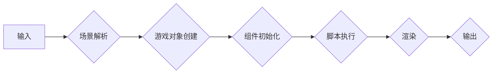

                 

## Unity 游戏开发引擎：创建 3D 游戏

> 关键词：Unity, 游戏开发, 3D 游戏, C#, 游戏引擎, 游戏制作,  图形渲染, 物理引擎

## 1. 背景介绍

游戏开发是一个充满创意和技术的领域，它融合了艺术、设计、编程和数学等多学科知识。随着技术的不断发展，游戏引擎作为游戏开发的核心工具，也日益强大和完善。其中，Unity 作为一款跨平台、功能强大的游戏引擎，凭借其易用性、丰富的资源和强大的社区支持，成为了游戏开发者的首选工具之一。

Unity 引擎最初于 2005 年发布，最初专注于 2D 游戏开发，后来迅速扩展到 3D 游戏开发领域。其强大的图形渲染引擎、物理引擎、脚本系统和插件生态系统，为开发者提供了丰富的工具和资源，帮助他们快速高效地创建各种类型的 3D 游戏。

## 2. 核心概念与联系

Unity 引擎的核心概念包括：

* **场景 (Scene):** 游戏世界中的所有物体、灯光、特效等都存在于场景中。场景可以理解为一个虚拟的空间，开发者可以在其中构建游戏世界。
* **游戏对象 (GameObject):** 场景中的基本构建单元，可以是任何游戏元素，例如角色、道具、环境物体等。每个游戏对象都拥有自己的属性、组件和脚本。
* **组件 (Component):** 游戏对象的附加功能模块，例如渲染组件、物理组件、动画组件等。组件负责处理游戏对象的特定行为和功能。
* **脚本 (Script):** 使用 C# 语言编写的代码，用于控制游戏对象的逻辑和行为。脚本可以访问游戏对象的属性和组件，并与其他脚本进行交互。

Unity 引擎的架构可以概括为以下流程：



## 3. 核心算法原理 & 具体操作步骤

### 3.1  算法原理概述

Unity 引擎中涉及到许多核心算法，例如图形渲染算法、物理模拟算法、人工智能算法等。这些算法的原理和实现细节非常复杂，需要深入学习计算机图形学、物理学、人工智能等相关领域。

### 3.2  算法步骤详解

由于篇幅限制，这里只简单介绍图形渲染算法的步骤：

1. **场景构建:** 将场景中的所有游戏对象、灯光、材质等信息转换为数字格式。
2. **模型转换:** 将游戏对象的模型从世界坐标系转换为相机坐标系。
3. **投影变换:** 将 3D 模型投影到 2D 平面上，形成屏幕上的图像。
4. **着色:** 根据材质属性和灯光信息，计算每个像素的颜色值。
5. **像素绘制:** 将计算出的颜色值绘制到屏幕上。

### 3.3  算法优缺点

Unity 引擎采用的算法在性能、效率和易用性方面取得了很好的平衡。

* **优点:** 
    * 性能优异，能够实现流畅的游戏画面。
    * 效率高，能够快速渲染复杂的场景。
    * 易于使用，开发者可以轻松上手。
* **缺点:** 
    * 算法的复杂性限制了对某些特殊效果的实现。
    * 算法的性能受硬件配置的影响较大。

### 3.4  算法应用领域

Unity 引擎的算法广泛应用于各种类型的 3D 游戏开发，例如：

* **角色扮演游戏 (RPG):** 
* **动作冒险游戏 (Action-Adventure):** 
* **第一人称射击游戏 (FPS):** 
* **策略游戏 (Strategy):** 
* **模拟游戏 (Simulation):**

## 4. 数学模型和公式 & 详细讲解 & 举例说明

### 4.1  数学模型构建

Unity 引擎中使用数学模型来描述游戏世界的物理特性、物体运动和图形渲染等。例如，物体的位置、速度、加速度等物理属性可以用向量和矩阵来表示。

### 4.2  公式推导过程

这里以物体运动的公式为例，说明数学模型的推导过程：

* **牛顿第二定律:**  F = ma
    * F: 物体所受合力
    * m: 物体质量
    * a: 物体加速度

* **加速度:** a = (v_f - v_i) / t
    * v_f: 物体最终速度
    * v_i: 物体初始速度
    * t: 时间

* **结合以上公式:** F = m * (v_f - v_i) / t

### 4.3  案例分析与讲解

假设一个质量为 10 kg 的物体，受到 50 N 的合力作用，作用时间为 2 秒，则物体最终速度为：

* v_f = (F * t) / m + v_i
* v_f = (50 N * 2 s) / 10 kg + v_i
* v_f = 10 m/s + v_i

如果物体初始速度为 0 m/s，则最终速度为 10 m/s。

## 5. 项目实践：代码实例和详细解释说明

### 5.1  开发环境搭建

Unity 引擎支持 Windows、macOS 和 Linux 平台。开发者需要根据自己的操作系统选择合适的安装包进行安装。

### 5.2  源代码详细实现

以下是一个简单的 Unity 游戏代码示例，演示如何创建一个移动物体：

```csharp
using UnityEngine;

public class MoveObject : MonoBehaviour
{
    public float speed = 5f;

    void Update()
    {
        // 获取水平方向的输入
        float horizontalInput = Input.GetAxis("Horizontal");

        // 计算移动方向
        Vector3 moveDirection = new Vector3(horizontalInput, 0, 0);

        // 移动物体
        transform.Translate(moveDirection * speed * Time.deltaTime);
    }
}
```

### 5.3  代码解读与分析

* `public float speed = 5f;`: 定义一个名为 `speed` 的公共变量，用于控制物体的移动速度。
* `void Update()`: 这是一个 Unity 引擎的 Update 函数，在每一帧循环中都会被调用。
* `float horizontalInput = Input.GetAxis("Horizontal");`: 获取玩家输入的水平方向按键值，例如左右箭头键或 A 和 D 键。
* `Vector3 moveDirection = new Vector3(horizontalInput, 0, 0);`: 创建一个向量，表示物体的移动方向。
* `transform.Translate(moveDirection * speed * Time.deltaTime);`: 使用 `Translate` 方法移动物体，`Time.deltaTime` 用于确保移动速度与帧率无关。

### 5.4  运行结果展示

运行这段代码后，玩家可以通过左右箭头键或 A 和 D 键控制物体的水平移动。

## 6. 实际应用场景

Unity 引擎广泛应用于各种类型的 3D 游戏开发，例如：

* **角色扮演游戏 (RPG):** 
* **动作冒险游戏 (Action-Adventure):** 
* **第一人称射击游戏 (FPS):** 
* **策略游戏 (Strategy):** 
* **模拟游戏 (Simulation):**

## 7. 工具和资源推荐

### 7.1  学习资源推荐

* **Unity 官方文档:** https://docs.unity3d.com/
* **Unity Learn:** https://learn.unity.com/
* **Unity Asset Store:** https://assetstore.unity.com/

### 7.2  开发工具推荐

* **Visual Studio:** https://visualstudio.microsoft.com/
* **Visual Studio Code:** https://code.visualstudio.com/

### 7.3  相关论文推荐

* **Real-Time Rendering:** https://www.amazon.com/Real-Time-Rendering-Tomas-Akenine-Möller/dp/1568811971
* **Game Programming Patterns:** https://gameprogrammingpatterns.com/

## 8. 总结：未来发展趋势与挑战

### 8.1  研究成果总结

Unity 引擎在游戏开发领域取得了巨大的成功，其易用性、功能强大和丰富的资源吸引了大量的开发者。随着技术的不断发展，Unity 引擎也在不断迭代更新，加入了新的功能和特性，例如物理模拟、人工智能、虚拟现实等。

### 8.2  未来发展趋势

未来，Unity 引擎的发展趋势包括：

* **更强大的图形渲染技术:** 
* **更智能的人工智能算法:** 
* **更沉浸式的虚拟现实体验:** 
* **更广泛的应用场景:**

### 8.3  面临的挑战

Unity 引擎也面临着一些挑战，例如：

* **性能优化:** 随着游戏场景越来越复杂，性能优化成为一个重要的挑战。
* **跨平台兼容性:** 确保游戏在不同平台上都能正常运行是一个持续的挑战。
* **人才培养:** 随着游戏开发行业的快速发展，人才需求越来越大。

### 8.4  研究展望

未来，Unity 引擎的研究方向将集中在以下几个方面：

* **更先进的图形渲染技术:** 
* **更智能的虚拟助手:** 
* **更沉浸式的交互体验:** 


## 9. 附录：常见问题与解答

### 9.1  常见问题

* **如何安装 Unity 引擎?**
* **如何创建第一个 Unity 游戏?**
* **如何使用 C# 脚本控制游戏对象?**

### 9.2  解答

* **如何安装 Unity 引擎?**

  请访问 Unity 官方网站 (https://unity.com/) 下载并安装适合自己操作系统的 Unity 引擎安装包。

* **如何创建第一个 Unity 游戏?**

  打开 Unity 引擎，创建一个新的项目，然后在场景视图中添加一些游戏对象，例如一个立方体。编写一些 C# 脚本来控制游戏对象的逻辑和行为。

* **如何使用 C# 脚本控制游戏对象?**

  在 Unity 编辑器中，创建一个新的 C# 脚本，然后附加到游戏对象上。在脚本中使用 Unity API 来访问游戏对象的属性和组件，并编写控制游戏对象行为的代码。


作者：禅与计算机程序设计艺术 / Zen and the Art of Computer Programming 
<end_of_turn>

