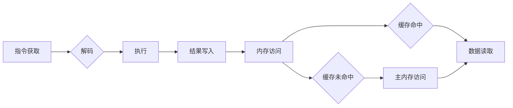

                 

## x86架构：PC与服务器的主流平台

> 关键词：x86架构、CPU、指令集、内存管理、虚拟化、服务器、PC

## 1. 背景介绍

x86架构是目前个人电脑 (PC) 和服务器领域最主流的处理器架构，其历史悠久，影响深远。从最初的Intel 8086处理器到如今的英特尔酷睿和AMD Ryzen系列处理器，x86架构不断演进，推动着计算机技术的进步。本文将深入探讨x86架构的原理、特点、发展历程以及在PC和服务器领域的应用。

## 2. 核心概念与联系

### 2.1  指令集体系

x86架构的核心是其指令集体系，即处理器能够理解和执行的指令集合。x86指令集经过多年的发展，已经非常丰富，涵盖了各种计算、数据处理、输入输出等操作。

### 2.2  冯诺伊曼体系结构

x86架构遵循冯诺伊曼体系结构，其特点是：

* **存储程序和数据在同一个内存空间中。**
* **CPU执行指令时，从内存中读取指令和数据。**
* **CPU将结果写回内存。**

这种体系结构使得程序的执行过程更加灵活，但也带来了一些挑战，例如内存访问时间的影响。

### 2.3  流水线技术

为了提高处理器的执行效率，x86架构采用了流水线技术。流水线技术将指令执行过程分解成多个阶段，每个阶段负责执行不同的操作。多个指令可以同时处于不同的阶段，从而提高了整体的执行速度。

### 2.4  缓存机制

为了减少内存访问时间，x86架构采用了缓存机制。缓存是一种高速内存，用于存储最近访问过的指令和数据。当CPU需要访问数据时，首先会检查缓存，如果数据存在于缓存中，则可以直接访问，否则需要访问主内存。

**Mermaid 流程图**



## 3. 核心算法原理 & 具体操作步骤

### 3.1  算法原理概述

x86架构的核心算法原理是指令集体系和流水线技术。指令集体系定义了处理器能够执行的操作，而流水线技术则提高了指令执行的效率。

### 3.2  算法步骤详解

1. **指令获取:** CPU从内存中读取指令。
2. **指令解码:** CPU解码指令，确定指令的操作类型和操作数。
3. **执行:** CPU执行指令的操作，例如加减乘除、逻辑运算等。
4. **结果写入:** CPU将指令执行的结果写入内存或寄存器。
5. **内存访问:** 如果指令需要访问内存，CPU会进行内存访问操作。

### 3.3  算法优缺点

**优点:**

* **指令集丰富:** x86指令集非常丰富，能够执行各种复杂的计算和数据处理操作。
* **流水线技术:** 流水线技术提高了指令执行的效率。
* **广泛应用:** x86架构在PC和服务器领域广泛应用，拥有庞大的软件生态系统。

**缺点:**

* **复杂性:** x86架构相对复杂，需要较高的技术门槛。
* **功耗:** x86架构的处理器功耗较高。

### 3.4  算法应用领域

x86架构广泛应用于各种领域，包括：

* **个人电脑:** x86架构是个人电脑的主流处理器架构。
* **服务器:** x86架构也广泛应用于服务器领域，用于运行各种应用程序和服务。
* **嵌入式系统:** 一些嵌入式系统也采用x86架构，例如工业控制系统和网络设备。

## 4. 数学模型和公式 & 详细讲解 & 举例说明

### 4.1  数学模型构建

x86架构的性能可以利用以下数学模型进行评估：

* **指令吞吐量 (IPC):** 指的是处理器每秒钟能够执行的指令数量。
* **时钟频率 (Clock Speed):** 指的是处理器每秒钟能够执行的指令周期数。
* **指令集复杂度 (Instruction Complexity):** 指的是每个指令执行所需的时钟周期数。

### 4.2  公式推导过程

**IPC = 指令吞吐量 / 时钟频率**

**指令吞吐量 = 执行的指令数 / 时间**

**时钟频率 = 1 / 指令周期**

### 4.3  案例分析与讲解

假设一个处理器具有 3GHz 的时钟频率，每秒钟可以执行 2个指令，则其 IPC 为：

**IPC = 2 / 3 = 0.67**

## 5. 项目实践：代码实例和详细解释说明

### 5.1  开发环境搭建

为了演示 x86 架构的原理，我们可以使用汇编语言编写一个简单的程序。

开发环境搭建步骤：

1. 安装一个支持汇编语言编写的开发环境，例如 NASM 和 GCC。
2. 创建一个新的汇编语言文件，例如 hello.asm。

### 5.2  源代码详细实现

```assembly
section .data
    msg db 'Hello, world!', 0

section .text
    global _start

_start:
    mov rax, 1
    mov rdi, 1
    mov rsi, msg
    mov rdx, 13
    syscall

    mov rax, 60
    syscall
```

### 5.3  代码解读与分析

* `section .data`: 定义数据段，存储程序的数据，例如字符串 "Hello, world!".
* `section .text`: 定义文本段，存储程序的指令。
* `global _start`: 定义 _start 作为程序的入口点。
* `_start:`: 程序的入口点。
* `mov rax, 1`: 将寄存器 rax 设置为 1，表示执行系统调用。
* `mov rdi, 1`: 将寄存器 rdi 设置为 1，表示执行 write 系统调用。
* `mov rsi, msg`: 将寄存器 rsi 设置为 msg，表示要写入的数据。
* `mov rdx, 13`: 将寄存器 rdx 设置为 13，表示要写入的数据长度。
* `syscall`: 执行系统调用。
* `mov rax, 60`: 将寄存器 rax 设置为 60，表示执行 exit 系统调用。
* `syscall`: 执行系统调用。

### 5.4  运行结果展示

编译并运行上述汇编语言程序，将会输出 "Hello, world!" 到控制台。

## 6. 实际应用场景

### 6.1  PC应用

x86架构在个人电脑领域应用广泛，从入门级笔记本电脑到高端游戏主机，几乎所有 PC 都采用 x86 架构的处理器。

### 6.2  服务器应用

x86架构也是服务器领域的主流架构，用于运行各种应用程序和服务，例如 Web 服务器、数据库服务器、邮件服务器等。

### 6.3  虚拟化应用

x86架构支持虚拟化技术，可以将一台物理服务器分割成多个虚拟机，每个虚拟机可以运行独立的操作系统和应用程序。

### 6.4  未来应用展望

随着技术的不断发展，x86架构将会继续演进，例如：

* **更强大的多核处理器:** 为了提高处理器的性能，未来 x86 架构将会采用更多核心的处理器。
* **更先进的缓存机制:** 更先进的缓存机制将会进一步提高内存访问速度。
* **更强大的虚拟化技术:** 更强大的虚拟化技术将会使得服务器更加灵活和高效。

## 7. 工具和资源推荐

### 7.1  学习资源推荐

* **Intel 64 and IA-32 Architectures Software Developer's Manual:** Intel 官方提供的 x86 架构文档。
* **Understanding the x86 Architecture:** 一本介绍 x86 架构的书籍。
* **x86 Assembly Language Programming:** 一本 x86 汇编语言编程的书籍。

### 7.2  开发工具推荐

* **NASM:** 一个开源的 x86 汇编语言汇编器。
* **GCC:** 一个开源的 C/C++/汇编语言编译器。
* **GDB:** 一个开源的调试器。

### 7.3  相关论文推荐

* **The x86 Architecture: A History and Overview:** 一篇介绍 x86 架构历史和特点的论文。
* **Virtualization Technologies for x86 Architectures:** 一篇介绍 x86 架构虚拟化技术的论文。

## 8. 总结：未来发展趋势与挑战

### 8.1  研究成果总结

x86架构在过去几十年中取得了巨大的成功，成为 PC 和服务器领域的主流架构。其指令集体系丰富、流水线技术高效、虚拟化技术强大，推动了计算机技术的进步。

### 8.2  未来发展趋势

未来 x86 架构将会继续朝着以下方向发展：

* **更强大的多核处理器:** 为了满足对处理性能不断增长的需求，未来 x86 架构将会采用更多核心的处理器。
* **更先进的缓存机制:** 更先进的缓存机制将会进一步提高内存访问速度。
* **更强大的虚拟化技术:** 更强大的虚拟化技术将会使得服务器更加灵活和高效。

### 8.3  面临的挑战

x86 架构也面临着一些挑战：

* **功耗:** x86 架构的处理器功耗较高，需要进一步降低功耗。
* **复杂性:** x86 架构相对复杂，需要更高的技术门槛。
* **安全:** 随着网络安全威胁的不断增加，x86 架构需要进一步加强安全防护。

### 8.4  研究展望

未来研究者将继续探索 x86 架构的改进方向，例如：

* **新型指令集设计:** 设计更适合未来应用场景的新型指令集。
* **更有效的缓存机制:** 研究更有效的缓存机制，提高内存访问速度。
* **更安全的虚拟化技术:** 开发更安全的虚拟化技术，保障数据安全。


## 9. 附录：常见问题与解答

### 9.1  x86 架构和 ARM 架构的区别是什么？

x86 架构和 ARM 架构是两种不同的处理器架构。x86 架构是 Intel 和 AMD 公司开发的，主要用于 PC 和服务器领域。ARM 架构是 ARM 公司开发的，主要用于移动设备和嵌入式系统。

### 9.2  x86 架构的指令集有哪些？

x86 架构的指令集非常丰富，包括：

* **x86 指令集:** 这是 x86 架构的原始指令集。
* **SSE 指令集:** 用于加速单精度浮点运算。
* **AVX 指令集:** 用于加速双精度浮点运算。
* **AVX-512 指令集:** 用于加速更高精度浮点运算。

### 9.3  如何学习 x86 架构？

学习 x86 架构可以参考以下资源：

* **Intel 64 and IA-32 Architectures Software Developer's Manual:** Intel 官方提供的 x86 架构文档。
* **Understanding the x86 Architecture:** 一本介绍 x86 架构的书籍。
* **x86 Assembly Language Programming:** 一本 x86 汇编语言编程的书籍。


作者：禅与计算机程序设计艺术 / Zen and the Art of Computer Programming 
<end_of_turn>

