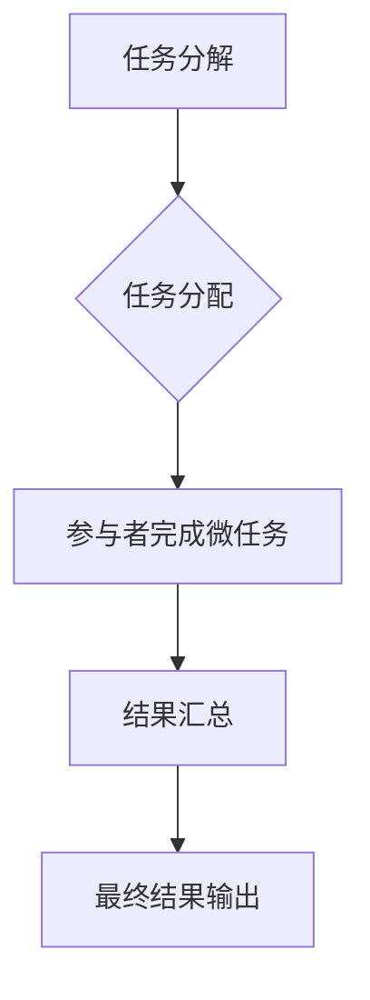

                 

## 众包：释放集体智慧的力量

> 关键词：众包、集体智慧、协作计算、微任务、算法设计、应用场景、未来趋势

## 1. 背景介绍

在信息时代，数据爆炸和计算能力的飞速发展为新的计算模式——众包（Crowdsourcing）提供了 fertile ground。众包是指通过互联网平台，将任务分解成微任务，并由全球范围内的志愿者或专业人员共同完成，从而利用集体智慧解决复杂问题。

众包的出现，打破了传统中心化计算模式的局限性，为解决大规模、复杂、需要大量人力参与的任务提供了新的思路和方法。它在各个领域都展现出巨大的潜力，例如：

* **科学研究:** 利用众包平台，可以快速收集大量数据，进行科学实验和数据分析，加速科研成果的产生。
* **软件开发:** 通过众包，可以快速测试软件功能，发现bug，并进行代码改进，提高软件开发效率。
* **创意设计:** 利用众包平台，可以收集来自不同背景和思维方式的创意，激发创新，设计出更具吸引力的产品和服务。
* **市场调研:** 通过众包，可以快速收集用户反馈，了解市场需求，为企业决策提供参考。

## 2. 核心概念与联系

众包的核心概念是将大型复杂任务分解成许多小的、可独立完成的微任务，然后通过互联网平台将这些微任务分配给全球范围内的参与者。参与者可以根据自己的兴趣和技能选择参与的任务，并完成任务后获得相应的奖励。

**核心概念原理和架构：**



**核心概念联系：**

* **任务分解:** 将大型复杂任务分解成许多小的、可独立完成的微任务，是众包的核心步骤。
* **任务分配:** 通过互联网平台将微任务分配给合适的参与者，是众包的关键环节。
* **参与者完成微任务:** 参与者根据自己的兴趣和技能选择参与的任务，并完成任务后获得相应的奖励。
* **结果汇总:** 将参与者完成的微任务结果汇总，形成最终的解决方案。
* **最终结果输出:** 将最终的解决方案输出，并应用于实际场景。

## 3. 核心算法原理 & 具体操作步骤

众包平台的运作离不开一系列算法的支撑，这些算法负责任务分解、参与者匹配、结果验证等关键环节。

### 3.1  算法原理概述

常见的众包算法包括：

* **任务分解算法:** 将大型复杂任务分解成许多小的、可独立完成的微任务，例如分词、图像识别、文本分类等。
* **参与者匹配算法:** 根据参与者的技能、经验、兴趣等信息，将任务分配给最合适的参与者，例如基于用户的评分、技能标签匹配等。
* **结果验证算法:** 对参与者完成的微任务结果进行验证，确保结果的准确性和可靠性，例如人工审核、机器学习模型评估等。

### 3.2  算法步骤详解

以任务分解算法为例，其具体操作步骤如下：

1. **任务分析:** 对待分解的任务进行分析，识别其核心功能和关键步骤。
2. **任务拆分:** 将任务的核心功能和关键步骤分解成许多小的、可独立完成的微任务。
3. **微任务描述:** 对每个微任务进行详细描述，包括任务目标、输入数据、输出格式、时间限制等。
4. **微任务分配:** 将微任务分配给合适的参与者，根据参与者的技能、经验、兴趣等信息进行匹配。
5. **结果汇总:** 将参与者完成的微任务结果汇总，形成最终的解决方案。

### 3.3  算法优缺点

**优点:**

* **高效:** 利用集体智慧，可以快速完成大型复杂任务。
* **灵活:** 可以根据任务需求灵活调整任务分解和参与者匹配策略。
* **成本效益高:** 可以降低人力成本，提高资源利用率。

**缺点:**

* **质量控制:** 需要建立有效的质量控制机制，确保结果的准确性和可靠性。
* **激励机制:** 需要设计合理的激励机制，鼓励参与者积极完成任务。
* **数据安全:** 需要保障参与者和平台数据的安全。

### 3.4  算法应用领域

众包算法广泛应用于各个领域，例如：

* **科学研究:** 基因组测序、蛋白质结构预测、药物发现等。
* **软件开发:** 代码审查、测试用例编写、软件本地化等。
* **创意设计:** 产品设计、广告创意、音乐创作等。
* **市场调研:** 用户反馈收集、市场趋势分析、产品评价等。

## 4. 数学模型和公式 & 详细讲解 & 举例说明

众包平台的运作可以抽象为数学模型，并利用数学公式进行分析和优化。

### 4.1  数学模型构建

假设一个众包平台有N个参与者和M个微任务，每个参与者可以完成K个微任务，则可以构建以下数学模型：

* **参与者数量:** N
* **微任务数量:** M
* **参与者完成任务能力:** K
* **任务完成时间:** T

### 4.2  公式推导过程

可以推导出以下公式：

* **任务完成时间:** T = M/K * N

其中，M/K表示每个参与者完成一个微任务所需的时间，N表示参与者数量。

### 4.3  案例分析与讲解

例如，假设一个众包平台有100个参与者，每个参与者可以完成10个微任务，需要完成1000个微任务，则任务完成时间为：

T = 1000 / (10 * 100) = 10小时

## 5. 项目实践：代码实例和详细解释说明

以下是一个简单的众包任务分配的代码实例，使用Python语言实现：

### 5.1  开发环境搭建

* Python 3.x
* Flask框架

### 5.2  源代码详细实现

```python
from flask import Flask, request, jsonify

app = Flask(__name__)

# 任务列表
tasks = [
    {'id': 1, 'title': '任务1', 'description': '描述任务1', 'status': '未完成'},
    {'id': 2, 'title': '任务2', 'description': '描述任务2', 'status': '未完成'},
]

# 参与者列表
users = [
    {'id': 1, 'name': '用户1', 'skills': ['编程', '设计']},
    {'id': 2, 'name': '用户2', 'skills': ['写作', '翻译']},
]

@app.route('/tasks', methods=['GET'])
def get_tasks():
    return jsonify(tasks)

@app.route('/tasks/<int:task_id>', methods=['GET'])
def get_task(task_id):
    task = next((task for task in tasks if task['id'] == task_id), None)
    if task:
        return jsonify(task)
    else:
        return jsonify({'error': '任务不存在'}), 404

@app.route('/tasks/<int:task_id>/assign', methods=['POST'])
def assign_task(task_id):
    data = request.get_json()
    user_id = data.get('user_id')
    user = next((user for user in users if user['id'] == user_id), None)
    if user:
        task = next((task for task in tasks if task['id'] == task_id), None)
        if task:
            task['status'] = '已分配'
            task['assigned_to'] = user['name']
            return jsonify({'message': '任务已分配'}), 201
        else:
            return jsonify({'error': '任务不存在'}), 404
    else:
        return jsonify({'error': '用户不存在'}), 404

if __name__ == '__main__':
    app.run(debug=True)
```

### 5.3  代码解读与分析

* 该代码实现了一个简单的众包任务分配平台，包含任务列表、参与者列表、任务获取、任务分配等功能。
* 使用Flask框架构建RESTful API，方便前端应用调用。
* 任务分配功能根据用户技能进行匹配，并更新任务状态。

### 5.4  运行结果展示

* 运行该代码后，可以访问以下API接口：
    * `/tasks`: 获取所有任务列表
    * `/tasks/<int:task_id>`: 获取指定ID的任务信息
    * `/tasks/<int:task_id>/assign`: 将指定ID的任务分配给指定用户

## 6. 实际应用场景

众包技术已广泛应用于各个领域，以下是一些实际应用场景：

### 6.1  科学研究

* **基因组测序:** 利用众包平台，可以快速完成基因组测序任务，加速基因研究的进展。
* **蛋白质结构预测:** 通过众包，可以收集来自全球范围内的科学家对蛋白质结构的预测，提高预测的准确性。
* **药物发现:** 利用众包平台，可以加速药物发现过程，例如筛选潜在的药物候选物、预测药物的活性等。

### 6.2  软件开发

* **代码审查:** 利用众包平台，可以邀请多个开发者对代码进行审查，提高代码质量。
* **测试用例编写:** 通过众包，可以快速生成大量的测试用例，提高软件测试的覆盖率。
* **软件本地化:** 利用众包平台，可以将软件翻译成多种语言，扩展软件的市场覆盖范围。

### 6.3  创意设计

* **产品设计:** 通过众包平台，可以收集来自不同背景和思维方式的创意，设计出更具吸引力的产品。
* **广告创意:** 利用众包，可以快速生成大量的广告创意，找到最有效的广告方案。
* **音乐创作:** 通过众包，可以邀请来自世界各地的音乐人参与音乐创作，创作出更具国际化的音乐作品。

### 6.4  未来应用展望

随着人工智能、大数据等技术的不断发展，众包技术将迎来更广阔的发展空间，例如：

* **智能任务分配:** 利用人工智能算法，可以更智能地分配任务，提高任务完成效率。
* **个性化众包:** 根据用户的兴趣和技能，提供个性化的众包任务，提高用户参与度。
* **区块链众包:** 利用区块链技术，可以保障众包平台的透明度和安全性，提高用户信任度。

## 7. 工具和资源推荐

### 7.1  学习资源推荐

* **书籍:**
    * 《众包：释放集体智慧的力量》
    * 《The Wisdom of Crowds》
* **在线课程:**
    * Coursera: Crowdsourcing and Collective Intelligence
    * edX: Introduction to Crowdsourcing

### 7.2  开发工具推荐

* **Amazon Mechanical Turk:** 一种大型的众包平台，可以用于发布和管理众包任务。
* **Figure Eight:** 一种专业的众包平台，提供数据标注、图像识别等服务。
* **CrowdFlower:** 一种众包平台，提供数据收集、分析等服务。

### 7.3  相关论文推荐

* **"The Wisdom of Crowds" by James Surowiecki**
* **"Crowdsourcing: Why the Power of the Crowd Is Driving the Future of Business" by Jeff Howe**
* **"A Survey of Crowdsourcing Systems" by Y. Wang et al.**

## 8. 总结：未来发展趋势与挑战

### 8.1  研究成果总结

众包技术已经取得了显著的成果，在科学研究、软件开发、创意设计等领域发挥着越来越重要的作用。

### 8.2  未来发展趋势

* **智能化:** 利用人工智能技术，实现更智能的任务分配、结果验证和激励机制。
* **个性化:** 根据用户的兴趣和技能，提供个性化的众包任务，提高用户参与度。
* **去中心化:** 利用区块链技术，构建更透明、更安全的众包平台。

### 8.3  面临的挑战

* **数据安全:** 保障参与者和平台数据的安全，防止数据泄露和滥用。
* **激励机制:** 设计合理的激励机制，鼓励参与者积极完成任务，提高任务完成质量。
* **质量控制:** 建立有效的质量控制机制，确保结果的准确性和可靠性。

### 8.4  研究展望

未来，众包技术将继续发展，并与其他新兴技术融合，例如人工智能、大数据、区块链等，为人类社会带来更多创新和价值。


## 9. 附录：常见问题与解答

**Q1: 众包和传统雇佣有什么区别？**

**A1:** 众包是指通过互联网平台，将任务分解成微任务，并由全球范围内的参与者共同完成，而传统雇佣是指雇佣固定员工，由他们完成特定任务。

**Q2: 众包的优势有哪些？**

**A2:** 众包的优势包括：

* **高效:** 利用集体智慧，可以快速完成大型复杂任务。
* **灵活:** 可以根据任务需求灵活调整任务分解和参与者匹配策略。
* **成本效益高:** 可以降低人力成本，提高资源利用率。

**Q3: 众包有哪些应用场景？**

**A3:** 众包技术广泛应用于各个领域，例如：

* **科学研究:** 基因组测序、蛋白质结构预测、药物发现等。
* **软件开发:** 代码审查、测试用例编写、软件本地化等。
* **创意设计:** 产品设计、广告创意、音乐创作等。
* **市场调研:** 用户反馈收集、市场趋势分析、产品评价等。

**Q4: 如何选择合适的众包平台？**

**A4:** 选择合适的众包平台需要考虑以下因素：

* **任务类型:** 不同的平台擅长不同的任务类型。
* **参与者数量:** 平台的参与者数量越大，任务完成速度越快。
* **价格:** 不同的平台收费标准不同。
* **平台安全性:** 平台需要保障参与者和平台数据的安全。


作者：禅与计算机程序设计艺术 / Zen and the Art of Computer Programming<end_of_turn>

