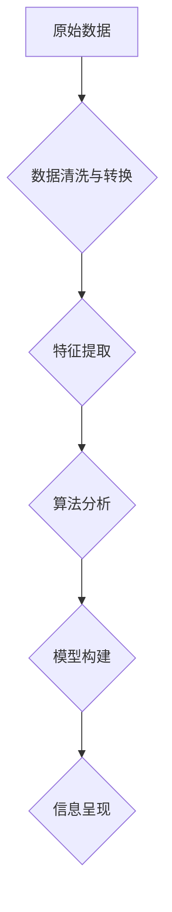

                 

## 信息简化的原则和艺术：在混乱中建立秩序与简化

> 关键词：信息简化、算法设计、数据结构、复杂系统、软件架构、代码可读性、效率优化、设计模式

### 1. 背景介绍

在当今信息爆炸的时代，我们每天都面临着海量数据的冲击。从新闻资讯到社交媒体，从科学研究到商业决策，信息无处不在，却也常常让人感到淹没和困惑。如何有效地处理和理解这些信息，从中提取有价值的知识，成为了一个至关重要的挑战。

信息简化，即从复杂的信息中提取本质，去除冗余和噪声，以简洁明了的形式呈现信息，是解决这一挑战的关键。它不仅可以帮助我们更好地理解世界，还能提高工作效率，促进创新思维。

### 2. 核心概念与联系

信息简化并非简单的压缩或删减，它是一个系统性的过程，涉及到多个层次和环节。

**2.1 信息简化层次**

* **数据层:** 针对原始数据进行清洗、转换、聚合等操作，去除不必要的数据，提取关键特征。
* **算法层:** 设计高效的算法，对数据进行分析和处理，发现隐藏的模式和规律。
* **模型层:** 建立数学模型或逻辑模型，抽象和概括数据之间的关系，形成可理解的知识表示。
* **呈现层:** 将简化后的信息以简洁明了的形式呈现给用户，例如图表、报告、交互式界面等。

**2.2 信息简化原则**

* **聚焦本质:** 识别信息的核心内容，去除无关细节。
* **层次化结构:** 将信息按照重要程度和逻辑关系进行分层，形成清晰的结构。
* **简洁明了:** 使用简洁的语言和图形，避免冗余和模糊。
* **可理解性:** 确保信息易于理解和理解，并提供必要的解释和上下文。

**2.3 信息简化流程图**



### 3. 核心算法原理 & 具体操作步骤

**3.1 算法原理概述**

信息简化算法的核心是通过数据分析和模式识别，从复杂的数据中提取有价值的信息。常见的算法包括：

* **聚类算法:** 将数据按照相似性进行分组，发现数据中的潜在结构。
* **降维算法:** 将高维数据映射到低维空间，保留数据的主要信息，同时减少数据维度。
* **关联规则挖掘算法:** 发现数据中频繁出现的项集，揭示数据之间的关联关系。

**3.2 算法步骤详解**

以聚类算法为例，其基本步骤如下：

1. **数据预处理:** 对原始数据进行清洗、转换、标准化等操作，确保数据质量。
2. **距离度量:** 选择合适的距离度量方法，例如欧氏距离、曼哈顿距离等，衡量数据点之间的相似性。
3. **聚类算法选择:** 根据数据特点和需求选择合适的聚类算法，例如K-means聚类、层次聚类等。
4. **聚类执行:** 使用选定的聚类算法对数据进行聚类，将数据点划分为不同的簇。
5. **聚类结果评估:** 使用聚类评估指标，例如Silhouette系数、Dunn指数等，评估聚类结果的质量。

**3.3 算法优缺点**

* **优点:** 可以有效地发现数据中的潜在结构和模式，帮助我们理解数据背后的规律。
* **缺点:** 聚类算法的性能受数据质量和参数设置的影响较大，需要谨慎选择算法和参数。

**3.4 算法应用领域**

信息简化算法广泛应用于各个领域，例如：

* **市场营销:** 分析客户行为，进行精准营销。
* **金融:** 风险评估、欺诈检测。
* **医疗:** 疾病诊断、药物研发。
* **科学研究:** 数据分析、模式识别。

### 4. 数学模型和公式 & 详细讲解 & 举例说明

**4.1 数学模型构建**

信息简化可以借助数学模型来进行量化分析和建模。例如，可以使用概率论和统计学来描述数据的分布和关联性，可以使用图论来表示数据的结构和关系。

**4.2 公式推导过程**

以K-means聚类算法为例，其目标是找到K个聚类中心，使得每个数据点到其所属聚类中心的距离最小。

* **距离度量:** 使用欧氏距离作为距离度量，即两个数据点之间的距离等于其坐标差的平方和的平方根。

* **聚类中心更新:** 迭代更新聚类中心的位置，使得每个数据点到其所属聚类中心的距离最小。

**4.3 案例分析与讲解**

假设我们有一组数据点，需要将其聚类成3个簇。

1. **随机选择3个数据点作为初始聚类中心。**
2. **计算每个数据点到每个聚类中心的距离。**
3. **将每个数据点分配到距离最近的聚类中心。**
4. **重新计算每个聚类中心的坐标，作为新的聚类中心。**
5. **重复步骤2-4，直到聚类中心不再发生变化。**

### 5. 项目实践：代码实例和详细解释说明

**5.1 开发环境搭建**

可以使用Python语言和Scikit-learn库来实现信息简化算法。

**5.2 源代码详细实现**

```python
from sklearn.cluster import KMeans

# 数据加载
data = [[1, 2], [1.5, 1.8], [5, 8], [8, 8], [1, 0.6], [9, 11]]

# K-means聚类
kmeans = KMeans(n_clusters=3, random_state=0)
kmeans.fit(data)

# 获取聚类结果
labels = kmeans.labels_
print(labels)

# 获取聚类中心
centers = kmeans.cluster_centers_
print(centers)
```

**5.3 代码解读与分析**

* `KMeans(n_clusters=3, random_state=0)`: 创建K-means聚类模型，指定聚类数量为3，随机种子为0。
* `kmeans.fit(data)`: 对数据进行聚类，训练模型。
* `kmeans.labels_`: 获取每个数据点的所属聚类标签。
* `kmeans.cluster_centers_`: 获取每个聚类的中心点坐标。

**5.4 运行结果展示**

运行代码后，会输出每个数据点的聚类标签和聚类中心坐标。

### 6. 实际应用场景

信息简化在各个领域都有广泛的应用场景，例如：

* **数据可视化:** 将复杂的数据以图表、地图等形式进行可视化，帮助用户快速理解数据趋势和规律。
* **搜索引擎:** 对海量网页进行信息简化，提取关键词和主题，提高搜索结果的准确性和相关性。
* **自然语言处理:** 对文本进行信息简化，提取关键信息和主题，用于文本摘要、机器翻译等应用。

**6.4 未来应用展望**

随着人工智能和数据分析技术的不断发展，信息简化将发挥越来越重要的作用。未来，信息简化技术将应用于更多领域，例如：

* **个性化推荐:** 根据用户的兴趣和行为，对信息进行个性化简化，提供更精准的推荐。
* **自动写作:** 利用信息简化技术，自动生成新闻报道、产品说明等文本。
* **智能决策支持:** 对复杂的数据进行信息简化，帮助决策者做出更明智的决策。

### 7. 工具和资源推荐

**7.1 学习资源推荐**

* **书籍:**
    * 《数据挖掘：概念与技术》
    * 《机器学习》
    * 《信息论与编码理论》
* **在线课程:**
    * Coursera: 数据科学
    * edX: 机器学习
    * Udacity: 数据分析

**7.2 开发工具推荐**

* **Python:** 广泛应用于数据分析和机器学习。
* **Scikit-learn:** Python机器学习库，提供多种聚类算法和数据分析工具。
* **Pandas:** Python数据分析库，用于数据处理和分析。
* **Matplotlib:** Python数据可视化库，用于生成图表和图形。

**7.3 相关论文推荐**

* **K-means聚类算法:**
    * MacQueen, J. (1967). Some methods for classification and analysis of multivariate observations.
* **降维算法:**
    * Jolliffe, I. T. (2002). Principal component analysis.
* **关联规则挖掘算法:**
    * Agrawal, R., Imielinski, T., & Swami, A. (1993). Mining association rules between sets of items in large databases.

### 8. 总结：未来发展趋势与挑战

**8.1 研究成果总结**

信息简化技术取得了显著的进展，为我们提供了有效处理复杂信息的方法。

**8.2 未来发展趋势**

* **更智能的信息简化算法:** 利用深度学习等人工智能技术，开发更智能、更精准的信息简化算法。
* **个性化信息简化:** 根据用户的需求和偏好，提供个性化的信息简化服务。
* **跨领域信息简化:** 将信息简化技术应用于更多领域，例如医疗、教育、金融等。

**8.3 面临的挑战**

* **数据质量问题:** 信息简化算法的性能受数据质量影响较大，需要解决数据清洗、预处理等问题。
* **算法解释性问题:** 一些复杂的信息简化算法难以解释其决策过程，需要提高算法的可解释性。
* **伦理问题:** 信息简化技术可能被用于操纵用户行为，需要关注其伦理问题。

**8.4 研究展望**

未来，信息简化技术将继续发展，为我们提供更有效、更智能的信息处理方法，帮助我们更好地理解世界，做出更明智的决策。

### 9. 附录：常见问题与解答

**9.1 如何选择合适的聚类算法？**

选择合适的聚类算法需要根据数据的特点和需求进行选择。例如，对于数据分布较为均匀的情况，可以使用K-means聚类算法；对于数据结构较为复杂的情况，可以使用层次聚类算法。

**9.2 如何评估聚类结果的质量？**

可以使用Silhouette系数、Dunn指数等聚类评估指标来评估聚类结果的质量。

**9.3 信息简化技术有哪些伦理问题？**

信息简化技术可能被用于操纵用户行为，例如通过信息筛选和推荐，引导用户接受特定的观点或信息。因此，需要关注其伦理问题，确保其应用符合社会道德规范。


作者：禅与计算机程序设计艺术 / Zen and the Art of Computer Programming 
<end_of_turn>

