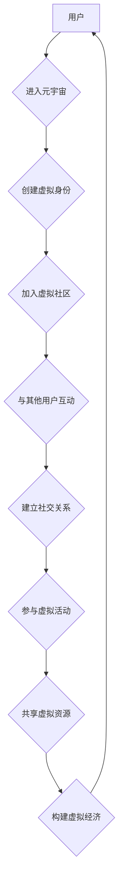

                 

## 元宇宙中的虚拟社区：全球社交网络的新形态

> 关键词：元宇宙、虚拟社区、社交网络、沉浸式体验、Web3、区块链、去中心化

## 1. 背景介绍

互联网的演进从未停止，从最初的静态网页到如今的社交媒体平台，再到正在兴起的元宇宙，人类与数字世界的交互方式不断地升级。元宇宙的概念，将虚拟现实、增强现实、区块链等技术融合在一起，构建一个持久、共享、沉浸式的虚拟世界。在这个世界里，人们可以创建虚拟身份，参与各种活动，建立社交关系，甚至进行虚拟经济交易。

虚拟社区作为元宇宙的重要组成部分，将成为人们在虚拟世界中社交、娱乐、工作、学习的重要场所。它打破了物理空间的限制，连接着来自世界各地的用户，构建了一个更加开放、包容、多元的社交网络。

## 2. 核心概念与联系

### 2.1 元宇宙

元宇宙是一个由虚拟现实、增强现实、区块链、人工智能等技术构成的虚拟世界，它具有以下核心特征：

* **持久性:** 元宇宙是一个永不关闭的虚拟世界，即使用户离开，虚拟世界也会继续存在。
* **共享性:** 多个用户可以同时进入元宇宙，并与彼此互动。
* **沉浸式体验:** 元宇宙利用虚拟现实和增强现实技术，为用户提供身临其境的体验。
* **去中心化:** 元宇宙的治理和数据控制权分散在用户手中，而不是由单一机构掌握。

### 2.2 虚拟社区

虚拟社区是指在虚拟世界中形成的，由共享兴趣、价值观或目标的用户组成的群体。它可以是基于特定主题的，例如游戏、音乐、艺术等，也可以是基于地理位置的，例如城市、国家等。

### 2.3 社交网络

社交网络是指用户之间建立联系和进行交互的平台。它可以是基于线上平台的，例如Facebook、Twitter等，也可以是基于线下活动的，例如俱乐部、社团等。

### 2.4 元宇宙中的虚拟社区与社交网络的联系

元宇宙中的虚拟社区是社交网络的一种新形态，它将社交网络的连接功能与元宇宙的沉浸式体验和去中心化特性相结合。

**Mermaid 流程图**



## 3. 核心算法原理 & 具体操作步骤

### 3.1 算法原理概述

元宇宙中的虚拟社区构建需要多种算法协同工作，包括用户身份认证、社区推荐、内容过滤、社交关系分析等。这些算法的目的是为了提供安全、高效、个性化的用户体验。

### 3.2 算法步骤详解

**用户身份认证:**

1. 用户注册时，需要提供真实身份信息进行验证。
2. 使用生物识别技术，例如指纹识别、人脸识别等，进行身份确认。
3. 利用区块链技术，生成用户的唯一身份标识，确保身份安全和不可篡改。

**社区推荐:**

1. 根据用户的兴趣爱好、行为数据等信息，进行用户画像分析。
2. 利用机器学习算法，推荐与用户兴趣相符的虚拟社区。
3. 提供社区搜索功能，方便用户自主查找感兴趣的社区。

**内容过滤:**

1. 利用自然语言处理技术，对社区内容进行分类和标签化。
2. 根据用户的兴趣偏好和行为数据，过滤掉不感兴趣的内容。
3. 建立内容审核机制，确保社区内容安全和健康。

**社交关系分析:**

1. 利用图数据库，构建用户之间的社交关系网络。
2. 分析用户之间的互动关系，识别关键用户和社区核心成员。
3. 提供社交关系推荐功能，帮助用户拓展社交圈。

### 3.3 算法优缺点

**优点:**

* 提供安全、高效、个性化的用户体验。
* 促进用户之间的互动和交流。
* 帮助用户发现和加入感兴趣的社区。

**缺点:**

* 算法需要大量数据进行训练和优化，数据安全和隐私保护是一个挑战。
* 算法可能会存在偏差，导致推荐结果不准确或不公平。
* 算法需要不断更新和迭代，以适应用户需求的变化。

### 3.4 算法应用领域

* 社交媒体平台
* 游戏平台
* 教育平台
* 商业平台
* 医疗平台

## 4. 数学模型和公式 & 详细讲解 & 举例说明

### 4.1 数学模型构建

虚拟社区的构建可以抽象为一个图论模型，其中用户表示为节点，用户之间的社交关系表示为边。

**节点:**

* 用户ID

**边:**

* 关系类型 (例如：朋友、同事、家人)
* 关系强度 (例如：频繁互动、共同兴趣)

### 4.2 公式推导过程

**社区发现算法:**

* **Louvain算法:**

该算法基于模块度最大化原理，通过迭代优化节点的社区划分，找到社区结构最优的划分。

**模块度 (Modularity):**

$$Q = \frac{1}{2m} \sum_{i,j} A_{ij} \left( \frac{k_i}{m} - \frac{c_i c_j}{m} \right)$$

其中:

* $A_{ij}$: 节点 $i$ 和节点 $j$ 之间的连接状态 (1 表示连接，0 表示不连接)
* $k_i$: 节点 $i$ 的度 (连接的边数)
* $m$: 图的总边数
* $c_i$: 节点 $i$ 所属的社区标识

### 4.3 案例分析与讲解

假设一个社交网络图中，用户 A 和用户 B 经常互动，用户 C 和用户 D 经常互动，但 A 和 C 之间没有直接连接。使用 Louvain 算法，可以将用户 A 和 B 分为一个社区，用户 C 和 D 分为另一个社区。

## 5. 项目实践：代码实例和详细解释说明

### 5.1 开发环境搭建

* 操作系统: Ubuntu 20.04
* 编程语言: Python 3.8
* 开发工具: PyCharm

### 5.2 源代码详细实现

```python
# 社区发现算法示例代码 (Louvain 算法)

import networkx as nx

# 创建一个社交网络图
graph = nx.Graph()
graph.add_edges_from([(1, 2), (1, 3), (2, 3), (4, 5), (4, 6)])

# 使用 Louvain 算法进行社区发现
communities = nx.community.greedy_modularity_communities(graph)

# 打印社区划分结果
print(communities)
```

### 5.3 代码解读与分析

* `networkx` 库用于构建和操作图结构。
* `nx.Graph()` 创建一个无向图。
* `graph.add_edges_from()` 添加图的边。
* `nx.community.greedy_modularity_communities()` 使用 Louvain 算法进行社区发现。
* `print(communities)` 打印社区划分结果，每个社区是一个节点列表。

### 5.4 运行结果展示

```
[{1, 2, 3}, {4, 5, 6}]
```

运行结果表明，图中的节点被分为两个社区。

## 6. 实际应用场景

### 6.1 游戏社区

元宇宙中的虚拟社区可以为游戏玩家提供更沉浸式的社交体验。玩家可以加入游戏相关的社区，与其他玩家交流、组队、分享游戏攻略等。

### 6.2 学习社区

虚拟社区可以为学生和教师提供一个在线学习平台。学生可以加入学习相关的社区，与老师和同学互动，共同学习和探讨知识。

### 6.3 工作社区

虚拟社区可以为企业员工提供一个协作平台。员工可以加入工作相关的社区，与同事沟通、分享项目进展、进行远程办公等。

### 6.4 娱乐社区

虚拟社区可以为用户提供一个娱乐平台。用户可以加入兴趣相关的社区，与其他用户一起观看电影、听音乐、玩游戏等。

### 6.5 未来应用展望

随着元宇宙技术的不断发展，虚拟社区将应用于更多领域，例如医疗、金融、教育等。它将成为人们在虚拟世界中生活、工作、学习、娱乐的重要场所。

## 7. 工具和资源推荐

### 7.1 学习资源推荐

* **书籍:**

* 《元宇宙：下一代互联网》
* 《虚拟现实技术》

* **在线课程:**

* Coursera: 元宇宙与虚拟现实
* edX: 虚拟现实开发

### 7.2 开发工具推荐

* **Unity:** 游戏引擎
* **Unreal Engine:** 游戏引擎
* **Blender:** 3D 建模软件

### 7.3 相关论文推荐

* **The Metaverse: A New Paradigm for Social Interaction**
* **Decentralized Social Networks: A Survey**

## 8. 总结：未来发展趋势与挑战

### 8.1 研究成果总结

元宇宙中的虚拟社区是一个新兴的领域，已经取得了一些重要的研究成果。例如，社区发现算法、用户身份认证技术、内容过滤技术等都取得了长足进步。

### 8.2 未来发展趋势

* **更沉浸式的体验:** 未来虚拟社区将更加注重沉浸式体验，例如使用更先进的虚拟现实和增强现实技术。
* **更个性化的服务:** 未来虚拟社区将提供更个性化的服务，例如根据用户的兴趣爱好推荐内容、提供定制化的社交体验。
* **更去中心化的治理:** 未来虚拟社区将更加注重去中心化的治理，例如使用区块链技术来管理社区资源和决策。

### 8.3 面临的挑战

* **技术挑战:** 元宇宙技术的成熟度还有待提高，例如虚拟现实和增强现实技术的成本较高，网络带宽需求也较高。
* **安全挑战:** 虚拟社区的安全问题是一个重要的挑战，例如用户身份认证、数据隐私保护等都需要得到有效解决。
* **伦理挑战:** 元宇宙中的虚拟社区可能会带来一些伦理问题，例如虚拟身份的真实性、虚拟财产的合法性等都需要得到探讨。

### 8.4 研究展望

未来，虚拟社区的研究将更加注重以下几个方面:

* **人工智能技术的应用:** 利用人工智能技术，为用户提供更智能化的服务，例如自动生成内容、个性化推荐等。
* **虚拟经济的构建:** 研究虚拟社区中的虚拟经济模型，探索虚拟货币、虚拟资产等的新模式。
* **虚拟社区的社会影响:** 研究虚拟社区对社会的影响，例如对人际关系、社会结构、文化等的影响。

## 9. 附录：常见问题与解答

**Q1: 元宇宙中的虚拟社区和现实世界中的社区有什么区别？**

**A1:** 元宇宙中的虚拟社区和现实世界中的社区都存在着社交互动、共同兴趣等特点，但元宇宙中的虚拟社区具有以下特点:

* **持久性:** 元宇宙中的虚拟社区永不关闭，即使用户离开，虚拟社区也会继续存在。
* **共享性:** 多个用户可以同时进入元宇宙，并与彼此互动。
* **沉浸式体验:** 元宇宙利用虚拟现实和增强现实技术，为用户提供身临其境的体验。
* **去中心化:** 元宇宙的治理和数据控制权分散在用户手中，而不是由单一机构掌握。

**Q2: 如何确保元宇宙中的虚拟社区安全？**

**A2:** 确保元宇宙中的虚拟社区安全需要采取多方面的措施，例如:

* **用户身份认证:** 使用生物识别技术等手段进行身份验证，防止虚假身份的注册。
* **数据隐私保护:** 加强数据加密和安全存储，防止用户数据泄露。
* **内容审核:** 建立内容审核机制，过滤掉违规和有害内容。
* **社区管理:** 建立社区管理机制，及时处理用户投诉和纠纷。

**Q3: 元宇宙中的虚拟社区会对现实社会产生什么影响？**

**A3:** 元宇宙中的虚拟社区可能会对现实社会产生以下影响:

* **改变人际关系:** 元宇宙中的虚拟社区可以帮助人们建立新的社交关系，拓展社交圈。
* **影响社会结构:** 元宇宙中的虚拟社区可能会形成新的社会群体和文化，影响现实社会的社会结构。
* **促进经济发展:** 元宇宙中的虚拟社区可以为虚拟经济的发展提供新的平台和机会。


作者：禅与计算机程序设计艺术 / Zen and the Art of Computer Programming 
<end_of_turn>

