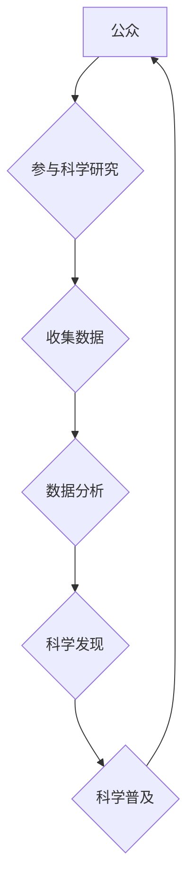

                 

## 公民科学：公众参与科学研究的新模式

> 关键词：公民科学、大众参与、科学研究、数据收集、人工智能、数据分析、科学普及

## 1. 背景介绍

科学研究，传统上被视为由专业科学家在实验室或研究机构进行的精英活动。然而，随着科技的进步和互联网的普及，科学研究的边界正在逐渐扩展，公众参与科学研究的新模式——公民科学（Citizen Science）应运而生。

公民科学是指公众参与科学研究活动的广泛范畴，从简单的观测记录到复杂的实验数据分析，公众可以利用自身的知识和技能，为科学研究贡献力量。这种模式打破了传统科学研究的壁垒，让每个人都能够参与到科学探索中来，推动科学研究的进步，同时也提升公众对科学的理解和参与度。

### 1.1  公民科学的兴起

公民科学的兴起与以下几个因素密切相关：

* **科技进步**:  互联网、移动设备和社交媒体等技术的进步，使得公众更容易获取科学信息、参与科学活动和与科学家交流。
* **数据爆炸**:  现代科学研究需要处理海量数据，而公民科学可以提供一个庞大的志愿者队伍，帮助收集、整理和分析数据。
* **科学普及**:  公民科学可以帮助公众更好地理解科学，激发他们的科学兴趣，并增强他们对科学的信任。

### 1.2  公民科学的意义

公民科学具有重要的社会意义：

* **促进科学研究**:  公民科学可以为科学家提供大量的数据和资源，加速科学研究的进程。
* **提升公众参与**:  公民科学让公众成为科学研究的一部分，增强他们的科学素养和责任感。
* **推动社会发展**:  公民科学可以解决社会问题，促进科技创新，推动社会进步。

## 2. 核心概念与联系

公民科学的核心概念包括：

* **参与**: 公众积极参与科学研究活动，贡献自己的知识、技能和资源。
* **协作**: 科学家和公众共同合作，完成科学研究任务。
* **数据共享**:  研究数据公开透明，方便公众和科学家进行分析和研究。
* **科学普及**:  公民科学活动可以帮助公众了解科学知识，激发他们的科学兴趣。

**Mermaid 流程图**



## 3. 核心算法原理 & 具体操作步骤

公民科学平台通常会采用一些特定的算法和技术来实现数据收集、分析和共享。

### 3.1  算法原理概述

常见的算法包括：

* **机器学习**:  用于分析海量数据，发现隐藏的模式和规律。
* **自然语言处理**:  用于处理文本数据，例如公众提交的观测记录或反馈意见。
* **地理信息系统**:  用于处理空间数据，例如生物多样性分布或环境污染情况。

### 3.2  算法步骤详解

例如，使用机器学习算法分析公众提交的鸟类观测记录：

1. **数据收集**:  公众通过手机应用程序或网站提交鸟类观测记录，包括鸟类种类、时间、地点等信息。
2. **数据预处理**:  清洗和格式化数据，例如去除重复记录、错误信息等。
3. **模型训练**:  使用机器学习算法，例如支持向量机或随机森林，训练一个模型，能够根据鸟类观测记录预测其分布范围。
4. **模型评估**:  使用测试数据评估模型的准确性，并进行调整优化。
5. **结果展示**:  将模型预测结果以地图或图表形式展示给公众，帮助他们了解鸟类分布情况。

### 3.3  算法优缺点

* **优点**:  能够处理海量数据，发现隐藏的模式和规律，提高科学研究效率。
* **缺点**:  需要专业的技术人员进行开发和维护，算法模型的准确性依赖于训练数据的质量。

### 3.4  算法应用领域

* **生物多样性研究**:  分析公众提交的观测记录，了解生物种群分布和变化趋势。
* **环境监测**:  收集公众报告的环境污染事件，监测环境质量变化。
* **疾病流行病学**:  分析公众报告的疾病症状，预测疾病流行趋势。

## 4. 数学模型和公式 & 详细讲解 & 举例说明

公民科学平台的算法模型通常基于数学模型和公式，例如：

### 4.1  数学模型构建

* **贝叶斯网络**:  用于表示随机变量之间的依赖关系，可以用于预测事件发生的概率。
* **回归模型**:  用于建立变量之间的关系，可以用于预测一个变量的值。

### 4.2  公式推导过程

例如，使用贝叶斯网络预测鸟类分布范围：

* **定义随机变量**:  鸟类种类、时间、地点、观测记录等。
* **建立概率关系**:  根据专家知识和历史数据，建立鸟类种类、时间、地点之间的概率关系。
* **计算预测概率**:  根据观测记录和概率关系，计算鸟类在特定地点出现的概率。

### 4.3  案例分析与讲解

例如，使用回归模型预测空气污染程度：

* **定义变量**:  空气污染指数（AQI）、温度、湿度、风速等。
* **建立回归模型**:  使用历史数据训练回归模型，建立空气污染指数与其他变量之间的关系。
* **预测空气污染程度**:  根据当前的天气条件，使用回归模型预测空气污染指数。

## 5. 项目实践：代码实例和详细解释说明

以下是一个简单的公民科学项目代码实例，使用Python语言实现鸟类观测记录的收集和分析：

### 5.1  开发环境搭建

* Python 3.x
* Jupyter Notebook

### 5.2  源代码详细实现

```python
# 导入必要的库
import pandas as pd
import matplotlib.pyplot as plt

# 读取鸟类观测记录数据
data = pd.read_csv("bird_observations.csv")

# 分析数据
# 计算不同鸟类观测次数
bird_counts = data["bird_species"].value_counts()

# 绘制柱状图展示不同鸟类观测次数
plt.bar(bird_counts.index, bird_counts.values)
plt.xlabel("Bird Species")
plt.ylabel("Observation Count")
plt.title("Bird Species Observation Counts")
plt.show()
```

### 5.3  代码解读与分析

* 使用 pandas 库读取 CSV 格式的鸟类观测记录数据。
* 使用 value_counts() 方法计算不同鸟类观测次数。
* 使用 matplotlib 库绘制柱状图展示不同鸟类观测次数。

### 5.4  运行结果展示

运行代码后，将生成一个柱状图，展示不同鸟类观测次数。

## 6. 实际应用场景

公民科学已在多个领域取得成功，例如：

* **生物多样性监测**:  例如，eBird 平台收集了全球数百万例鸟类观测记录，帮助科学家了解鸟类分布和迁徙规律。
* **环境监测**:  例如，Zooniverse 平台上的“Galaxy Zoo”项目，利用公众参与对星系进行分类，帮助科学家研究宇宙演化。
* **疾病流行病学**:  例如，Flu Near You 项目，收集公众报告的流感症状，帮助科学家预测流感流行趋势。

### 6.4  未来应用展望

随着科技的进步和公众参与的增加，公民科学将在未来发挥更重要的作用：

* **更精准的科学研究**:  利用人工智能和机器学习技术，提高公民科学数据分析的精准度和效率。
* **更广泛的参与**:  开发更易于使用的公民科学平台，吸引更多公众参与科学研究。
* **更深入的科学普及**:  通过公民科学活动，帮助公众更好地理解科学，激发他们的科学兴趣。

## 7. 工具和资源推荐

### 7.1  学习资源推荐

* **Citizen Science Association**:  https://citizenscience.org/
* **Zooniverse**:  https://www.zooniverse.org/
* **SciStarter**:  https://scistarter.org/

### 7.2  开发工具推荐

* **Python**:  https://www.python.org/
* **R**:  https://www.r-project.org/
* **Jupyter Notebook**:  https://jupyter.org/

### 7.3  相关论文推荐

* **Bonney, R., et al. (2014). Citizen science: A global endeavor. Trends in Ecology & Evolution, 29(12), 690-697.**
* **Silvertown, J. (2009). A new dawn for natural history? Trends in Ecology & Evolution, 24(10), 531-533.**

## 8. 总结：未来发展趋势与挑战

### 8.1  研究成果总结

公民科学已经成为一种重要的科学研究模式，为科学研究提供了新的数据来源和参与方式，推动了科学研究的进步和科学普及。

### 8.2  未来发展趋势

* **更智能的公民科学平台**:  利用人工智能和机器学习技术，提高公民科学数据分析的精准度和效率。
* **更广泛的参与**:  开发更易于使用的公民科学平台，吸引更多公众参与科学研究。
* **更深入的科学普及**:  通过公民科学活动，帮助公众更好地理解科学，激发他们的科学兴趣。

### 8.3  面临的挑战

* **数据质量**:  公民科学数据可能存在不准确或不完整的情况，需要开发有效的质量控制机制。
* **参与者激励**:  如何激励公众长期参与公民科学活动，是一个需要解决的问题。
* **伦理问题**:  公民科学活动涉及到个人隐私和数据安全等伦理问题，需要制定相应的规范和制度。

### 8.4  研究展望

未来，公民科学将继续发展壮大，成为科学研究的重要组成部分。我们需要不断探索新的技术和方法，解决公民科学面临的挑战，并推动公民科学的健康发展。

## 9. 附录：常见问题与解答

* **什么是公民科学？**

公民科学是指公众参与科学研究活动的广泛范畴，从简单的观测记录到复杂的实验数据分析，公众可以利用自身的知识和技能，为科学研究贡献力量。

* **如何参与公民科学？**

可以通过以下方式参与公民科学：

* 注册在线公民科学平台，例如 Zooniverse 或 SciStarter。
* 参加当地组织的公民科学活动。
* 利用手机应用程序收集科学数据，例如鸟类观测记录或空气污染数据。

* **公民科学有什么意义？**

公民科学具有重要的社会意义：

* 促进科学研究
* 提升公众参与
* 推动社会发展


作者：禅与计算机程序设计艺术 / Zen and the Art of Computer Programming 
<end_of_turn>

