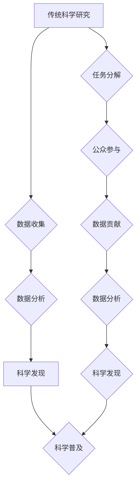

                 

## 公民科学：公众参与科学研究的新途径

> 关键词：公民科学、大众参与、科学研究、数据收集、人工智能、数据分析、科学普及

## 1. 背景介绍

科学研究，传统上被视为专业人士的领域，需要深厚的专业知识、昂贵的设备和漫长的实验周期。然而，随着科技的进步和互联网的普及，科学研究的门槛正在逐渐降低，公众参与科学研究的可能性也越来越大。公民科学（Citizen Science）应运而生，它赋予了公众参与科学研究的权利和机会，让每个人都能成为科学研究的一部分。

公民科学的兴起，源于以下几个因素：

* **数据爆炸**:  现代科学研究需要处理海量数据，而专业科研人员难以独自完成数据收集和分析任务。
* **互联网的普及**: 互联网为公众提供了一个便捷的平台，可以进行数据共享、协作和交流。
* **科学普及的需要**:  公民科学可以提高公众对科学的理解和兴趣，促进科学知识的传播。

## 2. 核心概念与联系

公民科学的核心概念是将科学研究的任务分解成更小的、易于理解和参与的任务，并通过互联网平台将这些任务分配给公众参与者。参与者可以利用自己的时间、精力和技能，为科学研究贡献数据、进行分析、提出问题等。

公民科学与传统科学研究的关系可以概括为：

* **互补**: 公民科学可以补充传统科学研究的不足，例如数据收集、实验验证等。
* **协同**: 公民科学和传统科学研究可以相互协同，共同推进科学进步。
* **创新**: 公民科学为科学研究带来了新的思路和方法，推动了科学研究的创新。

**Mermaid 流程图**



## 3. 核心算法原理 & 具体操作步骤

公民科学平台通常采用一些算法来管理数据收集、分析和分配任务。

### 3.1  算法原理概述

常见的算法包括：

* **数据挖掘算法**: 用于从海量数据中发现隐藏的模式和规律。
* **机器学习算法**: 用于训练模型，自动完成数据分析和分类任务。
* **推荐算法**: 用于根据用户的兴趣和参与历史，推荐合适的科学研究任务。

### 3.2  算法步骤详解

例如，一个公民科学平台用于收集鸟类观测数据，其数据分析流程可以概括为以下步骤：

1. **数据收集**: 公众参与者通过手机应用程序或网站上传鸟类观测数据，包括鸟类种类、观测时间、地点等信息。
2. **数据清洗**: 平台自动对上传的数据进行清洗，去除重复数据、错误数据等。
3. **数据分析**: 使用机器学习算法对清洗后的数据进行分析，例如识别鸟类种类、分析鸟类分布规律等。
4. **结果展示**: 将分析结果以图表、地图等形式展示给公众参与者，并提供科学解释。

### 3.3  算法优缺点

* **优点**: 

    * 可以处理海量数据，发现隐藏的模式和规律。
    * 可以自动完成数据分析和分类任务，提高效率。
    * 可以根据用户的兴趣和参与历史，推荐合适的科学研究任务。

* **缺点**: 

    * 需要大量的训练数据，才能训练出准确的模型。
    * 算法的复杂性可能难以理解，需要专业的技术人员进行维护和优化。

### 3.4  算法应用领域

公民科学平台的算法应用领域非常广泛，例如：

* **生物学**:  收集鸟类观测数据、植物分布数据等。
* **环境科学**:  监测空气质量、水质、噪音等。
* **天文学**:  观测流星、彗星、星云等。
* **社会科学**:  收集社会调查数据、舆情数据等。

## 4. 数学模型和公式 & 详细讲解 & 举例说明

公民科学平台的算法设计和优化，需要借助数学模型和公式进行分析和计算。

### 4.1  数学模型构建

例如，一个公民科学平台用于收集空气质量数据，其数学模型可以描述空气质量指数（AQI）与污染物浓度的关系。

AQI = f(PM2.5, SO2, NO2, O3, CO)

其中：

* AQI: 空气质量指数
* PM2.5: 二氧化碳浓度
* SO2: 二氧化硫浓度
* NO2: 一氧化氮浓度
* O3: 臭氧浓度
* CO: 一氧化碳浓度

### 4.2  公式推导过程

AQI 的计算公式可以根据不同的污染物浓度，采用不同的权重和计算方法。例如，PM2.5 对人体健康的影响较大，其权重通常较高。

### 4.3  案例分析与讲解

假设某地 PM2.5 浓度为 50 μg/m³，SO2 浓度为 20 μg/m³，NO2 浓度为 10 μg/m³，O3 浓度为 40 μg/m³，CO 浓度为 1 μg/m³，则根据 AQI 计算公式，可以得到该地区的 AQI 值。

## 5. 项目实践：代码实例和详细解释说明

以下是一个简单的公民科学平台代码实例，使用 Python 语言实现数据收集和存储功能。

### 5.1  开发环境搭建

* Python 3.x 环境
* Flask 框架
* SQLite 数据库

### 5.2  源代码详细实现

```python
from flask import Flask, request, jsonify
import sqlite3

app = Flask(__name__)

# 连接数据库
conn = sqlite3.connect('citizen_science.db')
cursor = conn.cursor()

# 创建数据表
cursor.execute('''
    CREATE TABLE IF NOT EXISTS observations (
        id INTEGER PRIMARY KEY AUTOINCREMENT,
        species TEXT,
        location TEXT,
        date TEXT
    )
''')

# 数据收集接口
@app.route('/observations', methods=['POST'])
def add_observation():
    data = request.get_json()
    species = data['species']
    location = data['location']
    date = data['date']

    # 插入数据到数据库
    cursor.execute('''
        INSERT INTO observations (species, location, date)
        VALUES (?, ?, ?)
    ''', (species, location, date))
    conn.commit()

    return jsonify({'message': 'Observation added successfully'}), 201

if __name__ == '__main__':
    app.run(debug=True)
```

### 5.3  代码解读与分析

* 该代码使用 Flask 框架构建了一个简单的 Web 应用程序。
* 应用程序提供了一个 `/observations` 接口，用于接收公众参与者上传的鸟类观测数据。
* 数据接收后，会存储到 SQLite 数据库中。

### 5.4  运行结果展示

运行该代码后，可以访问 http://127.0.0.1:5000/ 界面，并通过 POST 请求发送数据到 `/observations` 接口。

## 6. 实际应用场景

公民科学已经应用于各个领域，例如：

* **生物多样性监测**:  收集鸟类、昆虫、植物等生物的观测数据，帮助科学家了解生物多样性的变化趋势。
* **环境污染监测**:  收集空气质量、水质、噪音等环境数据，帮助公众了解环境状况，并参与环境保护。
* **疾病流行监测**:  收集疾病发病信息，帮助科学家追踪疾病传播路径，并制定防控措施。

### 6.4  未来应用展望

随着人工智能、大数据等技术的不断发展，公民科学的应用场景将更加广泛，例如：

* **个性化科学研究**:  根据用户的兴趣和技能，推荐个性化的科学研究任务。
* **科学决策支持**:  利用公民科学数据，为科学决策提供支持。
* **科学教育**:  通过公民科学平台，让公众参与到科学研究中，提高科学素养。

## 7. 工具和资源推荐

### 7.1  学习资源推荐

* **Citizen Science Association**: https://citizenscience.org/
* **Zooniverse**: https://www.zooniverse.org/
* **SciStarter**: https://scistarter.org/

### 7.2  开发工具推荐

* **Flask**: https://flask.palletsprojects.com/en/2.2.x/
* **Django**: https://www.djangoproject.com/
* **Scikit-learn**: https://scikit-learn.org/stable/

### 7.3  相关论文推荐

* Bonney, R., et al. (2014). Citizen science: A global endeavor. Trends in Ecology & Evolution, 29(1), 36-43.
* Silvertown, J. (2009). A new dawn for natural history? Trends in Ecology & Evolution, 24(10), 531-533.

## 8. 总结：未来发展趋势与挑战

公民科学作为一种新型的科学研究模式，具有巨大的潜力和发展前景。未来，公民科学将更加注重以下几个方面：

### 8.1  研究成果总结

* **数据质量提升**:  通过改进数据收集和验证机制，提高数据质量。
* **算法智能化**:  利用人工智能技术，提高算法的智能化水平，例如自动识别数据异常、自动分析数据趋势等。
* **参与者体验优化**:  通过设计更便捷、更有趣的平台，提高参与者的参与度和粘性。

### 8.2  未来发展趋势

* **跨学科合作**:  公民科学将与其他学科，例如人工智能、数据科学、社会学等，进行跨学科合作，推动科学研究的创新。
* **全球化发展**:  公民科学将更加全球化，跨越国界，汇聚全球的智慧。
* **社会影响力增强**:  公民科学将更加注重社会影响力，例如为环境保护、公共健康等领域提供数据支持。

### 8.3  面临的挑战

* **数据隐私保护**:  公民科学平台需要妥善处理用户的个人数据，确保数据隐私安全。
* **数据标准化**:  不同平台的数据格式和标准可能不一致，需要制定统一的数据标准。
* **参与者激励机制**:  需要设计有效的激励机制，鼓励公众持续参与科学研究。

### 8.4  研究展望

未来，公民科学将继续发展壮大，成为推动科学进步的重要力量。


## 9. 附录：常见问题与解答

* **什么是公民科学？**

公民科学是指公众参与科学研究的一种方式，通过收集数据、进行分析、提出问题等，为科学研究贡献力量。

* **如何参与公民科学？**

可以通过在线平台、手机应用程序等方式参与公民科学。

* **公民科学有什么意义？**

公民科学可以促进科学普及，提高公众对科学的理解和兴趣，并为科学研究提供宝贵的资源。

作者：禅与计算机程序设计艺术 / Zen and the Art of Computer Programming 


<end_of_turn>

