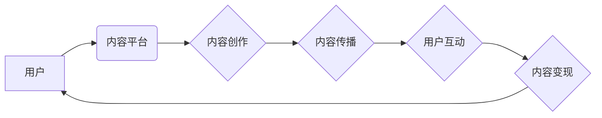

                 

## 内容电商创业：内容变现的新思路

> 关键词：内容电商、内容变现、知识付费、社区运营、数据驱动、人工智能、电商平台、用户体验

### 1. 背景介绍

互联网时代，信息爆炸，内容成为重要的生产要素。传统电商模式以商品交易为核心，而内容电商则将内容作为核心驱动力，通过提供优质内容吸引用户，并通过多种方式实现内容变现。

近年来，随着知识付费、直播电商、短视频等新兴模式的兴起，内容电商发展迅速。用户对个性化、多元化内容的需求不断增长，内容电商也迎来了新的发展机遇。

### 2. 核心概念与联系

**2.1 内容电商的本质**

内容电商本质上是一种以内容为核心，以用户体验为导向的商业模式。它将内容生产、内容传播、内容消费和内容变现有机结合，构建了一个全新的商业生态。

**2.2 内容电商的价值链**

内容电商的价值链主要包括以下环节：

* **内容创作:** 优质内容是内容电商的核心，需要专业团队或个人进行创作。
* **内容传播:** 通过多种渠道，例如社交媒体、搜索引擎、电商平台等，将内容传播给目标用户。
* **用户互动:** 鼓励用户参与内容互动，例如评论、点赞、分享等，提升用户粘性。
* **内容变现:** 通过多种方式实现内容价值变现，例如广告收入、会员订阅、电商销售等。

**2.3 内容电商的架构**



### 3. 核心算法原理 & 具体操作步骤

**3.1 算法原理概述**

内容电商的核心算法主要围绕用户个性化推荐、内容推荐算法、内容分发算法等方面。这些算法通过分析用户行为数据、内容特征数据等，实现精准内容推荐，提升用户体验，并促进内容变现。

**3.2 算法步骤详解**

1. **数据采集:** 收集用户行为数据、内容特征数据等。
2. **数据预处理:** 对数据进行清洗、转换、特征提取等处理。
3. **模型训练:** 利用机器学习算法，训练用户个性化推荐模型、内容推荐模型等。
4. **模型预测:** 根据用户行为和内容特征，预测用户对特定内容的兴趣。
5. **内容推荐:** 将预测结果作为依据，推荐个性化内容给用户。

**3.3 算法优缺点**

* **优点:** 能够精准推荐用户感兴趣的内容，提升用户体验，促进内容变现。
* **缺点:** 需要大量数据进行训练，算法模型需要不断更新迭代，才能保持推荐效果。

**3.4 算法应用领域**

* **内容平台:** 推荐新闻、视频、文章等内容。
* **电商平台:** 推荐商品、优惠券等信息。
* **社交媒体:** 推荐好友、群组、话题等内容。

### 4. 数学模型和公式 & 详细讲解 & 举例说明

**4.1 数学模型构建**

用户个性化推荐模型可以采用协同过滤算法，构建用户-物品评分矩阵。

**4.2 公式推导过程**

协同过滤算法的核心是计算用户之间和物品之间的相似度。常用的相似度度量方法包括余弦相似度、皮尔逊相关系数等。

**4.3 案例分析与讲解**

假设有一个用户-物品评分矩阵，其中用户和物品分别用数字表示。

```
用户 | 物品1 | 物品2 | 物品3
------- | -------- | -------- | --------
用户1 | 5 | 3 | 4
用户2 | 4 | 5 | 2
用户3 | 3 | 2 | 5
```

我们可以计算用户1和用户2之间的余弦相似度：

```
余弦相似度 = (用户1对物品1的评分 * 用户2对物品1的评分 + 用户1对物品2的评分 * 用户2对物品2的评分 + 用户1对物品3的评分 * 用户2对物品3的评分) / (sqrt(用户1对物品1的评分^2 + 用户1对物品2的评分^2 + 用户1对物品3的评分^2) * sqrt(用户2对物品1的评分^2 + 用户2对物品2的评分^2 + 用户2对物品3的评分^2))
```

通过计算，我们可以得到用户1和用户2之间的余弦相似度。

### 5. 项目实践：代码实例和详细解释说明

**5.1 开发环境搭建**

* 操作系统: Ubuntu 20.04
* 编程语言: Python 3.8
* 框架: Django 3.2
* 数据库: PostgreSQL 13

**5.2 源代码详细实现**

```python
# models.py
from django.db import models

class Content(models.Model):
    title = models.CharField(max_length=255)
    content = models.TextField()
    category = models.CharField(max_length=255)
    created_at = models.DateTimeField(auto_now_add=True)

class User(models.Model):
    username = models.CharField(max_length=255, unique=True)
    password = models.CharField(max_length=255)
    email = models.EmailField(unique=True)

# views.py
from django.shortcuts import render
from .models import Content

def index(request):
    contents = Content.objects.all()
    return render(request, 'index.html', {'contents': contents})
```

**5.3 代码解读与分析**

* models.py 文件定义了 Content 和 User 两个模型，分别代表内容和用户。
* views.py 文件定义了 index 函数，用于展示所有内容。

**5.4 运行结果展示**

运行代码后，可以访问 http://127.0.0.1:8000/，查看所有内容列表。

### 6. 实际应用场景

**6.1 内容电商平台**

例如知乎、豆瓣、Bilibili 等平台，通过提供优质内容吸引用户，并通过广告收入、会员订阅、电商销售等方式实现内容变现。

**6.2 知识付费平台**

例如Udemy、Coursera、网易云课堂等平台，通过提供在线课程、付费直播等形式，实现知识付费变现。

**6.3 社区运营**

例如微信公众号、QQ群、论坛等平台，通过提供社区服务、会员权益等，实现社区运营变现。

**6.4 未来应用展望**

随着人工智能、大数据等技术的不断发展，内容电商将更加智能化、个性化、多元化。

### 7. 工具和资源推荐

**7.1 学习资源推荐**

* 书籍: 《内容营销》、《电商运营》、《人工智能》
* 网站: 知乎、豆瓣、CSDN
* 课程: Udemy、Coursera、网易云课堂

**7.2 开发工具推荐**

* 编程语言: Python, JavaScript
* 框架: Django, React
* 数据库: PostgreSQL, MySQL

**7.3 相关论文推荐**

* 《Collaborative Filtering for Recommender Systems》
* 《Deep Learning for Recommender Systems》
* 《Content-Based Recommendation Systems》

### 8. 总结：未来发展趋势与挑战

**8.1 研究成果总结**

内容电商模式发展迅速，取得了显著成果，为用户提供了更多优质内容和服务，也为企业带来了新的商业机会。

**8.2 未来发展趋势**

* 智能化推荐: 利用人工智能技术，实现更加精准、个性化的内容推荐。
* 多元化变现: 探索更多内容变现模式，例如直播电商、虚拟现实等。
* 社交化内容: 鼓励用户参与内容创作和互动，构建更加活跃的社区生态。

**8.3 面临的挑战**

* 内容质量: 确保内容质量，避免低俗、虚假内容的传播。
* 用户隐私: 保护用户隐私，避免数据泄露。
* 平台竞争: 面对激烈的市场竞争，需要不断创新，提升平台竞争力。

**8.4 研究展望**

未来，内容电商将更加智能化、个性化、多元化，并与其他新兴技术融合，创造更加丰富的用户体验和商业模式。

### 9. 附录：常见问题与解答

**9.1 如何提高内容推荐的准确性?**

可以通过以下方式提高内容推荐的准确性:

* 收集更多用户行为数据和内容特征数据。
* 采用更先进的机器学习算法进行模型训练。
* 定期更新模型，并根据用户反馈进行调整。

**9.2 如何保护用户隐私?**

可以通过以下方式保护用户隐私:

* 明确告知用户数据收集和使用方式。
* 加密用户数据，防止数据泄露。
* 遵守相关法律法规，保护用户隐私权。


作者：禅与计算机程序设计艺术 / Zen and the Art of Computer Programming 
<end_of_turn>

