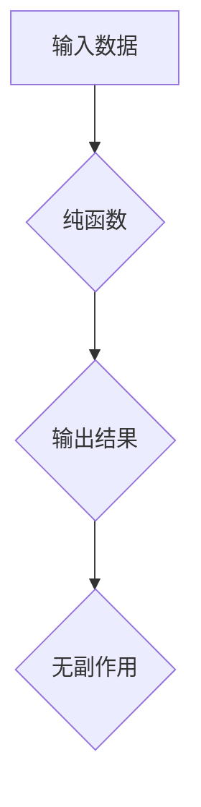

                 

## 函数式编程的思想与技术框架

> 关键词：函数式编程、纯函数、副作用、递归、lambda表达式、高阶函数、单例模式、并发编程、可测试性

### 1. 背景介绍

函数式编程 (Functional Programming, FP) 是一种编程范式，它将计算视为对函数的应用。与面向对象编程 (OOP) 不同，FP 强调函数的不可变性、纯函数和递归操作。它起源于 20 世纪 50 年代的数学逻辑和计算理论，并在 60 年代的 Lisp 和 Haskell 等语言中得到发展。近年来，随着云计算、大数据和人工智能等领域的兴起，FP 逐渐成为主流编程范式之一，因为它能够带来更高的可读性、可维护性和并发性。

### 2. 核心概念与联系

**2.1 核心概念**

* **纯函数 (Pure Function):**  一个纯函数的输出完全取决于其输入，并且不会产生任何副作用。换句话说，对于相同的输入，纯函数总是返回相同的输出，并且不会改变外部状态。

* **副作用 (Side Effect):**  副作用是指函数执行过程中对外部状态的改变，例如打印输出、修改变量或访问文件。

* **递归 (Recursion):**  递归是一种函数调用自身的方式，它通过重复地调用自身来解决问题。

* **高阶函数 (Higher-Order Function):**  高阶函数可以接受其他函数作为参数，或者返回另一个函数作为结果。

**2.2 架构流程图**



**2.3 联系**

FP 核心概念相互关联，共同构建了其独特的编程风格。纯函数是 FP 的基石，它保证了程序的确定性和可预测性。递归则提供了解决复杂问题的简洁和优雅的方式。高阶函数则提供了强大的代码复用和抽象能力。

### 3. 核心算法原理 & 具体操作步骤

**3.1 算法原理概述**

FP 中的算法通常基于递归和函数组合。递归允许函数以简洁的方式处理重复结构，而函数组合则允许将多个函数组合成更复杂的逻辑。

**3.2 算法步骤详解**

1. **分解问题:** 将问题分解成更小的、更容易处理的子问题。
2. **递归定义:** 为每个子问题定义一个递归函数。
3. **基线条件:** 为递归函数定义一个终止条件，避免无限递归。
4. **函数组合:** 将多个递归函数组合成一个解决完整问题的函数。

**3.3 算法优缺点**

**优点:**

* **可读性:** 递归算法通常具有良好的可读性和可理解性。
* **可维护性:** 由于算法的模块化和抽象性，FP 算法更容易维护和修改。
* **并发性:** FP 算法的纯函数特性使得它们更容易并行化。

**缺点:**

* **性能:** 递归算法可能在某些情况下比迭代算法性能更差。
* **栈溢出:** 深度递归可能会导致栈溢出错误。

**3.4 算法应用领域**

* 数据处理和分析
* 图算法
* 数学计算
* 并发编程

### 4. 数学模型和公式 & 详细讲解 & 举例说明

**4.1 数学模型构建**

FP 可以用数学函数的模型来理解。一个函数可以看作是一个从输入到输出的映射关系。

**4.2 公式推导过程**

在 FP 中，函数的组合可以看作是数学函数的复合。例如，如果 f(x) 和 g(x) 是两个函数，那么 (f ∘ g)(x) 表示先对 x 应用 g(x)，然后将结果应用于 f(x)。

**4.3 案例分析与讲解**

例如，我们可以用 FP 的方式实现一个简单的加法函数：

```
add = lambda x, y: x + y
```

这个函数接受两个整数作为输入，并返回它们的和。我们可以用数学公式来表示这个函数：

```
add(x, y) = x + y
```

**4.4 举例说明**

```
>>> add(2, 3)
5
```

在这个例子中，我们调用了 add 函数，并将 2 和 3 作为输入。函数返回了 5，这与数学公式的预期结果一致。

### 5. 项目实践：代码实例和详细解释说明

**5.1 开发环境搭建**

为了演示 FP 的应用，我们可以使用 Python 语言进行开发。Python 是一种支持 FP 思想的语言，它提供了 lambda 表达式、高阶函数和递归操作等功能。

**5.2 源代码详细实现**

```python
def factorial(n):
  """
  计算阶乘
  """
  if n == 0:
    return 1
  else:
    return n * factorial(n - 1)

# 计算 5 的阶乘
result = factorial(5)
print(f"5 的阶乘为: {result}")
```

**5.3 代码解读与分析**

这个代码实现了阶乘的计算。它使用递归的方式来计算阶乘。

* `factorial(n)` 函数接受一个整数 `n` 作为输入。
* 如果 `n` 等于 0，则返回 1，这是阶乘的基线条件。
* 否则，返回 `n` 乘以 `factorial(n - 1)`，这实现了阶乘的递归定义。

**5.4 运行结果展示**

```
5 的阶乘为: 120
```

### 6. 实际应用场景

FP 在许多实际应用场景中都有着广泛的应用，例如：

* **数据科学:** FP 可以用于处理和分析大规模数据，例如机器学习和数据挖掘。
* **软件开发:** FP 可以用于开发更可靠、可维护和可测试的软件。
* **游戏开发:** FP 可以用于开发更复杂的和更具交互性的游戏。

**6.4 未来应用展望**

随着云计算、大数据和人工智能等领域的不断发展，FP 的应用场景将会更加广泛。

### 7. 工具和资源推荐

**7.1 学习资源推荐**

* **书籍:**
    * 《函数式编程》 by  Richard Bird
    * 《Haskell 编程指南》 by Simon Peyton Jones
* **在线课程:**
    * Coursera 上的《Functional Programming Principles in Scala》
    * edX 上的《Functional Programming》

**7.2 开发工具推荐**

* **Haskell:** Haskell 是一种纯函数式编程语言，它提供了强大的类型系统和并发支持。
* **Scala:** Scala 是一种结合了面向对象和函数式编程的语言，它运行在 Java 平台上。
* **Clojure:** Clojure 是一种 Lisp 语言，它运行在 Java 平台上，并支持函数式编程和并发编程。

**7.3 相关论文推荐**

* 《The Art of Programming》 by Donald Knuth
* 《Structure and Interpretation of Computer Programs》 by Harold Abelson and Gerald Jay Sussman

### 8. 总结：未来发展趋势与挑战

**8.1 研究成果总结**

FP 已经取得了显著的成果，它为软件开发带来了更高的可靠性、可维护性和并发性。

**8.2 未来发展趋势**

* **更广泛的应用:** FP 将在更多领域得到应用，例如云计算、大数据和人工智能。
* **更强大的工具:** 将会有更多新的 FP 工具和框架出现，以支持 FP 的应用。
* **更深入的研究:** FP 的理论和实践将继续深入研究，以探索其更深层的潜力。

**8.3 面临的挑战**

* **学习曲线:** FP 的学习曲线相对陡峭，需要开发者掌握新的编程思想和概念。
* **生态系统:** FP 的生态系统相对较小，相对于 OOP 来说，其工具和资源相对较少。
* **性能:** 在某些情况下，FP 算法的性能可能不如 OOP 算法。

**8.4 研究展望**

未来，FP 将继续发展和完善，并为软件开发带来更多创新和突破。


### 9. 附录：常见问题与解答

**9.1 什么是纯函数？**

纯函数是指对于相同的输入，总是返回相同的输出，并且不会产生任何副作用的函数。

**9.2 为什么 FP 强调纯函数？**

纯函数使得程序更加确定性和可预测性，更容易测试和维护。

**9.3 FP 和 OOP 的区别是什么？**

FP 强调函数的不可变性和纯函数，而 OOP 则强调对象的封装和继承。

**9.4 FP 的应用场景有哪些？**

FP 在数据科学、软件开发、游戏开发等领域都有着广泛的应用。


作者：禅与计算机程序设计艺术 / Zen and the Art of Computer Programming 
<end_of_turn>

