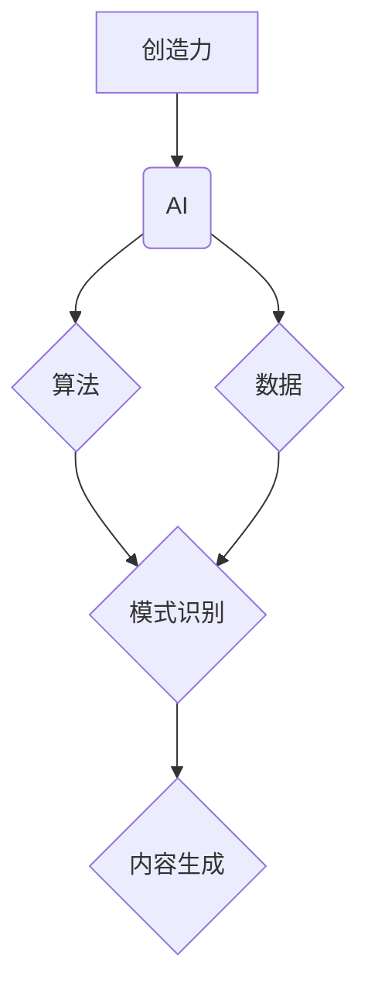

                 

## 创造力与 AI：推动艺术和科学发展

> 关键词：人工智能、创造力、艺术、科学、算法、数学模型、应用场景、未来趋势

### 1. 背景介绍

人工智能（AI）近年来取得了飞速发展，从语音识别到图像生成，AI已经渗透到我们生活的方方面面。然而，AI的潜力远不止于此。随着算法和模型的不断进步，AI正在展现出令人惊叹的创造力，不仅能够辅助人类进行创作，甚至能够独立完成艺术和科学研究。

传统上，创造力被认为是人类独有的特质，是人类思维的产物。但随着AI技术的进步，人们开始重新审视这一定义。AI可以通过学习海量数据，发现隐藏的模式和规律，并根据这些模式生成新的内容，例如绘画、音乐、文学作品，甚至科学发现。

### 2. 核心概念与联系

**2.1 创造力的本质**

创造力可以理解为产生新颖、有价值的思想、概念或作品的能力。它涉及到多种认知过程，包括想象力、联想、创新思维和解决问题的能力。

**2.2 AI 的创造力**

AI的创造力并非完全模仿人类的创造过程，而是基于算法和数据驱动。AI模型通过学习大量数据，识别模式和规律，并根据这些知识生成新的内容。

**2.3 核心概念关系图**



### 3. 核心算法原理 & 具体操作步骤

**3.1 算法原理概述**

AI创造力算法主要分为两类：

* **生成式模型:** 这些模型学习数据分布，并生成类似训练数据的新的样本。例如，GPT-3 是一种文本生成模型，可以根据输入的文本生成新的文本内容。
* **变分自编码器 (VAE):** 这些模型学习数据的潜在表示，并根据潜在表示生成新的样本。例如，VAE 可以用于生成图像、音频和视频。

**3.2 算法步骤详解**

以生成式对抗网络 (GAN) 为例，详细说明其工作原理：

1. **生成器:** 生成器是一个神经网络，其输入是随机噪声，输出是生成的新样本。
2. **鉴别器:** 鉴别器也是一个神经网络，其输入是真实样本和生成样本，输出是判断样本真实性的概率。
3. **训练过程:** 生成器和鉴别器在对抗训练中相互学习。生成器试图生成逼真的样本，而鉴别器试图区分真实样本和生成样本。
4. **输出结果:** 当生成器生成足够逼真的样本时，鉴别器无法区分真实样本和生成样本，此时生成器就达到了目标。

**3.3 算法优缺点**

* **优点:** GAN 可以生成高质量的样本，并能够学习复杂的数据分布。
* **缺点:** GAN 训练过程比较复杂，容易出现模式崩溃等问题。

**3.4 算法应用领域**

* **图像生成:** 生成逼真的图像、照片、艺术作品等。
* **文本生成:** 生成小说、诗歌、代码等文本内容。
* **音频生成:** 生成音乐、语音等音频内容。
* **视频生成:** 生成电影片段、动画等视频内容。

### 4. 数学模型和公式 & 详细讲解 & 举例说明

**4.1 数学模型构建**

GAN 的数学模型主要包括生成器 G 和鉴别器 D。

* **生成器 G:**  G(z) = x', 其中 z 是随机噪声，x' 是生成样本。
* **鉴别器 D:** D(x) = p(x), 其中 x 是输入样本，p(x) 是样本真实性的概率。

**4.2 公式推导过程**

GAN 的训练目标是最大化鉴别器 D 的准确率，同时最小化生成器 G 的损失。

* **鉴别器损失函数:** L_D = E_{x~p_data(x)}[log D(x)] + E_{x'~p_z(z)}[log(1 - D(G(z)))]
* **生成器损失函数:** L_G = E_{z~p_z(z)}[log(D(G(z)))]

**4.3 案例分析与讲解**

例如，在图像生成任务中，GAN 可以学习图像的特征分布，并生成新的图像。训练过程中，鉴别器会判断输入图像是否为真实图像，而生成器会根据鉴别器的反馈调整其生成图像的参数，最终生成逼真的图像。

### 5. 项目实践：代码实例和详细解释说明

**5.1 开发环境搭建**

使用 Python 语言和 TensorFlow 或 PyTorch 深度学习框架进行开发。

**5.2 源代码详细实现**

```python
# 生成器网络结构
class Generator(nn.Module):
    def __init__(self):
        super(Generator, self).__init__()
        # ...

    def forward(self, z):
        # ...

# 鉴别器网络结构
class Discriminator(nn.Module):
    def __init__(self):
        super(Discriminator, self).__init__()
        # ...

    def forward(self, x):
        # ...

# 训练循环
for epoch in range(num_epochs):
    # ...
```

**5.3 代码解读与分析**

代码中定义了生成器和鉴别器网络结构，并使用 Adam 优化器进行训练。训练过程中，生成器和鉴别器相互对抗，最终生成器能够生成逼真的样本。

**5.4 运行结果展示**

训练完成后，可以使用生成器生成新的样本，并将其与真实样本进行比较。

### 6. 实际应用场景

**6.1 艺术创作**

AI 可以辅助艺术家创作新的艺术作品，例如绘画、音乐、舞蹈等。

**6.2 科学研究**

AI 可以帮助科学家进行药物研发、材料设计、疾病诊断等研究。

**6.3 教育教学**

AI 可以用于个性化教育、自动批改作业、生成学习资源等。

**6.4 未来应用展望**

随着 AI 技术的不断发展，其在艺术和科学领域的应用将更加广泛和深入。

### 7. 工具和资源推荐

**7.1 学习资源推荐**

* **书籍:**
    * 《深度学习》
    * 《生成对抗网络》
* **在线课程:**
    * Coursera 上的深度学习课程
    * Udacity 上的 AI 课程

**7.2 开发工具推荐**

* **TensorFlow:** 开源深度学习框架
* **PyTorch:** 开源深度学习框架
* **Keras:** 高级深度学习 API

**7.3 相关论文推荐**

* 《Generative Adversarial Networks》
* 《Deep Convolutional Generative Adversarial Networks》

### 8. 总结：未来发展趋势与挑战

**8.1 研究成果总结**

AI 已经取得了令人瞩目的成就，在艺术和科学领域展现出巨大的潜力。

**8.2 未来发展趋势**

* **模型更加强大:** AI 模型将更加强大，能够生成更加逼真的和创新的内容。
* **应用更加广泛:** AI 将应用于更多领域，例如医疗、金融、教育等。
* **伦理问题更加突出:** AI 的发展也带来了伦理问题，例如数据隐私、算法偏见等。

**8.3 面临的挑战**

* **数据获取和标注:** 训练强大的 AI 模型需要大量的数据，而数据获取和标注成本很高。
* **算法效率:** 训练大型 AI 模型需要大量的计算资源，算法效率是一个重要的挑战。
* **伦理问题:** AI 的发展需要解决伦理问题，例如数据隐私、算法偏见等。

**8.4 研究展望**

未来，AI 研究将继续探索新的算法、模型和应用场景，并致力于解决 AI 发展过程中面临的挑战。


### 9. 附录：常见问题与解答

**9.1 如何训练一个 GAN 模型？**

训练 GAN 模型需要使用深度学习框架，例如 TensorFlow 或 PyTorch。需要定义生成器和鉴别器网络结构，并使用 Adam 优化器进行训练。

**9.2 GAN 模型有哪些应用场景？**

GAN 模型可以应用于图像生成、文本生成、音频生成、视频生成等领域。

**9.3 GAN 模型有哪些缺点？**

GAN 模型训练过程比较复杂，容易出现模式崩溃等问题。


作者：禅与计算机程序设计艺术 / Zen and the Art of Computer Programming 
<end_of_turn>

