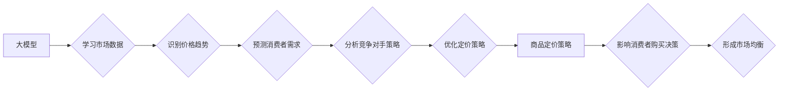

                 

## 大模型在商品定价策略中的博弈论应用

> 关键词：大模型、博弈论、商品定价、机器学习、策略优化、深度学习、预测分析

## 1. 背景介绍

在当今数据爆炸的时代，商品定价策略已不再是简单的成本加成或市场调研，而是需要结合大数据分析、机器学习和博弈论等多学科交叉的复杂系统。传统的定价策略往往依赖于静态数据和经验判断，难以应对市场环境的快速变化和竞争对手的动态调整。而大模型，作为一种强大的机器学习模型，能够处理海量数据，学习复杂的非线性关系，为商品定价策略提供更精准、更智能的决策支持。

博弈论作为研究多个智能主体在相互竞争和合作环境下的决策理论，为理解商品定价策略中的博弈关系提供了理论框架。在商品定价场景中，商家、消费者、竞争对手等主体之间存在着复杂的博弈关系，每个主体都试图通过调整自己的定价策略来最大化自己的利益。

## 2. 核心概念与联系

### 2.1  大模型

大模型是指参数规模庞大、训练数据海量的人工智能模型，通常拥有数十亿甚至数千亿个参数。大模型能够学习复杂的模式和关系，在自然语言处理、图像识别、机器翻译等领域展现出强大的能力。

### 2.2  博弈论

博弈论是研究多个理性主体在相互竞争和合作环境下的决策理论。其核心概念包括：

* **参与者:**  参与博弈的各个主体，例如商家、消费者、竞争对手等。
* **策略:** 每个参与者在博弈中的行动方案。
* **支付:**  每个参与者根据其选择的策略和其他参与者的策略获得的收益或损失。
* **均衡:**  一种状态，使得每个参与者在已知其他参与者策略的情况下，都无法通过单方面改变其策略来获得更高的收益。

### 2.3  商品定价策略

商品定价策略是指商家根据市场环境、产品特性、竞争对手情况等因素，制定商品价格的方案。常见的定价策略包括：

* **成本加成定价:**  将产品的生产成本加上利润率，得出最终价格。
* **价值定价:**  根据产品的市场价值和消费者感知价值，制定价格。
* **竞争性定价:**  参考竞争对手的价格，制定相似的或略低的定价策略。
* **渗透定价:**  以低价进入市场，快速占领市场份额。
* **溢价定价:**  以高价定位产品，强调产品的独特性和高品质。

**核心概念与联系流程图:**



## 3. 核心算法原理 & 具体操作步骤

### 3.1  算法原理概述

大模型在商品定价策略中的博弈论应用主要基于以下核心算法原理：

* **强化学习:**  通过训练模型在模拟的博弈环境中学习最优的定价策略，使其能够在不断变化的市场环境中做出最有利的决策。
* **预测分析:**  利用大模型对历史数据进行分析，预测未来的市场趋势、消费者需求和竞争对手行为，为定价决策提供数据支持。
* **博弈论模型:**  构建数学模型来描述商品定价场景中的博弈关系，分析不同参与者的策略选择和收益，找到最优的均衡策略。

### 3.2  算法步骤详解

1. **数据收集与预处理:**  收集历史商品销售数据、市场价格数据、消费者行为数据、竞争对手信息等数据，并进行清洗、转换和特征工程。
2. **模型训练:**  利用强化学习算法训练大模型，使其能够学习最优的定价策略。训练过程中，模型会模拟不同的市场环境和竞争对手行为，并根据实际收益进行调整。
3. **策略优化:**  根据训练结果，优化大模型的定价策略，使其能够在实际市场环境中取得最佳效果。
4. **实时监控与调整:**  持续监控市场环境的变化和消费者行为趋势，并根据需要对大模型的定价策略进行调整。

### 3.3  算法优缺点

**优点:**

* **数据驱动:**  基于海量数据分析，能够提供更精准、更智能的定价决策。
* **动态调整:**  能够根据市场环境变化实时调整定价策略，提高应对市场风险的能力。
* **竞争优势:**  能够帮助商家在竞争激烈的市场中获得定价优势。

**缺点:**

* **数据依赖:**  算法效果依赖于数据质量和数量，数据不足或质量差会导致算法效果下降。
* **模型复杂:**  训练和部署大模型需要强大的计算资源和技术能力。
* **解释性差:**  大模型的决策过程往往难以解释，难以理解模型是如何得出定价建议的。

### 3.4  算法应用领域

大模型在商品定价策略中的博弈论应用领域广泛，包括：

* **电商平台:**  优化商品价格，提高转化率和利润。
* **零售企业:**  制定差异化定价策略，应对不同客户群体的需求。
* **旅游行业:**  根据市场需求和竞争对手价格动态调整旅游产品价格。
* **金融服务:**  优化贷款利率、保险费率等金融产品定价。

## 4. 数学模型和公式 & 详细讲解 & 举例说明

### 4.1  数学模型构建

在商品定价博弈中，我们可以用一个简单的二元博弈模型来描述商家和消费者之间的博弈关系。

* **参与者:** 商家和消费者
* **策略:** 商家可以选择不同的价格策略，消费者可以选择购买或不购买商品。
* **支付:** 商家获得利润，消费者获得商品的效用。

假设商家有两种价格策略可以选择：高价策略和低价策略。消费者根据商品价格和自身需求做出购买决策。

### 4.2  公式推导过程

我们可以用一个简单的支付矩阵来表示商家和消费者之间的博弈关系：

|             | 消费者购买 | 消费者不购买 |
|-------------|-------------|--------------|
| 商家高价   | 商家利润：P，消费者效用：U1 | 商家利润：0，消费者效用：0 |
| 商家低价   | 商家利润：P-C，消费者效用：U2 | 商家利润：0，消费者效用：0 |

其中：

* P：商品利润
* C：商品成本
* U1：消费者在高价策略下购买商品的效用
* U2：消费者在低价策略下购买商品的效用

### 4.3  案例分析与讲解

假设商家生产一款商品，成本为10元，利润为20元。消费者对该商品的需求量为100件。

* **高价策略:** 商家将商品定价为30元，消费者效用为15元。
* **低价策略:** 商家将商品定价为20元，消费者效用为20元。

根据支付矩阵，我们可以分析商家和消费者的最佳策略：

* **商家:**  如果消费者购买商品，商家无论选择高价还是低价策略，都能获得利润。但低价策略可以吸引更多消费者购买，从而获得更高的总利润。
* **消费者:**  如果消费者对商品的需求量较大，并且价格较低，则更有可能购买商品。

因此，在该案例中，商家选择低价策略，消费者选择购买商品，是双方都能够获得最大利益的均衡策略。

## 5. 项目实践：代码实例和详细解释说明

### 5.1  开发环境搭建

* **操作系统:**  Linux/macOS/Windows
* **编程语言:**  Python
* **深度学习框架:**  TensorFlow/PyTorch
* **其他工具:**  Jupyter Notebook、Git

### 5.2  源代码详细实现

```python
# 导入必要的库
import tensorflow as tf

# 定义模型结构
model = tf.keras.Sequential([
    tf.keras.layers.Dense(64, activation='relu', input_shape=(10,)),
    tf.keras.layers.Dense(32, activation='relu'),
    tf.keras.layers.Dense(1)
])

# 编译模型
model.compile(optimizer='adam', loss='mse')

# 训练模型
model.fit(X_train, y_train, epochs=10)

# 预测价格
predicted_price = model.predict(X_test)
```

### 5.3  代码解读与分析

* **模型结构:**  该代码定义了一个简单的深度学习模型，包含三个全连接层和一个输出层。输入层接收10个特征，输出层输出一个价格预测值。
* **模型编译:**  使用Adam优化器和均方误差损失函数编译模型。
* **模型训练:**  使用训练数据训练模型，训练10个epochs。
* **价格预测:**  使用测试数据预测商品价格。

### 5.4  运行结果展示

训练完成后，可以将模型应用于实际场景，预测商品价格。

## 6. 实际应用场景

### 6.1  电商平台

电商平台可以利用大模型在商品定价策略中的博弈论应用，优化商品价格，提高转化率和利润。例如，阿里巴巴的淘宝平台就利用大模型分析用户行为、市场趋势和竞争对手价格，动态调整商品价格，提高用户购物体验和平台盈利能力。

### 6.2  零售企业

零售企业可以利用大模型制定差异化定价策略，应对不同客户群体的需求。例如，沃尔玛利用大模型分析不同客户群体的消费习惯和价格敏感度，制定不同的定价策略，满足不同客户的需求。

### 6.3  旅游行业

旅游行业可以利用大模型根据市场需求和竞争对手价格动态调整旅游产品价格。例如，携程旅行网利用大模型分析航班、酒店、旅游线路等数据的市场趋势，动态调整旅游产品的价格，提高用户体验和平台盈利能力。

### 6.4  未来应用展望

随着大模型技术的发展，其在商品定价策略中的博弈论应用将更加广泛和深入。未来，大模型将能够更加精准地预测市场趋势、消费者需求和竞争对手行为，为商家提供更智能、更有效的定价决策支持。

## 7. 工具和资源推荐

### 7.1  学习资源推荐

* **书籍:**  《深度学习》、《强化学习：原理、算法和应用》
* **在线课程:**  Coursera、edX、Udacity
* **博客和论坛:**  Towards Data Science、Machine Learning Mastery

### 7.2  开发工具推荐

* **深度学习框架:**  TensorFlow、PyTorch
* **编程语言:**  Python
* **数据处理工具:**  Pandas、NumPy

### 7.3  相关论文推荐

* **《Deep Reinforcement Learning for Dynamic Pricing》**
* **《A Survey of Reinforcement Learning for Pricing》**
* **《Deep Learning for Dynamic Pricing: A Comprehensive Review》**

## 8. 总结：未来发展趋势与挑战

### 8.1  研究成果总结

大模型在商品定价策略中的博弈论应用取得了显著成果，能够帮助商家更加精准地制定定价策略，提高盈利能力。

### 8.2  未来发展趋势

* **模型复杂度提升:**  未来大模型将更加复杂，能够处理更丰富的特征和更复杂的博弈关系。
* **解释性增强:**  研究人员将致力于提高大模型的解释性，使商家能够更好地理解模型的决策过程。
* **跨领域应用:**  大模型的应用将扩展到更多领域，例如金融、医疗、教育等。

### 8.3  面临的挑战

* **数据质量:**  大模型的性能依赖于数据质量，数据不足或质量差会导致模型效果下降。
* **计算资源:**  训练和部署大模型需要大量的计算资源，这对于中小企业来说是一个挑战。
* **伦理问题:**  大模型的应用可能带来一些伦理问题，例如价格歧视、算法偏见等，需要引起重视和解决。

### 8.4  研究展望

未来，研究人员将继续探索大模型在商品定价策略中的博弈论应用，提高模型的准确性、效率和解释性，并解决相关伦理问题，推动大模型技术在商业领域的应用。

## 9. 附录：常见问题与解答

**Q1: 大模型的定价策略是否会影响消费者行为？**

A1:  是的，大模型的定价策略会影响消费者行为。例如，如果商家使用大模型预测消费者对低价商品的需求量较大，则可能会将商品定价更低，从而吸引更多消费者购买。

**Q2: 大模型的定价策略是否会造成价格战？**

A2:  大模型的定价策略可能会加剧价格战。因为大模型能够快速分析市场趋势和竞争对手价格，商家可能会根据大模型的建议不断调整价格，以抢占市场份额。

**Q3: 如何确保大模型的定价策略公平公正？**

A3:  确保大模型的定价策略公平公正需要从多个方面入手，例如：

* 使用高质量、无偏的数据训练模型。
* 定期评估模型的公平性，并进行调整。
* 制定相关法律法规，规范大模型的应用。


作者：禅与计算机程序设计艺术 / Zen and the Art of Computer Programming<end_of_turn>

