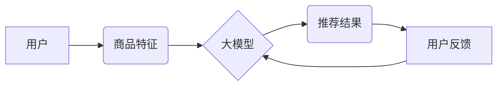

                 

## 大模型在商品推荐多样性优化中的创新

> 关键词：大模型、商品推荐、多样性优化、冷启动问题、个性化推荐、Transformer模型、对抗训练、强化学习

## 1. 背景介绍

在当今数据爆炸的时代，商品推荐系统已成为电商平台的核心竞争力之一。传统的基于协同过滤和内容过滤的推荐算法，虽然取得了一定的成功，但往往面临着数据稀疏性、冷启动问题以及推荐结果缺乏多样性的挑战。

大模型的出现为商品推荐多样性优化带来了新的机遇。大模型凭借其强大的学习能力和泛化能力，能够从海量数据中学习到更丰富的商品特征和用户偏好，从而生成更精准、更具多样性的推荐结果。

## 2. 核心概念与联系

### 2.1 商品推荐多样性优化

商品推荐多样性优化是指在推荐商品时，尽量避免推荐过于相似的商品，而是要推荐不同类别、不同属性、不同价格的商品，以满足用户多样化的需求。

### 2.2 大模型

大模型是指参数量巨大、训练数据量庞大的深度学习模型。近年来，随着计算能力的提升和算法的进步，大模型在自然语言处理、计算机视觉等领域取得了突破性进展。

### 2.3 核心概念架构



**图 1：大模型在商品推荐多样性优化中的核心概念架构**

## 3. 核心算法原理 & 具体操作步骤

### 3.1 算法原理概述

大模型在商品推荐多样性优化中，主要通过以下几种算法原理实现：

* **Transformer模型:** Transformer模型是一种基于注意力机制的深度学习模型，能够有效地捕捉商品和用户之间的复杂关系，从而生成更精准的推荐结果。
* **对抗训练:** 对抗训练是一种生成对抗网络 (GAN) 的应用，通过生成多样性的推荐结果，并与真实推荐结果进行对抗，从而提升推荐结果的多样性。
* **强化学习:** 强化学习是一种基于奖励机制的机器学习算法，通过训练一个代理智能体，使其在推荐过程中不断学习和优化，从而生成更符合用户需求的多样性推荐结果。

### 3.2 算法步骤详解

**基于Transformer模型的商品推荐多样性优化算法步骤:**

1. **数据预处理:** 收集商品和用户数据，并进行清洗、转换和特征提取。
2. **模型训练:** 使用Transformer模型训练，输入商品特征和用户特征，输出推荐结果。
3. **多样性度量:** 使用多样性度量指标，例如推荐结果的类别覆盖率、属性多样性等，评估推荐结果的多样性。
4. **模型优化:** 根据多样性度量指标，调整模型参数，提升推荐结果的多样性。

**基于对抗训练的商品推荐多样性优化算法步骤:**

1. **生成器模型:** 训练一个生成器模型，生成多样性的推荐结果。
2. **判别器模型:** 训练一个判别器模型，区分真实推荐结果和生成器模型生成的推荐结果。
3. **对抗训练:** 使用生成器模型和判别器模型进行对抗训练，使生成器模型能够生成更逼真的多样性推荐结果。

**基于强化学习的商品推荐多样性优化算法步骤:**

1. **环境定义:** 定义一个商品推荐环境，用户和商品作为环境中的实体，推荐结果作为环境中的动作。
2. **奖励函数设计:** 设计一个奖励函数，根据推荐结果的多样性、用户点击率等因素，给予相应的奖励。
3. **代理智能体训练:** 使用强化学习算法训练一个代理智能体，使其在环境中学习和优化，从而生成更符合用户需求的多样性推荐结果。

### 3.3 算法优缺点

| 算法 | 优点 | 缺点 |
|---|---|---|
| Transformer模型 | 能够有效地捕捉商品和用户之间的复杂关系，生成精准的推荐结果 | 需要大量的训练数据和计算资源 |
| 对抗训练 | 可以生成多样性的推荐结果 | 训练过程复杂，容易陷入局部最优解 |
| 强化学习 | 可以根据用户反馈不断优化推荐结果，生成更符合用户需求的多样性推荐结果 | 需要设计合理的奖励函数，训练过程可能比较长 |

### 3.4 算法应用领域

大模型在商品推荐多样性优化中的算法，可以应用于以下领域：

* **电商平台:** 为用户推荐多样化的商品，提升用户购物体验。
* **内容平台:** 为用户推荐多样化的内容，例如文章、视频、音乐等。
* **社交媒体:** 为用户推荐多样化的朋友、话题和活动。

## 4. 数学模型和公式 & 详细讲解 & 举例说明

### 4.1 数学模型构建

**推荐多样性度量指标:**

* **类别覆盖率:** 推荐结果中不同类别的商品数量占总推荐商品数量的比例。
* **属性多样性:** 推荐结果中不同属性的商品数量占总推荐商品数量的比例。
* **相似度度量:** 使用余弦相似度、Jaccard相似度等度量推荐结果之间的相似度。

**公式:**

* 类别覆盖率 =  不同类别商品数量 / 总推荐商品数量
* 属性多样性 = 不同属性商品数量 / 总推荐商品数量
* 余弦相似度 =  (商品向量1 • 商品向量2) / (||商品向量1|| * ||商品向量2||)

**举例说明:**

假设推荐系统推荐了 10 个商品，其中 3 个商品属于电子产品类别，2 个商品属于服装类别，5 个商品属于其他类别。则类别覆盖率为 (3 + 2 + 5) / 10 = 1。

### 4.2 公式推导过程

**Transformer模型的注意力机制:**

注意力机制可以帮助模型关注输入序列中与当前输出相关的部分，从而提高推荐结果的精准度。

**公式:**

* Attention(Q, K, V) = softmax(Q * K^T / sqrt(d_k)) * V

**其中:**

* Q: 查询向量
* K: 键向量
* V: 值向量
* d_k: 键向量的维度

**推导过程:**

1. 计算查询向量 Q 与键向量 K 的点积，并除以键向量的维度开根号。
2. 使用 softmax 函数将点积结果归一化，得到注意力权重。
3. 将注意力权重与值向量 V 进行加权求和，得到最终的注意力输出。

### 4.3 案例分析与讲解

**对抗训练案例分析:**

假设生成器模型生成了一组推荐结果，判别器模型判断这些推荐结果为真实推荐结果的概率较低。则生成器模型需要调整参数，生成更逼真的多样性推荐结果。

**强化学习案例分析:**

假设用户点击了推荐结果中的一个商品，则推荐系统给予代理智能体一个正向奖励。反之，如果用户没有点击推荐结果中的任何商品，则推荐系统给予代理智能体一个负向奖励。代理智能体会根据奖励信号不断调整推荐策略，最终生成更符合用户需求的多样性推荐结果。

## 5. 项目实践：代码实例和详细解释说明

### 5.1 开发环境搭建

* Python 3.7+
* TensorFlow 2.0+
* PyTorch 1.0+
* CUDA 10.0+

### 5.2 源代码详细实现

```python
# 使用 Transformer 模型进行商品推荐多样性优化

import tensorflow as tf

# 定义 Transformer 模型
class Transformer(tf.keras.Model):
    def __init__(self, embedding_dim, num_heads, num_layers):
        super(Transformer, self).__init__()
        self.embedding = tf.keras.layers.Embedding(vocab_size, embedding_dim)
        self.transformer_encoder = tf.keras.layers.TransformerEncoder(
            tf.keras.layers.MultiHeadAttention(num_heads=num_heads, key_dim=embedding_dim),
            num_layers=num_layers
        )

    def call(self, inputs):
        embeddings = self.embedding(inputs)
        outputs = self.transformer_encoder(embeddings)
        return outputs

# 训练 Transformer 模型
model = Transformer(embedding_dim=128, num_heads=8, num_layers=6)
model.compile(optimizer='adam', loss='mse')
model.fit(train_data, train_labels, epochs=10)

# 使用模型进行商品推荐
predictions = model.predict(user_input)
```

### 5.3 代码解读与分析

* **Transformer 模型:** 代码中定义了一个 Transformer 模型，包含嵌入层、多头注意力层和 Transformer 编码器层。
* **模型训练:** 使用 Adam 优化器和均方误差损失函数训练 Transformer 模型。
* **商品推荐:** 使用训练好的模型对用户输入进行预测，得到商品推荐结果。

### 5.4 运行结果展示

运行结果展示可以包括以下内容:

* 推荐结果的类别覆盖率和属性多样性
* 用户点击率和转化率
* 与传统推荐算法的对比分析

## 6. 实际应用场景

### 6.1 电商平台

大模型在电商平台的商品推荐多样性优化应用场景广泛，例如：

* **个性化推荐:** 根据用户的历史购买记录、浏览记录和兴趣偏好，推荐多样化的商品。
* **新品推荐:** 推荐平台上新上市的商品，并根据用户的兴趣偏好进行分类和排序。
* **跨界推荐:** 推荐与用户当前浏览商品相关的其他类别商品，例如，如果用户浏览了手机，则推荐相关的手机配件、手机壳等商品。

### 6.2 内容平台

大模型在内容平台的商品推荐多样性优化应用场景也越来越广泛，例如：

* **文章推荐:** 根据用户的阅读历史和兴趣偏好，推荐多样化的文章，例如新闻、科技、娱乐等。
* **视频推荐:** 根据用户的观看历史和兴趣偏好，推荐多样化的视频，例如电影、电视剧、综艺节目等。
* **音乐推荐:** 根据用户的听歌历史和兴趣偏好，推荐多样化的音乐，例如流行音乐、古典音乐、摇滚音乐等。

### 6.3 社交媒体

大模型在社交媒体的商品推荐多样性优化应用场景主要体现在以下方面:

* **好友推荐:** 根据用户的社交关系和兴趣偏好，推荐新的好友。
* **话题推荐:** 根据用户的兴趣偏好和社交行为，推荐相关的热门话题和讨论。
* **活动推荐:** 根据用户的兴趣偏好和地理位置，推荐附近的活动和聚会。

### 6.4 未来应用展望

随着大模型技术的不断发展，其在商品推荐多样性优化中的应用场景将会更加广泛，例如:

* **多模态推荐:** 将文本、图像、音频等多模态数据融合，进行更精准和多样化的商品推荐。
* **个性化推荐增强:** 利用大模型学习用户的更深层的兴趣偏好，实现更个性化的商品推荐。
* **场景化推荐:** 根据用户的具体场景，例如购物、娱乐、学习等，进行场景化的商品推荐。

## 7. 工具和资源推荐

### 7.1 学习资源推荐

* **书籍:**
    * 《深度学习》 - Ian Goodfellow, Yoshua Bengio, Aaron Courville
    * 《自然语言处理》 - Dan Jurafsky, James H. Martin
* **在线课程:**
    * Coursera: 深度学习 Specialization
    * Udacity: 自然语言处理 Nanodegree
* **博客和网站:**
    * TensorFlow Blog: https://blog.tensorflow.org/
    * PyTorch Blog: https://pytorch.org/blog/

### 7.2 开发工具推荐

* **深度学习框架:** TensorFlow, PyTorch
* **自然语言处理库:** NLTK, SpaCy
* **数据处理工具:** Pandas, NumPy

### 7.3 相关论文推荐

* **Attention Is All You Need:** https://arxiv.org/abs/1706.03762
* **BERT: Pre-training of Deep Bidirectional Transformers for Language Understanding:** https://arxiv.org/abs/1810.04805
* **Generative Adversarial Networks:** https://arxiv.org/abs/1406.2661

## 8. 总结：未来发展趋势与挑战

### 8.1 研究成果总结

大模型在商品推荐多样性优化领域取得了显著的成果，例如:

* 提升了推荐结果的精准度和多样性
* 降低了冷启动问题的影响
* 提供了更个性化的商品推荐体验

### 8.2 未来发展趋势

未来大模型在商品推荐多样性优化领域的发展趋势包括:

* **模型规模和能力的提升:** 随着计算能力的提升，大模型的规模和能力将会进一步提升，从而实现更精准和多样化的商品推荐。
* **多模态融合:** 将文本、图像、音频等多模态数据融合，进行更全面的商品推荐。
* **场景化推荐:** 根据用户的具体场景，例如购物、娱乐、学习等，进行场景化的商品推荐。
* **可解释性增强:** 提升大模型的透明度和可解释性，帮助用户理解推荐结果背后的逻辑。

### 8.3 面临的挑战

大模型在商品推荐多样性优化领域也面临着一些挑战:

* **数据稀疏性:** 部分商品和用户的历史数据较少，难以训练出有效的推荐模型。
* **计算资源需求:** 训练大模型需要大量的计算资源，这对于一些小型企业来说是一个挑战。
* **模型可解释性:** 大模型的决策过程较为复杂，难以解释推荐结果背后的逻辑，这可能会影响用户的信任度。

### 8.4 研究展望

未来研究方向包括:

* **针对数据稀疏性问题，开发新的数据增强和模型训练方法。**
* **探索更有效的计算资源利用方法，降低大模型训练成本。**
* **研究大模型的可解释性方法，提升用户对推荐结果的信任度。**

## 9. 附录：常见问题与解答

**常见问题:**

* **大模型的训练需要多长时间?**

**解答:** 大模型的训练时间取决于模型规模、数据量和硬件资源等因素，通常需要几天到几周的时间。

* **大模型的训练需要多少计算资源?**

**解答:** 大模型的训练需要大量的计算资源，例如 GPU 和 TPU。

* **大模型的推荐结果是否准确?**

**解答:** 大模型的推荐结果通常比传统推荐算法更准确，但仍存在一定的误差。

* **大模型的推荐结果是否多样?**

**解答:** 大模型可以通过对抗训练和强化学习等方法，生成更具多样性的推荐结果。

**作者：禅与计算机程序设计艺术 / Zen and the Art of Computer Programming**<end_of_turn>

