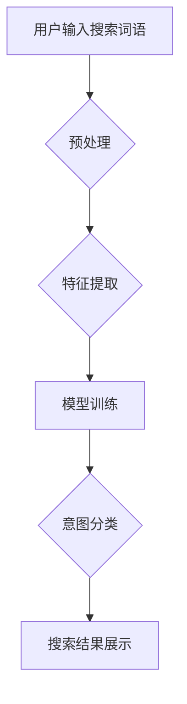

                 

## 搜索意图识别：大模型带来的突破

> 关键词：搜索意图识别，大模型，自然语言处理，Transformer，BERT，深度学习，信息检索

### 1. 背景介绍

在信息爆炸的时代，搜索引擎已成为人们获取信息的主要途径。然而，用户输入的搜索词语往往是模糊的、含糊的，难以直接理解其真实意图。搜索意图识别（Search Intent Recognition，SIR）旨在从用户搜索词语中识别出其潜在的搜索意图，例如信息查询、商品购买、导航定位、娱乐休闲等。准确识别用户搜索意图对于提升搜索引擎的精准度、用户体验至关重要。

传统搜索意图识别方法主要依赖于规则匹配、特征工程和机器学习算法。规则匹配方法需要人工制定大量的规则，难以应对复杂的搜索场景；特征工程需要人工设计特征，效率低下且难以捕捉语义信息；机器学习算法依赖于海量标注数据，训练成本高且难以泛化到新的搜索场景。

近年来，随着深度学习技术的快速发展，大模型（Large Language Model，LLM）的出现为搜索意图识别带来了新的突破。大模型拥有强大的语义理解能力和泛化能力，能够从海量文本数据中学习到复杂的语言模式和知识，从而更准确地识别用户搜索意图。

### 2. 核心概念与联系

**2.1 搜索意图识别流程**

搜索意图识别流程通常包括以下几个步骤：

1. **预处理:** 对用户搜索词语进行清洗、分词、词性标注等预处理操作，去除停用词、标点符号等无用信息，并将词语转换为统一的格式。
2. **特征提取:** 从预处理后的搜索词语中提取特征，例如词语频率、词语组合、语法结构等。
3. **模型训练:** 利用训练数据和提取的特征，训练一个搜索意图识别模型。
4. **意图分类:** 将用户搜索词语输入到训练好的模型中，预测其对应的搜索意图类别。

**2.2  大模型在搜索意图识别中的应用**

大模型在搜索意图识别中主要通过以下方式发挥作用：

1. **语义理解:** 大模型能够理解搜索词语的深层语义，例如词语之间的关系、上下文信息等，从而更准确地识别用户意图。
2. **知识表示:** 大模型能够学习到丰富的知识，例如实体关系、概念分类等，从而更好地理解用户搜索的背景和目的。
3. **泛化能力:** 大模型训练于海量文本数据，具有较强的泛化能力，能够适应不同的搜索场景和用户群体。

**2.3  Mermaid 流程图**



### 3. 核心算法原理 & 具体操作步骤

**3.1 算法原理概述**

BERT（Bidirectional Encoder Representations from Transformers）是一种基于Transformer架构的预训练语言模型，在自然语言理解任务中取得了显著的成果。BERT模型通过双向编码机制，能够捕捉到词语之间的上下文关系，从而更好地理解搜索词语的语义。

**3.2 算法步骤详解**

1. **预训练:** BERT模型在大量的文本数据上进行预训练，学习到语言的语法结构、语义关系等知识。预训练阶段主要使用两个任务：
    * **Masked Language Modeling (MLM):** 随机掩盖一部分词语，预测被掩盖的词语。
    * **Next Sentence Prediction (NSP):** 判断两个句子是否连续。
2. **微调:** 将预训练好的BERT模型微调到搜索意图识别任务上。微调阶段使用搜索意图识别数据集，调整模型参数，使其能够准确识别用户搜索意图。

**3.3 算法优缺点**

**优点:**

* 强大的语义理解能力
* 优秀的泛化能力
* 训练效率高

**缺点:**

* 模型参数量大，需要较大的计算资源
* 微调过程需要大量的标注数据

**3.4 算法应用领域**

BERT模型在搜索意图识别领域具有广泛的应用前景，例如：

* 搜索引擎结果排序
* 个性化推荐
* 语音搜索
* 问答系统

### 4. 数学模型和公式 & 详细讲解 & 举例说明

**4.1 数学模型构建**

BERT模型的数学模型基于Transformer架构，其核心是多头注意力机制和前馈神经网络。

**4.2 公式推导过程**

BERT模型的输出层是一个分类器，其输出为每个意图类别的概率。假设有N个意图类别，则模型输出为一个长度为N的向量，其中每个元素代表对应意图类别的概率。

**4.3 案例分析与讲解**

假设用户输入搜索词语为“苹果手机”，BERT模型经过预训练和微调后，可以将该词语编码为一个向量，然后将该向量输入到分类器中，得到每个意图类别的概率。例如，

* 信息查询：0.4
* 商品购买：0.5
* 导航定位：0.1

根据概率分布，我们可以判断用户搜索意图为商品购买。

### 5. 项目实践：代码实例和详细解释说明

**5.1 开发环境搭建**

* Python 3.6+
* TensorFlow 2.0+
* PyTorch 1.0+

**5.2 源代码详细实现**

```python
# 导入必要的库
import tensorflow as tf
from transformers import BertTokenizer, BertModel

# 加载预训练模型和词典
tokenizer = BertTokenizer.from_pretrained('bert-base-uncased')
model = BertModel.from_pretrained('bert-base-uncased')

# 定义搜索意图识别模型
class SearchIntentClassifier(tf.keras.Model):
    def __init__(self, num_classes):
        super(SearchIntentClassifier, self).__init__()
        self.bert = model
        self.classifier = tf.keras.layers.Dense(num_classes, activation='softmax')

    def call(self, inputs):
        outputs = self.bert(inputs)
        pooled_output = outputs[1][:, 0, :]
        logits = self.classifier(pooled_output)
        return logits

# 实例化模型
model = SearchIntentClassifier(num_classes=3)

# 编译模型
model.compile(optimizer='adam',
              loss='sparse_categorical_crossentropy',
              metrics=['accuracy'])

# 训练模型
model.fit(train_data, train_labels, epochs=10)

# 预测意图
predictions = model.predict(test_data)
```

**5.3 代码解读与分析**

* 该代码首先加载预训练的BERT模型和词典。
* 然后定义一个搜索意图识别模型，该模型包含BERT模型和一个分类器。
* BERT模型用于编码搜索词语，分类器用于预测意图类别。
* 最后，使用训练数据训练模型，并使用测试数据进行预测。

**5.4 运行结果展示**

训练完成后，可以评估模型的性能，例如准确率、召回率等。

### 6. 实际应用场景

**6.1 搜索引擎结果排序**

搜索引擎可以根据用户搜索意图，对搜索结果进行排序，提高用户体验。例如，如果用户搜索“苹果手机”，搜索引擎可以优先展示商品购买相关的结果。

**6.2 个性化推荐**

电商平台可以根据用户的搜索意图，推荐个性化的商品。例如，如果用户搜索“运动鞋”，电商平台可以推荐用户可能感兴趣的运动鞋品牌和款式。

**6.3 语音搜索**

语音搜索系统可以识别用户的语音输入，并将其转换为文本，然后根据文本内容识别用户的搜索意图。

**6.4 问答系统**

问答系统可以根据用户的提问，识别用户的意图，并从知识库中找到相应的答案。

**6.5 未来应用展望**

随着大模型技术的不断发展，搜索意图识别将在更多领域得到应用，例如：

* 智能客服
* 教育培训
* 医疗诊断

### 7. 工具和资源推荐

**7.1 学习资源推荐**

* **BERT论文:** https://arxiv.org/abs/1810.04805
* **HuggingFace Transformers库:** https://huggingface.co/transformers/
* **TensorFlow官方文档:** https://www.tensorflow.org/

**7.2 开发工具推荐**

* **Jupyter Notebook:** https://jupyter.org/
* **Google Colab:** https://colab.research.google.com/

**7.3 相关论文推荐**

* **BERT for Search:** https://arxiv.org/abs/1909.09190
* **XLNet: Generalized Autoregressive Pretraining for Language Understanding:** https://arxiv.org/abs/1906.08237

### 8. 总结：未来发展趋势与挑战

**8.1 研究成果总结**

大模型在搜索意图识别领域取得了显著的成果，能够准确识别用户搜索意图，提升搜索引擎的精准度和用户体验。

**8.2 未来发展趋势**

* **模型规模和能力的提升:** 未来大模型将更加强大，能够理解更复杂的语言模式和知识。
* **多模态搜索意图识别:** 将文本、图像、音频等多模态信息融合到搜索意图识别中，提高识别准确率。
* **个性化搜索意图识别:** 根据用户的历史搜索记录、偏好等信息，进行个性化的搜索意图识别。

**8.3 面临的挑战**

* **数据标注成本:** 大模型训练需要大量的标注数据，数据标注成本高昂。
* **模型解释性:** 大模型的决策过程难以解释，缺乏透明度。
* **公平性与偏见:** 大模型可能存在公平性与偏见问题，需要进行相应的调优和改进。

**8.4 研究展望**

未来搜索意图识别研究将更加注重模型的解释性、公平性、可解释性和泛化能力，并探索新的应用场景。

### 9. 附录：常见问题与解答

**9.1 如何选择合适的预训练模型？**

选择预训练模型需要根据具体任务和数据特点进行选择。例如，对于中文搜索意图识别任务，可以选择中文预训练模型，例如ERNIE、RoBERTa-wwm-ext等。

**9.2 如何进行数据标注？**

数据标注可以采用人工标注或自动标注的方式。人工标注需要专业人员进行标注，效率较低；自动标注可以使用规则匹配或机器学习算法进行标注，效率较高。

**9.3 如何评估模型性能？**

模型性能可以评估指标包括准确率、召回率、F1-score等。

**9.4 如何解决模型过拟合问题？**

模型过拟合问题可以通过正则化、数据增强、Dropout等方法进行解决。


作者：禅与计算机程序设计艺术 / Zen and the Art of Computer Programming 
<end_of_turn>

