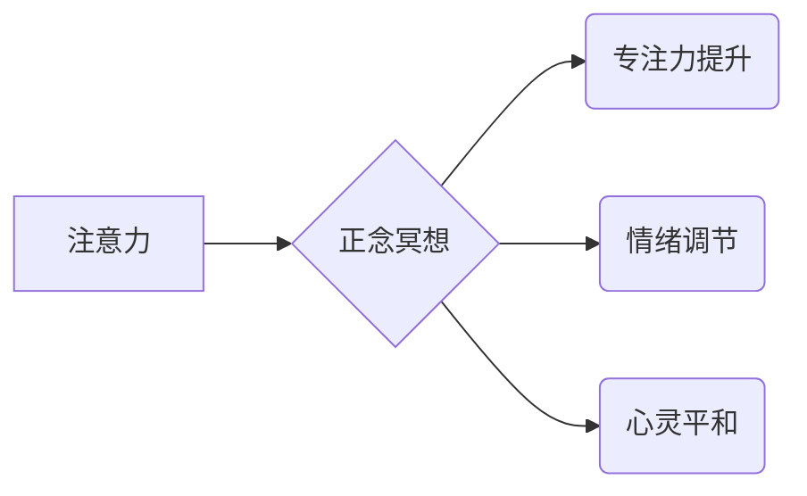

                 

##  注意力管理与正念冥想实践：通过内省增强专注力和心灵平和

> 关键词：注意力管理、正念冥想、专注力、心灵平和、内省、认知科学、神经科学、 mindfulness、meditation、focus、well-being

## 1. 背景介绍

在当今信息爆炸的时代，我们面临着前所未有的注意力挑战。来自手机、社交媒体、电子邮件等各种渠道的信息轰炸，使得专注力变得稀缺，心灵也常常陷入焦虑和不安。如何有效地管理注意力，提升专注力，并获得内心的平静，成为现代人亟需解决的问题。

正念冥想作为一种古老而有效的精神修养方法，近年来在科学界得到了越来越多的关注。研究表明，正念冥想能够有效地增强注意力、减轻压力、改善情绪，甚至还能改变大脑结构和功能。

## 2. 核心概念与联系

### 2.1 注意力与正念

**注意力**是指对特定信息或刺激的意识集中，它是一种有限的资源，需要我们主动选择和调控。

**正念**是指对当下体验的觉察和接受，不评判、不执着，以一种开放和好奇的态度去观察自己的思想、感受和身体状态。

正念冥想通过训练我们的注意力，帮助我们更好地觉察当下，并以一种非评判的态度去面对各种体验。

**核心概念架构**



### 2.2 正念冥想与认知科学

正念冥想与认知科学的研究密切相关。认知科学致力于理解人类的思维过程，而正念冥想可以被视为一种训练思维的工具。

研究表明，正念冥想能够改变大脑的结构和功能，增强前额叶皮层的活动，前额叶皮层负责执行功能、注意力控制和情绪调节。

## 3. 核心算法原理 & 具体操作步骤

### 3.1 算法原理概述

正念冥想的核心算法并非一个严格的算法，而是基于对人类认知机制的理解，并通过特定的练习方法来训练注意力和觉察能力。

其核心原理在于：

* **专注于当下:** 将注意力集中在当下正在发生的事情上，例如呼吸、身体的感觉、声音等。
* **非评判性观察:** 观察自己的思想、感受和身体状态，不评判、不执着，以一种好奇和接纳的态度去对待它们。
* **回归当下:** 当注意力被分散时，轻轻地将注意力拉回当下。

### 3.2 算法步骤详解

1. **找到一个安静舒适的环境:** 选择一个安静、舒适的地方，尽量减少干扰。
2. **采取舒适的坐姿:** 坐在椅子上或垫子上，保持背部挺直，但不要过于僵硬。
3. **专注于呼吸:** 将注意力集中在呼吸上，感受呼吸的节奏和感受。
4. **觉察身体感觉:** 注意身体的各个部位，感受身体的温度、触感、重量等。
5. **观察思想和情绪:** 当思想或情绪出现时，不要评判或执着，只是观察它们，就像看云朵一样。
6. **回归当下:** 当注意力被分散时，轻轻地将注意力拉回呼吸或身体感觉上。
7. **持续练习:** 每天练习一段时间，从几分钟开始，逐渐增加练习时间。

### 3.3 算法优缺点

**优点:**

* **简单易学:** 正念冥想不需要任何特殊的设备或技能，每个人都可以练习。
* **效果显著:** 研究表明，正念冥想能够有效地增强注意力、减轻压力、改善情绪。
* **安全无副作用:** 正念冥想是一种安全有效的练习方法，没有副作用。

**缺点:**

* **需要坚持练习:** 正念冥想需要持续的练习才能看到效果。
* **初期可能感到困难:** 初期练习可能会感到无聊或难以集中注意力。
* **效果因人而异:** 不同的人对正念冥想的反应可能有所不同。

### 3.4 算法应用领域

正念冥想在以下领域都有广泛的应用:

* **教育:** 帮助学生提高注意力、学习效率和情绪调节能力。
* **医疗:** 缓解焦虑、抑郁、慢性疼痛等症状。
* **企业:** 提升员工的专注力、压力管理能力和团队合作能力。
* **个人成长:** 提升自我意识、情绪管理能力和生活质量。

## 4. 数学模型和公式 & 详细讲解 & 举例说明

正念冥想本身并非一个严格的数学模型，但我们可以通过数学模型来描述其对大脑的影响。

### 4.1 数学模型构建

我们可以用一个简单的数学模型来描述注意力和正念之间的关系：

**注意力 = 正念 * 认知能力**

其中：

* **注意力:** 指的是对特定信息或刺激的意识集中程度。
* **正念:** 指的是对当下体验的觉察和接受程度。
* **认知能力:** 指的是个体处理信息的能力。

### 4.2 公式推导过程

这个模型的推导过程基于以下假设：

* 正念能够增强注意力。
* 认知能力是注意力水平的一个重要影响因素。

当正念水平提高时，注意力水平也会随之提高。

### 4.3 案例分析与讲解

例如，一个专注于工作的人，如果能够保持正念，专注于当下正在做的事情，那么他的注意力水平就会更高，工作效率也会更高。

反之，如果一个人被各种杂念干扰，注意力无法集中，那么他的工作效率就会下降。

## 5. 项目实践：代码实例和详细解释说明

正念冥想并非一个需要编程实现的概念，但我们可以通过编程来模拟和研究其背后的机制。

### 5.1 开发环境搭建

可以使用 Python 语言和相关的库来实现正念冥想相关的模拟和研究。

### 5.2 源代码详细实现

```python
import time

def mindfulness_meditation(duration):
  """
  模拟正念冥想练习
  """
  print("开始正念冥想练习...")
  for i in range(duration):
    print(f"第{i+1}分钟：专注于呼吸，感受身体...")
    time.sleep(60)
  print("正念冥想练习结束...")

# 设置练习时长
duration = 10

# 调用函数进行练习
mindfulness_meditation(duration)
```

### 5.3 代码解读与分析

这段代码模拟了正念冥想练习的过程，通过循环打印提示信息，并使用 `time.sleep()` 函数模拟时间流逝。

### 5.4 运行结果展示

运行这段代码后，会打印出模拟正念冥想练习的过程，并每分钟打印一次提示信息。

## 6. 实际应用场景

正念冥想在现实生活中有着广泛的应用场景。

### 6.1 教育领域

* **提高学生注意力:** 正念冥想可以帮助学生集中注意力，提高学习效率。
* **减轻学生压力:** 正念冥想可以帮助学生缓解压力，改善情绪。
* **培养学生情绪管理能力:** 正念冥想可以帮助学生更好地理解和管理自己的情绪。

### 6.2 医疗领域

* **缓解焦虑和抑郁:** 正念冥想可以有效地缓解焦虑和抑郁症状。
* **减轻慢性疼痛:** 正念冥想可以帮助患者更好地管理慢性疼痛。
* **改善睡眠质量:** 正念冥想可以帮助患者改善睡眠质量。

### 6.3 企业领域

* **提升员工注意力和专注力:** 正念冥想可以帮助员工提高注意力和专注力，从而提高工作效率。
* **减轻员工压力和焦虑:** 正念冥想可以帮助员工缓解压力和焦虑，从而提高工作满意度。
* **促进团队合作:** 正念冥想可以帮助员工更好地理解和沟通，从而促进团队合作。

### 6.4 未来应用展望

随着对正念冥想的深入研究，其应用场景将会更加广泛。

例如，未来可能会有更多基于正念冥想的应用程序和工具，帮助人们更好地管理注意力、情绪和健康。

## 7. 工具和资源推荐

### 7.1 学习资源推荐

* **书籍:** 《正念：改变生活的八周冥想计划》
* **网站:** Headspace, Calm
* **应用程序:** Insight Timer, Smiling Mind

### 7.2 开发工具推荐

* **Python:** 用于模拟和研究正念冥想机制。
* **TensorFlow:** 用于构建深度学习模型，研究正念冥想对大脑的影响。

### 7.3 相关论文推荐

* **正念冥想对注意力和认知功能的影响**
* **正念冥想对情绪调节和压力管理的影响**
* **正念冥想对大脑结构和功能的影响**

## 8. 总结：未来发展趋势与挑战

### 8.1 研究成果总结

近年来，对正念冥想的研究取得了显著进展，证实了其对注意力、情绪、健康等方面的积极影响。

### 8.2 未来发展趋势

未来，正念冥想研究将朝着以下方向发展：

* **更深入地了解正念冥想机制:** 通过神经科学、认知科学等领域的交叉研究，更深入地了解正念冥想对大脑的影响。
* **开发更有效的正念冥想训练方法:** 基于对正念冥想机制的深入理解，开发更有效的训练方法，提高训练效果。
* **拓展正念冥想的应用场景:** 将正念冥想应用于更多领域，例如教育、医疗、企业等，发挥其更大的社会价值。

### 8.3 面临的挑战

正念冥想研究也面临着一些挑战：

* **研究方法的局限性:** 目前的研究方法难以完全捕捉正念冥想的复杂性。
* **个体差异:** 不同的人对正念冥想的反应可能有所不同，需要考虑个体差异。
* **推广应用的难点:** 将正念冥想推广到社会各个层面，需要克服一些文化和观念上的障碍。

### 8.4 研究展望

尽管面临着挑战，但正念冥想研究的前景依然光明。随着研究的深入，相信正念冥想将为人类带来更多福祉。

## 9. 附录：常见问题与解答

### 9.1 如何开始正念冥想练习？

* 找到一个安静舒适的环境。
* 采取舒适的坐姿。
* 将注意力集中在呼吸上。
* 觉察身体的感觉。
* 观察思想和情绪。
* 当注意力被分散时，轻轻地将注意力拉回呼吸或身体感觉上。

### 9.2 正念冥想需要多长时间才能看到效果？

正念冥想的效果因人而异，有些人可能在几周内就能感受到效果，而有些人可能需要几个月或更长时间。

### 9.3 正念冥想有什么副作用吗？

正念冥想是一种安全有效的练习方法，没有副作用。

### 9.4 正念冥想适合所有人吗？

正念冥想一般来说适合所有人，但如果患有精神疾病，建议在专业医生的指导下进行练习。


作者：禅与计算机程序设计艺术 / Zen and the Art of Computer Programming 
<end_of_turn>

