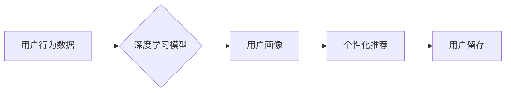

                 

##  注意力经济下的用户留存策略

> 关键词：用户留存、注意力经济、深度学习、推荐系统、个性化、行为分析、A/B测试

## 1. 背景介绍

在当今信息爆炸的时代，用户面临着来自各方信息的冲击，他们的注意力变得越来越稀缺。这使得“注意力经济”成为一个重要的概念，企业需要通过提供更有价值、更吸引人的内容和服务来获取和保持用户的注意力。用户留存，即用户持续使用产品或服务的程度，成为衡量产品成功的重要指标。

传统的用户留存策略往往依赖于简单的行为分析和粗粒度的用户画像，例如用户活跃度、使用时长等。然而，随着用户行为的复杂化和个性化的需求不断增加，传统的策略已经难以有效应对。

## 2. 核心概念与联系

### 2.1 注意力经济

注意力经济是指在信息过载的时代，用户注意力成为一种稀缺资源，而企业需要通过提供有价值的内容和服务来获取和保持用户的注意力。

### 2.2 用户留存

用户留存是指用户持续使用产品或服务的程度，通常用留存率来衡量，留存率是指在特定时间段内，仍然活跃的用户比例。

### 2.3 深度学习与推荐系统

深度学习是一种机器学习方法，能够从海量数据中学习复杂的模式和特征。推荐系统利用深度学习技术，通过分析用户的行为数据和偏好，推荐用户感兴趣的内容和服务，从而提高用户留存率。

**Mermaid 流程图**



## 3. 核心算法原理 & 具体操作步骤

### 3.1 算法原理概述

深度学习算法在用户留存策略中发挥着关键作用，主要通过以下方式：

* **用户画像构建:** 利用深度学习模型从用户的行为数据中学习用户的兴趣、偏好、习惯等特征，构建用户画像。
* **个性化推荐:** 根据用户的画像，推荐用户感兴趣的内容和服务，提高用户参与度和粘性。
* **留存预测:** 利用深度学习模型预测用户的留存概率，帮助企业制定针对性的留存策略。

### 3.2 算法步骤详解

1. **数据收集:** 收集用户的行为数据，例如用户访问记录、点击记录、购买记录、评论记录等。
2. **数据预处理:** 对收集到的数据进行清洗、转换、特征提取等预处理操作，使其适合深度学习模型的训练。
3. **模型选择:** 选择合适的深度学习模型，例如循环神经网络（RNN）、长短期记忆网络（LSTM）、卷积神经网络（CNN）等。
4. **模型训练:** 利用预处理后的数据训练深度学习模型，调整模型参数，使其能够准确地预测用户的留存概率或推荐用户感兴趣的内容。
5. **模型评估:** 使用测试数据评估模型的性能，例如准确率、召回率、F1-score等。
6. **模型部署:** 将训练好的模型部署到生产环境中，实时预测用户的留存概率或推荐用户感兴趣的内容。

### 3.3 算法优缺点

**优点:**

* **高准确率:** 深度学习算法能够从海量数据中学习复杂的模式，提高预测准确率。
* **个性化推荐:** 深度学习算法能够根据用户的个性化特征进行推荐，提高用户体验。
* **持续学习:** 深度学习模型能够持续学习，随着数据的不断积累，模型的性能会不断提升。

**缺点:**

* **数据依赖:** 深度学习算法需要大量的训练数据，否则模型性能会下降。
* **计算资源:** 训练深度学习模型需要大量的计算资源，成本较高。
* **可解释性:** 深度学习模型的决策过程较为复杂，难以解释模型的决策结果。

### 3.4 算法应用领域

深度学习算法在用户留存策略中广泛应用，例如：

* **推荐系统:** 推荐用户感兴趣的内容和服务，提高用户参与度和粘性。
* **用户画像构建:** 从用户的行为数据中学习用户的兴趣、偏好、习惯等特征，构建用户画像。
* **留存预测:** 预测用户的留存概率，帮助企业制定针对性的留存策略。
* **个性化内容推送:** 根据用户的画像，推送个性化的内容和服务，提高用户体验。

## 4. 数学模型和公式 & 详细讲解 & 举例说明

### 4.1 数学模型构建

用户留存模型通常采用概率模型，例如泊松分布、指数分布、生存分析模型等。

**泊松分布:** 用于描述事件在固定时间间隔内发生的次数，例如用户在一天内访问网站的次数。

**指数分布:** 用于描述事件发生的时间间隔，例如用户首次访问网站到再次访问网站的时间间隔。

**生存分析模型:** 用于描述用户在特定时间点之前离开系统的概率，例如用户注册后离开系统的概率。

### 4.2 公式推导过程

假设用户在时间 t 时刻离开系统的概率为 F(t)，则用户在时间 t 到 t+Δt 之间离开系统的概率为：

```latex
f(t) = F'(t) = \frac{d}{dt}F(t)
```

其中，F'(t) 为生存函数的导数，即死亡率函数。

### 4.3 案例分析与讲解

例如，假设用户注册后离开系统的概率服从指数分布，其参数为 λ，则用户在时间 t 时刻离开系统的概率为：

```latex
F(t) = 1 - e^{-\lambda t}
```

其中，λ 为用户离开系统的速率。

## 5. 项目实践：代码实例和详细解释说明

### 5.1 开发环境搭建

* Python 3.x
* TensorFlow 或 PyTorch 深度学习框架
* Jupyter Notebook 或 VS Code 开发环境

### 5.2 源代码详细实现

```python
import tensorflow as tf

# 定义用户留存模型
model = tf.keras.Sequential([
    tf.keras.layers.Dense(64, activation='relu', input_shape=(10,)),
    tf.keras.layers.Dense(32, activation='relu'),
    tf.keras.layers.Dense(1, activation='sigmoid')
])

# 编译模型
model.compile(optimizer='adam', loss='binary_crossentropy', metrics=['accuracy'])

# 训练模型
model.fit(X_train, y_train, epochs=10)

# 评估模型
loss, accuracy = model.evaluate(X_test, y_test)
print('Loss:', loss)
print('Accuracy:', accuracy)
```

### 5.3 代码解读与分析

* 代码首先定义了一个简单的深度学习模型，包含三个全连接层。
* 模型的输入维度为 10，表示用户行为数据的维度。
* 模型的输出维度为 1，表示用户留存的概率。
* 模型使用 Adam 优化器、二元交叉熵损失函数和准确率作为评估指标。
* 代码然后训练模型，使用训练数据 X_train 和 y_train。
* 最后，使用测试数据 X_test 和 y_test 评估模型的性能。

### 5.4 运行结果展示

运行结果将显示模型的损失值和准确率，可以根据结果评估模型的性能。

## 6. 实际应用场景

### 6.1 游戏行业

游戏公司可以使用深度学习算法分析用户的游戏行为数据，例如游戏时长、关卡完成情况、道具使用情况等，构建用户画像，并根据用户的画像推荐个性化的游戏内容和活动，提高用户留存率。

### 6.2 电商行业

电商平台可以使用深度学习算法分析用户的购买记录、浏览记录、评价记录等数据，构建用户画像，并根据用户的画像推荐个性化的商品和服务，提高用户留存率。

### 6.3 社交媒体平台

社交媒体平台可以使用深度学习算法分析用户的点赞、评论、分享等行为数据，构建用户画像，并根据用户的画像推荐个性化的内容和好友，提高用户留存率。

### 6.4 未来应用展望

随着深度学习技术的不断发展，用户留存策略将更加个性化、智能化。未来，我们可以期待以下应用场景：

* **实时个性化推荐:** 基于用户的实时行为数据，提供更加个性化的推荐，提高用户参与度和粘性。
* **主动式留存:** 通过分析用户的行为数据，预测用户即将离开系统的风险，并主动采取措施挽留用户。
* **多模态用户画像:** 将用户的文本、图像、视频等多模态数据融合在一起，构建更加全面的用户画像，提高推荐的准确率和个性化程度。

## 7. 工具和资源推荐

### 7.1 学习资源推荐

* **书籍:**
    * 深度学习
    * 人工智能
* **在线课程:**
    * Coursera
    * edX
    * Udacity

### 7.2 开发工具推荐

* **Python:**
    * TensorFlow
    * PyTorch
* **数据分析工具:**
    * Pandas
    * NumPy
* **可视化工具:**
    * Matplotlib
    * Seaborn

### 7.3 相关论文推荐

* **Attention Is All You Need**
* **BERT: Pre-training of Deep Bidirectional Transformers for Language Understanding**
* **Recurrent Neural Networks for Sequence Learning**

## 8. 总结：未来发展趋势与挑战

### 8.1 研究成果总结

深度学习算法在用户留存策略中取得了显著的成果，能够提高用户留存率、个性化推荐和预测用户行为。

### 8.2 未来发展趋势

未来，用户留存策略将更加智能化、个性化和自动化。

* **更强大的模型:** 研究人员将继续开发更强大的深度学习模型，例如 Transformer、Graph Neural Networks 等，提高用户留存策略的准确率和效率。
* **多模态数据融合:** 将用户的文本、图像、视频等多模态数据融合在一起，构建更加全面的用户画像，提高推荐的准确率和个性化程度。
* **实时个性化推荐:** 基于用户的实时行为数据，提供更加个性化的推荐，提高用户参与度和粘性。

### 8.3 面临的挑战

* **数据隐私:** 深度学习算法需要大量的用户数据进行训练，如何保护用户隐私是一个重要的挑战。
* **模型解释性:** 深度学习模型的决策过程较为复杂，难以解释模型的决策结果，这可能会导致用户对模型的信任度降低。
* **算法公平性:** 深度学习算法可能会存在偏见，导致对不同用户群体的不公平对待，需要研究如何保证算法的公平性。

### 8.4 研究展望

未来，用户留存策略的研究将更加注重以下方面:

* **隐私保护:** 研究更加隐私保护的深度学习算法，例如联邦学习、差分隐私等。
* **模型解释性:** 研究如何提高深度学习模型的解释性，使模型的决策过程更加透明。
* **算法公平性:** 研究如何保证深度学习算法的公平性，避免对不同用户群体的不公平对待。


## 9. 附录：常见问题与解答

**Q1: 深度学习算法需要多少数据才能训练？**

A1: 深度学习算法需要大量的训练数据，通常需要百万甚至数十万条数据才能达到较好的效果。

**Q2: 如何评估深度学习模型的性能？**

A2: 深度学习模型的性能通常使用准确率、召回率、F1-score 等指标进行评估。

**Q3: 如何解决深度学习模型的过拟合问题？**

A3: 可以使用正则化技术、数据增强、Dropout 等方法来解决深度学习模型的过拟合问题。

**作者：禅与计算机程序设计艺术 / Zen and the Art of Computer Programming**<end_of_turn>

