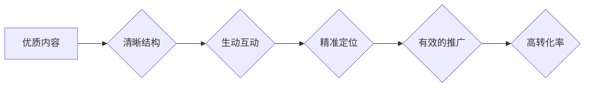

                 

## 程序员如何打造高转化率的知识付费课程

> 关键词：知识付费、程序员、课程设计、转化率、市场营销、技术内容、教学方法、用户体验

## 1. 背景介绍

近年来，随着互联网技术的快速发展和知识经济的兴起，知识付费行业蓬勃发展。程序员作为技术领域的高需求人才，其技能和经验也成为知识付费市场上的热门资源。越来越多的程序员开始尝试通过打造知识付费课程来分享自己的技术知识，并获得经济回报。然而，知识付费课程的市场竞争激烈，如何打造高转化率的课程，成为许多程序员面临的挑战。

## 2. 核心概念与联系

**2.1 知识付费课程的本质**

知识付费课程本质上是一种以知识和技能为核心价值的商品，通过线上平台进行销售和传播。其核心价值在于为用户提供有价值的知识和技能，帮助用户提升自身能力，解决实际问题，从而实现个人价值提升和经济回报。

**2.2 高转化率课程的构成要素**

高转化率的知识付费课程需要具备以下核心要素：

* **优质内容：** 内容是课程的核心，需要深入浅出、实用性强、具有独特性和价值。
* **清晰结构：** 课程内容需要结构清晰、逻辑严谨，方便用户理解和掌握。
* **生动互动：** 课程形式需要多样化，例如视频、音频、文字、案例等，并加入互动环节，提高用户参与度。
* **精准定位：** 课程目标受众需要明确，内容和营销策略需要针对特定人群进行定制。
* **有效的推广：** 需要通过多种渠道进行课程推广，例如社交媒体、搜索引擎、KOL合作等，扩大课程影响力。

**2.3 课程设计与转化率的关系**

课程设计直接影响着课程的转化率。良好的课程设计能够吸引用户关注，激发用户学习兴趣，并帮助用户有效地获取知识和技能。

**Mermaid 流程图**



## 3. 核心算法原理 & 具体操作步骤

**3.1 算法原理概述**

打造高转化率的知识付费课程，本质上是一个数据驱动、用户体验优化的迭代优化过程。我们可以将它抽象成一个算法，其核心原理是：

* **数据收集与分析：** 通过用户行为数据、市场调研等方式收集相关信息，分析用户需求、学习习惯、痛点等。
* **内容优化：** 根据数据分析结果，对课程内容进行优化，例如调整内容结构、增加互动环节、改进教学方法等。
* **推广策略调整：** 根据用户反馈和市场变化，调整课程推广策略，例如优化广告投放、选择合适的推广渠道等。
* **持续迭代：** 通过不断收集数据、分析结果、优化内容和推广策略，实现课程的持续迭代和改进。

**3.2 算法步骤详解**

1. **需求调研：** 通过问卷调查、用户访谈、市场调研等方式，了解目标用户的学习需求、痛点、学习习惯等。
2. **内容规划：** 根据需求调研结果，制定课程内容框架，确定课程目标、学习内容、教学方法等。
3. **内容制作：** 根据课程框架，制作高质量的课程内容，例如视频、音频、文字、案例等。
4. **课程平台搭建：** 选择合适的课程平台，搭建课程网站或APP，并进行课程发布和管理。
5. **推广营销：** 通过多种渠道进行课程推广，例如社交媒体、搜索引擎、KOL合作等，扩大课程影响力。
6. **用户反馈收集：** 收集用户学习反馈，例如课程评价、学习进度、用户提问等。
7. **数据分析与优化：** 对用户反馈数据进行分析，找出课程的不足之处，并进行相应的优化。
8. **持续迭代：** 根据数据分析结果，不断优化课程内容、教学方法、推广策略等，实现课程的持续迭代和改进。

**3.3 算法优缺点**

* **优点：** 数据驱动、用户体验优化、持续迭代，能够有效提高课程转化率。
* **缺点：** 需要投入大量时间和精力进行数据收集、分析和优化，需要具备一定的技术和市场营销能力。

**3.4 算法应用领域**

该算法适用于所有类型的知识付费课程，例如编程课程、设计课程、管理课程等。

## 4. 数学模型和公式 & 详细讲解 & 举例说明

**4.1 数学模型构建**

我们可以用一个简单的数学模型来描述知识付费课程的转化率：

```latex
转化率 = (购买用户数 / 访问用户数) * 100%
```

其中：

* 购买用户数：访问课程并完成购买的用户数量。
* 访问用户数：访问课程页面或试听课程的用户数量。

**4.2 公式推导过程**

该公式的推导过程很简单，就是将购买用户数与访问用户数进行比例计算，并乘以100%得到转化率。

**4.3 案例分析与讲解**

假设一个编程课程的访问用户数为1000人，购买用户数为100人，那么该课程的转化率为：

```latex
转化率 = (100 / 1000) * 100% = 10%
```

这意味着该课程的10%的访问用户最终完成了购买。

## 5. 项目实践：代码实例和详细解释说明

**5.1 开发环境搭建**

打造知识付费课程需要搭建一个合适的开发环境，包括课程平台、内容制作工具、数据分析工具等。

**5.2 源代码详细实现**

由于课程内容和平台搭建方式多种多样，这里不再给出具体的源代码实现。

**5.3 代码解读与分析**

课程平台的源代码通常包含以下模块：

* 用户管理模块：负责用户注册、登录、信息管理等功能。
* 课程管理模块：负责课程发布、更新、删除等功能。
* 支付模块：负责课程购买、支付处理等功能。
* 数据统计模块：负责收集用户行为数据，并进行分析和报表生成。

**5.4 运行结果展示**

课程平台的运行结果展示包括课程页面、用户界面、数据报表等。

## 6. 实际应用场景

**6.1 编程课程平台**

例如，Codecademy、Udemy、Coursera等平台提供各种编程课程，并通过数据分析和用户反馈不断优化课程内容和教学方法。

**6.2 设计课程平台**

例如，Skillshare、Domestika等平台提供各种设计课程，并通过用户作品展示和社区互动来提高课程的吸引力和互动性。

**6.3 管理课程平台**

例如，LinkedIn Learning、edX等平台提供各种管理课程，并通过案例分析和行业专家分享来提升课程的实用性和价值。

**6.4 未来应用展望**

随着人工智能、虚拟现实等技术的不断发展，知识付费课程将更加个性化、互动化、沉浸式。

## 7. 工具和资源推荐

**7.1 学习资源推荐**

* **书籍：** 《The Lean Startup》、《Hooked》、《Influence》
* **课程：** Udemy的“Marketing for Beginners”、Coursera的“Digital Marketing Specialization”
* **博客：** Neil Patel Blog、MarketingProfs

**7.2 开发工具推荐**

* **课程平台：** Thinkific、Teachable、Kajabi
* **内容制作工具：** Camtasia、Adobe Premiere Pro、Canva
* **数据分析工具：** Google Analytics、Hotjar

**7.3 相关论文推荐**

* **《The Impact of Online Learning on Student Outcomes》**
* **《The Economics of Online Education》**
* **《The Future of Online Learning》**

## 8. 总结：未来发展趋势与挑战

**8.1 研究成果总结**

打造高转化率的知识付费课程需要结合数据驱动、用户体验优化、持续迭代等理念，并利用合适的工具和资源。

**8.2 未来发展趋势**

未来知识付费课程将更加个性化、互动化、沉浸式，并与人工智能、虚拟现实等技术深度融合。

**8.3 面临的挑战**

知识付费课程市场竞争激烈，如何打造差异化课程、提升用户粘性、应对技术变革等都是需要克服的挑战。

**8.4 研究展望**

未来研究方向包括：

* 探索更有效的课程设计方法和教学模式。
* 研究人工智能在知识付费课程中的应用场景。
* 探索知识付费课程与其他教育模式的融合发展。

## 9. 附录：常见问题与解答

**9.1 如何确定课程目标受众？**

可以通过市场调研、用户访谈等方式了解目标用户的学习需求、痛点、学习习惯等。

**9.2 如何提高课程的互动性？**

可以通过加入互动环节，例如问答、讨论、案例分析等，鼓励用户参与学习。

**9.3 如何进行课程推广？**

可以通过多种渠道进行课程推广，例如社交媒体、搜索引擎、KOL合作等。

**9.4 如何应对用户反馈？**

需要认真收集用户反馈，并根据反馈进行课程优化和改进。


作者：禅与计算机程序设计艺术 / Zen and the Art of Computer Programming 
<end_of_turn>

