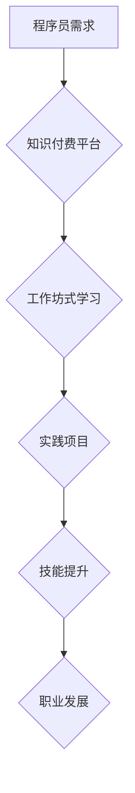

                 

## 程序员知识付费：打造工作坊式学习模式

> 关键词：程序员知识付费、工作坊式学习、实践驱动、深度学习、技术社区、在线教育、项目实战、技能提升

### 1. 背景介绍

在当今科技飞速发展的时代，程序员的需求量持续增长，而程序员的技能水平也面临着越来越高的要求。传统的教育模式难以满足程序员快速学习和提升技能的需求。知识付费作为一种新型的教育模式，逐渐成为程序员学习新技术、提升技能的重要途径。

然而，单纯的线上课程或视频教程往往缺乏实践操作和互动交流，难以真正帮助程序员掌握核心技能。因此，如何打造更有效的程序员知识付费模式，成为业界关注的焦点。

工作坊式学习模式，以其实践驱动、互动交流、项目实战的特点，逐渐成为程序员知识付费的热门选择。

### 2. 核心概念与联系

#### 2.1 工作坊式学习

工作坊式学习是一种以实践为中心的学习模式，强调学员通过参与实际项目、解决真实问题来学习和掌握知识。它通常由以下几个关键要素组成：

* **实践驱动:** 学习内容以实践项目为核心，学员通过动手操作、解决问题来学习和理解知识。
* **互动交流:** 工作坊通常会设置小组讨论、案例分享等环节，鼓励学员之间进行互动交流，共同学习和解决问题。
* **导师指导:** 经验丰富的导师会全程指导学员，提供技术支持和学习建议。
* **项目实战:** 工作坊通常会设置一个完整的项目，学员需要从需求分析、设计、开发到测试，完成整个项目开发流程。

#### 2.2 知识付费

知识付费是指通过付费的方式获取知识和技能。它可以采用多种形式，例如线上课程、线下培训、咨询服务等。

#### 2.3 工作坊式知识付费

工作坊式知识付费将工作坊式学习模式与知识付费模式相结合，通过付费的方式参与工作坊，获得实践经验和技能提升。

**Mermaid 流程图**



### 3. 核心算法原理 & 具体操作步骤

#### 3.1 算法原理概述

工作坊式知识付费模式的核心算法原理在于将知识和技能的学习与实践项目相结合，通过实践操作和互动交流，帮助学员快速掌握核心技能。

#### 3.2 算法步骤详解

1. **需求分析:** 首先，需要对目标学员的需求进行深入分析，了解他们的学习目标、技能水平和学习偏好。
2. **课程设计:** 根据需求分析结果，设计一个符合学员需求的实践项目，并将其分解成多个模块，每个模块对应一个具体的学习目标。
3. **资源准备:** 准备必要的学习资源，例如代码示例、文档资料、在线工具等。
4. **导师团队:** 组建一支经验丰富的导师团队，负责指导学员完成项目开发，并提供技术支持和学习建议。
5. **平台搭建:** 搭建一个专业的知识付费平台，提供学员注册、课程购买、项目管理、互动交流等功能。
6. **学员参与:** 学员通过平台注册购买课程，并参与到实践项目中，完成各个模块的学习任务。
7. **项目评估:** 导师对学员完成的项目进行评估，并提供反馈意见，帮助学员改进和提升。
8. **技能提升:** 通过实践项目和导师指导，学员能够快速掌握核心技能，并将其应用到实际工作中。

#### 3.3 算法优缺点

**优点:**

* **实践驱动:** 通过实践项目，学员能够更深入地理解和掌握知识。
* **互动交流:** 互动交流环节可以促进学员之间的学习和分享，提高学习效率。
* **项目实战:** 完成项目开发，能够锻炼学员的实际操作能力和解决问题的能力。

**缺点:**

* **成本较高:** 工作坊式学习需要投入更多的资源，例如导师费用、平台搭建费用等。
* **时间成本:** 工作坊式学习通常需要较长的学习时间，学员需要投入更多的时间和精力。
* **学员参与度:** 需要保证学员的积极参与，才能达到预期效果。

#### 3.4 算法应用领域

工作坊式知识付费模式广泛应用于程序员技能培训领域，例如：

* **前端开发:** HTML、CSS、JavaScript、React、Vue.js等
* **后端开发:** Python、Java、Node.js、Go等
* **数据库:** MySQL、MongoDB、PostgreSQL等
* **云计算:** AWS、Azure、GCP等
* **人工智能:** Machine Learning、Deep Learning等

### 4. 数学模型和公式 & 详细讲解 & 举例说明

#### 4.1 数学模型构建

工作坊式知识付费模式可以抽象为一个数学模型，其中涉及到学员数量、课程价格、学习时长、技能提升等因素。

**模型假设:**

* 学员数量为N
* 课程价格为P
* 学习时长为T
* 技能提升程度为S

**模型公式:**

```latex
S = f(N, P, T)
```

其中，f()为一个复杂的函数，代表技能提升程度与学员数量、课程价格、学习时长之间的关系。

#### 4.2 公式推导过程

由于技能提升程度是一个多因素综合影响的结果，其公式推导过程较为复杂，需要考虑多个因素之间的相互作用。

例如，学员数量会影响学习氛围和互动交流的强度，课程价格会影响学员的学习意愿和付费能力，学习时长会影响学员对知识的吸收和理解程度。

#### 4.3 案例分析与讲解

假设一个工作坊式学习课程，目标学员数量为100人，课程价格为1000元，学习时长为4周。

根据模型公式，我们可以计算出学员的技能提升程度。

但是，由于模型公式的复杂性，需要进行大量的实验和数据分析，才能得到一个较为准确的技能提升程度。

### 5. 项目实践：代码实例和详细解释说明

#### 5.1 开发环境搭建

为了实现工作坊式知识付费平台，需要搭建一个合适的开发环境。

* **操作系统:** Linux、macOS、Windows
* **编程语言:** Python、Java、Node.js
* **数据库:** MySQL、MongoDB、PostgreSQL
* **框架:** Django、Flask、Spring Boot
* **工具:** Git、Docker、Kubernetes

#### 5.2 源代码详细实现

由于篇幅限制，这里只提供一个简单的代码示例，展示工作坊式知识付费平台的基本功能。

```python
# Python Flask 示例代码

from flask import Flask, render_template

app = Flask(__name__)

@app.route('/')
def index():
    return render_template('index.html')

if __name__ == '__main__':
    app.run(debug=True)
```

**代码解读:**

* 首先，使用Flask框架创建一个简单的Web应用。
* 定义一个路由 `/`，当访问该路由时，渲染 `index.html` 模板文件。

#### 5.3 代码解读与分析

这个简单的代码示例展示了工作坊式知识付费平台的基本结构。

* **前端:** 使用HTML、CSS、JavaScript等技术构建用户界面。
* **后端:** 使用Python、Flask等技术构建API接口，处理用户请求和数据逻辑。
* **数据库:** 使用MySQL、MongoDB等数据库存储用户数据、课程信息等。

#### 5.4 运行结果展示

运行上述代码后，可以访问 `http://127.0.0.1:5000/`，看到一个简单的网页。

### 6. 实际应用场景

#### 6.1 在线教育平台

在线教育平台可以利用工作坊式知识付费模式，提供更实用的编程课程，帮助学员快速掌握技能。

#### 6.2 技术社区

技术社区可以组织工作坊式学习活动，帮助成员之间进行交流学习，提升技能水平。

#### 6.3 企业培训

企业可以利用工作坊式知识付费模式，为员工提供定制化的培训课程，提升员工技能水平，提高工作效率。

#### 6.4 未来应用展望

随着人工智能、云计算等技术的不断发展，工作坊式知识付费模式将有更广泛的应用场景。

例如，可以利用人工智能技术，为学员提供个性化的学习路径和学习建议，提高学习效率。

### 7. 工具和资源推荐

#### 7.1 学习资源推荐

* **在线学习平台:** Udemy、Coursera、edX、Udacity
* **技术博客:** Hacker News、Medium、Stack Overflow
* **开源项目:** GitHub、GitLab

#### 7.2 开发工具推荐

* **代码编辑器:** VS Code、Sublime Text、Atom
* **版本控制工具:** Git
* **云平台:** AWS、Azure、GCP

#### 7.3 相关论文推荐

* **工作坊式学习:** "The Effectiveness of Workshop-Based Learning"
* **知识付费:** "The Economics of Knowledge Sharing"
* **人工智能:** "Deep Learning"

### 8. 总结：未来发展趋势与挑战

#### 8.1 研究成果总结

工作坊式知识付费模式是一种有效的程序员技能培训模式，能够帮助学员快速掌握核心技能，并将其应用到实际工作中。

#### 8.2 未来发展趋势

未来，工作坊式知识付费模式将朝着以下几个方向发展:

* **个性化定制:** 利用人工智能技术，为学员提供个性化的学习路径和学习建议。
* **沉浸式体验:** 利用虚拟现实、增强现实等技术，打造更沉浸式的学习体验。
* **社区化学习:** 加强学员之间的互动交流，构建更活跃的学习社区。

#### 8.3 面临的挑战

工作坊式知识付费模式也面临一些挑战:

* **成本控制:** 工作坊式学习需要投入更多的资源，如何控制成本是一个重要问题。
* **学员参与度:** 需要保证学员的积极参与，才能达到预期效果。
* **质量保证:** 如何保证课程质量和学员满意度是一个持续的挑战。

#### 8.4 研究展望

未来，需要进一步研究工作坊式知识付费模式的优化方法，提高其效率和效果。

### 9. 附录：常见问题与解答

#### 9.1 如何选择合适的课程?

选择课程时，需要考虑以下几个因素:

* **学习目标:** 你的学习目标是什么?
* **技能水平:** 你的技能水平如何?
* **课程内容:** 课程内容是否符合你的需求?
* **导师团队:** 导师团队的经验和实力如何?
* **学员评价:** 其他学员对课程的评价如何?

#### 9.2 如何提高学习效率?

* **制定学习计划:** 制定一个合理的学习计划，并严格执行。
* **积极参与:** 积极参与课堂讨论和项目开发，与导师和同学交流学习。
* **复习巩固:** 定期复习巩固所学知识，并进行实践应用。
* **寻求帮助:** 当遇到困难时，及时寻求导师或同学的帮助。


作者：禅与计算机程序设计艺术 / Zen and the Art of Computer Programming 
<end_of_turn>

