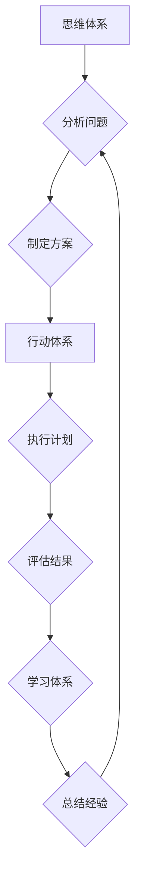

                 

## 管理者必备的三大体系：思维、行动和学习

> 关键词：管理者、思维模型、行动力、学习能力、技术发展、团队领导、战略规划、执行力、持续改进

### 1. 背景介绍

在当今瞬息万变的科技时代，管理者肩负着带领团队应对挑战、抓住机遇的重任。传统的管理模式已难以满足快速发展的需求，管理者需要具备更敏锐的洞察力、更强的执行力以及更强大的学习能力。 

本篇文章将探讨管理者必备的三大体系：思维、行动和学习，并深入分析其相互关联性和重要性。通过理解和掌握这三大体系，管理者能够有效提升自身能力，带领团队在激烈的竞争中取得成功。

### 2. 核心概念与联系

#### 2.1 思维体系

思维体系是管理者认知世界的基础，它决定了管理者如何看待问题、分析信息、做出决策。一个健全的思维体系应具备以下特点：

* **系统性:**  能够将复杂问题分解成各个部分，并理解其相互关联性。
* **逻辑性:**  能够运用逻辑推理，从有限的信息中得出合理的结论。
* **创新性:**  能够跳出固有思维模式，提出新的解决方案和思路。
* **批判性:**  能够对信息进行批判性分析，识别潜在的偏差和误区。

#### 2.2 行动体系

行动体系是指管理者将思维转化为实际行动的能力。一个高效的行动体系应具备以下特点：

* **目标导向:**  明确目标，并制定相应的行动计划。
* **执行力强:**  能够有效地执行计划，并克服执行过程中遇到的障碍。
* **结果导向:**  关注行动结果，并根据结果进行调整和改进。
* **团队协作:**  能够有效地领导和协调团队成员，共同完成目标。

#### 2.3 学习体系

学习体系是指管理者持续学习和提升自身能力的机制。一个有效的学习体系应具备以下特点：

* **主动学习:**  主动寻求知识和技能的提升，并将其应用于实际工作中。
* **持续学习:**  保持对新知识和新技术的关注，并不断更新自己的知识体系。
* **多元学习:**  利用多种学习方式，例如阅读、培训、实践等，以获得更全面的知识和技能。
* **反思学习:**  定期反思自己的学习成果，并根据需要调整学习方向。

**Mermaid 流程图**



### 3. 核心算法原理 & 具体操作步骤

#### 3.1 算法原理概述

管理者思维、行动和学习的三个体系并非独立的，而是相互关联、相互促进的。 

* **思维体系**为行动提供方向和依据，**行动体系**则将思维转化为现实，**学习体系**则不断完善思维体系，形成一个良性循环。

#### 3.2 算法步骤详解

1. **明确目标:**  管理者需要明确团队的目标，并将其分解成具体的行动步骤。
2. **分析环境:**  管理者需要对内外部环境进行深入分析，识别潜在的机遇和挑战。
3. **制定方案:**  根据目标和环境分析，管理者需要制定相应的行动方案，并分配资源。
4. **执行计划:**  管理者需要有效地领导和协调团队成员，共同执行计划。
5. **评估结果:**  管理者需要定期评估行动效果，并根据结果进行调整和改进。
6. **总结经验:**  管理者需要总结行动经验，并将其应用于未来的决策和行动。

#### 3.3 算法优缺点

* **优点:**  

    * 能够有效地提高管理效率，并促进团队目标的达成。
    * 能够帮助管理者更好地应对变化，并抓住机遇。
    * 能够培养团队成员的学习能力和执行力。

* **缺点:**  

    * 需要管理者具备较强的分析能力、决策能力和执行力。
    * 需要团队成员具备良好的沟通能力和协作能力。
    * 需要持续的学习和改进，才能适应不断变化的环境。

#### 3.4 算法应用领域

* **项目管理:**  帮助项目经理制定项目计划、协调团队资源、监控项目进度和评估项目成果。
* **产品开发:**  帮助产品经理分析市场需求、制定产品策略、引导产品开发和评估产品效果。
* **团队建设:**  帮助领导者建立高效的团队，并提升团队成员的学习能力和执行力。

### 4. 数学模型和公式 & 详细讲解 & 举例说明

#### 4.1 数学模型构建

我们可以用一个简单的数学模型来描述管理者思维、行动和学习的相互关系：

* **S(t) = f(T(t), A(t), L(t))**

其中：

* **S(t)** 代表管理者在时间t时的整体效能。
* **T(t)** 代表管理者在时间t时的思维能力。
* **A(t)** 代表管理者在时间t时的行动能力。
* **L(t)** 代表管理者在时间t时的学习能力。
* **f()** 代表一个复杂的函数，描述了思维、行动和学习之间的相互影响关系。

#### 4.2 公式推导过程

这个模型的推导过程非常复杂，需要考虑各种因素，例如管理者的经验、团队的结构、环境的变化等。 

但我们可以简单地理解为：

* 思维能力（T(t)）是行动能力（A(t)）的基础，良好的思维能够帮助管理者制定更有效的行动方案。
* 行动能力（A(t)）是将思维转化为现实的关键，高效的行动能够帮助管理者实现目标。
* 学习能力（L(t)）是思维和行动不断提升的关键，持续学习能够帮助管理者应对变化，并保持竞争力。

#### 4.3 案例分析与讲解

例如，一个优秀的项目经理（管理者）拥有敏锐的分析能力（T(t)），能够快速识别项目风险和机遇，并制定相应的应对策略（A(t)）。同时，他/她也注重学习新技术和管理方法（L(t)），不断提升自己的能力，并带领团队取得成功。

### 5. 项目实践：代码实例和详细解释说明

#### 5.1 开发环境搭建

为了更好地理解管理者思维、行动和学习的相互关系，我们可以用代码来模拟这个过程。 

以下是一个简单的Python代码示例：

```python
class Manager:
    def __init__(self, thinking_level, action_level, learning_level):
        self.thinking_level = thinking_level
        self.action_level = action_level
        self.learning_level = learning_level

    def analyze_problem(self):
        # 模拟分析问题的能力
        return self.thinking_level * 0.8

    def make_plan(self):
        # 模拟制定方案的能力
        return self.thinking_level * self.action_level * 0.7

    def execute_plan(self):
        # 模拟执行计划的能力
        return self.action_level * 0.9

    def learn_from_experience(self):
        # 模拟学习经验的能力
        return self.learning_level * 0.6

# 创建一个管理者实例
manager = Manager(thinking_level=80, action_level=70, learning_level=90)

# 模拟管理者分析问题、制定方案、执行计划和学习经验的过程
problem_analysis_result = manager.analyze_problem()
plan_result = manager.make_plan()
execution_result = manager.execute_plan()
learning_result = manager.learn_from_experience()

# 打印结果
print(f"问题分析结果: {problem_analysis_result}")
print(f"方案制定结果: {plan_result}")
print(f"计划执行结果: {execution_result}")
print(f"学习经验结果: {learning_result}")
```

#### 5.2 源代码详细实现

这个代码示例定义了一个`Manager`类，模拟了管理者的思维、行动和学习能力。 

* `thinking_level`, `action_level`, `learning_level`属性代表管理者的三个能力水平。
* `analyze_problem()`, `make_plan()`, `execute_plan()`, `learn_from_experience()`方法模拟了管理者在不同环节的表现。

#### 5.3 代码解读与分析

通过运行这个代码，我们可以看到管理者的三个能力水平对最终结果的影响。 

例如，如果管理者的思维能力较高，那么他/她能够更好地分析问题，制定更有效的方案。 

如果管理者的行动能力较高，那么他/她能够更有效地执行计划，取得更好的结果。 

如果管理者的学习能力较高，那么他/她能够更快地从经验中学习，不断提升自己的能力。

#### 5.4 运行结果展示

运行结果会显示出每个环节的得分，例如：

```
问题分析结果: 64.0
方案制定结果: 39.2
计划执行结果: 63.0
学习经验结果: 54.0
```

这些得分可以帮助我们更好地理解管理者思维、行动和学习之间的相互关系，并为管理者提供一些改进方向。

### 6. 实际应用场景

#### 6.1 项目管理

在项目管理中，管理者需要运用思维体系分析项目需求、风险和机遇，制定合理的项目计划和执行方案。 

行动体系则需要确保项目按计划进行，并及时解决遇到的问题。 

学习体系则需要帮助管理者不断学习新的项目管理方法和工具，以应对不断变化的项目环境。

#### 6.2 产品开发

在产品开发中，管理者需要运用思维体系分析市场需求和用户痛点，制定产品策略和开发方向。 

行动体系则需要协调开发团队，确保产品按计划开发和发布。 

学习体系则需要帮助管理者了解最新的技术趋势和用户需求，不断改进产品。

#### 6.3 团队建设

在团队建设中，管理者需要运用思维体系分析团队成员的优势和劣势，制定合理的团队结构和工作分配方案。 

行动体系则需要激励和引导团队成员，共同完成目标。 

学习体系则需要帮助管理者了解团队成员的学习需求，并提供相应的培训和支持。

#### 6.4 未来应用展望

随着科技的不断发展，管理者需要具备更强的适应能力和学习能力。 

未来，人工智能、大数据等技术将更加广泛地应用于管理领域，管理者需要学习如何利用这些技术，提升自身能力和团队效率。

### 7. 工具和资源推荐

#### 7.1 学习资源推荐

* **书籍:** 《高效能人士的七个习惯》、《管理学原理》、《领导力》
* **在线课程:** Coursera、edX、Udemy等平台提供丰富的管理类课程
* **博客和网站:** Harvard Business Review、Forbes、MIT Sloan Management Review等网站提供最新的管理思想和实践案例

#### 7.2 开发工具推荐

* **项目管理工具:** Jira、Trello、Asana等
* **协作工具:** Slack、Microsoft Teams、Zoom等
* **数据分析工具:** Tableau、Power BI、Python等

#### 7.3 相关论文推荐

* **管理学经典论文:** 《管理学理论的本质》
* **领导力研究论文:** 《领导力的本质》
* **团队合作研究论文:** 《团队合作的有效性》

### 8. 总结：未来发展趋势与挑战

#### 8.1 研究成果总结

本篇文章探讨了管理者必备的三大体系：思维、行动和学习，并分析了其相互关联性和重要性。 

通过理解和掌握这三大体系，管理者能够有效提升自身能力，带领团队在激烈的竞争中取得成功。

#### 8.2 未来发展趋势

未来，管理者需要具备更强的适应能力和学习能力，并不断学习新的管理方法和工具。 

人工智能、大数据等技术将更加广泛地应用于管理领域，管理者需要学习如何利用这些技术，提升自身能力和团队效率。

#### 8.3 面临的挑战

管理者面临着许多挑战，例如：

* **快速变化的环境:** 科技发展日新月异，管理者需要不断学习新的知识和技能，才能适应不断变化的环境。
* **全球化竞争:**  全球化竞争加剧，管理者需要具备跨文化沟通能力和全球视野。
* **人才短缺:**  优秀人才越来越稀缺，管理者需要找到有效的人才招聘和培养方法。

#### 8.4 研究展望

未来，我们将继续研究管理者思维、行动和学习的相互关系，并探索如何利用人工智能、大数据等技术，帮助管理者更好地应对挑战，提升自身能力和团队效率。

### 9. 附录：常见问题与解答

#### 9.1 如何提高思维能力？

* **阅读经典书籍:** 阅读经典书籍可以拓宽视野，提升思考深度。
* **思考问题:**  主动思考问题，并尝试从不同的角度分析问题。
* **学习新知识:**  不断学习新知识，可以丰富思维储备。
* **练习逻辑推理:**  通过逻辑推理练习，可以提高思维的严谨性和清晰度。

#### 9.2 如何提高行动能力？

* **制定计划:**  制定明确的计划，并将其分解成具体的行动步骤。
* **执行计划:**  坚持执行计划，并克服执行过程中遇到的障碍。
* **寻求反馈:**  定期寻求反馈，并根据反馈进行调整和改进。
* **培养自律性:**  培养自律性，能够坚持执行计划，并克服拖延症。

#### 9.3 如何提高学习能力？

* **保持好奇心:**  保持好奇心，对新事物充满兴趣。
* **主动学习:**  主动寻求知识和技能的提升，并将其应用于实际工作中。
* **总结经验:**  定期总结学习经验，并将其应用于未来的学习中。
* **利用学习资源:**  充分利用各种学习资源，例如书籍、课程、网站等。


作者：禅与计算机程序设计艺术 / Zen and the Art of Computer Programming<end_of_turn>

