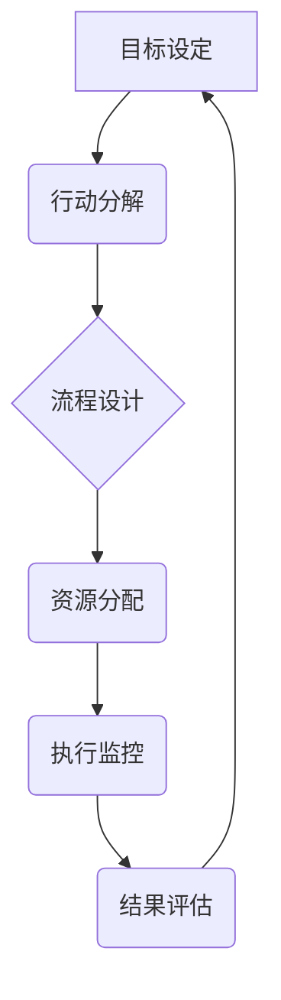
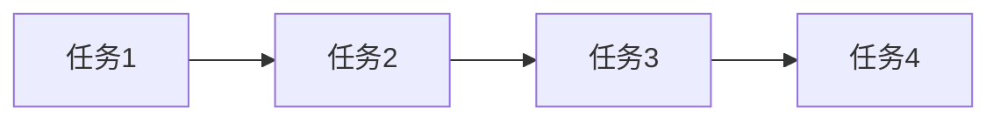

                 

## 行动体系打造:执行力的关键

> 关键词：行动体系、执行力、流程优化、自动化、效率提升、项目管理、软件开发

### 1. 背景介绍

在当今瞬息万变的科技时代，技术革新日新月异，竞争日益激烈。对于个人和组织而言，高效地执行任务、实现目标至关重要。然而，许多人往往在行动阶段遭遇瓶颈，难以将计划付诸实践，导致目标无法达成。

行动体系的构建，正是解决这一问题的关键。它提供了一个清晰、结构化的框架，帮助我们将目标分解成可执行的步骤，并制定相应的策略和流程，从而提高执行效率，最终实现目标。

### 2. 核心概念与联系

**2.1 核心概念**

* **行动体系:**  一个系统化的框架，用于规划、执行和跟踪任务，以实现预定的目标。它包含了明确的目标、可执行的步骤、必要的资源和衡量成功的指标。
* **执行力:**  将计划付诸实践的能力，包括制定目标、分解任务、协调资源、克服阻碍和持续改进的能力。
* **流程优化:**  通过分析和改进现有流程，提高效率、降低成本和减少浪费。

**2.2 架构关系**



**2.3 核心概念联系**

行动体系的核心在于将目标分解成可执行的步骤，并通过流程优化和资源分配，确保这些步骤能够顺利执行。执行力则是贯穿整个行动体系的关键要素，它决定了我们能否有效地将计划付诸实践。

### 3. 核心算法原理 & 具体操作步骤

**3.1 算法原理概述**

行动体系的构建可以看作是一个迭代的过程，它遵循以下基本原理：

* **目标分解:** 将宏大的目标分解成一个个小的、可管理的任务。
* **流程设计:**  为每个任务设计一个清晰的流程，明确每个步骤的责任人和时间节点。
* **资源分配:**  根据任务需求，合理分配资源，包括人力、物力、时间等。
* **执行监控:**  实时监控任务执行进度，及时发现和解决问题。
* **结果评估:**  定期评估任务执行结果，并根据反馈进行调整和改进。

**3.2 算法步骤详解**

1. **目标设定:** 明确目标，并将其分解成具体的、可衡量的、可实现的、相关的和有时间限制的目标（SMART）。
2. **行动分解:** 将每个目标分解成若干个可执行的任务，并为每个任务设定优先级。
3. **流程设计:**  为每个任务设计一个清晰的流程，包括步骤、责任人、时间节点和所需资源等。
4. **资源分配:**  根据任务需求，合理分配资源，包括人力、物力、时间等。
5. **执行监控:**  使用工具或方法实时监控任务执行进度，及时发现和解决问题。
6. **结果评估:**  定期评估任务执行结果，并根据反馈进行调整和改进。

**3.3 算法优缺点**

* **优点:** 
    * 提高执行效率，将计划付诸实践。
    * 增强团队协作，明确责任和目标。
    * 促进持续改进，不断优化流程和效率。
* **缺点:** 
    * 建立行动体系需要投入时间和精力。
    * 需要不断调整和改进，以适应变化的环境。
    * 可能会过于僵化，缺乏灵活性。

**3.4 算法应用领域**

行动体系的应用领域非常广泛，包括：

* **项目管理:**  帮助项目团队规划、执行和跟踪项目进度，确保项目按时、按预算完成。
* **软件开发:**  帮助开发团队制定开发计划、分配任务、跟踪进度和解决问题。
* **个人效率提升:**  帮助个人制定目标、规划时间、提高执行力。

### 4. 数学模型和公式 & 详细讲解 & 举例说明

**4.1 数学模型构建**

我们可以使用图论模型来表示行动体系，其中节点代表任务，边代表任务之间的依赖关系。

**4.2 公式推导过程**

* **任务完成时间:**  T(i) = ΣT(j) + C(i)
    * T(i): 任务i的完成时间
    * T(j): 任务j的完成时间
    * C(i): 任务i的处理时间
* **资源需求:**  R(i) = ΣR(j) + D(i)
    * R(i): 任务i所需的资源
    * R(j): 任务j所需的资源
    * D(i): 任务i的额外资源需求

**4.3 案例分析与讲解**

假设我们要开发一个简单的应用程序，包含以下任务：

* 任务1: 设计用户界面
* 任务2: 开发后台逻辑
* 任务3: 进行测试
* 任务4: 部署上线

我们可以使用图论模型表示任务之间的依赖关系：



根据任务的复杂程度和资源需求，我们可以计算出每个任务的完成时间和资源需求。

### 5. 项目实践：代码实例和详细解释说明

**5.1 开发环境搭建**

* 操作系统: Ubuntu 20.04
* 编程语言: Python 3.8
* 工具: Git, Docker

**5.2 源代码详细实现**

```python
# 任务管理工具示例代码

class Task:
    def __init__(self, name, description, priority, due_date):
        self.name = name
        self.description = description
        self.priority = priority
        self.due_date = due_date
        self.status = "未完成"

    def update_status(self, new_status):
        self.status = new_status

# 创建任务实例
task1 = Task("设计用户界面", "完成应用程序的用户界面设计", 1, "2023-12-25")
task2 = Task("开发后台逻辑", "实现应用程序的核心功能", 2, "2023-12-31")
task3 = Task("进行测试", "测试应用程序的功能和性能", 3, "2024-01-05")

# 添加任务到任务列表
tasks = [task1, task2, task3]

# 打印任务列表
for task in tasks:
    print(f"任务名称: {task.name}")
    print(f"任务描述: {task.description}")
    print(f"优先级: {task.priority}")
    print(f"截止日期: {task.due_date}")
    print(f"任务状态: {task.status}")
    print("-" * 20)

# 更新任务状态
task1.update_status("已完成")

# 打印更新后的任务列表
for task in tasks:
    print(f"任务名称: {task.name}")
    print(f"任务描述: {task.description}")
    print(f"优先级: {task.priority}")
    print(f"截止日期: {task.due_date}")
    print(f"任务状态: {task.status}")
    print("-" * 20)
```

**5.3 代码解读与分析**

这段代码实现了简单的任务管理功能。它定义了一个 `Task` 类，用于表示一个任务，并提供了创建任务、更新任务状态等方法。

**5.4 运行结果展示**

代码运行后，会打印出所有任务的信息，包括任务名称、描述、优先级、截止日期和状态。

### 6. 实际应用场景

**6.1 项目管理**

在项目管理中，行动体系可以帮助项目经理规划项目进度、分配任务、跟踪执行情况和管理风险。例如，可以使用行动体系来管理软件开发项目、营销活动项目或建筑工程项目。

**6.2 软件开发**

在软件开发中，行动体系可以帮助开发团队制定开发计划、分配任务、跟踪代码提交和测试结果，并确保项目按时、按预算完成。

**6.3 个人效率提升**

个人也可以使用行动体系来提高效率。例如，可以将年度目标分解成季度目标、每月目标和每周目标，并制定相应的行动计划。

**6.4 未来应用展望**

随着人工智能和自动化技术的不断发展，行动体系的应用场景将会更加广泛。例如，我们可以使用人工智能来辅助构建行动体系、预测任务完成时间和优化资源分配。

### 7. 工具和资源推荐

**7.1 学习资源推荐**

* 书籍：《Getting Things Done》
* 网站: https://www.gettingthingsdone.com/

**7.2 开发工具推荐**

* 项目管理工具: Asana, Trello, Jira
* 任务管理工具: Todoist, Microsoft To Do

**7.3 相关论文推荐**

* "A Framework for Building Actionable Knowledge"
* "The Impact of Actionable Intelligence on Decision Making"

### 8. 总结：未来发展趋势与挑战

**8.1 研究成果总结**

行动体系的构建是提高执行力、实现目标的关键。通过分解目标、设计流程、分配资源和监控执行，我们可以有效地将计划付诸实践。

**8.2 未来发展趋势**

未来，行动体系将会更加智能化、自动化和个性化。人工智能将能够帮助我们构建更精准的行动体系、预测任务完成时间和优化资源分配。

**8.3 面临的挑战**

* 如何将行动体系与现有的工作流程和工具无缝集成。
* 如何克服人们的惰性和拖延心理，提高执行力。
* 如何不断调整和改进行动体系，以适应变化的环境。

**8.4 研究展望**

未来，我们将继续研究行动体系的构建方法、优化策略和应用场景，并探索人工智能在行动体系中的应用潜力。

### 9. 附录：常见问题与解答

**9.1 如何制定行动计划？**

制定行动计划的关键是将目标分解成可执行的步骤，并为每个步骤设定明确的责任人、时间节点和资源需求。

**9.2 如何提高执行力？**

提高执行力的关键是克服惰性和拖延心理，并建立良好的工作习惯。例如，可以使用番茄工作法、时间管理技巧和任务管理工具来提高效率。

**9.3 如何评估行动体系的有效性？**

评估行动体系的有效性可以通过跟踪任务执行进度、衡量目标达成率和收集用户反馈来实现。


作者：禅与计算机程序设计艺术 / Zen and the Art of Computer Programming 
<end_of_turn>

